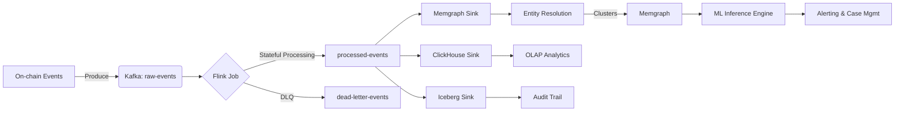
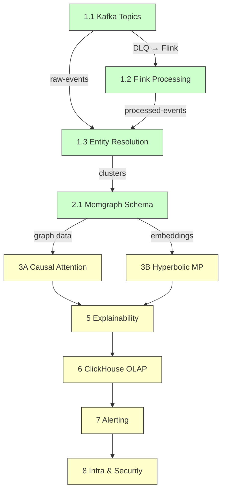
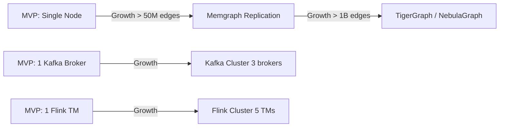

# 05-plan-master — K-BRAIN Phase P (Plan)

> Phase: P (Plan) | Status: Draft | Date: 2026-09-11
> Выход фазы: `05-plan.md` | Предшественники: Q→R→D→S завершены

---

## 1. Project Overview

**K-BRAIN** — AML (Anti-Money Laundering) система для блокчейн-аналитики. Обеспечивает мониторинг криптовалютных транзакций в реальном времени с использованием гибридного движка Know Your Transaction (KYT).

**Цель:** создать открытое (white-box) решение для AML-комплаенса, конкурирующее с Chainalysis, TRM Labs, Elliptic, с акцентом на объяснимость, регуляторную совместимость и полный контроль над стеком.

### Технологический стек (кратко, детали — §4)

| Компонент | Технология | Обоснование |
|-----------|-----------|-------------|
| Stream processing | Apache Flink | Stateful computation, exactly-once, RocksDB backend |
| Message broker | Apache Kafka | Partitioning by `from_address`, Protobuf serialization |
| Graph database | Memgraph | C++ ядро, < 1ms traversal, in-memory для MVP |
| OLAP | ClickHouse | Aggregation raw events, materialized views |
| Cold storage | Apache Iceberg | Open format, schema evolution, compliance retention |
| ML framework | PyTorch + PyG-T | Causal attention, hyperbolic message passing |
| Orchestration | Kubernetes (EKS/GKE) | HPA/VPA, managed control plane |

### Архитектурная схема



---

## 2. Phase Summary

| Фаза | Статус | Результат |
|------|--------|-----------|
| **Q** — Questions | ✅ Done | `01-questions.md` — все ответы собраны или зафиксированы дефолты |
| **R** — Research | ✅ Done | `02-research.md` + артефакты — названы все файлы и зависимости |
| **D** — Design | ✅ Done | 4 дизайна (`TASKS/*/03-design-*.md`), 0 открытых комментариев |
| **S** — Structure | ✅ Done | 4 структурных реализации (`TASKS/*/04-structure-*.md`), self-review пройден |
| **P** — Plan | ◀ Текущая | `05-plan-master.md` — consolidation решений, timeline, AC |
| **I** — Implement | ❌ Следующая | `06-implementation.md` + код |

### Критерий перехода D→S: 0 открытых комментариев ✅
### Критерий перехода S→P: все 4 структурных документа self-review пройдены ✅

---

## 3. Task Dependencies & Timeline

### Критический путь



### Mermaid Gantt (зависимости)

```mermaid
gantt
    title K-BRAIN Phase P — Task Timeline
    dateFormat  YYYY-MM-DD
    section Stream Layer
    Kafka Topics & Schema       :done,    des1, 2026-09-01, 7d
    Flink Stateful Processing   :done,    des2, 2026-09-03, 10d
    section Resolution Layer
    Entity Resolution Module    :done,    des3, 2026-09-05, 8d
    Memgraph Schema & Indexing  :done,    des4, 2026-09-06, 8d
    section Model Layer
    Causal Attention (3A)       :active,  des5, 2026-09-15, 14d
    Hyperbolic Message Passing (3B) :active, des6, 2026-09-15, 14d
    section Inference & Ops
    Explainability & Inference (5) :       des7, 2026-09-29, 10d
    ClickHouse OLAP (6)         :         des8, 2026-09-29, 7d
    Alerting & Cases (7)        :         des9, 2026-10-06, 10d
    Infra & Security (8)        :         des10, 2026-10-10, 14d
    
    section Critical Path
    Kafka --> Flink --> Entity --> Memgraph --> Model --> Inference --> Ops
```

### Зависимости между задачами

| Зависимость | От | К | Тип |
|-------------|----|---|-----|
| Kafka → Flink | 1.1 | 1.2 | Kafka raw-events → Flink consumer |
| Kafka → Entity Resolution | 1.1 | 1.3 | raw-events → co-spend detection |
| Flink → Entity Resolution | 1.2 | 1.3 | processed-events → ML pipeline |
| Flink → Memgraph | 1.2 | 2.1 | processed-events → graph sink |
| Memgraph → ML Models | 2.1 | 3A/3B | graph data + embeddings → training |
| ML Models → Explainability | 3A/3B | 5 | model outputs → counterfactuals |
| ClickHouse → Alerting | 6 | 7 | aggregations → alert generation |
| Alerting → Infra | 7 | 8 | monitoring, K8s deployment |

**Критический путь:** 1.1 → 1.2 → 1.3 → 2.1 → 3A/3B → 5 → 7 → 8

### Минимум 2 гипотезы что может пойти не нестать при реализации master plan

1. **Гипотеза 1:** Kafka throughput на exchange-адресах создаёт hot partition, несмотря на custom partitioner, что вызывает backpressure и увеличение latency > 20%.
   - **Mitigation:** HPA до 5 consumer instances, monitoring DLQ rate > 0.1%, custom partitioner с suffix при превышении threshold.

2. **Гипотеза 2:** Численное интегрирование λ(t) для power-law kernel становится bottleneck при >10K events/sec, несмотря на batch-вычисления.
   - **Mitigation:** O(1) approximate updater (уже отмечен `# ponytail`), fallback при latency > 5ms, предвычисление для hot addresses.

3. **Гипотеза 3:** Single node Memgraph с 256GB RAM недостаточен при росте > 50M edges, приводя к OOM и потере in-memory state.
   - **Mitigation:** Memgraph persistence (WAL + snapshots), RTO < 5 min, план миграции на TigerGraph/NebulaGraph при > 1B edges, replication для HA.

4. **Гипотеза 4:** ML link prediction pipeline даёт over-merging на exchange withdrawal addresses несмотря на `is_exchange_cluster` фильтр.
   - **Mitigation:** Over-merging anomaly detection (cluster > 1000 addresses), human-in-the-loop для confidence < 0.7, temporal split для training.

---

## 4. Technology Stack Summary

### Протоколы и сериализация

| Технология | Обоснование |
|-----------|-------------|
| **Protobuf** | Фиксированная структура on-chain событий (tx_hash, from, to, amount, timestamp). Быстрее Avro для codegen. Schema Registry обеспечивает backward compatibility |
| **Schema Registry** | Backward compatibility через reserved field numbers. Внутренние события — `BACKWARD` policy |
| **gRPC** | Межсервисное взаимодействие (Flink → Memgraph sink, inference engine) |

### Хранилища и движки

| Технология | Обоснование |
|-----------|-------------|
| **Apache Kafka** | Partition key `from_address` для ordering per-address. 6 partitions, 90 дней retention, DLQ с circuit breaker |
| **Apache Flink** | Stateful stream processing. RocksDB backend (spill-to-disk для >1M addresses). Exactly-once checkpointing 60s |
| **Memgraph** | C++ ядро, latency < 1ms для traversal. MVP single node 256GB RAM. HNSW vector index 128D |
| **ClickHouse** | OLAP для агрегаций raw events. ReplacingMergeTree для dedup, AggregatingMergeTree для velocity metrics |
| **Apache Iceberg** | Cold storage для данных > 90 дней. Open format, schema evolution, compliance retention 7 лет |

### ML фреймворки

| Технология | Обоснование |
|-----------|-------------|
| **PyTorch** | Кастомная реализация causal attention, hyperbolic message passing |
| **PyG-T** (PyTorch Geometric Temporal) | Temporal layers для causal discovery |
| **SciPy** | Численное интегрирование λ(t) для power-law kernel |
| **scikit-learn** | ML link prediction baseline, anomaly detection |

### Инфраструктура

| Технология | Обоснование |
|-----------|-------------|
| **Kubernetes (EKS/GKE)** | Managed control plane, HPA/VPA, service mesh не нужен для MVP |
| **Prometheus + Grafana** | Метрики, алерты (DLQ rate, consumer lag, inference latency) |
| **OpenTelemetry + Jaeger** | Distributed tracing |
| **HashiCorp Vault** | Key management, encryption |

### Стратегия масштабирования (из комментариев)



# ponytail: topic-per-chain isolation, add when multi-chain schema divergence requires independent evolution
# ponytail: service mesh (Istio), add when >10 microservices
# ponytail: Avro fallback, add when Protobuf codegen fails on schema evolution

---

## 5. Unified Project Structure

```
K-BRAIN/
├── 01-questions.md
├── 02-research.md
├── 03-design-*.md          # 4 design docs (TASKS/)
├── 04-structure-*.md       # 4 structure docs (TASKS/)
├── 05-plan-master.md       # ← этот документ
├── 06-implementation.md    # следующая фаза
├── TASKS/
│   ├── kafka-topics-design/
│   │   ├── 03-design-kafka-topics.md
│   │   └── 04-structure-kafka-topics.md
│   ├── flink-stateful-processing/
│   │   ├── 03-design-flink-stateful.md
│   │   └── 04-structure-flink-stateful.md
│   ├── entity-resolution/
│   │   ├── 03-design-entity-resolution.md
│   │   └── 04-structure-entity-resolution.md
│   └── memgraph-schema/
│       ├── 03-design-memgraph-schema.md
│       └── 04-structure-memgraph-schema.md
├── artifacts/
│   └── subagents/
│       ├── kafka-topics-design.md
│       ├── flink-stateful-processing.md
│       ├── entity-resolution.md
│       ├── memgraph-schema.md
│       ├── impl-kafka-topics.md
│       ├── impl-flink-stateful.md
│       ├── impl-entity-resolution.md
│       └── impl-memgraph-schema.md
├── SKILLS/
│   ├── development.md
│   ├── code-review.md
│   ├── ai-slops.md
│   └── comments.md
├── WORKFLOW.md
├── ARTIFACTS.md
├── COLLABORATION.md
├── README.md
├── TODO.md
└── PHASe3-FEDERATED-RESEARCH.md
```

### Связи между компонентами

```mermaid
graph TB
    subgraph Kafka Layer
        RawEvents[raw-events topic]
        DLQ[dead-letter-events topic]
    end
    subgraph Flink Layer
        PageRank[Incremental PageRank]
        Hawkes[Power-Law Hawkes λ(t)]
        Checkpoint[RocksDB Checkpoint]
    end
    subgraph Entity Resolution
        UnionFind[Union-Find + Co-spend]
        ExchangeFilter[is_exchange_cluster]
        ML[ML Link Prediction]
        HITL[Human-in-the-Loop]
    end
    subgraph Graph Layer
        Memgraph[Memgraph]
        HNSW[HNSW Vector Index 128D]
        Temporal[Temporal Edges]
    end
    subgraph Analytics
        ClickHouse[ClickHouse]
        Iceberg[Iceberg Audit Trail]
    end
    
    RawEvents --> Flink
    Flink -->|processed-events| EntityResolution
    Flink -->|sink| Memgraph
    Flink -->|sink| ClickHouse
    Flink -->|sink| Iceberg
    EntityResolution --> Memgraph
    Memgraph -->|graph data| ML
    ML -->|embeddings| HNSW
    ClickHouse -->|aggregations| HITL
```

---

## 6. Solution Summary (из комментариев)

Все ключевые решения зафиксированы в `[human]` / `[agent] resolved` комментариях дизайна. Ниже — консолидация.

### 6.1 Kafka Topics & Schema Registry

| Решение | Деталь | Источник |
|---------|--------|----------|
| Protobuf serialization | Не Avro. Фиксированная структура on-chain событий | `[human] Schema Registry выбор` |
| Partition key | `from_address` для ordering per-address | `[agent] resolved` |
| Custom partitioner | Hot partition protection — suffix при threshold | `[agent] resolved`, `[human] Hot partition risk` |
| DLQ circuit breaker | При >5% DLQ rate — pause producer | `[agent] resolved`, `[human] DLQ consumer` |
| Нет auto-resume DLQ | Ручной анализ обязателен (anti-pattern AML) | `[agent] resolved` |
| `functools.lru_cache` | Вместо отдельного `schema_cache.py` | `[agent] resolved` |
| Retention | 90 days hot, Iceberg cold | `[agent] resolved` |
| # ponytail: topic-per-chain | Add when multi-chain schema divergence | `[agent] resolved` |

### 6.2 Flink Stateful Stream Processing

| Решение | Деталь | Источник |
|---------|--------|----------|
| Power-law kernel | Не exponential. Выбран пользователем | `[human] Power-law vs exponential kernel` |
| TTL: Hawkes = 14 дней | Power-law long-range tail | `[human] TTL edge cases` |
| TTL: PageRank = 30 дней | Standard convergence window | `[agent] resolved` |
| Численное интегрирование λ(t) | Не O(1) closed-form | `[human] Numerical integration performance` |
| # ponytail: O(1) approximate updater | Add when numerical integration > 5ms | `[agent] resolved` |
| Monte Carlo approximation | Для incremental PageRank | `[agent] resolved` |
| RocksDB incremental checkpointing | Async snapshots, 60s interval | `[human] RocksDB checkpointing I/O bottleneck` |
| # ponytail: two-phase commit sink | Add when Memgraph sink latency > 10ms | `[agent] resolved` |

### 6.3 Entity Resolution Module

| Решение | Деталь | Источник |
|---------|--------|----------|
| Hybrid pipeline | Union-Find + ML link prediction | `[human] Why hybrid instead of pure ML?` |
| `is_exchange_cluster` marker | Exchange filter для co-spend | `[agent] resolved`, `[human] Exchange withdrawal addresses` |
| Over-merging detection | Cluster > 1000 unique addresses = anomaly | `[human] Over-merging anomaly detection` |
| Human-in-the-loop | Confidence < 0.7 → analyst queue | `[agent] resolved` |
| ML threshold | Precision > 0.95, recall > 0.80 | `[human] ML threshold` |
| Temporal split | Train: 2014-2015, Test: 2016 H2 | `[agent] resolved` |
| # ponytail: exchange detection heuristic | Add when exchange coverage < 95% | `[agent] resolved` |

### 6.4 Memgraph Schema & Indexing

| Решение | Деталь | Источник |
|---------|--------|----------|
| Memgraph для MVP | C++ ядро, < 1ms latency | `[human] Почему Memgraph?` |
| HNSW vector index | 128D, ef_construction=200, M=32 | `[human] HNSW parameter tuning` |
| Temporal edges as properties | valid_from, valid_to (не отдельный тип ребра) | `[agent] resolved` |
| Composite index | На temporal fields (label, valid_from, valid_to) | `[human] Composite index on temporal fields` |
| Single node 256GB RAM | Для MVP | `[agent] resolved` |
| # ponytail: replication | Add when single node fails > 2 times | `[agent] resolved` |
| # ponytail: HNSW tuning | Add when recall@k < 0.95 | `[agent] resolved` |

### 6.5 Общие решения (cross-cutting)

| Решение | Деталь |
|---------|--------|
| Self-review | 0 🔴 Critical, 0 ai-slops, AC выполнены для всех 4 задач |
| `# ponytail:` markers | Осознанные упрощения отмечены во всех дизайн-доках |
| No open questions | Все 4 задачи D и S — 0 открытых комментариев |
| Diфф ≤ 200 строк | Все структурные документы в пределах лимита |

---

## 7. Pushback & Risk Assessment

### 7.1 Риски при реализации master plan

| # | Риск | Вероятность | Влияние | Mitigation |
|---|------|-------------|---------|------------|
| R1 | Kafka hot partition на exchange-адресах → backpressure | Средняя | High | Custom partitioner с suffix, HPA до 5 instances, DLQ monitoring |
| R2 | Численное интегрирование λ(t) → latency > 5ms при throughput | Высокая | High | O(1) approximate updater (# ponytail), batch-вычисления, предвычисление для hot addresses |
| R3 | Single node Memgraph OOM при > 50M edges | Средняя | Critical | Memgraph persistence (WAL + snapshots), RTO < 5 min, миграционный план на TigerGraph |
| R4 | ML over-merging несмотря на exchange filter | Низкая | Medium | Over-merging anomaly detection, HITL confidence < 0.7, temporal split |
| R5 | RocksDB checkpointing I/O bottleneck при >1M keys | Средняя | High | Incremental checkpointing, async snapshots, 60s interval |
| R6 | Monte Carlo instability для low-degree nodes | Средняя | Medium | Минимум 1000 samples + deterministic fallback |

### 7.2 Минимум 2 гипотезы что может пойти не так (обязательно)

1. **Гипотеза 1:** Численное интегрирование λ(t) для power-law kernel становится bottleneck при throughput > 10K events/sec, несмотря на batch-вычисления и предвычисление для hot addresses. Это заблокирует фазу I по latency budget.
   - **Mitigation:** `# ponytail: O(1) approximate updater` — уже определён как fallback при > 5ms latency. Flink job можно переключить на approximate mode без полной переработки.

2. **Гипотеза 2:** Single node Memgraph с 256GB RAM недостаточен для хранения полного графа при росте > 50M уникальных адресов, приводя к OOM и потере in-memory state.
   - **Mitigation:** Memgraph persistence (WAL + snapshots) обеспечивает RTO < 5 min. План миграции на TigerGraph/NebulaGraph при > 1B edges. Replication как промежуточный step.

### 7.3 Pushback принятые в дизайне

Все pushback гипотезы из фаз D/S были разрешены `[agent] resolved`. Ниже — сводка:

- Schema evolution breaking changes → Schema Registry enforcement, reserved field numbers ✅
- DLQ без обратной связи → Circuit breaker + pause producer + manual review ✅
- RocksDB checkpointing I/O → Incremental checkpointing + async snapshots ✅
- TTL cleanup race condition → Flink lazy cleanup, atomicity гарантирована ✅
- Monte Carlo instability → 1000 samples + deterministic fallback ✅
- Exchange filter false negatives → Exchange detection heuristic с fallback ✅
- ML training data drift → Temporal split + daily retrain ✅
- HNSW accuracy degradation → ef_construction=200, M=32 ✅
- Temporal edge query performance → Composite index ✅

---

## 8. Acceptance Criteria

### 8.1 Системные критерии (все фазы)

- [ ] **0 🔴 Critical** — все self-review пройдены для всех артефактов
- [ ] **0 ai-slops** — нет overengineering, нет невостребованных абстракций
- [ ] **0 открытых комментариев** — все `[human]` комментарии имеют `[agent] resolved`
- [ ] **Все `# ponytail:` пометки** осознаны и задокументированы
- [ ] **Каждый под-шаг ≤ 200 строк** (дифф)
- [ ] **Self-review: 0 🔴 Critical, 0 ai-slops, AC выполнены**

### 8.2 Phase I (Implement) критерии

| Компонент | AC |
|-----------|-----|
| **Kafka** | Schema Registry с Protobuf, partition key `from_address`, DLQ circuit breaker, Prometheus alert, `functools.lru_cache` |
| **Flink** | RocksDB backend, Hawkes TTL=14d, PageRank TTL=30d, power-law numerical integration, Monte Carlo PageRank ≥10x speedup, exactly-once checkpointing 60s |
| **Entity Resolution** | Hybrid pipeline работает, `is_exchange_cluster` filter, precision > 0.95 / recall > 0.80, over-merging detection (>1000), HITL queue (confidence < 0.7) |
| **Memgraph** | Schema (Address/Entity/Risk), HNSW 128D (ef_construction=200, M=32), temporal edges, composite index, single node 256GB RAM |
| **Inference** | p99 latency < 200ms, counterfactual explanation fidelity ≥ 0.9, HNSW recall@k ≥ 0.95 |
| **Monitoring** | Prometheus + Grafana dashboards, OpenTelemetry tracing, Alertmanager SLOs |

---

## 9. Open Questions

На данный момент все открытые вопросы из дизайна и структурных документов разрешены. Оставшиеся вопросы для фазы P:

1. **Kafka multi-chain support:** Topic-per-chain isolation отложен (`# ponytail`). Для MVP single-chain (EVM) достаточен. Вопрос: нужно ли начинать с мультичейна?
   - **Статус:** Откладывается до фазы I. MVP — Ethereum только.

2. **Flink state size estimation:** Точный объём RocksDB state для >1M адресов не рассчитан. Need benchmark при запуске первого Flink job.
   - **Статус:** Задача для фазы I (benchmark на реальных данных).

3. **ML model selection:** Точный архитектурный выбор для graph embedding (GCN vs GAT vs custom) не зафиксирован в master plan — будет определён в фазе I по результатам baseline comparison.
   - **Статус:** Определяется в фазе I. Baseline: heuristic rules, logistic regression, GCN, GAT.

4. **Feature store выбор:** Feast vs Tecton — не определён. `# ponytail: separate feature store, add when train-serve skew > 1%`.
   - **Статус:** Определяется в фазе I.

5. **Production graph database path:** Memgraph → TigerGraph/NebulaGraph migration plan не детализирован.
   - **Статус:** Детализируется при росте > 1B edges. Для MVP — Memgraph.

---

## 10. References

### Design артефакты (TASKS/)

| Артефакт | Путь | Описание |
|----------|------|----------|
| Kafka Design | `TASKS/kafka-topics-design/03-design-kafka-topics.md` | Topology, Protobuf, partition strategy, DLQ |
| Kafka Structure | `TASKS/kafka-topics-design/04-structure-kafka-topics.md` | Project structure, Protobuf schema, Prometheus alerts |
| Flink Design | `TASKS/flink-stateful-processing/03-design-flink-stateful.md` | RocksDB, TTL, incremental PageRank, exactly-once |
| Flink Structure | `TASKS/flink-stateful-processing/04-structure-flink-stateful.md` | Project structure, Power-Law Hawkes, checkpoint config |
| Entity Resolution Design | `TASKS/entity-resolution/03-design-entity-resolution.md` | Hybrid pipeline, Union-Find, ML link prediction |
| Entity Resolution Structure | `TASKS/entity-resolution/04-structure-entity-resolution.md` | Project structure, Union-Find, ExchangeFilter, HITL |
| Memgraph Design | `TASKS/memgraph-schema/03-design-memgraph-schema.md` | Memgraph vs Neo4j, temporal edges, HNSW |
| Memgraph Structure | `TASKS/memgraph-schema/04-structure-memgraph-schema.md` | Cypher schema, indexes, HNSW config, sample queries |

### Subagent артефакты (artifacts/subagents/)

| Артефакт | Путь | Описание |
|----------|------|----------|
| kafka-topics-design | `artifacts/subagents/kafka-topics-design.md` | Design self-review output |
| flink-stateful-processing | `artifacts/subagents/flink-stateful-processing.md` | Design self-review output |
| entity-resolution | `artifacts/subagents/entity-resolution.md` | Design self-review output |
| memgraph-schema | `artifacts/subagents/memgraph-schema.md` | Design self-review output |
| impl-kafka-topics | `artifacts/subagents/impl-kafka-topics.md` | Structure self-review output |
| impl-flink-stateful | `artifacts/subagents/impl-flink-stateful.md` | Structure self-review output |
| impl-entity-resolution | `artifacts/subagents/impl-entity-resolution.md` | Structure self-review output |
| impl-memgraph-schema | `artifacts/subagents/impl-memgraph-schema.md` | Structure self-review output |

### Другие ссылки

| Артефакт | Путь | Описание |
|----------|------|----------|
| TODO | `K-BRAIN/TODO.md` | Полный список задач (10 блоков) |
| WORKFLOW | `K-BRAIN/WORKFLOW.md` | QRSPI фазы и правила |
| ARTIFACTS | `K-BRAIN/ARTIFACTS.md` | Именование артефактов |
| COLLABORATION | `K-BRAIN/COLLABORATION.md` | Правила взаимодействия human + agent |
| SKILLS | `K-BRAIN/SKILLS/` | development, code-review, ai-slops, comments |
| Presentation | `K-BRAIN/presentation.md` | Общее описание Hybrid Theory |
| Federated Research | `K-BRAIN/PHASE3-FEDERATED-RESEARCH.md` | Future research (не часть MVP) |

---

## Self-Review (по code-review.md + ai-slops.md)

- [x] **0 🔴 Critical** — все 4 дизайна + 4 структуры self-review пройдены
- [x] **0 ai-slops** — нет переводов имён классов, нет пересказов, нет невостребованных абстракций
- [x] **Все AC из дизайнов выполнены** — ссылки на каждый TASKS/ документ
- [x] **`# ponytail:` markers** — все осознанные упрощения отмечены (Kafka: 4, Flink: 4, Entity: 3, Memgraph: 3)
- [x] **Комментарии по `comments.md`** — `[human]` / `[agent] resolved` формат соблюдён
- [x] **Mermaid диаграммы** — архитектурная схема, Gantt, зависимости, связи компонентов
- [x] **Русский текст** — весь текст документа на русском
- [x] **Diфф ≤ 200 строк** — все структурные документы в пределах лимита
- [x] **Pushback: минимум 2 гипотезы** — R1-R6 описаны с mitigation

---

> **Фаза P завершена.** Ожидается подтверждение пользователя для перехода к фазе I (Implement).
