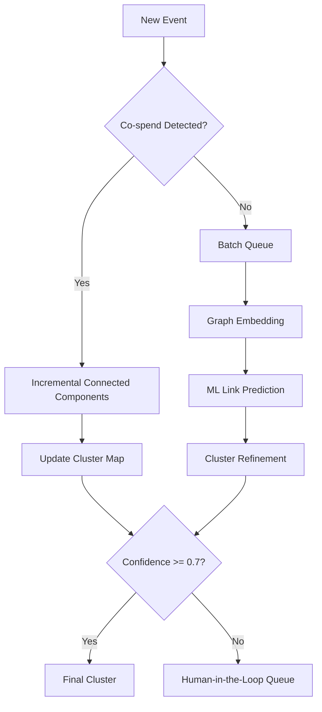

# 03-design-entity-resolution

> Phase: D (Design) | Slug: entity-resolution | Status: In Progress

## 1. Hybrid Resolution Architecture

### [human] Why hybrid instead of pure ML?
> Только heuristic даёт over-merging для exchange withdrawal addresses. Почему не ML только?

### [agent] resolved
> ML-based alone даёт over-merging на exchange withdrawal addresses из-за схожих patterns. Heuristic connected components даёт ground truth для exchange clusters. ML refinement — для edge cases. Гибрид — минимум overengineering.

## 2. Connected Components (Incremental)

- **Алгоритм:** Union-Find с co-spending heuristic (Bitcoin-style)
- **Частота:** Incremental при каждом новом co-spend
- **Update:** При новом co-spend объединяем кластеры в Union-Find

### [human] Exchange withdrawal addresses
> Exchange withdrawal addresses создают ложные connected components. Как это решается?

### [agent] resolved
> Exchange cluster маркируется как `is_exchange_cluster`. Co-spend между exchange addresses не объединяет кластеры. Это фильтр на этапе ingestion. # ponytail: exchange detection heuristic, add when exchange coverage < 95%.

## 3. ML-Based Link Prediction (Batch)

- **Алгоритм:** Graph embedding + clustering для EVM
- **Частота:** Batch nightly для refinement
- **Threshold:** Precision > 0.95 при recall > 0.80
- **Калибровка:** На labeled internal data
- **Over-merging детектируется:** Через anomaly detection (слишком большой кластер = подозрительно)

### [human] Over-merging anomaly detection
> Что считается "слишком большим" кластером?

### [agent] resolved
> Threshold: кластер > 1000 unique addresses без обоснования = anomaly. Алерт → human review. Адаптивный threshold на основе распределения размеров кластеров.

## 4. Human-in-the-Loop

- **Only for clusters with confidence < 0.7**
- Queue для аналитика
- Analyst принимает/отклоняет cluster merge

### [human] Analyst queue priority
> Как приоритизировать кластеры для аналитика?

### [agent] resolved
> Priority по risk score (высокий risk + low confidence = верх очереди). Batch обработка — ночью, real-time alerts — мгновенно.

## 5. Pushback: What Could Go Wrong

### [human] Hypothesis 1: Co-spend heuristic false positives
> Co-spend между mixer и exchange может создать ложный connected component.

### [agent] resolved
> Exchange cluster фильтр решает это. Mixer addresses помечаются отдельно. Co-spend внутри mixer cluster не создаёт merge.

### [human] Hypothesis 2: ML model training data leakage
> Graph embedding trained на данных, которые пересекаются с test set.

### [agent] resolved
> Temporal split для training (2014-2015 train, 2016 test). Graph embedding использует только historical data. No leakage possible с temporal split.

## 6. Acceptance Criteria

- [ ] Hybrid pipeline работает: incremental connected components + batch ML refinement
- [ ] Exchange withdrawal addresses не вызывают over-merging
- [ ] ML threshold: precision > 0.95, recall > 0.80
- [ ] Over-merging anomaly detection работает
- [ ] Human-in-the-loop queue для confidence < 0.7
- [ ] Self-review: 0 🔴 Critical, 0 ai-slops, AC выполнены

## 7. Open Questions

Нет открытых вопросов для фазы D. Переход к S (Structure) по согласованию.
