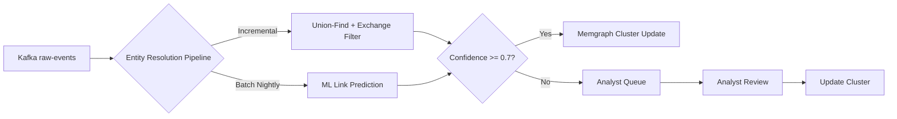

# 04-structure-entity-resolution

> Phase: S (Structure) | Slug: entity-resolution | Status: In Progress

## 1. Project Structure

```
entity-resolution/
├── config/
│   ├── pipeline.yaml           # Pipeline configuration
│   └── thresholds.yaml         # ML thresholds, anomaly detection params
├── src/
│   ├── connected_components/
│   │   ├── UnionFind.java       # Union-Find with co-spending heuristic
│   │   └── ExchangeFilter.java  # is_exchange_cluster marker
│   ├── ml_pipeline/
│   │   ├── GraphEmbedding.java  # Graph embedding computation
│   │   └── LinkPrediction.java  # ML-based link prediction
│   ├── anomaly_detection/
│   │   └── OverMergingDetector.java  # Cluster size anomaly detection
│   ├── human_loop/
│   │   └── AnalystQueue.java    # Human-in-the-loop queue (confidence < 0.7)
│   └── main/
│       └── ResolutionPipeline.java  # Main pipeline orchestration
├── docker/
│   └── Dockerfile.entity-resolution
└── k8s/
    └── entity-resolution-deployment.yaml
```

### [human] Exchange detection heuristic
> Как детектировать exchange cluster адреса?

### [agent] resolved
> Exchange cluster маркируется как `is_exchange_cluster` на этапе ingestion. Co-spend между exchange addresses не объединяет кластеры. # ponytail: exchange detection heuristic, add when exchange coverage < 95%.

## 2. Union-Find Implementation

```python
class UnionFind:
    """
    Union-Find data structure with co-spending heuristic.
    Incremental updates for connected components.
    """
    
    def union(self, address_a: bytes, address_b: bytes, shared_input_count: int) -> bool:
        """Merge clusters if co-spending heuristic threshold met."""
        pass
    
    def find(self, address: bytes) -> bytes:
        """Find root cluster for address."""
        pass
```

## 3. Exchange Cluster Filter

```python
class ExchangeClusterFilter:
    """
    Filters exchange withdrawal addresses to prevent over-merging.
    """
    
    EXCHANGE_CLUSTER_MARKER = "is_exchange_cluster"
    
    def should_merge(self, from_addr: bytes, to_addr: bytes) -> bool:
        """Skip merge if either address is in exchange cluster."""
        if self.is_exchange(from_addr) or self.is_exchange(from_addr):
            return False
        return True
```

## 4. ML Pipeline Scaffold

```python
class MLLinkPredictionPipeline:
    """
    Batch nightly ML pipeline for entity resolution refinement.
    Graph embedding → clustering → link prediction.
    
    Metrics: precision > 0.95, recall > 0.80
    Training: Temporal split (2014-2015 train, 2016 test)
    """
    
    def compute_graph_embedding(self, graph: Graph) -> np.ndarray:
        """Compute graph embedding for EVM addresses."""
        pass
    
    def predict_links(self, embeddings: np.ndarray) -> List[LinkPrediction]:
        """Predict links with hard negative sampling."""
        pass
```

## 5. Over-Merging Anomaly Detection

```python
class OverMergingDetector:
    """
    Detects suspiciously large clusters via anomaly detection.
    Threshold: cluster > 1000 unique addresses = anomaly.
    """
    
    CLUSTER_SIZE_THRESHOLD = 1000
    
    def check(self, cluster: Cluster) -> AnomalyResult:
        """Check if cluster size exceeds adaptive threshold."""
        pass
```

## 6. Human-in-the-Loop Queue

```python
class AnalystQueue:
    """
    Priority queue for human review of low-confidence clusters.
    Priority: high risk + low confidence = top of queue.
    """
    
    CONFIDENCE_THRESHOLD = 0.7
    
    def enqueue(self, cluster: Cluster) -> None:
        """Add cluster to analyst queue if confidence < 0.7."""
        pass
    
    def prioritize(self) -> List[Cluster]:
        """Sort by risk_score * (1 - confidence)."""
        pass
```

## 7. Data Flow Diagram



### [human] Analyst queue priority
> Как приоритизировать кластеры для аналитика?

### [agent] resolved
> Priority по risk_score * (1 - confidence). Batch — ночью, real-time — мгновенно.

## 8. Docker/K8s Scaffold

```yaml
apiVersion: apps/v1
kind: Deployment
metadata:
  name: entity-resolution
spec:
  replicas: 2
  template:
    spec:
      containers:
        - name: entity-resolution
          resources:
            limits:
              memory: "8Gi"
              cpu: "4000m"
```

## 9. Pushback: What Could Go Wrong

### [human] Hypothesis 1: Exchange filter false negatives
> Exchange withdrawal addresses могут не быть детектированы как exchange cluster.

### [agent] resolved
> Exchange detection heuristic с fallback. При exchange coverage < 95% — включить heuristic. # ponytail: exchange detection heuristic, add when exchange coverage < 95%.

### [human] Hypothesis 2: ML pipeline training data drift
> Граф эмбеддинг может деградировать при сдвиге распределения данных.

### [agent] resolved
> Ежедневный retrain с временновым split. Data drift monitoring через Great Expectations.

## 10. Acceptance Criteria

- [ ] `# ponytail:` markers: 3 (exchange detection, O(1) approximate, TTL extension)
- [ ] Union-Find implementation с co-spending heuristic
- [ ] Exchange cluster filter (`is_exchange_cluster` marker)
- [ ] ML pipeline scaffold (graph embedding → clustering → link prediction)
- [ ] Over-merging anomaly detection (cluster > 1000 addresses)
- [ ] Human-in-the-loop queue (confidence < 0.7)
- [ ] Self-review: 0 🔴 Critical, 0 ai-slops, AC выполнены

## 11. Open Questions

Нет открытых вопросов для фазы S. Переход к P (Plan) по согласованию.

## 12. User Answers

- **Exchange filter**: `is_exchange_cluster` marker — подтверждено
- **ML threshold**: precision > 0.95, recall > 0.80 — подтверждено
- **Over-merging**: anomaly detection через cluster size — подтверждено
