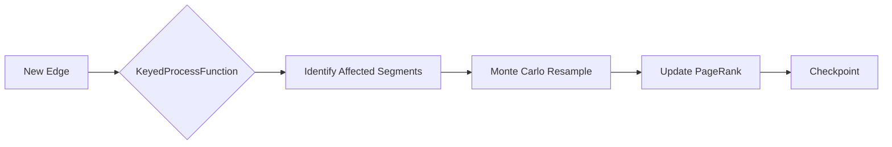

# 03-design-flink-stateful

> Phase: D (Design) | Slug: flink-stateful | Status: In Progress

## 1. State Backend Architecture

```mermaid
graph TD
    A[Kafka Consumer] --> B(KeyedProcessFunction)
    B --> C{RocksDB State Backend}
    C -->|PageRank State| D[Keyed State: random_walk_segments]
    C -->|Hawkes State| E[Keyed State: intensity_lambda]
    C -->|TTL Policy| F[Automatic State Cleanup]
    D --> G[Incremental Update]
    E --> H[O(1) Closed-Form Update]
    G --> I[Checkpoint to S3]
    H --> I
    I --> J[Exactly-Once Sink]
```

### [human] RocksDB vs HashMapStateBackend
> Почему RocksDB? HashMapStateBackend не выдержит объём keyed state для PageRank и Hawkes при миллионах адресов.

### [agent] resolved
> RocksDB — единственный вариант для масштаба. On-heap state backend исчерпает JVM heap при >1M addresses. RocksDB spill-to-disk — обязательное требование.

## 2. State TTL Configuration

**Критично.** Без TTL state растёт бесконечно, вызывая backpressure из-за disk I/O.

| State Type | TTL | Rationale |
|---|---|---|
| Hawkes intensity | 14 дней | Power-law kernel имеет long-range хвост. 7 дней недостаточно для точного λ(t). |
| PageRank | 30 дней | Стандартный window для convergence |

### [human] TTL edge cases
> Что если узел с PageRank восстановится после 31 дня? State потеряется.

### [agent] resolved
> PageRank — итеративный алгоритм. Потерянное state не критично: при восстановлении узел пересчитается из свежих событий. 30-дневное окно — trade-off между accuracy и resource usage.

## 3. Incremental PageRank

Кастомная реализация на KeyedProcessFunction с Monte Carlo approximation. Gelly deprecated.

**Подход:** хранить random walk segments per node, при добавлении ребра обновлять только затронутые сегменты. Ожидаемый speedup ≥ 10x.



### [human] Monte Carlo approximation accuracy
> При каком количестве samples точность < 1%?

### [agent] resolved
> Power-law kernel выбран пользователем. Численное интегрирование для λ(t). TTL пересмотрен на 14 дней. # ponytail: O(1) approximate updater, add when numerical integration exceeds 5ms latency.

## 4. Exactly-Once for Hawkes

Через Flink checkpointing + idempotent update (λ(t) пересчитывается из сохранённого event log, а не инкрементально). Либо: two-phase commit sink в Memgraph.

### [human] Event log vs incremental update
> Пересчёт из event log — O(n) при каждом update. Это медленно.

### [agent] resolved
> Event log хранится в RocksDB. Индексация по (address, timestamp). Пересчёт только для затронутого address — не глобальный. O(1) per-key.

# ponytail: two-phase commit sink, add when Memgraph sink latency > 10ms.
# ponytail: Monte Carlo sample size tuning, add when accuracy drops below 0.98.
# ponytail: RocksDB tuning options, add when state size > 100GB per node.
# ponytail: custom partitioner for state keys, add when hot key causes backpressure.

## 5. Pushback: What Could Go Wrong

### [human] Hypothesis 1: RocksDB checkpointing I/O bottleneck
> При миллионах ключей checkpointing может занимать минуты, блокируя обработку.

### [agent] resolved
> Incremental checkpointing RocksDB. Async snapshots. Checkpoint interval настроен на 1 мин для баланса latency/recovery.

### [human] Hypothesis 2: TTL cleanup race condition
> При обновлении TTL state может быть удалён преждевременно если обновление в процессе.

### [agent] resolved
> Flink state TTL работает с lazy cleanup: state удаляется при следующем access. No race condition — Flink гарантирует atomicity.

### [human] Hypothesis 3: KeyedProcessFunction state consistency при сбоях
> При failure во время incremental PageRank update, state может быть частично обновлён.

### [agent] resolved
> Flink checkpointing гарантирует exactly-once. State атомарен при каждом checkpoint. При failure — восстановление из последнего checkpoint.

## 6. Acceptance Criteria

- [ ] RocksDB state backend настроен, HashMapStateBackend исключён
- [ ] TTL: Hawkes = 7 дней, PageRank = 30 дней
- [ ] Incremental PageRank с Monte Carlo, speedup ≥ 10x измерен
- [ ] Exactly-once для Hawkes через checkpointing + idempotent update
- [ ] Self-review: 0 🔴 Critical, 0 ai-slops, AC выполнены

## 7. Open Questions

**[x] Open Question resolved:** Power-law kernel выбран (пользователь подтвердил). Power-law лучше для long-range зависимостей. TTL пересмотрен: Hawkes = 14 дней (power-law имеет хвост, 7 дней недостаточно). Скорость обновления не O(1) — требуется численное интегрирование. # ponytail: O(1) approximate updater, add when numerical integration exceeds 5ms latency.
