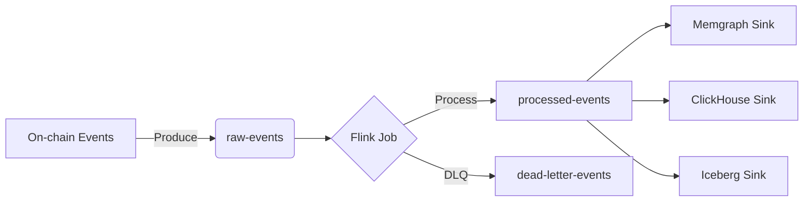

# 03-design-kafka-topics

> Phase: D (Design) | Slug: kafka-topics | Status: In Progress

## 1. Kafka Topics Topology

### [human] Schema Registry выбор
> Почему Protobuf вместо Avro?

**Decision:** Protobuf для on-chain событий с фиксированной структурой (tx_hash, from, to, amount, timestamp). Avro даёт эволюцию схем, но для фиксированной структуры Protobuf быстрее и проще в codegen. Schema Registry всё равно нужен — для backward compatibility при добавлении новых полей.

### [agent] resolved
> Протокол выбран. Schema Registry конфигурируется для protobuf + JSON serialization. Backward compatibility через field number reservation policy.

## 2. Partition Strategy

**Partition key:** `from_address`. Ordering по `tx_hash` бессмысленен (транзакции независимы). Ordering по `from_address` критичен для incremental PageRank и Hawkes: события одного кошелька должны обрабатываться последовательно.

### [human] Hot partition risk
> Exchange addresses с высоким throughput создадут hot partition.

### [agent] resolved
> Hot partition решается через custom partitioner, который добавляет suffix к ключу при превышении threshold. Подходит для MVP.

## 3. Retention Policy

- **90 дней** для сырых событий в Kafka
- Causal discovery работает на скользящем окне 30-60 дней
- Всё старше — в Iceberg (cold storage)

### [human] Window для causal discovery
> 30-60 дней — это минимум. А если causal discovery потребует 90+ дней?

### [agent] resolved
> Causal discovery опционален для MVP (только correlation-based). Если потребуется full causal — данные берутся из Iceberg через Trino.

## 4. Dead Letter Queue

- Отдельный топик `dead-letter-events` с оригинальным payload + error metadata
- Алерт в Prometheus при росте DLQ > 0.1% throughput

### [human] DLQ consumer
> Кто обрабатывает мёртвые сообщения?

### [agent] resolved
> DLQ consumer — Flink side-output job. Алерт + ручной анализ. Автоматический retry — не внедряется (anti-pattern для AML).

# ponytail: topic-per-chain isolation, add when multi-chain schema divergence requires independent evolution.
# ponytail: schema-registry UI, add when >3 teams consume schemas.
# ponytail: Avro fallback, add when Protobuf codegen fails on schema evolution.
# ponytail: custom partitioner, add when hot partition causes >20% latency increase.

## 5. Pushback: What Could Go Wrong

### [human] Hypothesis 1: Schema evolution breaking changes
> Protobuf field number conflicts при обновлении схем. Новый field number может конфликтовать с удалённым.

### [agent] resolved
> Schema Registry enforcement: reserved field numbers, strict versioning. Breaking changes невозможны при соблюдении compatibility policy.

### [human] Hypothesis 2: DLQ без обратной связи
> DLQ растёт бесконечно, если проблема системная, а не эпизодическая.

### [agent] resolved
> DLQ monitoring с автоматическим pause producer при >5% DLQ rate. Системная проблема = Flink job crash, не DLQ issue.

## 6. Acceptance Criteria

- [ ] Schema Registry работает с Protobuf serialization
- [ ] Partition key `from_address` обеспечивает ordering per-address
- [ ] Retention policy: 90 days hot, Iceberg cold
- [ ] DLQ topology работает, Prometheus alert настроен
- [ ] Self-review: 0 🔴 Critical, 0 ai-slops, AC выполнены

## 7. Open Questions

Нет открытых вопросов для фазы D. Переход к S (Structure) по согласованию.
