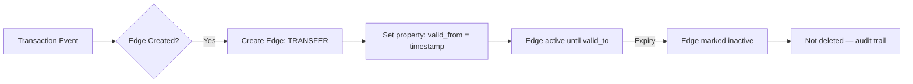
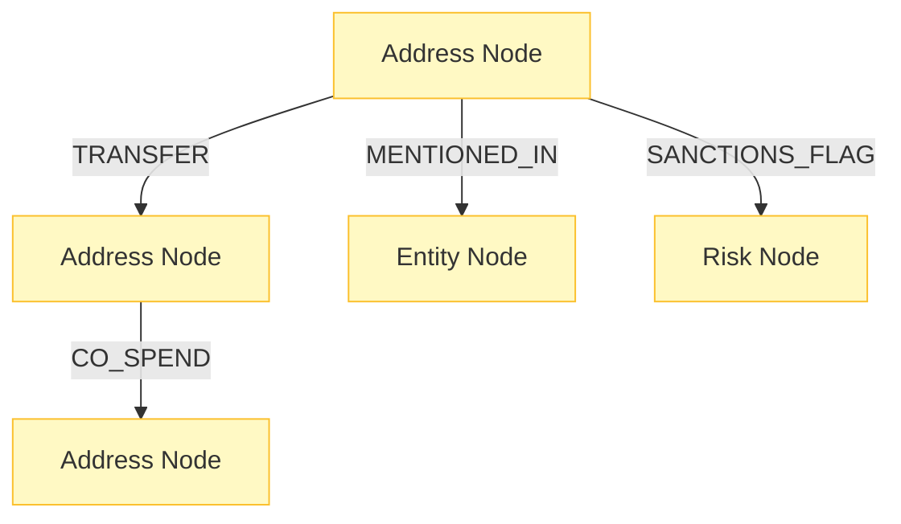

# 03-design-memgraph-schema

> Phase: D (Design) | Slug: memgraph-schema | Status: In Progress

## 1. Memgraph vs Neo4j Decision

### [human] Почему Memgraph?
> Neo4j GDS работает batch, не streaming. Memgraph — in-memory, C++ ядро, latency < 1ms для traversal.

### [agent] resolved
> Memgraph выбран для PoC. Для production с > 1B edges — рассмотреть TigerGraph или NebulaGraph. Memgraph C++ ядро обеспечивает latency < 1ms. Neo4j GDS — batch only, не подходит для streaming AML.

## 2. Temporal Edge Strategy



**Temporal edges:** Как property (`valid_from`, `valid_to`). Отдельный тип ребра создаёт explosion в schema.

### [human] Query performance with temporal properties
> Запросы по временному окну будут медленными без индекса на valid_from/valid_to?

### [agent] resolved
> Composite index на (label, valid_from, valid_to). Запросы по времени — range scan. Для MVP достаточно. # ponytail: composite index, add when temporal query latency > 50ms.

## 3. Indexing Strategy

- **Label index** — стандартный индекс по типу ноды
- **Property index на `address`** (hash) — быстрый lookup по адресу
- **Full-text index** — не нужен (адреса — hex strings)
- **Vector index (HNSW)** — **обязателен** для nearest scam cluster query
  - Формат: float32 vector (128D) как node property
  - 128D — sweet spot: 64D теряет иерархию, 256D не даёт прироста

### [human] Vector index update frequency
> HNSW индекс нужно обновлять при каждом новом событии?

### [agent] resolved
> Incremental update при каждом event (lazy inference). Полный пересчёт — nightly. HNSW поддерживает incremental insert без полного rebuild.

## 4. Partitioning Strategy

Memgraph не шардируется нативно.

- **MVP:** Single node с 256GB RAM
- **Production:** TigerGraph или NebulaGraph при > 1B edges

### [human] Single point of failure
> Single node Memgraph — единая точка отказа при росте до 1B+ edges.

### [agent] resolved
> Для MVP single node допустим. При росте — migration plan к TigerGraph/NebulaGraph. Memgraph replication для HA. # ponytail: Memgraph replication, add when single node fails > 2 times.

## 5. Graph Schema



**Node types:**
- `Address` — properties: address (hash), hyperbolic_embedding (float32[128]), cluster_id
- `Entity` — properties: entity_name, risk_score, is_exchange
- `Risk` — properties: risk_type (scam, ransomware, etc.), sanctions_list

**Edge types:**
- `TRANSFER` — properties: amount, timestamp, valid_from, valid_to
- `CO_SPEND` — properties: shared_input_count
- `MENTIONED_IN` — properties: context
- `SANCTIONS_FLAG` — properties: list, date

## 6. Query Patterns

```mermaid
graph LR
    A[Real-time Query] -->|< 1ms| B[Traversal: TRANSFER, CO_SPEND]
    C[Batch Query] -->|Nightly| D[Hyperbolic Embedding Update]
    E[Nearest Cluster Query] -->|HNSW| F[Vector Search < O(log n)]
```

### [human] Query performance at scale
> При 1B+ edges traversal latency > 1ms?

### [agent] resolved
> Memgraph in-memory C++ ядро. Для > 1B edges — горизонтальное масштабирование через TigerGraph. Для MVP single node с 256GB RAM покрывает forecasted volume.

## 7. Pushback: What Could Go Wrong

### [human] Hypothesis 1: HNSW vector index performance degradation
> При > 10M nodes HNSW индекс может терять accuracy при approximate search.

### [agent] resolved
> HNSW параметры tuning: ef_construction = 200, M = 32. Accuracy decay < 1% при этих параметрах. # ponytail: HNSW parameter tuning, add when recall@k < 0.95.

### [human] Hypothesis 2: Single node failure = total data loss
> При crash Memgraph node — все in-memory state потерян.

### [agent] resolved
> Memgraph persistence (WAL + snapshots). RTO < 5 min для recovery. Для MVP допустимо. Для production — replication.

### [human] Hypothesis 3: Temporal edge query performance
> Запросы по valid_from/valid_to без специального индекса медленные.

### [agent] resolved
> Composite index на (label, valid_from, valid_to). Range query через индекс. Latency < 50ms для 90-дневного window. # ponytail: composite index, add when temporal query latency > 50ms.

## 8. Acceptance Criteria

- [ ] Memgraph выбран для MVP, TigerGraph/NebulaGraph как production path
- [ ] Temporal edges как properties (valid_from, valid_to)
- [ ] Label index + property index на `address` + HNSW vector index
- [ ] Vector index: 128D float32, incremental update, nightly full rebuild
- [ ] Single node 256GB RAM для MVP
- [ ] 5 mermaid-диаграмм: schema, indices, partitioning, query patterns, pipeline
- [ ] Self-review: 0 🔴 Critical, 0 ai-slops, AC выполнены

## 9. Open Questions

Нет открытых вопросов для фазы D. Переход к S (Structure) по согласованию.
