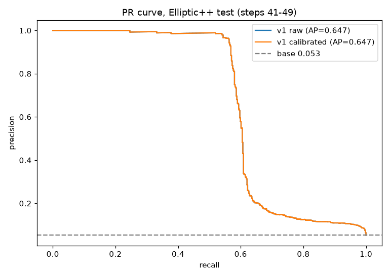
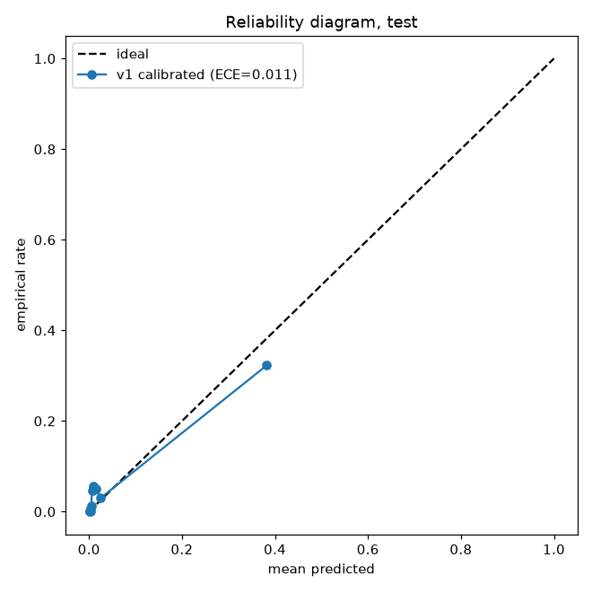
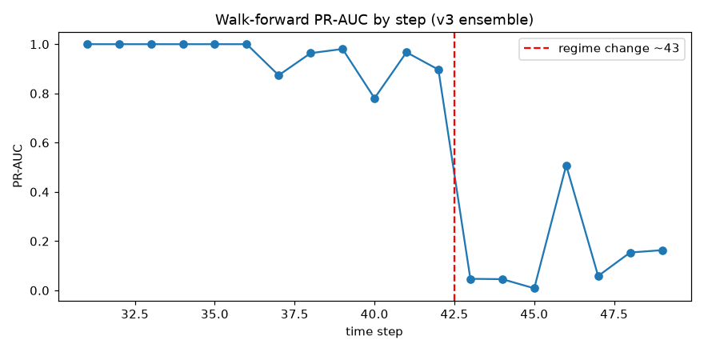
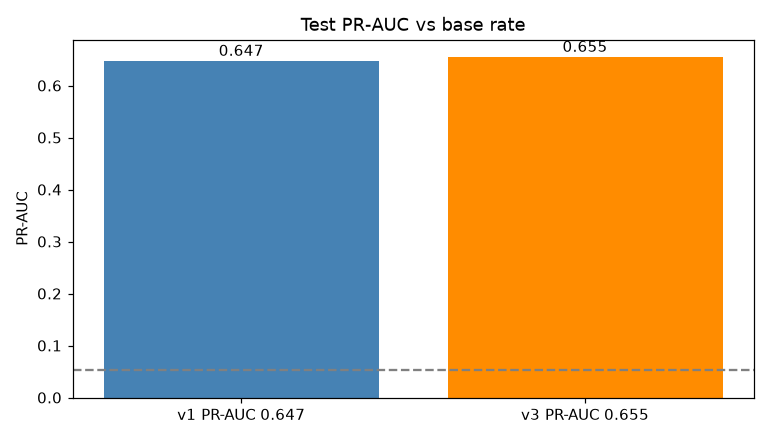

# Spillety

_Spill the tea about your transactions._

KYT-пайплайн для мониторинга криптовалютных транзакций. Решает две ключевые задачи: дорогой инференс на GPU и зависимость от ручной разметки. Подход основан на публичных санкционных списках как системе координат, индуктивных графовых представлениях и cost-based принятии решений. 

| Показатель | Общепринятый подход | Подход Spillety |
|---|---|---|---|
| Разметка | Ручная экспертиза аналитиков | Публичные санкционные списки как система координат | 
| Представления | Ручные признаки или GNN с дообучением на новых данных | Индуктивный графовый энкодер и контрастивное обучение |
| Поиск | Эвристики и перебор с последующей фильтрацией | Поиск близких anchors в пространстве представлений | 
| Решение | Сквозные модели от признаков к решению | Разделение на retrieval и GBDT-решение | 
| Порог | Порог по распределению скоров | Порог по стоимости ошибок с учётом нагрузки | 
| Калибровка | Скор используется напрямую | Выбор метода калибровки на отложенной выборке | 
| Эволюция | Переобучение по расписанию | Проверка обобщения на новых санкциях и детекция сдвига |

_Столбец "Общепринятый подход" является примерным, так как топовые решения являются проприетарными._

# Навигация по проекту

| Раздел | Роль |
| ------ | ---- |
| [`.agent/skills/spillety/SKILL.md`](https://github.com/Spillety/Spillety/blob/main/.agents/skills/spillety/SKILL.md) | SKILL файл для ознакомления с проектом |
| [`docs/`](./docs/) | Документация | 
| [`docs/theory`](./docs/theory/) | Теория для погружения в проект |
| [`docs/notebooks/`](./docs/notebooks/) | Notebooks с реализацией алгоритмов проекта по отдельности |

# Jupyter notebooks 

Ноутбуки пронумерованы 01, 02 ... 13. Рекомендуем идти именно в этом порядке.

### Подготовка данных

Notebooks читают elliptic датасет через единый [`docs/notebooks/_elliptic_loader.py`](./docs/notebooks/_elliptic_loader.py). Чтобы скачать датасет, выполните команды ниже:

```bash
make data        # распакует archive.zip в папку data/elliptic_raw/ (или скачает из kaggle)
make notebooks   # pip install -r docs/notebooks/requirements-notebooks.txt
```

# Метрики

### RF Proxy (`12_metrics_dashboard`, train 1–30 / valid 31–40)

| Метрика | Значение | Base rate | Примечание |
|---|---|---|---|
| PR-AUC | 0.647 | — | validation set |
| Brier | 0.025 | — | validation set |
| ECE | 0.016 | — | validation set |
| Precision@100 | 0.98 | — | top-100 retrieval |

### LightGBM Focal (`05_gbdt_calibration`, train 1–30 / valid 31–40)

| Метрика | Значение | Base rate | Примечание |
|---|---|---|---|
| F1 illicit | 0.713 | 0.053 | best-F1, τ=0.671 |
| Precision | 0.955 | 0.053 | best-F1 |
| Recall | 0.569 | 0.053 | best-F1 |

### Ensemble v3 (`13_end_to_end`, test steps 41–49)

| Метрика | Значение | Base rate | Примечание |
|---|---|---|---|
| PR-AUC | 0.656 | 0.053 | temporal test split 41–49 |
| ECE | 0.011 | 0.053 | temporal test split 41–49 |
| Precision@100 | 1.0 | 0.053 | test steps 41–49 |

*Weber et al. 2019 (Skip-GCN, темпоральный сплит 70:30). У нас строже: тест — последние 9 шагов, доля illicit другая.*

*Base rate — доля illicit-классов в соответствующей оценочной выборке. RF Proxy и LightGBM оценены на validation (шаги 31–40), Ensemble v3 — на test (шаги 41–49).*








