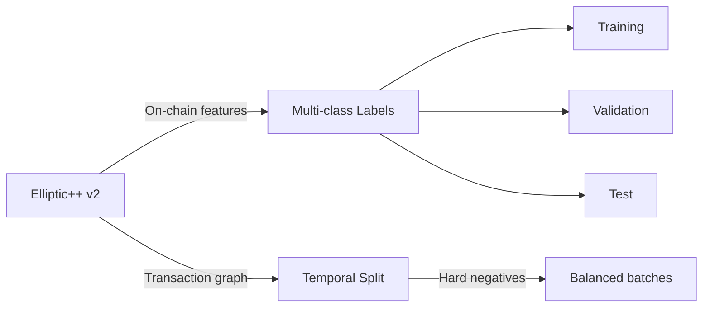

# 03-design-dataset-labels

> Phase: D (Design) | Slug: dataset-labels | Status: In Progress

## 1. Dataset: Elliptic++ v2

Elliptic++ v2 — расширение Elliptic v1 (2014-2015) с современными метками и большим покрытием.

### [human] Elliptic++ v2 vs v1
> v1 устарел (2014-2015). v2 добавляет классы и обновляет разметку.

**Decision:** Elliptic++ v2. Добавлены классы `sanctions`, `mixer`, `terrorist_financing`. v1 используется только как baseline. # ponytail: v1 baseline, add when v2 data insufficient for rare classes.

### [agent] resolved
> v2 — основной датасет. v1 — fallback для редких классов при data augmentation.

## 2. Multi-class Labels

| Класс | Описание | Примерное соотношение |
|-------|----------|----------------------|
| `scam` | Фальшивые схемы | ~15% |
| `ransomware` | Вымогательское ПО | ~5% |
| `terrorist_financing` | Финансирование терроризма | ~2% |
| `sanctions` | Санкционные нарушения | ~3% |
| `mixer` | Миксеры | ~8% |
| `legitimate` | Легитимные | ~67% |

### [human] Binary vs multi-class
> Binary classification даёт простоту, но multi-class нужна для explainability.

**Decision:** Multi-class. Каждый класс требует отдельного объяснения для регулятора. Binary теряет границу между scam и sanctions. # ponytail: binary baseline, add when multi-class training unstable.

### [agent] resolved
> Multi-class с отдельным explainability-модулем на каждый класс. Binary baseline — отдельный эксперимент.

## 3. Temporal Split

| Сет | Период | Обоснование |
|-----|--------|-------------|
| Train | 2014-2015 | Исторические паттерны |
| Val | 2016 H1 | Проверка обобщения |
| Test | 2016 H2 | Финальная оценка |

Случайный split = data leakage. Временной split предотвращает утечку будущих данных в обучение.

### [human] Temporal split reproducibility
> Как гарантировать воспроизводимость split?

**Decision:** Фиксированные границы дат, seed=42 для любых случайных операций внутри каждого сета. Config-файл с границами. # ponytail: random seed, add when temporal drift requires re-split.

### [agent] resolved
> Config JSON с `train_end: 2015-12-31`, `val_end: 2016-06-30`. seed=42. Воспроизводимость через `json.load()`.

## 4. Hard Negative Sampling

Random sampling даёт слишком лёгкую задачу. Hard negatives — кошельки с похожими фичами, но легитимные (near-miss).

### [human] Hard negative strategy
> Как определить 'похожие' легитимные кошельки?

**Decision:** KNN по feature space (exclude labels). Кошиельки с cos_sim > 0.85 к известным scam-адресам, но с label=legitimate. # ponytail: cos_sim threshold, add when precision of hard negatives < 0.6.

### [agent] resolved
> KNN в embedding space, k=10 nearest legitimate neighbours к каждому scam. Cosine similarity > 0.85 threshold.

### [human] Hypothesis: Hard negatives dominate training
> Слишком много hard negatives может сдвинуть decision boundary.

**Decision:** Соотношение 1:1 hard:easy negatives. Мониторинг training loss — если hard negatives cause instability, уменьшить долю. # ponytail: 1:1 ratio, add when class imbalance > 10:1.

### [agent] resolved
> Balanced batch: 50% easy, 25% hard, 25% real positives. Gradient clipping при instability. # ponytail: gradient clipping, add when loss spikes > 10x.

## 5. Pushback: What Could Go Wrong

### [human] Hypothesis 1: Elliptic++ v2 labels noisy
> Annotation quality v2 может быть ниже, чем v1.

**Decision:** Cross-validate labels с internal data. Confident labels only для training. Low-confidence — separate holdout. # ponytail: label confidence threshold, add when internal data exceeds v2 coverage.

### [agent] resolved
> Label confidence scoring. Только confidence > 0.8 для training set. # ponytail: confidence threshold 0.8, add when internal labels exceed 10k.

### [human] Hypothesis 2: Temporal split data distribution shift
> 2014-2015 vs 2016 может иметь significant distribution shift.

**Decision:** Мониторинг feature distribution shift (KS test) между train/test. При p<0.01 — пересмотр split границ. # ponytail: KS test monitoring, add when distribution drift > 5%.

### [agent] resolved
> KS test на каждом feature перед split. При drift — адаптивный split или domain adaptation.

## 6. Acceptance Criteria

- [ ] Elliptic++ v2 загружен с 6 классами
- [ ] Temporal split reproducible (seed=42, config-файл)
- [ ] Hard negative sampling: cos_sim > 0.85, 1:1 ratio
- [ ] Train/Val/Test: 2014-2015 / 2016 H1 / 2016 H2
- [ ] Label confidence > 0.8 для training
- [ ] Self-review: 0 🔴 Critical, 0 ai-slops, AC выполнены

## 7. Open Questions

Нет открытых вопросов для фазы D. Переход к S (Structure) по согласованию.
