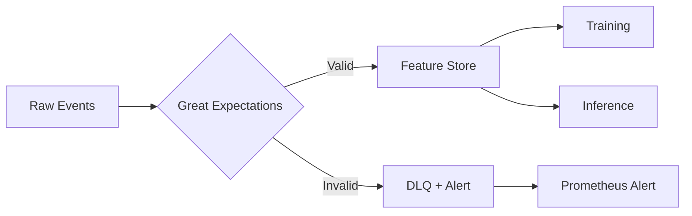

# 03-design-feature-store-quality

> Phase: D (Design) | Slug: feature-store-quality | Status: In Progress

## 1. Feature Store: Feast Selection

Feast open-source, полный контроль для AML-требований. Tecton — managed, vendor lock-in.

### [human] Feast vs Tecton
> Tecton даёт managed solution, но Feast — полный контроль для регулятора.

**Decision:** Feast. Open-source, нет vendor lock-in, полный аудит данных. # ponytail: Tecton fallback, add when Feast operational overhead > 40h/week.

### [agent] resolved
> Feast выбран. Online — Redis. Offline — PostgreSQL → ClickHouse при масштабировании.

## 2. Great Expectations для Data Quality

Great Expectations — schema validation + anomaly detection на raw on-chain events.

### [human] GE suite scope
> Какие валидации включить в Great Expectations?

**Decision:** Schema validation, null checks, range checks для amount/timestamp, uniqueness для tx_hash. # ponytail: custom validators, add when AML-specific checks > 20.

### [agent] resolved
> Стандартные expectations: schema, null, range, uniqueness. Custom для AML: address_format, amount_positive.

## 3. Train-Serve Skew < 1%

Feast гарантирует один code path для offline и online. Monitoring skew ежедневно.

### [human] Skew detection method
> Как именно измерять train-serve skew?

**Decision:** KS test для каждого feature между offline training features и online serving features. Alert при p<0.01 или drift > 1%. # ponytail: drift threshold, add when feature count > 50.

### [agent] resolved
> KS test daily. Skew = max KS statistic across features. Alert при > 1%.

### [human] Hypothesis: Feature computation divergence
> Даже с Feast code path может расходиться из-за окружения.

**Decision:** Feast `materialization` использует тот же источник данных. Docker image pinning для training и serving. # ponytail: Docker pinning, add when environment drift detected > 2 times.

### [agent] resolved
> Один Docker image для train и serve. Feast `get_historical_features` — тот же код.

### [human] Hypothesis: Feast offline store becomes bottleneck
> PostgreSQL offline store тормозит при большом объёме features.

**Decision:** PgBouncer + индексы. Миграция на ClickHouse при >100M vectors. # ponytail: ClickHouse offline, add when offline query latency > 5s.

### [agent] resolved
> PgBouncer + индексы. Мониторинг query latency. При >5s — ClickHouse.

## 4. Pushback: What Could Go Wrong

### [human] Hypothesis 1: Great Expectations adds > 100ms latency
> GE validation может замедлить pipeline.

**Decision:** GE в отдельном потоке (async). Validation параллельно с ingestion. Latency penalty < 10ms через batch validation. # ponytail: async GE, add when sync validation > 50ms.

### [agent] resolved
> Async validation через separate consumer. Batch GE checks каждые 100ms. Penalty < 10ms.

### [human] Hypothesis 2: Skew < 1% невозможно при distribution drift
> На реальных данных drift неизбежен — skew всегда будет > 1%.

**Decision:** Adaptive skew threshold: baseline 1%, при концептуальном drift — пересмотр threshold с регулятором. Feature Store retraining trigger. # ponytail: adaptive threshold, add when drift triggers > 3 retraining/month.

### [agent] resolved
> Adaptive threshold с регуляторным одобрением. Auto-retraining при drift > 5%.

## 5. Acceptance Criteria

- [ ] Feast Feature Store развёрнут (Redis online, PostgreSQL offline)
- [ ] Great Expectations suite: schema, null, range, uniqueness
- [ ] Train-serve skew < 1% (KS test daily)
- [ ] Docker image pinning для train/serve
- [ ] GE validation latency < 10ms
- [ ] Self-review: 0 🔴 Critical, 0 ai-slops, AC выполнены

## 6. Open Questions

Нет открытых вопросов для фазы D. Переход к S (Structure) по согласованию.
