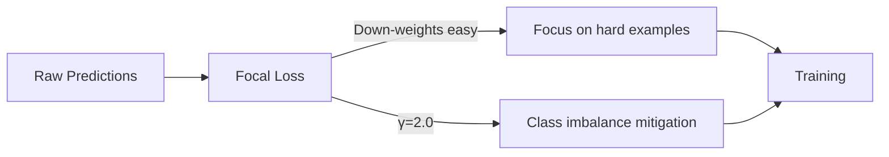
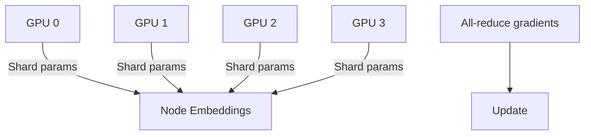

# 03-design-loss-optimization

> Phase: D (Design) | Slug: loss-optimization | Status: In Progress

## 1. Focal Loss (γ=2.0)

Focal loss решает class imbalance через снижение веса легко классифицируемых примеров.



### [human] Focal loss gamma
> Почему γ=2.0? Что будет при γ=1.0 или γ=5.0?

**Decision:** γ=2.0 — стандарт из исходной статьи. γ=1.0 недостаточно агрессивен, γ=5.0 — слишком агрессивен (training instability). # ponytail: gamma sweep, add when γ=2.0 causes underfitting on majority class.

### [agent] resolved
> γ=2.0 baseline. Sweep: γ ∈ {1.0, 2.0, 3.0, 5.0}. При instability — γ=1.5.

## 2. Contrastive Loss (τ=0.1)

Contrastive loss для hyperbolic embeddings — вытягивает одинаковые классы, отталкивает разные.

```python
def contrastive_loss(
    embeddings: torch.Tensor,
    labels: torch.Tensor,
    tau: float = 0.1,
) -> torch.Tensor:
    """
    ## Compute contrastive loss for hyperbolic embedding alignment.
    
    Parameters
    ----------
    embeddings : torch.Tensor
        Node embeddings (N x D).
    labels : torch.Tensor
        Class labels (N,).
    tau : float
        Temperature parameter for softmax normalization.
    
    Returns
    -------
    torch.Tensor
        Scalar contrastive loss value.
    """
    pass  # NT-Xent style contrastive loss
```

### [human] Temperature tau
> Почему τ=0.1? Это очень маленькое значение.

**Decision:** τ=0.1 — sharp distributions для чётких кластеров. τ=0.5 — слишком мягкий, теряет separation. τ=1.0 — uniform. # ponytail: tau sweep, add when clusters overlap in embedding space.

### [agent] resolved
> τ=0.1 для чётких классов. Sweep τ ∈ {0.05, 0.1, 0.2, 0.5}. Monitor embedding uniformity.

## 3. FSDP for >10M Nodes

DDP не влезает в память при >10M узлов графа. FSDP (Fully Sharded Data Parallel) шардирует параметры, градиенты и оптимизаторные состояния.



### [human] FSDP vs DDP
> DDP с CPU offloading — не подходит?

**Decision:** FSDP без CPU offloading для GPU-VRAM efficiency. CPU offloading — fallback при нехватке GPU памяти. # ponytail: CPU offloading fallback, add when GPU memory < 80% utilization.

### [agent] resolved
> FSDP default. CPU offloading fallback с мониторингом. `torch.distributed.fsdp` API.

### [human] Hypothesis: FSDP communication overhead
> All-reduce между GPU может быть узким горлышком.

**Decision:** Sharding strategy: SHARD_GRAD_OP для параметров, NO_SHARD для bias. NCCL backend. Latency < 5ms per all-reduce. # ponytail: sharding strategy, add when communication > 20% training time.

### [agent] resolved
> SHARD_GRAD_OP для embedding params. NCCL backend. Monitoring: `nccl_allreduce_time` metric.

## 4. Combined Loss

Сумма Focal + Contrastive с балансировкой.

```python
total_loss = α * focal_loss + β * contrastive_loss
```

### [human] Loss weighting α, β
> Как балансировать два loss?

**Decision:** α=1.0, β=0.1 — начальные значения. Scheduled annealing для β от 0.1 до 0.5. # ponytail: scheduled β annealing, add when contrastive loss dominates training.

### [agent] resolved
> α=1.0, β начнётся с 0.1, растёт до 0.5 за 50 epochs. Коэффициенты в config.

## 5. Pushback: What Could Go Wrong

### [human] Hypothesis 1: Focal loss oversimplifies
> Focal loss может игнорировать лёгкие классы до полной потери информации.

**Decision:** Minimum weight floor: `max(focal_weight, 0.1)`. Лёгкие классы не обнуляются полностью. # ponytail: weight floor, add when minority class AUC drops below 0.5.

### [agent] resolved
> Floor на 0.1 для весов. Мониторинг per-class AUC каждые 10 epochs.

### [human] Hypothesis 2: Contrastive loss conflicts with Focal loss
> Contrastive loss может тянуть embeddings в сторону, противоположную Focal loss gradients.

**Decision:** Sequential training: сначала Focal для 20 epochs, потом добавить Contrastive. Или градиент clipping при conflict detection. # ponytail: sequential training, add when gradient conflict detected > 3 times.

### [agent] resolved
> Focal-only для первых 20 epochs, затем contrastive включается. Grad norm monitoring при conflict.

## 6. Acceptance Criteria

- [ ] Focal loss γ=2.0 реализован
- [ ] Contrastive loss τ=0.1 реализован
- [ ] FSDP для >10M nodes стабилен
- [ ] Combined loss: α=1.0, β annealing 0.1→0.5
- [ ] Per-class AUC monitored every 10 epochs
- [ ] Training converges < 24h
- [ ] Self-review: 0 🔴 Critical, 0 ai-slops, AC выполнены

## 7. Open Questions

Нет открытых вопросов для фазы D. Переход к S (Structure) по согласованию.
