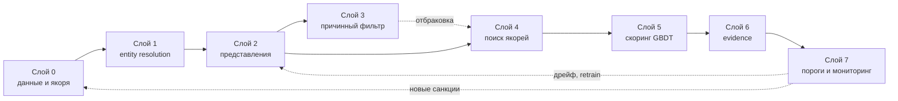

# Архитектура: восемь слоёв от сырого графа до проверяемого алерта

Spillety устроена как конвейер, в котором каждый следующий слой сужает и уточняет смысл предыдущего.
Сырые транзакции превращаются в систему координат, координаты — в кластеры и представления,
представления — в ранжированные подозрения, а подозрения — в калиброванную вероятность с приложенным доказательством.

Сквозной принцип держится на четырёх ролях: расстояние измеряет, причинный граф отбраковывает,
градиентный бустинг решает, а всё, что вышло наружу, воспроизводимо из хешированного JSON.

Временная дисциплина соблюдается везде одинаково: обучение видит только шаги до тридцатого включительно,
валидация — шаги с тридцать первого по сороковой, тест — с сорок первого по сорок девятый.
Дефолты зашиты в сигнатуру `temporal_split` из `spillety/data/loader.py`,
так что случайный шафл исключён на уровне интерфейса, а не договорённости.
Весь конвейер работает на CPU, без ускорителей.

## Слой 0. Данные и якоря: система координат, а не разметка

Первый слой отвечает на вопрос, относительно чего вообще измерять подозрительность.
Ответ Spillety — относительно якорей: адресов из открытых санкционных перечней,
которые не используются как training labels, а задают точки отсчёта в пространстве представлений.
Различие существенное: якорь не учит модель классу, он даёт линейку,
и смена линейки не требует переобучения всего тракта.

Загрузка графа Elliptic++ сосредоточена в `spillety/data/loader.py`.
Функция `load_elliptic` собирает признаки, классы и рёбра в единый фрейм,
а `temporal_split` режет его по шагам на train, validation и test с границами 30 и 40.
Санкционные адреса подтягиваются скриптом `scripts/fetch_sanctions.py`
и складываются в `data/sanctions/addresses.csv` — на момент написания там 507 строк
из OFAC-SDN и европейского перечня.
Финальность цепочки и глубина подтверждений проверяются через `is_finalized` из `data/canonical.py`,
чтобы перестроение на границе окна не превращалось в шум признаков.

Якорный замысел держится на допущении, что санкционная близость коррелирует с риском,
и допущение это одностороннее: отсутствие якоря поблизости ничего не доказывает.
Санкционные перечни смещены в сторону того, что регуляторы уже нашли,
и якорная линейка наследует это смещение.
Частично оно компенсируется анализом чувствительности на третьем слое, но полностью не снимается.
Bitcoin-граф Elliptic++ открыт и воспроизводим, однако перенос выводов на account-модель Ethereum
остаётся экстраполяцией, которую контролирует только темпоральная валидация седьмого слоя.

## Слой 1. Entity resolution: склеить адреса владельца

Адрес как единица анализа ненадёжен: один субъект размазывает активность по тысячам кошельков,
и по каждому в отдельности сигнал тонет в шуме.
Поэтому прежде чем что-либо измерять, слой склеивает адреса предполагаемого владельца в кластеры,
и вся дальнейшая работа идёт на уровне кластера.
Агрегированное поведение стабильнее на длинном горизонте, санкционная метка одного адреса
распространяется на весь кластер, а стохастические колебания уровня адреса усредняются.

Реализация разложена на три модуля в `spillety/entity/`.
Модуль `cioh.py` извлекает эвристику общего входа и поведенческие сигналы пары,
`fusion.py` сводит сигналы в апостериорную вероятность принадлежности одному владельцу,
`unionfind.py` сливает пары выше порога в кластеры через DSU с ограничением максимального размера.
Порог слияния подбирается в `select_tau_star` минимизацией ожидаемой стоимости ошибок,
поскольку ложное слияние и ложное разделение стоят по-разному.

В fusion сравнивались логистическая регрессия и копулы.
На валидации логистика дала PR-AUC 0.887 против 0.867 у лучшей копулы Clayton,
и по правилу парсимонии осталась базовой моделью.

Рядом лежит самый неприятный результат волны J1, который нет смысла прятать.
На полном графе транзитивное замыкание слило 203 769 узлов в 49 гигантских кластеров
с минимальным размером 1089, и обе метрики чистоты кластеров — взвешенная и невзвешенная —
обратились в 0.000.
Причина читается из допущения, записанного в `models/er_v1/metrics.json`:
ребро списка трактуется как одна co-spending транзакция, то есть адрес отождествляется
с идентификатором транзакции, а дальше связные компоненты доделывают своё.
Порог, подобранный на парах, не удерживает глобальную структуру —
локально разумные решения дают глобальное пере-слияние.
Слой в таком виде годится для попарного скоринга, но не для наивной кластеризации всего графа,
и любой потребитель отображения в кластеры обязан это помнить.

## Слой 2. Представления: где близость означает похожесть

Задача слоя — вложить кошельки в векторное пространство, где геометрическая близость отражает
структурное и поведенческое сходство, причём без supervision на illicit.
Запрет на supervision здесь load-bearing: если представления увидят метки,
все downstream-метрики превратятся в самоисполняющееся пророчество.

Конструкция стандартная для контрастного обучения.
Положительные пары собираются из совместных трат, временной близости и принадлежности одному кластеру,
отрицательные — из degree-corrected сэмплирования и hard negatives из того же временного окна, но чужих кластеров.
Потери лежат в `spillety/embeddings/loss.py` — NT-Xent с температурой 0.1 и anchor loss с margin,
взвешенным жаккарой согласия санкционных списков.
Генерация пар — в `pairs.py`, аугментации — в `augment.py`, сам энкодер GraphSAGE — в `sage.py`.

Производственная оговорка: в рабочем контуре сейчас стоит PCA32-прокси вместо GraphSAGE,
поскольку `torch_geometric` в окружении отсутствует и тест эмбеддингов пропускается через `importorskip`.
Сам `torch` при этом установлен, не хватает именно графовой надстройки,
и `encode` из `sage.py` прямо требует её установкой с понятным сообщением об ошибке.
Прокси детерминирован, дёшев и честно держит косинусную геометрию,
но message passing он не выполняет, и структурность представлений ниже той,
на которую рассчитана теория.
Замена на настоящий SAGEConv задумана без смены интерфейса, однако до неё retrieval живёт
на упрощённой геометрии.

## Слой 3. Причинный фильтр: от корреляционной близости к допустимой

Близость к якорю в embedding-пространстве корреляционна по построению.
Горячий кошелёк биржи коллоцируется с санкционным адресом из-за сходных графовых характеристик,
а не из-за причинной связи, и без коррекции такая конфигурация — чистая spurious correlation.
Слой существует, чтобы ложные соседи не доходили до скоринга,
и чтобы устойчивость каждого surviving-сигнала была измерена, а не постулирована.

Механика разложена на три модуля в `spillety/causal/`.
Модуль `filter.py` реализует предикат `causal_filter`: якорь отбрасывается,
если его близость к запросу объясняется общим конфаундером, и пропускается,
если сохраняется прямой причинный путь.
Модуль `validate.py` проверяет DAG тестами условных независимостей и фальсификациями
с bootstrap-доверительными интервалами для p-value.
Модуль `select.py` выбирает среди кандидатов DAG-A…DAG-E по числу отвержений
с power-gate по мощности, чтобы неотвержение на слабых данных не читалось как подтверждение.

На реальных данных отбор остановился на DAG-E с единственным конфаундером hawkes —
у него два отвержения против трёх-четырёх у конкурентов при сопоставимой сложности.
Доля якорей, проходящих фильтр, составила 1.000 на train и 0.750 на test.
Падение честное и ожидаемое: на тестовых шагах распределение уже другое,
и фильтр, откалиброванный на прошлом, режет агрессивнее.
Медианные E-value при этом остались ниже порога Tier 1, то есть фильтр работает как фильтр,
а не как печать одобрения.

Оговорки слоя load-bearing, а не ритуальные.
DAG — экспертный априорный граф, и ошибка спецификации транслируется вниз по конвейеру без предупреждения.
Латентные конфаундеры вроде истинного владельца и его намерений ненаблюдаемы в принципе,
поэтому E-value, Γ* и partial R² параметризуют устойчивость, а не исправляют смещение.
Выбор среди пяти кандидатов снижает неопределённость марковского класса эквивалентности, но не устраняет её.

## Слой 4. Поиск: K ближайших якорей как признаки

Четвёртый слой превращает геометрию в табличные признаки для скоринга.
Для каждой транзакции находятся K ближайших якорей, и расстояния до них вместе с агрегатами —
среднее, минимум, квантили, типология источников — уходят в модель решений.
Поиск приближённый, через HNSW, с причинной фильтрацией top-K перед извлечением признаков.
Доля прошедших фильтр сама становится признаком и связывает третий слой с пятым напрямую.

Код лежит в `spillety/retrieval/`: `hnsw.py` строит индекс и меряет качество через `recall_at_k`,
`pq.py` отвечает за экономику хранения и решает, допустимо ли квантование.
Замер на тысяче hold-out запросов дал recall@10 0.995 при долях миллисекунды на запрос —
поиск практически точный, и прокси на kd-tree отдаёт те же топы, что точный brute force.
С квантованием история противоположная: product quantization с шестнадцатью субквантователями
держит recall@10 0.851, что ниже минимального порога 0.93, зашитого в `MIN_RECALL_AT_K`.
Рекомендация слоя однозначна — хранить float32, а политику пересборки индекса
по recall и числу вставок уже принимает `hnsw_action` седьмого слоя.

## Слой 5. Решение: GBDT, калибровка и разбор на вклады

Всё, что накоплено выше — расстояния до якорей, их типы, графовые и темпоральные признаки,
метрики причинной устойчивости, — сходится в одну калиброванную вероятность ilícito в следующем окне.
Модель решения — LightGBM: последовательная коррекция ошибок деревьями допускает
детерминированную трассировку пути, а TreeSHAP даёт точное разложение предсказания
на вклады признаков за полиномиальное время.
Нейросеть в этом месте исключена сознательно — её непрозрачность регулятор квалифицирует
как недостаток, а CPU-инференс бустинга укладывается в потоковую обработку.

Обучение описано в `spillety/models/gbdt.py`.
Сложность выбирается из трёх кандидатов для `num_leaves` — 31, 63 и 127 —
сравнением PR-AUC на hold-out с попарным bootstrap на тысяче репликаций.
При неразличимости берётся меньшая сложность: парсимония здесь правило, а не вкус.
Дисбаланс классов гасится через `scale_pos_weight`, вычисляемый из частот train.
Калибровка живёт в `spillety/models/calibration.py`: изотоническая регрессия
и трёхпараметрическая beta-калибровка подгоняются на валидации,
а выбор между ними делается на тесте по bootstrap-интервалу для разности ECE с Brier-стражем.
Изотоника побеждает только при значимо меньшем ECE без значимого проигрыша в Brier,
иначе остаётся более устойчивая beta.

Финальный ансамбль `models/elliptic_v3` держит PR-AUC 0.655 на тестовых шагах
при базовой доле 5.25% и precision@100, равную 1.0:
первая сотня самых подозрительных — чистый illicit, в топ-500 — почти две трети.
Оговорки стандартные для этого места: классовый дисбаланс смещает модель к большинству
и полностью не снимается весами, калибровка на малых окнах шумная,
а SHAP-вклады ассоциативны — причинную интерпретацию им приписывать нельзя,
для неё есть язык DAG из шестой главы теории.

## Слой 6. Evidence: каждый алерт как проверяемый документ

Шестой слой превращает скор в юридически пригодный артефакт.
Каждый алерт упаковывается в JSON с provenance, причинным путём, чувствительностями и SHAP-вкладами,
затем хешируется SHA-256, и хеш становится его идентичностью.
Любое изменение документа на один символ ломает верификацию —
это проверяется прямым пересчётом, а не доверием к хранилищу.

Модули в `spillety/evidence/` распределены по смыслу.
`evidence.py` строит документ и считает хеш через `build_evidence` и `evidence_hash`
с проверкой через `verify_evidence` за константное время.
`merkle.py` собирает корень и доказательства включения за логарифмическое число хешей,
так что партию алертов можно привязать одним корнем вместо подписания каждого по отдельности.
`sar.py` отображает evidence в черновик SAR и держит human-review gate:
черновик рождается с `approved: False`, автоматическая подача без ревью запрещена конструктивно —
`submit_sar` её отклоняет, а открывает gate только `approve_sar` с именем ревьюера.

Отдельно фиксируется отрицательный факт: модулей `worm.py` и `audit.py` в кодовой базе нет,
и архитектура не ссылается на них как на существующие.
Неизменяемость на уровне кода сейчас держится на хешах, Merkle-дереве и гейте ревью,
а не на WORM-хранилище или подписях — и честное описание не приписывает слою то, чего в нём нет.
SHAP в evidence при этом настоящий, из TreeExplainer конвейера, а не importance-прокси.

## Слой 7. Пороги, стоимость и самонаблюдение во времени

Последний слой решает, что делать с вероятностями: куда маршрутизировать алерт,
когда переобучаться и как отличить смену режима от шума.
Стоимость ошибок задаётся явно — `Cost(τ) = C_FP·FP(τ) + C_FN·FN(τ)` в `spillety/cost/operating.py`,
оптимум ищется по PR-кривой с опциональным бюджетом на число алертов.
Бюджет здесь не косметика: без него при большом штрафе за пропуск порог уползает в ноль
и затапливает очередь аналитиков.

Маршрутизация идёт через `assign_tier`.
Tier 1 требует конъюнкции — скор выше верхнего порога, пройденный причинный фильтр,
E-value выше 2.0 и Γ* выше 1.5; всё, что не прошло gate, понижается в Tier 2 на ручной разбор,
дальше Tier 3 с асинхронным просмотром и автоснятие с выборочным аудитом для несмещённых метрик.
Порог 2.0 для E-value выбран базовым, поскольку bootstrap-интервал прироста precision
при переходе к 2.5 перекрывает нуль при значимом падении recall.

Временной контур живёт в `spillety/temporal/`.
`drift.py` меряет расхождение распределений через KS-статистику, d Коэна
и медианное расстояние до якорей с порогом `tau_d` как 95-м квантилем истории.
`policy.py` классифицирует режим и решает между инкрементом, игнором, ревью и переобучением,
включая `walk_forward_retrain` и `retrain_gate` как закодированные триггеры.
`sampling.py` считает объёмы аудита через power-анализ, чтобы редкие режимы не уходили
из-под наблюдения молча.

Самое поучительное наблюдение пришло с шага 43.
Геометрия осталась в норме — силуэт 0.35, режим normal, медианное расстояние ниже порога, —
а PR-AUC рухнул с 0.897 на шаге 42 до 0.047.
Это коллапс меток, а не геометрии: после смены режима типологии стали другими,
и модель, отлично державшая локальный дрейф, смену режима не пережила.
Walk-forward просадка свыше десяти процентов должна дёргать gate переобучения,
и этот gate в `policy.py` уже закодирован, а не запланирован.

## Сквозное: конвейер, метрики и воспроизводимость

Склейка слоёв в один проход живёт в `spillety/pipeline/pipeline.py`.
Класс конвейера принимает фреймы upstream-слоёв, выдаёт калиброванные вероятности
через decision path пятого слоя и прикладывает к каждому алерту SHAP-разложение
топ-10 признаков через TreeExplainer.
Наблюдение за качеством разложено в `spillety/metrics/` на три модуля:
`dashboard.py` для витрин, `operational.py` для потоковых показателей
и `fairness.py` для групповых разрезов, без которых пороги легко уползают в дискриминацию поневоле.

Прототипы, из которых вырос код, лежат в `docs/notebooks/` под номерами с 01 по 13 —
от базовой таблички и эго-графовых признаков через контрастные эмбеддинги и причинный фильтр
до сквозного конвейера.
Итоговая картина, если смотреть на неё целиком: якоря дают линейку, кластеры — единицу анализа,
представления — геометрию, DAG — отбраковку ложных близостей, поиск — признаки,
бустинг — калиброванное решение, evidence — проверяемость,
а временной контур — признание того, что всё вышеперечисленное протухает,
и вопрос лишь в скорости обнаружения.
