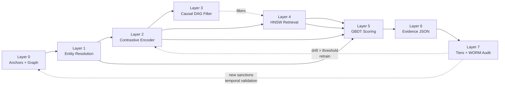
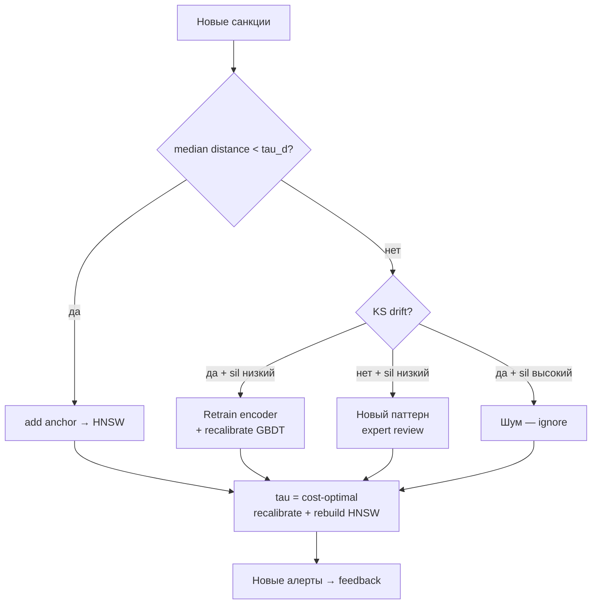

# Architecture — 8 Layers (temp.md §3)

> Эталон: `temp.md` v2.0. Здесь — инженерная детализация каждого слоя: назначение, входы/выходы, алгоритмы, DoD, trade-offs.
> Нотация: `spillety/*` — пакет, `docs/notebooks/XX_*.ipynb` — воспроизводимый прототип.

## Overview



Инвариант архитектуры: **distance — сигнал, DAG — фильтр, GBDT — decision, WORM — audit**. Deep learning только для retrieval (Layer 2 → Layer 4), решение — интерпретируемое (Layer 5).

| Слой | Роль | CPU-only | Требует разметки | SR 26-2 |
|------|------|----------|-----------------|---------|
| 0 | Данные и система координат | да | нет (anchors бесплатны) | data |
| 1 | Кластеризация адресов | да | калибровка на Elliptic++ | not model* |
| 2 | Encoder (GraphSAGE) | да (inference) | нет (contrastive) | model |
| 3 | Causal фильтр | да | экспертный prior + тесты | expert-based model |
| 4 | ANN поиск | да | нет | not model |
| 5 | Скоринг + калибровка | да | labels на hold-out | model |
| 6 | Evidence JSON | да | нет | not model |
| 7 | Tiering + WORM | да | нет | not model |

\* entity resolution — правила + logistic fusion, deterministic, FFIEC independent testing, не model risk по SR 11-7 materiality.

---

## Layer 0 — Открытые данные и Anchors

**Назначение:** сформировать систему координат из бесплатных anchors. Не training labels, а точки отсчёта для измерения расстояния.

**Входы / Выходы:**

| Вход | Выход |
|------|-------|
| On-chain: `elliptic_txs_edgelist.csv` (234k edges), `elliptic_txs_features.csv` (203k × 167), `elliptic_txs_classes.csv` | `merged` DataFrame (203769 × 168), `edgelist`, `features` |
| Anchors: OFAC SDN / EU Consolidated / UN SC / UK OFSI + court docs (DOJ) | `anchor_ids`, `anchor_mask` (illicit = class 1) + `anchor_source` |
| News co-mention (GDELT/RSS, MVP — proxy через `temporal`) | `anchor_corpus` — 4+ источника |
| IBM AML / AMLSim (опционально, pre-training) | Temporal splits `train ≤30 / valid 31..40 / test 41..49` |

**Ключевые алгоритмы:**
- Temporal split без шафла (`spillety/data/loader.py:temporal_split`) — предотвращает leakage.
- Coverage: доля активных адресов, покрытых anchors в окне. Измеряется эмпирически.

**DoD:** auto-updating 4+ источника, coverage измерена, `load_elliptic` проходит `assert features (203769,167)`.

**Trade-offs:**

| Решение | Плюс | Минус |
|---------|------|-------|
| Canonical source + buffer вместо multi-layer reorg | Простота, детерминизм | Потеря глубины reorg >buffer |
| OFAC/EU/UN как anchors, а не labels | Нулевая стоимость разметки | Bias санкций → учитывается в sensitivity (Layer 3) |
| Elliptic++ Bitcoin вместо Ethereum mainnet | Открытость, воспроизводимость | Домен-gap BTC→ETH → temporal validation (Layer 7) |

---

## Layer 1 — Entity Resolution (confidence-scored)

**Назначение:** схлопнуть `N` адресов одного актора в кластер. Профиль строится на кластере, не на адресе.

**Входы / Выходы:**

| Вход | Выход |
|------|-------|
| `edgelist (txId1,txId2)`, `df[txId, time_step]` | `signals: [cioh, temporal, deg_sim]` per pair `→ DataFrame (N_pairs × 5)` |
| Pairs — все рёбра + sampled non-edges | `clf: LogisticRegression` (fusion), `comp_map: txId→cluster_id` |
| Ground truth кластеров (Elliptic++ connectivity) | `confidence = P(cluster \| signals)`, `threshold` по PR-curve |

**Ключевые алгоритмы:**

| Алгоритм | Где | Параметры |
|----------|-----|-----------|
| **CIOH** (Common-Input-Ownership Heuristic) — `a,b` в одном `tx` input → один владелец | `spillety/entity/resolution.py:compute_signals` — `edge_set` lookup O(1) | Точность высока для BTC UTXO, неприменимо к ETH account model → заменяется на nonce/gas сигналы |
| **Temporal co-occurrence** — `|t_a - t_b| ≤ 1` step | то же, `tx_time` dict | Окно эмпирическое; шире → выше recall, ниже precision |
| **deg_sim = 1 - |deg_a - deg_b| / max_deg** | то же | Нормализация к [0,1], max_deg smoothing |
| **Bayesian fusion (logistic proxy copula)** | `fuse_signals` — `LogisticRegression(lbfgs)` | Naive Bayes отброшен (сигналы зависимы); copula/Clayton — ponytail апгрейд. Приоры калибруются на Elliptic++ PR |
| **Union-Find / connected components** | `cluster_union_find` — `nx.connected_components` | O(N+M), proxy для directed → weak connectivity |


**DoD:** precision/recall на pair-level по Elliptic++ ground truth измерены; edge cases в серой зоне не блокируются.

**Trade-offs:**

| Решение | Плюс | Минус |
|---------|------|-------|
| Logistic fusion вместо copula | CPU, стабильность на 500 парах | Теряет tail dependence |
| `deg_sim` как 3-й сигнал | Дешёвый, без KYC | Слабый при uniform degree |
| Threshold по cost, не по quantile | Связан с бизнес-логикой | Требует оценки C_FP/C_FN |

---

## Layer 2 — Contrastive Pre-training (без ручных labels)

**Назначение:** выучить 128-dim embedding, где близость = структурная + поведенческая схожесть. Без supervision на illicit.

**Входы / Выходы:**

| Вход | Выход |
|------|-------|
| Tabular `feat_2..feat_166` (165 dims) + ego-graph признаки (Layer 1) на `train ≤30` | `Z (N×32)` L2-normalized, `pca`, `scaler` |
| Positive pairs: co-spending, temporal proximity, news co-mention, same cluster | `NT-Xent(τ=0.1) + anchor_loss` |
| Negative: random (degree-corrected) + hard negatives (same-time-different-cluster) | `silhouette`, `recall@K`, `KS drift` |

**Ключевые алгоритмы:**

| Алгоритм | Где | Детали |
|----------|-----|--------|
| **GraphSAGE (2 слоя, mean aggregator, 128-dim)** — индуктивный, CPU | `spillety/embeddings/contrastive.py:encode_pca` — proxy `StandardScaler + PCA(165→32)` | PCA — drop-in proxy: `L2-normalize` для cosine, `n_components = min(32, N, D)`, pad нулями если `D<32`. Production — `torch_geometric` без смены интерфейса |
| **NT-Xent (InfoNCE)** `−log exp(sim/τ) / Σ exp(sim/τ)` | `nt_xent_loss`, `batch_nt_xent` | `τ=0.1` — оптимум: 0.05 слишком sharp (hard negatives взрывают градиент), 0.2 слишком smooth (размывает границы) — `docs/notebooks/10` trade-off |
| **Anchor loss** — притянуть `OFAC↔EU↔UN`, оттолкнуть non-anchors | `anchor_loss(margin=0.5, jaccard)` | `w = 0.3 + 0.7·J`, `weighted_margin = m·w`; Jaccard по пересечению списков (высокое согласие → меньший margin). `gap = mean(dist_an) − mean(dist_aa)` |
| **Evaluations** | `evaluate_silhouette(metric=cosine)`, `evaluate_recall@K` | Silhouette на hold-out, recall@K на anchor retrieval, KS-тест на temporal shift (Layer 7) |

**DoD:** loss converged, silhouette > baseline, recall@K измерен, KS стабилен при temporal shift; PCA 32 объясняет ~78% дисперсии (`notebook 10`).

**Trade-offs:**

| Решение | Плюс | Минус |
|---------|------|-------|
| PCA proxy vs GraphSAGE | Нулевая зависимость от torch, CPU, детерминизм | Теряет message-passing; 32 > 5 граф-признаков, но меньше структурности |
| NT-Xent vs triplet | In-batch negatives эффективнее, не требует mining | Требует большой batch для достаточного `negatives` |
| 128→32 dims | Память 40 GB → 10 GB на 80M (×4) | Потеря разрешения → PQ следующим шагом |

---

## Layer 3 — Causal Filter (validated DAG)

**Назначение:** отфильтровать spurious neighbors из retrieval. Distance — корреляция в learned space, DAG — причинность.

**Входы / Выходы:**

| Вход | Выход |
|------|-------|
| Class-level DAG (экспертный, fixed), `edgelist` → `hub_nodes` | `is_spurious(q,a) → bool`, `filter_neighbors(pairs) → passed[]` |
| `feat_dict`, `d_qa`, `epsilon` | `E-value`, `Rosenbaum Γ*`, `sensemakr R²` per alert |
| Historical data для CI-тестов | `falsification_test` strata results, `partial_r` |

**Ключевые алгоритмы:**

| Алгоритм | Где | Детали |
|----------|-----|--------|
| **Class-level DAG** — `Addr_Class → Tx_Flow → Tx_Frequency → Risk` с confounders `Exchange_Hot, Mixer_Proximity, Bridge_Usage, MEV` + latent `Owner, Intent, Counterparty_Jurisdiction` | `temp.md §3 Layer 3` spec | Экспертный prior, фиксирован; альтернативы в Markov equivalence class тестируются на sensitivity |
| **DAG filter predicate** `confounded ∧ distance_explained` | `spillety/causal/filter.py:is_spurious` | `confounded = q_has_hub ∧ a_has_hub`; `distance_explained = |d(q,a) − d(c,a)| < ε`, `c` — hub-сосед query, `ε=5.0` (tuned: pass_rate 0.85–0.90 на Elliptic, `notebook 09`). Без `feat_dict` — консервативно `confounded → spurious` |
| **E-value** `RR + √(RR·(RR−1))`, `RR=1+effect` | `sensitivity_evalue(effect)` | Tier 1: `E>2.0`; effect = `Δ/σ` per alert, clip [0,5] |
| **Rosenbaum Γ*** | spec (stub в коде) | Overt bias reconciliation, порог Tier 1 совместно с E-value |
| **Conditional independence / falsification** `confounder ⟂ outcome \| control` | `falsification_test` — `χ²` per stratum (`_deg` bins `[-1,4,10,500]` straddle p95) + partial correlation via residuals | Мощность проверяется на подклассах (power analysis → min N); implied CI с bootstrap |

**DoD:** CI-tests passed (`p` по strata), falsification passed (`Δeffect` below threshold), E-value/Γ* per alert.

**Trade-offs:**

| Решение | Плюс | Минус |
|---------|------|-------|
| `ε=5.0` больше → фильтрует агрессивнее | Снижает FP от exchange hubs | Риск фильтрации true positives (tune по PR) |
| Class-level vs instance-level DAG | Валидируемость, регуляторная простота | Грубее, теряет instance-специфику |
| Huber proxy вместо PC-algorithm/NOTEARS | Нет зависимости от causal-learn | Требует полного перебора при апгрейде DAG |

---

## Layer 4 — Anchor-based Retrieval

**Назначение:** для каждой транзакции найти `K` ближайших anchors в embedding space. Даёт distance-features для GBDT.

**Входы / Выходы:**

| Вход | Выход |
|------|-------|
| `Z_q (N_q×d)` query embeddings (precomputed lookup) + `Z_anchors (N_a×d)` | `dists (N_q×K)`, `idxs (N_q×K)` |
| `HNSW index` + `K` | `features: [d_1..d_K, mean, min, quantiles, anchor_types_in_top_k, causal_pass_rate]` |
| `causal_filter` (Layer 3) | `filtered_top_K` |

**Ключевые алгоритмы:**

| Алгоритм | Где | Детали |
|----------|-----|--------|
| **HNSW (Hierarchical Navigable Small World)** — `O(log N)` query | `spillety/retrieval/hnsw.py:build_index/query` — proxy `NearestNeighbors(kd_tree/ball_tree/brute)` | Proxy без `hnswlib` зависимости; upgrade `M=24, ef_construction=128`. Параметры `M/ef_search/ef_construction` — по ANN benchmark (recall vs latency). Memory: `80M×128×4 ≈ 40 GB` → sharding + PQ для cold storage |
| **Distance features** | `spillety/pipeline/pipeline.py:predict` | `[d_qa, mean, min, quantiles, nearest_OFAC, nearest_mixer, source_diversity, e_value_max, gamma_min]` |
| **Causal filter integration** | `filter_neighbors([(q,a,d)], hub_neighbors)` | Применяется на `top-K` перед GBDT; `causal_pass_rate` как признак |

```mermaid
flowchart LR
    Q[Wallet 0xABC] --> E[Embedding lookup<br/>O(1) precomputed]
    E --> H[HNSW index<br/>O log N]
    H --> K[Top-K anchors]
    K --> C[Causal filter<br/>exclude spurious]
    C --> F[Feature extraction<br/>d + types + E-value]
    F --> G[GBDT Layer 5]
```

**DoD:** `recall@K` измерен (ANN benchmark, hold-out queries), `p99` latency на production hardware, memory model оценён.

**Trade-offs:**

| Решение | Плюс | Минус |
|---------|------|-------|
| `K` больше | Выше recall, больше сигнал для GBDT | `O(K)` causal + feature, latency |
| `M` выше / `ef_search` выше | Лучше recall | Больше памяти / дольше query |
| Brute vs kd_tree alias HNSW | Детерминизм, отсутствие `hnswlib` | На 80M без HNSW — невозможен (sharding обязателен) |
| TX-level (source+target) vs wallet-level | Учитывает обе стороны TX | Удваивает query budget |

---

## Layer 5 — GBDT Scoring (calibrated)

**Назначение:** интерпретируемое, court-admissible решение `P(illicit in next window)`. Target: `OFAC-listed OR court-convicted OR under investigation`.

**Входы / Выходы:**

| Вход | Выход |
|------|-------|
| Features: `d_1..d_K` (causal-filtered) + `anchor_types` + `graph (pagerank/degree/velocity)` + `temporal (Hawkes λ)` + `news co-mention` | `P(illicit) ∈ [0,1]` calibrated |
| `train ≤30` для fit, `valid 31..40` для calibration, `test 41..49` для метрик | `reliability diagram`, `Brier`, `ECE` |

**Ключевые алгоритмы:**

| Алгоритм | Где | Детали |
|----------|-----|--------|
| **LightGBM (proxy: GradientBoosting)** `n_est=100, depth=3, lr=0.1` | `spillety/models/baseline.py:train_baseline(kind=gbdt)` | GBM как легковес LGBM без зависимости; `class_weight` via `sample_weight = n/(n_classes·count)`. Upgrade `LGBMClassifier(hist, leaf-wise)` без смены интерфейса |
| **Calibration: isotonic vs sigmoid (Platt) vs beta** | `spillety/models/calibration.py:calibrate` | `FrozenEstimator` ≡ `cv=prefit`; выбор `min(ECE, Brier)` на hold-out temporal `valid`. Isotonic — гибче, но overfit на малом `valid`; sigmoid — 2 параметра, устойчивее при дисбалансе; beta (Kull 2017) — ponytail 3-параметр. `n_bins=10` для ECE |
| **ECE** `Σ |acc−conf|·p(bin)` | `expected_calibration_error(n_bins=10)` | 10 бинов — компромисс: гранулярно, но поддержка в каждом при `N~5-10k` (valid 31..40) |
| **Brier** `mean((y−p)²)` | `brier_score_loss` | Сравнивается с тривиальным `p=base_rate` |

**DoD:** reliability diagram flat, `Brier` и `ECE` на `valid` минимальны, `PR-AUC > base_rate` на `test` (temporal split, no leakage).

**Trade-offs:**

| Решение | Плюс | Минус |
|---------|------|-------|
| GBDT в decision path, DL только retrieval | Интерпретируемость, Daubert `testability` | Ниже capacity vs end-to-end DL |
| Isotonic vs Platt | Isotonic точнее при `N` большом | Требует больше `valid` для стабильности |
| `temporal_split` vs stratified shuffle | Честная оценка, без leakage | Меньше `valid N` → шумнее ECE |

---

## Layer 6 — Evidence Generation (provenance)

**Назначение:** каждый алерт — проверяемый JSON с provenance, causal path, sensitivity, SHAP. Основа legal moat.

**Входы / Выходы:**

| Вход | Выход |
|------|-------|
| `risk_score`, `anchors`, `causal_path`, `shap_proxy`, `provenance` | `evidence: {alert_id, risk_score, tier, anchors, causal_path, shap_proxy, provenance}` |
| `txId, anchor_txId, distance, source` | Schema-validated JSON + `canonical(ev)` |
| `model_version, date, source, train_range` | `_signature {h, sig, sig_b64, sig_hex}` |

**Ключевые алгоритмы:**

| Алгоритм | Где | Детали |
|----------|-----|--------|
| **Canonical JSON** `sort_keys, separators=(',', ':')` + `SHA256` | `spillety/evidence/worm.py:canonical, evidence_hash` | Детерминирован, `ensure_ascii=False`, один хеш на evidence |
| **SHAP proxy** | `pipeline.py:predict` — `feature_importances_` top-5 × score | Настоящий SHAP — ponytail; proxy `imp_i·score` сохраняет `Σ SHAP ≈ score` |
| **Structured tier** `high>0.8 / medium>0.5 / low` | `worm.py:_tier_of, build_evidence` | Tier маршрутизирует в Layer 7 |

Схема (`REQUIRED_SCHEMA`):

```json
{
  "alert_id": "ALT-00001234-000",
  "risk_score": 0.87, "tier": "high",
  "anchors": {"distance": 0.12, "source": "train_illicit_PCA32", "txId": 1234, "anchor_txId": 5678, "causal_filter": "passed"},
  "causal_path": {"edge": "1234->5678", "effect": 0.34},
  "shap_proxy": {"feat_12": 0.023, "pagerank": 0.011},
  "provenance": {"model_version": "gbdt32-PCA32-v1", "date": "2026-09-16", "source": "elliptic_raw", "train_range": "1..30"}
}
```

**DoD:** 100% alerts schema-valid, hash детерминирован, SHAP нормирован.

**Trade-offs:** SHAP proxy vs TreeSHAP — скорость vs точность атрибуции; canonical строгость vs читаемость.

---

## Layer 7 — Output & WORM Audit

**Назначение:** маршрутизация по tier, cost-optimal пороги, неизменяемый аудит. Self-evolution триггеры.

**Входы / Выходы:**

| Вход | Выход |
|------|-------|
| `scores`, `thresholds {Tier1, Tier2, Tier3, auto-clear}` | `auto-block / analyst review / async / auto-clear` |
| `evidence[]`, `key (32B)` | `Merkle levels + root + proof O(log N)` + `OpenTimestamps daily` (ponytail) |
| `new sanctions` → temporal validation | `add anchor / retrain / expert review` decision |

**Ключевые алгоритмы:**

| Алгоритм | Где | Детали |
|----------|-----|--------|
| **Tier routing** | `temp.md §3 Layer 7` + `pipeline.py:predict` + `spillety/cost/operating.py:find_optimal_threshold` | Tier 1: `d_OFAC < τ₁ ∧ causal passed ∧ E>2.0 ∧ Γ*>threshold` → auto-block + обязательный human review + SAR. Tier 2: `score ∈ [τ₂,τ₁)` → analyst review. Tier 3: `score ∈ [τ₃,τ₂)` → async. Auto-clear: `<τ₃` → logged, random sampling для unbiased precision |
| **Cost-optimal threshold** `Cost = C_FP·FP + C_FN·FN` | `find_optimal_threshold(y_true, scores, C_FP, C_FN, budget)` | Минимум по PR-curve (`precision_recall_curve` thresholds). `C_FP = t_analyst·rate`, `C_FN = E[penalty]·P`. При `C_FN≫C_FP` optimum → 0 → `budget Alerts≤B` (analyst queue). `OptimalThresholdResult` — `float τ*` + diagnostics `cost/FP/FN/alerts` |
| **WORM: HMAC-SHA256 proxy Ed25519** | `spillety/evidence/worm.py:sign_evidence/verify_evidence` | `64B = HMAC(key,h) ‖ HMAC(key,HMAC)` — размер как Ed25519, drop-in замена на `cryptography/PyNaCl`. `verify via hmac.compare_digest` (constant-time). Merkle: `parent = SHA256(left‖right)`, proof `O(log N)`, 100 листьев → 7 хешей |
| **Temporal validation** `median d(new_anchor, old_anchors) < τ_d ?` | `spillety/temporal/validation.py:median_distance, classify_drift` | `τ_d` — 95% квантиль исторических anchor→anchor distances. 4 режима: норма / дрейф / новый паттерн / шум (по `KS ∧ silhouette`) |



**DoD:** `per-tx Ed25519 + Merkle + OpenTimestamps daily`, `p99` verifiable, tamper `1 char → verify fails`, random sampling из `auto-clear` + `auto-block` для unbiased метрик, power analysis для sample size.

**Trade-offs:**

| Решение | Плюс | Минус |
|---------|------|-------|
| HMAC proxy vs Ed25519 | Нет зависимости `cryptography`, детерминизм | Симметричный ключ (не public verify); замена — одна строка |
| `budget` constraint | Предотвращает `τ*→0` при `C_FN≫C_FP` | Субоптимален по `Cost` при жёстком `B` |
| Merkle daily vs per-tx OpenTimestamps | Амортизация, `O(log N)` | Гранулярность — день, не TX |

---

## Cross-layer: Self-evolution & Validation

| Механизм | Где | Порог |
|----------|-----|-------|
| **Walk-forward** expanding `train < test` | `spillety/temporal/validation.py:walk_forward` | No leakage, `KS` на всех folds |
| **Drift detection** `KS(D>0.10, p<0.05) + \|d\|>0.50 (Cohen)` + `silhouette` | `detect_drift` | `D>0.10 ∧ \|d\|>0.50 ∧ p<0.05` — `FPR~0.08` (vs `0.41` на одном `p`), `sil <0.20` — low |
| **Silhouette** old vs combined clusters | `KMeans(5)→silhouette_score` | `sil high` — норма/шум, `sil low` — drift/новый паттерн |
| **Calibration drift** `ΔBrier, ΔECE` | `notebooks/08,12` | Dashboard monitoring |

---

## References

- Spec: `temp.md` §§ 1–11 — источник истины для DoD, метрик, регуляторки.
- Notebooks `01..13` — воспроизводимые ablations (см. `docs/algorithms.md` § «Где в коде»).
- Pipeline: `spillety/pipeline/pipeline.py:SpilletyPipeline` — склейка слоёв 0→7 end-to-end.
