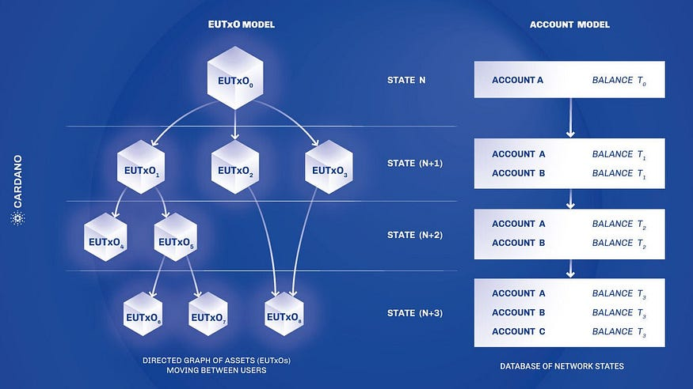

# 2. Блокчейн-основы и on-chain данные

Прежде чем искать отмывание средств в блокчейне, нужно понимать, как блокчейн устроен и в каком виде к нему вообще можно подступиться. Эта глава фиксирует два базовых выбора — какие сети мы анализируем и откуда берём данные — и описывает структуру on-chain графа вместе с теми признаками, которые из неё естественно извлекаются.

## 2.1. Bitcoin и Ethereum

### 2.1.1. Почему именно эти две сети

Spillety фокусируется на Bitcoin и Ethereum — и дело не только в размерах. Эти сети реализуют две принципиально разные модели учёта: Bitcoin — эталон UTXO-модели, Ethereum — доминирующую платформу смарт-контрактов и стейблкоинов с account-моделью. Метод, который работает на обеих парадигмах, скорее всего, обобщается и на остальные сети; метод, заточенный под одну, — нет. Так что выбор даёт нам не только покрытие рынка, но и бесплатную проверку обобщающей способности.

### 2.1.2. Смарт-контракты

Смарт-контракт — это программа, чей код и состояние живут в блокчейне Ethereum и исполняются виртуальной машиной EVM; результат исполнения проверяется каждым узлом сети, поэтому «договориться» с программой нельзя — можно только выполнить её честно. Для аналитика это меняет саму ткань данных: значительная доля транзакций Ethereum — не переводы между людьми, а вызовы функций контрактов (DEX, DeFi, кросс-чейн мосты), и в этих взаимодействиях формируются паттерны, которые бессмысленно интерпретировать без учёта семантики вызова.

### 2.1.3. Стейблкоины

Стейблкоин — токен, курс которого привязан к базовому активу, обычно к доллару: эмитент держит резерв, а держатель рассчитывает на обмен по фиксированному курсу. Квартальные объёмы переводов стейблкоинов в Ethereum измеряются триллионами долларов, и более 90% из них — легитимная ликвидность: DEX, кредитование, переводы между биржами. Для KYT это худший из миров: подозрительные потоки прячутся в океане абсолютно рутинной активности, и различить «чистую» DeFi-операцию от маскирующейся под неё — центральная задача скоринга.

---

## 2.2. Канонический источник данных

### 2.2.1. Какая транзакция «настоящая»

Транзакция считается состоявшейся тогда и только тогда, когда она входит в каноническую — финализированную — цепочку блоков. Звучит тривиально, пока не столкнёшься с реорганизацией.

### 2.2.2. Reorg

Два майнера или валидатора могут собрать блок на одной высоте, и несколько минут сеть живёт с двумя конкурирующими версиями истории. Затем одна цепочка побеждает (по накопленной сложности в Bitcoin, по LMD-GHOST/Casper FFG в Ethereum), а вторая — со всеми своими транзакциями — отбрасывается. Это и есть реорганизация, reorg. Если система успела обработать транзакцию из отброшенной ветви, все производные данные — графовые признаки, эмбеддинги, скоринги — становятся некорректными.

### 2.2.3. Реализация в Spillety

Канонические источники — полные узлы Bitcoin Core и Geth, плюс буфер подтверждений: транзакция признаётся финализированной после заданного числа подтверждений (кандидаты: 0/1/3/6 блоков для Bitcoin, 12/32/64 для Ethereum). Компромисс здесь прозрачен: ноль подтверждений даёт минимальную задержку, но максимум риска обработать не-канонические данные; шесть и шестьдесят четыре — наоборот. Конкретную точку на этом компромиссе выбирает эксперимент — по качеству детекции, задержке финализации и объёму хранимого состояния.

---

## 2.3. UTXO vs Account

### 2.3.1. UTXO-модель (Bitcoin)

В Bitcoin нет понятия «баланс адреса» как элемента состояния. Состояние — это множество непотраченных выходов, UTXO (Unspent Transaction Output). Каждая транзакция $T$ потребляет несколько существующих UTXO как входы $\{in_i\}$ и создаёт новые как выходы $\{out_j\}$, причём стоимость сохраняется:

$$\sum value(in_i) = \sum value(out_j) + fee$$

**Пример.** Адрес Алисы контролирует три UTXO номиналом 0.15, 0.18 и 0.25 BTC. Чтобы отправить Бобу 0.3 BTC, кошелёк выбирает входы $0.15 + 0.18 = 0.33$ BTC и создаёт выходы: 0.3 BTC Бобу, 0.029 BTC сдачи Алисе, 0.001 BTC — комиссия. Старые UTXO уничтожены, новые созданы, нетронутый выход на 0.25 BTC остался лежать.

Отсюда следует, пожалуй, самое важное для нас наблюдение. Если транзакция потребляет несколько входов ($n > 1$), все они почти наверняка подписаны одним владельцем — иначе откуда у отправителя приватные ключи ко всем им? Это эмпирическое правило известно как **Common Input Ownership Heuristic (CIOH)**, и оно — базовый сигнал кластеризации адресов в UTXO-графе. Разумеется, правило нарушается: в CoinJoin-транзакциях входы специально смешиваются от независимых пользователей.

### 2.3.2. Account-модель (Ethereum)

В Ethereum баланс — явный элемент глобального состояния (state trie) для каждого адреса.

Для аккаунта $A$ хранится кортеж:

- **nonce** — счётчик отправленных транзакций, защита от replay;
- **balance** — баланс в Wei ($1\ ETH = 10^{18}\ Wei$);
- **storageRoot** — корень Merkle-Patricia Trie хранилища контракта (у EOA — пустой);
- **codeHash** — хеш байт-кода контракта (у EOA — хеш пустой строки).

EOA (Externally-Owned Account) отличается от контрактного аккаунта именно пустыми `storageRoot` и `codeHash`.

> Алиса отправляет 0.5 ETH Бобу: $T = \{from: A_{Alice}, to: A_{Bob}, value: 0.5\ ETH, nonce: 43, gasPrice, gasLimit, ...\}$. После исполнения $nonce(A_{Alice}) \leftarrow 44$, баланс Алисы уменьшается на $0.5 + gasUsed \cdot gasPrice$, баланс Боба растёт на 0.5.

Газ — единица вычислительной работы: элементарный перевод стоит 21 000 единиц, взаимодействие с DeFi-протоколом — сотни тысяч. Комиссия $fee = gasUsed \times gasPrice$, газ оплачивается в ETH (цена — в gwei, $1\ gwei = 10^{-9}\ ETH$).

CIOH в account-модели неприменима в принципе: поле `from` идентифицирует единственный аккаунт, смешивать входы просто не из чего. Кластеризация вынуждена опираться на другие сигналы — nonce-последовательности, паттерны gas price, временную близость транзакций, повторяемость взаимодействий с контрактами.

<!--  -->

### 2.3.3. Сравнение

| Аспект | Bitcoin (UTXO) | Ethereum (Account) |
|--------|----------------|-------------------|
| CIOH | Применима: co-spending → один владелец (с оговорками CoinJoin) | Неприменима |
| Кластеризация | Алгоритмически простая, уязвима к CoinJoin | Сложнее, требует поведенческих и темпоральных сигналов |
| Признаки | UTXO-граф, change-эвристики, анализ сдачи | Nonce-последовательности, gas price-паттерны, DApp-взаимодействия, граф вызовов контрактов |

В Bitcoin кластеризация достаётся почти даром — CIOH вычислительно дешёв, хоть и зашумлён. В Ethereum за устойчивость к смешиванию приходится платить вычислительной сложностью поведенческих признаков.

---

## 2.4. On-chain граф

### 2.4.1. Вершины и рёбра

Вершины $V$ — адреса кошельков (EOA) и контракты; рёбра $E$ — ориентированные транзакции $e = (u, v, t, value, metadata)$, где $t$ — время блока, $value$ — переданная стоимость. Граф $G = (V, E)$ ориентированный, мультиграф (кратные рёбра допустимы) и динамический — рёбра упорядочены по времени.

Однореберная запись скрывает структуру, которая видна при различении сортов узлов. Полная картина — двудольная: узлы-адреса и узлы-транзакции, рёбра входа вида адрес $\to$ транзакция и рёбра выхода вида транзакция $\to$ адрес. Путь адрес $\to$ tx $\to$ адрес восстанавливает движение средств через конкретную транзакцию, включая сдачу и многосторонние входы, которые в проекции адрес $\to$ адрес слипаются в неразличимый пучок. Разнородные рёбра позволяют энкодеру раздельно агрегировать входы и выходы и не смешивать семантику «кто платил» с семантикой «кто получил».

Поверх адресного слоя лежит уровень счетов. Счёт — множество адресов, отнесённых к одному владельцу сигналами entity resolution: в UTXO-сети это прежде всего совместное расходование, в account-сети — поведенческие связки из 2.3. Подграф счёта объединяет ego-окрестности его адресов, а их представления сливаются взвешенным усреднением, где вес отражает уверенность кластеризации. Оговорка прямая: разрешение сущностей ошибается в обе стороны — пере-слияние размывает счёт чужими окрестностями, недо-слияние дробит поведение на фрагменты, и качество account-представления упирается в precision кластеризации из главы 5.

### 2.4.2. Ego-graph

Локальную окрестность кошелька удобно рассматривать отдельно. Ego-graph $G_{ego}(v_0, R)$ — подграф, индуцированный всеми вершинами на расстоянии не больше $R$ от $v_0$ (в Spillety $R = 1\text{--}2$):

$$G_{ego}(v_0, R) = \{ v \in V \mid dist(v_0, v) \le R \} \cup \{ e \in E \mid e \subseteq G_{ego}\}$$

Топология окрестности выдаёт поведенческий тип кошелька почти напрямую. Входящих рёбер много, исходящих мало ($\text{in-degree} \gg \text{out-degree}$) — накопление. Обратный перевес при высокой интенсивности — активная дистрибуция. Замкнутые циклы и реципрокные рёбра — сигнал смешивания или кругового движения средств.

### 2.4.3. Признаки ego-graph

| Признак | Определение | Ориентиры |
|---------|-------------|-----------|
| In-degree | $\deg_{in}(v) = |\{ e = (u, v) \in E \}|$ | Биржа: $\deg_{in} \sim 10^3\text{--}10^6$ |
| Out-degree | $\deg_{out}(v) = |\{ e = (v, u) \in E \}|$ | Личный кошелёк: $\deg_{out} \sim 10^1\text{--}10^2$ |
| Velocity | $v(v) = \frac{|E_{ego}|}{\Delta t}$ | Бот: десятки транзакций в час; человек: единицы |
| Counterparty diversity | $D(v) = \frac{|\{ u \mid (v,u) \in E \lor (u,v) \in E \}|}{|E_{ego}|}$ | Миксер: $D(v) \to 1$; зарплатный кошелёк: $D(v) \ll 1$ |

---

## 2.5. Темпоральные признаки

### 2.5.1. Hawkes process

Когда кошелёк совершает транзакции? Простейший ответ — «случайно с постоянной интенсивностью» (процесс Пуассона, $\lambda(t) = \mu$). Но on-chain активность так себя не ведёт: одна транзакция провоцирует следующие. **Hawkes process** вводит эту зависимость в интенсивность:

$$\lambda(t) = \mu + \sum_{t_i < t} \alpha \cdot e^{-\beta (t - t_i)}$$

где $\mu$ — базовая интенсивность, $\alpha$ — величина возбуждения, $\beta$ — скорость затухания.

> Хакер выводит похищенные средства: сначала одна крупная транзакция-источник, затем серия мелких «размазывающих» (peeling chain). Интенсивность скачком растёт и экспоненциально затухает — классическая сигнатура самовозбуждения, которую пуассоновская модель не увидит никогда.

Отношение $\alpha / \beta$ само по себе — признак: высокие значения отличают автоматизированное или паническое поведение от ровной активности легитимных пользователей.

### 2.5.2. Burstiness

Более грубая, но дешёвая мера «всплесковости» — burstiness:

$$B = \frac{\sigma_{\tau} - m_{\tau}}{\sigma_{\tau} + m_{\tau}} \in [-1, 1]$$

где $m_{\tau}$ и $\sigma_{\tau}$ — среднее и стандартное отклонение межсобытийных интервалов $\tau_i = t_{i+1} - t_i$. Значение $B \to 1$ означает выраженные всплески, $B \to -1$ — почти периодическую активность, $B \approx 0$ — пуассоновскую равномерность. Биржа с автоматизированной обработкой выводов сидит около нуля; даркнет-маркет, оживающий ночью и затихающий днём, — у единицы.

---

## 2.6. Публичные датасеты

| Датасет | Описание | Назначение |
|---------|----------|------------|
| **Elliptic++** | Bitcoin-граф с разметкой узлов/транзакций `illicit` / `legit` | Калибровка порогов entity resolution; измерение PR-AUC, ECE, Brier |
| **IBM AML** | Синтетический набор по паттернам отмывания (fan-out, fan-in, cycle) | Pre-training графовых моделей; оценка recall@K и silhouette |
| **AMLSim** | Мульти-агентная симуляция с инжекцией AML-паттернов | Pre-training и стресс-тестирование; оценка latency p99 и memory |

Стоит понимать разницу в статусе этих данных. Elliptic++ — единственный публичный датасет с реальной разметкой незаконных адресов, поэтому именно на нём калибруются приоры и измеряются калибровочные метрики. Синтетические наборы годятся для предобучения и стресс-тестов, но калибровочные искажения реального мира они не воспроизводят.

Протокол измерения на Elliptic++ — временной разрез по шагам с метрикой illicit-F1 на удерживаемом будущем. Разметка режется строго по времени, окно обучения предшествует окну валидации, окно теста лежит позже всех; перемешивание шагов запрещено, поскольку оно подмешивает в обучение паттерны из будущего оцениваемого периода. Отчётной величиной служит F1 класса illicit, а не accuracy и не micro-усреднение по доминирующему legit-классу. Предостережение, которое определяет чтение литературы: значения 0.97 и выше на этом датасете получаются без временного разреза, на micro-усреднении либо на сбалансированных подвыборках, и к операционной постановке с дрейфом отношения не имеют.

---

## См. также

- [02_ego_graph_features.ipynb](../notebooks/02_ego_graph_features.ipynb) — построение ego-graph и извлечение признаков.
- [03_hawkes_temporal.ipynb](../notebooks/03_hawkes_temporal.ipynb) — темпоральные признаки и Hawkes process.