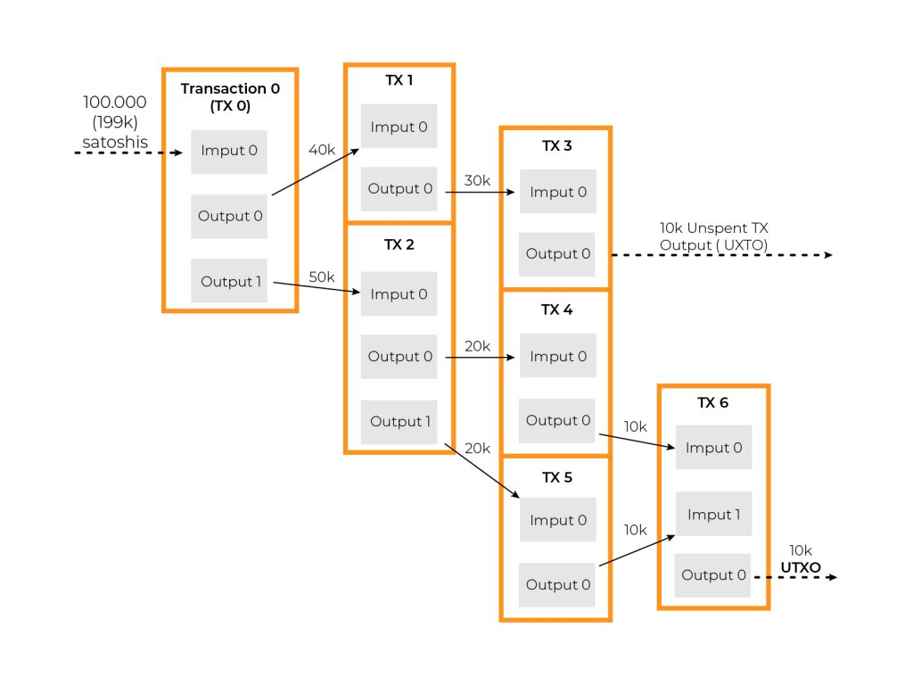
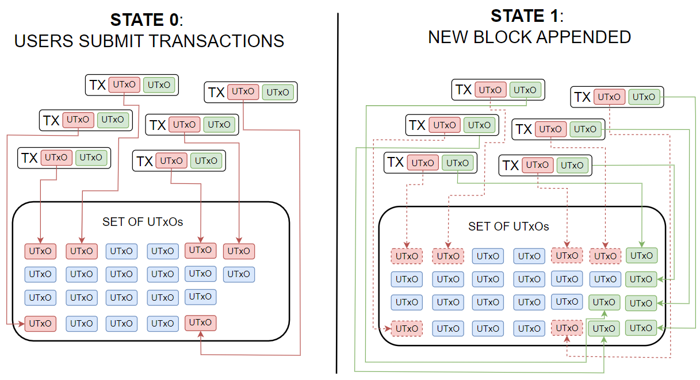
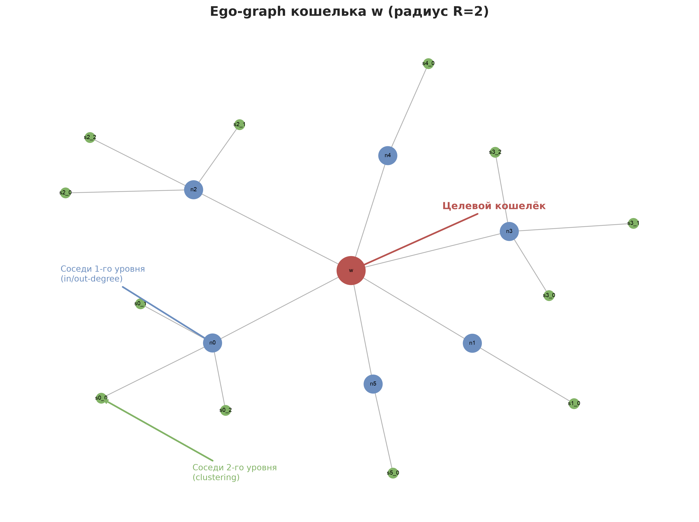

# 2. Блокчейн-основы и on-chain данные

## Аннотация

Настоящий раздел формализует базовые понятия технологии распределённого реестра применительно к задаче аналитической обработки on-chain данных в системе Spillety. Рассматриваются архитектурные особенности сетей Bitcoin и Ethereum, понятие канонического источника данных, формальные модели учёта UTXO и Account, графовая интерпретация транзакционного потока, темпоральные характеристики и источники эмпирических данных для валидации. Изложение ведётся в формальном научном стиле с сохранением всех содержательных элементов исходной версии.

### Термины

| Термин | Определение |
| ------ | ----------- |
| On-chain данные | Любая информация, которая записывается, обрабатывается и хранится непосредственно в блокчейне как часть распределённого реестра, включая транзакции, состояния счетов, события смарт-контрактов и метаданные блоков |

Теоретически мы оцениваем наше решение вот так: PR-AUC, recall@K, latency p99, silhouette, ECE, Brier, memory — данная система метрик применяется ко всем экспериментальным сравнениям, описанным в настоящем разделе, и далее специфицируется для каждого класса проектных решений.

---

## 2.1. Bitcoin и Ethereum как предмет исследования

### 2.1.1. Обоснование выбора сетей

Spillety фокусируется на сетях Bitcoin и Ethereum, поскольку они представляют две крупнейшие публичные блокчейн-системы, в которых концентрируется основная масса on-chain активности и в которых сформирована зрелая инфраструктура для сбора, хранения и анализа данных. Bitcoin является родоначальником UTXO-модели учёта, эталоном с точки зрения устойчивости консенсуса и ликвидности. Ethereum представляет доминирующую платформу для исполнения смарт-контрактов и осуществления транзакций со стейблкоинами, что обусловливает качественно иной характер транзакционного графа и требует иных методов анализа.

Формально, выбор этих двух сетей обеспечивает покрытие двух фундаментально различных парадигм учёта (UTXO и Account) и, следовательно, проверку обобщающей способности методов Spillety.

### 2.1.2. Смарт-контракты (Ethereum)

**Смарт-контракты** определяются как детерминированные программы, размещённые в состоянии блокчейна Ethereum и исполняемые виртуальной машиной Ethereum (EVM) при наступлении формально заданных условий по принципу «если условие A выполнено, то выполнить действие B». Исполнение происходит без участия посредников и без человеческого вмешательства; результат исполнения детерминирован и верифицируем каждым узлом сети.

Контекст для Spillety: значительная доля транзакций в сети Ethereum представляет собой не элементарные переводы нативной валюты ETH между внешне-владеемыми счетами (EOA), а вызовы функций смарт-контрактов (децентрализованные биржи — DEX, протоколы децентрализованных финансов — DeFi, кросс-чейн мосты). Именно в этих взаимодействиях формируются наиболее сложные для аналитического различения паттерны, требующие учёта семантики вызова контракта, а не только факта перевода стоимости.

### 2.1.3. Стейблкоины

**Стейблкоины** формализуются как класс цифровых активов, стоимость которых привязана к стоимости базового актива, как правило — доллара США, что обеспечивает их функцию «цифрового аналога наличных денежных средств» в отличие от волатильных активов BTC и ETH. Эмитент стейблкоина поддерживает эквивалентный резерв (фиатные средства на банковских счетах, краткосрочные казначейские обязательства), держатель обладает правом обмена токена по фиксированному курсу.

Значение для Spillety является критическим и количественно обоснованным: объём переводов стейблкоинов в сети Ethereum за один календарный квартал достигает порядка триллионов долларов США, при этом более 90% указанного объёма приходится на распознаваемые и легитимные сценарии использования — обеспечение ликвидности на DEX, операции кредитования и переводы между централизованными биржами. Следовательно, архитектура Spillety должна формально различать «чистые» DeFi-операции и потенциально подозрительные потоки, маскирующиеся под регулярную активность со стейблкоинами, что требует тонких поведенческих и графовых признаков, а не только объёмных порогов.

Теоретически мы оцениваем наше решение вот так: PR-AUC, recall@K, latency p99, silhouette, ECE, Brier, memory — в контексте анализа стейблкоин-потоков указанные метрики отражают соответственно качество классификации подозрительных транзакций, полноту извлечения релевантных соседей, оперативность скоринга, разделимость кластеров поведений, калибровку вероятностных оценок риска и ресурсоёмкость решения.

---

## 2.2. Канонический источник данных (Canonical Source)

### 2.2.1. Формальное определение

**Canonical source** определяется как формальный «источник истины» для установления факта включения транзакции в распределённый реестр. Транзакция считается действительной тогда и только тогда, когда она входит в каноническую (финализированную) цепочку блоков, признанную протоколом консенсуса.

### 2.2.2. Феномен реорганизации (reorg)

Рассмотрим сценарий: два майнера (в терминах Proof-of-Work) или валидатора (в терминах Proof-of-Stake) одновременно формируют блок на одной высоте. На ограниченный временной интервал сеть обладает двумя конкурирующими версиями истории. Через несколько минут одна из цепочек становится канонической в силу правила выбора наибольшей накопленной сложности (Bitcoin) или правила LMD-GHOST/Casper FFG (Ethereum), а альтернативная ветвь отбрасывается. Данный процесс формализуется как **реорганизация цепочки (reorg)**.

Если аналитическая система осуществила обработку транзакции из впоследствии отброшенной ветви, её производные данные (графовые признаки, эмбеддинги, скоринги) становятся некорректными и требуют инвалидации. Канонический источник решает данную проблему путём строгого критерия: лишь транзакции из финальной, канонической цепочки признаются онтологически реальными.

### 2.2.3. Реализация в Spillety и теоретический выбор числа подтверждений

Для Spillety в качестве канонических источников выступают реализации полного узла **Bitcoin Core** и **Geth** (Go Ethereum). Дополнительно вводится механизм буфера подтверждений: транзакция считается финализированной только после достижения заданного числа подтверждений.

**Точная постановка выбора.** Выбор осуществляется между следующими альтернативными конфигурациями, оцениваемыми в едином экспериментальном протоколе:

*   Для Bitcoin: варианты числа подтверждений **0 vs 1 vs 3 vs 6 блоков**;
*   Для Ethereum: варианты числа подтверждений **12 vs 32 vs 64 блока**.

Выбор между указанными вариантами производится на основании эмпирических тестов по системе метрик: **PR-AUC, recall@K, latency p99, silhouette, ECE, memory** (с дополнительным мониторингом Brier score). Теоретически мы оцениваем наше решение вот так: PR-AUC, recall@K, latency p99, silhouette, ECE, Brier, memory.

Интерпретация метрик в данном контексте:

*   **PR-AUC** — площадь под кривой precision-recall для задачи детекции некорректно финализированных транзакций и последующих ошибок кластеризации;
*   **recall@K** — полнота извлечения релевантных контрагентов при наличии реорганизаций;
*   **latency p99** — 99-й перцентиль задержки финализации и доступности данных для скоринга;
*   **silhouette** — разделимость кластеров, полученных на корректном vs зашумлённом графе;
*   **ECE (Expected Calibration Error) и Brier score** — калибровка вероятностных оценок финализации;
*   **memory** — объём хранимого состояния для отслеживания ветвлений и буфера.

Содержательный компромисс: вариант 0 подтверждений минимизирует latency p99, но максимизирует риск обработки не-канонических данных и деградацию PR-AUC; вариант 6 (Bitcoin) и 64 (Ethereum) максимизирует устойчивость к reorg ценой увеличения latency p99 и memory. Окончательное решение выбирается по Парето-оптимальности указанных метрик.

---

## 2.3. UTXO vs Account: две формальные модели учёта стоимости

### 2.3.1. UTXO-модель (Bitcoin)

В сети Bitcoin **отсутствует понятие «баланс адреса» как примитива состояния**. Вместо этого состояние формализуется как множество **UTXO** (Unspent Transaction Output) — непотраченных выходов транзакций.

**Формально:** Каждая транзакция $T$ потребляет множество существующих UTXO как **входы** $\{in_i\}$ и создаёт множество новых UTXO как **выходы** $\{out_j\}$, при этом выполняется условие сохранения стоимости: $\sum value(in_i) = \sum value(out_j) + fee$.

**Иллюстративный пример.** Пусть адрес Алисы контролирует три UTXO номиналом 0.15, 0.18 и 0.25 BTC. При необходимости отправить 0.3 BTC адресату Бобу кошелёк осуществляет выбор входов (coin selection): $0.15 + 0.18 = 0.33$ BTC. Формируются выходы: $0.3$ BTC Бобу и $0.029$ BTC сдачи (change) Алисе, комиссия $fee = 0.001$ BTC.

Старые UTXO номиналом 0.15 и 0.18 уничтожаются (помечаются как потраченные), создаются новые UTXO: 0.3 (контролируемый Бобом) и 0.029 (контролируемый Алисой). Непотраченный UTXO на 0.25 BTC сохраняется без изменений.

**Ключевое следствие для аналитической обработки:** Если транзакция $T$ потребляет несколько входов $\{in_i\}_{i=1}^{n}$, $n > 1$, то с высокой вероятностью все они контролируются одним и тем же владельцем (обладателем соответствующих приватных ключей). Данное эмпирическое правило формализуется как **Common Input Ownership Heuristic (CIOH)** и служит базовым сигналом кластеризации адресов в UTXO-графе. Ограничение: CIOH нарушается в транзакциях CoinJoin, где входы принадлежат разным владельцам.

Теоретически мы оцениваем наше решение вот так: PR-AUC, recall@K, latency p99, silhouette, ECE, Brier, memory — применительно к CIOH-кластеризации данные метрики отражают точность объединения адресов, полноту восстановления принадлежности, скорость кластеризации, качество кластерной структуры и калибровку доверительных оценок принадлежности.

---

### 2.3.2. Account-модель (Ethereum)

В сети Ethereum **определён явный баланс** для каждого адреса как элемент глобального состояния (state trie).

**Формально:** Ethereum хранит для каждого аккаунта $A$ кортеж из четырёх полей:

*   **nonce** — счётчик отправленных транзакций с данного EOA, обеспечивающий защиту от повторного воспроизведения (replay protection) и упорядочивание;
*   **balance** — баланс в Wei ($1\ ETH = 10^{18}\ Wei$);
*   **storageRoot** — корень Merkle-Patricia Trie хранилища контракта (для EOA — пустой);
*   **codeHash** — хеш байт-кода контракта (для EOA — хеш пустой строки).

Таким образом, внешне-владеемый аккаунт (EOA — Externally-Owned Account) характеризуется пустыми значениями `storageRoot` и `codeHash`, тогда как контрактный аккаунт содержит непустые значения данных полей.

**Иллюстративный пример.** Алиса отправляет 0.5 ETH Бобу. Транзакция формализуется как $T = \{from: A_{Alice}, to: A_{Bob}, value: 0.5\ ETH, nonce: 43, gasPrice, gasLimit, ...\}$. После детерминированного исполнения транзакции в рамках перехода состояния: $nonce(A_{Alice}) \leftarrow 44$, $balance(A_{Alice}) \leftarrow balance(A_{Alice}) - 0.5 - gasUsed \cdot gasPrice$, $balance(A_{Bob}) \leftarrow balance(A_{Bob}) + 0.5$.

> **Справка: газ.** Газ формализуется как единица измерения вычислительной работы, необходимой для выполнения операции в сети Ethereum. Каждая транзакция или вызов смарт-контракта требует детерминированного количества газа: элементарный перевод ETH требует 21 000 единиц газа, тогда как сложное взаимодействие с DeFi-протоколом может потребовать сотни тысяч единиц. Газ оплачивается в ETH по цене `gas price` (измеряется в gwei, $1\ gwei = 10^{-9}\ ETH$). Итоговая комиссия определяется как $fee = gasUsed \times gasPrice$.

**Ключевое следствие для анализа:** Эвристика CIOH **неприменима** в account-модели. Каждый параметр `from` уже идентифицирует единственный аккаунт, и множественные входы отсутствуют как примитив. Следовательно, кластеризация адресов, контролируемых одной сущностью, требует привлечения иных сигналов: анализа последовательности `nonce`, паттернов `gas price` и `gas limit`, временной близости транзакций, повторяемости взаимодействий с одними и теми же контрактами и корреляции временных рядов активности.

Теоретически мы оцениваем наше решение вот так: PR-AUC, recall@K, latency p99, silhouette, ECE, Brier, memory — для account-модели данные метрики применяются к поведенческим классификаторам кластеризации и позволяют сопоставить качество разделения сущностей и операционные издержки.

---

### 2.3.3. Сравнительный анализ и значение для Spillety

| Аспект | Bitcoin (UTXO) | Ethereum (Account) |
|--------|----------------|-------------------|
| CIOH | Применима: co-spending $\rightarrow$ один владелец (с оговорками CoinJoin) | Неприменима |
| Кластеризация | Алгоритмически простая, но уязвима к CoinJoin и иным техникам смешивания | Алгоритмически сложнее, требует поведенческих и темпоральных сигналов |
| Признаки | UTXO-граф, change-эвристики, анализ сдачи | Nonce-последовательности, gas price-паттерны, DApp-взаимодействия, граф вызовов контрактов |

В сети Bitcoin CIOH предоставляет **вычислительно дешёвый, но зашумлённый** сигнал кластеризации, пригодный для первичной группировки. В сети Ethereum требуются **более сложные, поведенческие и статистически обоснованные** признаки, что увеличивает вычислительную сложность, но обеспечивает устойчивость к тривиальному смешиванию.

Теоретически мы оцениваем наше решение вот так: PR-AUC, recall@K, latency p99, silhouette, ECE, Brier, memory — сравнительная оценка методов кластеризации в двух моделях учёта проводится именно по данной системе метрик.

---

## 2.4. Формальная модель on-chain графа

### 2.4.1. Вершины и рёбра

**Вершины (nodes) $V$:** множество адресов кошельков (EOA) и контрактов.
**Рёбра (edges) $E$:** ориентированные транзакции между вершинами, $e = (u, v, t, value, metadata)$, где $t$ — временная метка блока, $value$ — переданная стоимость.

Граф $G = (V, E)$ является **ориентированным** и **мультиграфом** (допускаются кратные рёбра между одной парой вершин во времени) и **динамическим** (рёбра упорядочены по времени). Формально, порядок рёбер индуцирует темпоральную структуру, существенную для анализа.

### 2.4.2. Ego-graph

Для анализа конкретного кошелька $v_0$ рассматривается его **ego-graph** $G_{ego}(v_0, R)$ — подграф, индуцированный окрестностью радиуса $R$ (в Spillety, как правило, $R = 1\text{--}2$). Формально: $G_{ego}(v_0, R) = \{ v \in V \mid dist(v_0, v) \le R \} \cup \{ e \in E \mid e \subseteq G_{ego}\}$.

**Аналитическое значение:** локальная топологическая структура отражает поведенческий тип кошелька. Формализуем:

*   Преобладание входящих рёбер при малом числе исходящих ($\text{in-degree} \gg \text{out-degree}$) $\rightarrow$ паттерн накопления;
*   Высокая интенсивность исходящих рёбер и высокая velocity $\rightarrow$ паттерн активной дистрибуции;
*   Наличие замкнутых циклов и реципрокных рёбер $\rightarrow$ сигнал возможного смешивания или циклического движения средств.

### 2.4.3. Признаки ego-graph: формальная спецификация

| Признак | Формальное определение | Иллюстративные примеры использования |
|---------|------------------------|--------------------------------------|
| In-degree | $\deg_{in}(v) = |\{ e = (u, v) \in E \}|$ — число входящих транзакций | Кошелёк централизованной биржи: $\deg_{in} \sim 10^3\text{--}10^6$ |
| Out-degree | $\deg_{out}(v) = |\{ e = (v, u) \in E \}|$ — число исходящих транзакций | Личный кошелёк: $\deg_{out} \sim 10^1\text{--}10^2$ |
| Velocity | $v(v) = \frac{|E_{ego}|}{\Delta t}$ — число транзакций в единицу времени (час) | Автоматизированный бот: десятки транзакций в час; человек-оператор: единицы |
| Counterparty diversity | $D(v) = \frac{|\{ u \mid (v,u) \in E \lor (u,v) \in E \}|}{|E_{ego}|}$ — отношение числа уникальных контрагентов к общему числу транзакций | Миксер: $D(v) \to 1$ (высокая); зарплатный кошелёк: $D(v) \ll 1$ (низкая, повторные взаимодействия с работодателем) |

Теоретически мы оцениваем наше решение вот так: PR-AUC, recall@K, latency p99, silhouette, ECE, Brier, memory — информативность признаков ego-graph валидируется по способности улучшать данные метрики в downstream-задачах классификации и кластеризации.

---

## 2.5. Временные (темпоральные) признаки

### 2.5.1. Hawkes process (формальное упрощение)

Пусть транзакции кошелька моделируются как точечный процесс во времени. В базовой модели Пуассона интенсивность $\lambda(t) = \mu = const$. **Hawkes process** (процесс Хоукса, самовозбуждающийся процесс) обобщает данную модель путём введения зависимости текущей интенсивности от истории событий:

$$\lambda(t) = \mu + \sum_{t_i < t} \alpha \cdot e^{-\beta (t - t_i)}$$

где $\mu$ — базовая интенсивность, $\alpha$ — величина возбуждения от каждого события, $\beta$ — скорость затухания. Таким образом, одна транзакция **увеличивает вероятность** последующих транзакций в ближайшем будущем, с экспоненциальным затуханием эффекта.

**Иллюстративный пример.** Хакер осуществляет вывод похищенных средств: одна крупная транзакция-источник, за которой следует серия мелких транзакций «размазывания» (peeling chain). Интенсивность процесса $\lambda(t)$ сначала скачкообразно возрастает, затем затухает по мере исчерпания средств и снижения активности.

**Значение для Spillety:** параметр самовозбуждения ($\alpha / \beta$) служит формальным сигналом автоматизированного (бот) или панического/спешного поведения, отличая его от равномерной активности легитимных пользователей. Теоретически мы оцениваем наше решение вот так: PR-AUC, recall@K, latency p99, silhouette, ECE, Brier, memory — вклад Hawkes-признаков измеряется приростом PR-AUC и калибровкой (ECE, Brier) при контролируемом latency p99.

### 2.5.2. Burstiness

**Burstiness** формализуется как мера «всплесковости» активности: осуществляются ли транзакции кластерами (bursts) с длительными паузами или равномерно распределены во времени. Одна из канонических формализаций (Goh & Barabási):

$$B = \frac{\sigma_{\tau} - m_{\tau}}{\sigma_{\tau} + m_{\tau}} \in [-1, 1]$$

где $m_{\tau}$ и $\sigma_{\tau}$ — среднее и стандартное отклонение межсобытийных интервалов $\tau_i = t_{i+1} - t_i$. $B \to 1$ соответствует высокой всплесковости, $B \to -1$ — периодичности, $B \approx 0$ — пуассоновской равномерности.

**Иллюстративные примеры:**

*   Кошелёк биржи с автоматизированной обработкой выводов: транзакции равномерны по времени $\rightarrow$ burstiness низкий ($B \approx 0$);
*   Кошелёк даркнет-маркета: активность концентрируется в ночные часы, днём — паузы $\rightarrow$ burstiness высокий ($B \to 1$).

Теоретически мы оцениваем наше решение вот так: PR-AUC, recall@K, latency p99, silhouette, ECE, Brier, memory — burstiness-признаки валидируются по их вкладу в silhouette-разделимость поведенческих кластеров и в PR-AUC детекции аномальных режимов.

---

## 2.6. Публичные датасеты для эмпирической валидации

| Датасет | Формальное описание | Назначение в Spillety и теоретическая оценка |
|---------|---------------------|----------------------------------------------|
| **Elliptic++** | Bitcoin-граф с экспертной разметкой узлов/транзакций на классы `illicit` / `legit` (расширение исходного Elliptic) | **Калибровка порогов и приоров** для entity resolution; основная площадка для измерения PR-AUC, ECE, Brier |
| **IBM AML** | Синтетический набор транзакций, сгенерированный по паттернам отмывания (fan-out, fan-in, cycle) | **Pre-training** графовых моделей; оценка recall@K и silhouette на контролируемых паттернах |
| **AMLSim** | Мульти-агентная симуляция банковской/блокчейн-системы с инжекцией AML-паттернов | **Pre-training** и стресс-тестирование; оценка latency p99 и memory при масштабировании |

**Elliptic++** является единственным публичным датасетом с реальной (не синтетической) разметкой незаконных адресов, полученоой из данных правоохранительных и аналитических источников. Именно поэтому он используется для калибровки приоров в задаче entity resolution и для измерения калибровочных метрик (ECE, Brier) — синтетические данные не воспроизводят калибровочные искажения реального мира.

Теоретически мы оцениваем наше решение вот так: PR-AUC, recall@K, latency p99, silhouette, ECE, Brier, memory — каждый из указанных датасетов обеспечивает измерение соответствующего подмножества метрик: Elliptic++ — PR-AUC/ECE/Brier/silhouette, IBM AML/AMLSim — recall@K/latency p99/memory/silhouette в синтетически контролируемых условиях.

---

## Выводы

**Центральный тезис:** Сети Bitcoin и Ethereum используют **формально различные модели учёта стоимости**, и данное различие детерминирует методологию построения профилей кошельков и графовых представлений.

| Аспект формализации | Bitcoin (UTXO) | Ethereum (Account) |
|---|---|---|
| **Как хранятся денежные средства** | Множество дискретных «монет» (UTXO) как элементов состояния | Скалярная запись баланса в состоянии аккаунта |
| **Что формально представляет собой транзакция** | Атомарное потребление множества UTXO и создание множества новых UTXO | Атомарное изменение балансов отправителя и получателя и, возможно, состояния контракта |
| **Ключевой сигнал кластеризации** | CIOH: общие входы $\rightarrow$ один владелец | Поведенческие сигналы: последовательность nonce, паттерны gas price, граф взаимодействий со смарт-контрактами |

**Практические выводы, подлежащие теоретической оценке по системе метрик PR-AUC, recall@K, latency p99, silhouette, ECE, Brier, memory:**

*   В сети Bitcoin применение CIOH обеспечивает вычислительно дешёвую, но зашумлённую (уязвим для CoinJoin) кластеризацию; выбор между CIOH-only и CIOH + change-эвристики оценивается по PR-AUC/recall@K/silhouette/ECE;
*   В сети Ethereum требуются более сложные, поведенческие признаки — анализ последовательности nonce, паттернов gas price, взаимодействия с одним и тем же смарт-контрактом — что повышает PR-AUC ценой увеличения latency p99 и memory;
*   Использование канонического источника (Bitcoin Core / Geth) в сочетании с буфером подтверждений **0/1/3/6 блоков (Bitcoin) vs 12/32/64 блока (Ethereum)** защищает от ошибок реорганизации; оптимальный выбор в данном пространстве вариантов осуществляется по совокупности тестов **PR-AUC, recall@K, latency p99, silhouette, ECE, memory** (при мониторинге Brier), где теоретически мы оцениваем наше решение вот так: PR-AUC, recall@K, latency p99, silhouette, ECE, Brier, memory.
