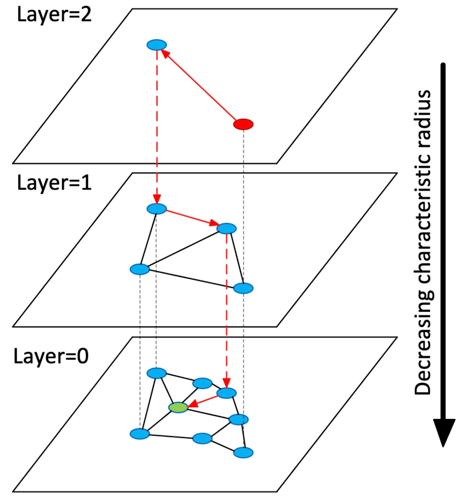

# 3. Графовые нейронные сети и эмбеддинги

### Термины

| Термин | Определение |
| ------ | ----------- |
| Граф | Структура данных, состоящая из вершин (узлов) и рёбер (связей между ними)  |
| Эмбеддинг | Числовой вектор, представляющий объект (узел, слово, изображение) в многомерном пространстве, где близость векторов отражает семантическую близость объектов  |
| GNN | Графовая нейронная сеть — тип нейросети, которая напрямую работает со структурой графа, сохраняя топологические отношения между узлами  |
| Message passing | Механизм, при котором каждый узел собирает информацию от соседей и обновляет своё представление  |

---

## 3.1. Зачем нам графовые нейронные сети

On-chain данные — это **граф по своей природе**: кошельки связаны транзакциями. Однако традиционные методы машинного обучения требуют преобразования графа в таблицу (например, «признак 1: in-degree, признак 2: out-degree»). При таком преобразовании **теряется информация о том, кто с кем связан** .

**Что даёт GNN:**
- Кошелёк описывается не только своими признаками, но и **окружением** (кто его соседи, как они связаны)
- Embedding кошелька отражает его **структурную роль** в графе: биржа, миксер, личный кошелёк
- Расстояние между embedding’ами двух кошельков показывает их **поведенческую близость**

---

## 3.2. Как работает графовая нейронная сеть

### 3.2.1. Message passing

Основной механизм GNN называется **message passing** (передача сообщений) . Каждый узел:
1. **Собирает** информацию от соседей
2. **Агрегирует** её (например, усредняет)
3. **Обновляет** своё представление

**Что это даёт:** Кошелёк, который взаимодействует с миксером, получит embedding, похожий на embedding других кошельков, взаимодействующих с миксерами, даже если у них разные in-degree или out-degree.

### 3.2.2. Почему не обычная нейросеть?

Обычная полносвязная нейросеть (MLP) работает с **фиксированным вектором признаков**: на вход подаётся вектор `x ∈ R^d`, и модель учится отображать его в выход.

В графе у каждого узла **разное число соседей** и **разная структура окружения**. Чтобы подать кошелёк в MLP, нужно сначала «развернуть» его окружение в вектор фиксированной длины — например, `[in-degree, out-degree, velocity, ...]`. При этом **теряется информация о том, кто именно является соседом и как соседи связаны между собой** — а именно эта информация и определяет роль кошелька в графе.

GNN решает эту проблему через механизм **message passing**: узел не «разворачивает» окружение в вектор, а **итеративно агрегирует представления соседей**. После первого слоя узел знает о своих прямых соседях, после второго — о соседях соседей, и так далее. Ключевое свойство агрегации — **инвариантность к порядку соседей**: неважно, в каком порядке перечислены соседи, результат одинаков. Это позволяет GNN работать с узлами, у которых **разное число соседей и разная структура окружения**, не требуя приведения к фиксированному формату.

---

## 3.3. GraphSAGE: индуктивное обучение

### 3.3.1. Проблема с обычными GNN

Ранние GNN (например, GCN) были **transductive**: они обучались на фиксированном графе. Если появлялся новый кошелёк, приходилось переобучать всю модель .

### 3.3.2. Решение: GraphSAGE

**GraphSAGE** (Graph SAmple and aggreGatE) — это **индуктивный** метод. Он учится не запоминать конкретные узлы, а **агрегировать соседей** по определённому правилу.

**Ключевая идея:** вместо того чтобы использовать всех соседей, GraphSAGE **выбирает случайную выборку** соседей фиксированного размера. Это:
- Снижает вычислительную сложность
- Позволяет работать с новыми узлами
- Делает модель пригодной для работы на CPU

**Формула (упрощённо):**

Новое представление узла = функция от (его старого представления + агрегированного представления случайных соседей).

---

## 3.4. Что такое embedding

### 3.4.1. Идея

**Embedding** — это числовой вектор, представляющий объект в многомерном пространстве . В Spillety каждый кошелёк получает вектор из 128 чисел.

**Аналогия:** Представьте карту, где каждый город — это точка. Близкие города (по культуре, экономике) находятся рядом. Embedding делает то же самое, но в 128-мерном пространстве: похожие кошельки (по поведению, окружению) оказываются рядом.

**Что кодирует embedding кошелька:**
- Структурные признаки (in-degree, out-degree)
- Временные паттерны (частота, burstiness)
- Окружение (кто соседи, какие у них роли)

### 3.4.2. Расстояние между embedding’ами

Расстояние показывает **поведенческую близость**:
- **Маленькое расстояние** → кошельки ведут себя похоже
- **Большое расстояние** → разное поведение

**В Spillety:** мы измеряем расстояние от целевого кошелька до **anchors** (OFAC, миксеры, биржи). Маленькое расстояние до OFAC-кошелька — сигнал риска.

---

## 3.5. HNSW: быстрый поиск похожих кошельков

### 3.5.1. Проблема

У нас 80 миллионов anchors. Для каждой транзакции нужно найти **ближайшие** anchors в embedding space. Перебор всех 80 миллионов — слишком медленно.

### 3.5.2. Решение: HNSW

**HNSW** (Hierarchical Navigable Small World) — это алгоритм **приближённого поиска ближайших соседей** (Approximate Nearest Neighbors, ANN).

HNSW строит многослойный граф: верхние слои содержат мало точек для быстрой навигации, нижние — много для точного поиска.

### 3.5.3. Параметры HNSW

| Параметр | Что означает | Влияние |
|----------|--------------|---------|
| **M** | Максимум связей у каждого узла | Больше M → лучше recall, больше памяти |
| **ef_construction** | Размер списка при построении | Больше → лучше качество графа |
| **ef_search** | Размер списка при поиске | Больше → лучше recall, медленнее поиск |

**Рекомендуемые значения**:
- M = 24 (вместо стандартных 16)
- ef_construction = 128
- ef_search = 100

### 3.5.4. Product Quantization 

**Проблема:** 80M × 128 × 4 байта ≈ 40 GB памяти.

**Решение:** Product Quantization (PQ) — сжатие векторов. Вектор разбивается на подвекторы, каждый квантуется в компактный код. Это снижает память в разы, немного теряя в точности.

---

**Главная мысль:** Графовые нейронные сети позволяют представить кошелёк не просто набором признаков, а **структурной ролью в графе транзакций**.

| | Что даёт | Зачем Spillety |
|---|---|---|
| **GraphSAGE** | Индуктивные embeddings | Работает на новых кошельках без переобучения |
| **Embedding** | 128-мерный вектор кошелька | Числовое представление для сравнения |
| **HNSW** | Быстрый поиск ближайших anchors | Retrieval за миллисекунды |

**Практический вывод:**
- GraphSAGE выбирает **случайную выборку соседей**, что делает его индуктивным и CPU-friendly.
- Embedding кошелька кодирует его **структурную и поведенческую близость** к другим кошелькам.
- HNSW позволяет искать **ближайшие anchors** за O(log N) вместо полного перебора.
- Параметры HNSW (M, ef_search) подбираются по **trade-off между recall и latency**.