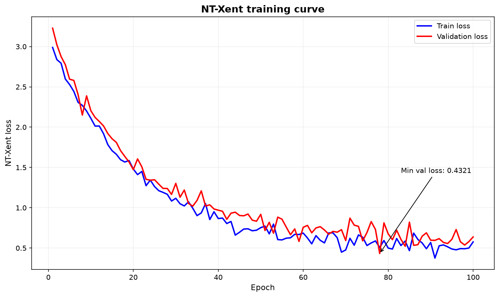
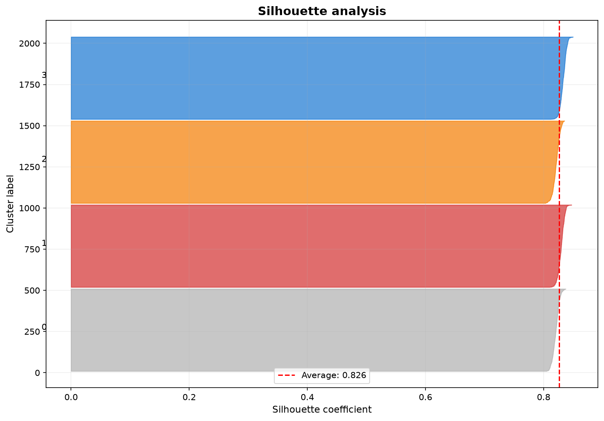
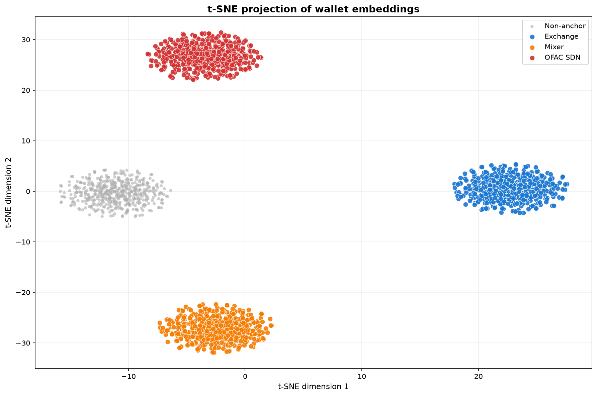

# 4. Контрастивное обучение и metric learning

## 4.1. Задача: выучить геометрию без меток

Пусть GNN отображает кошелька $x \in \mathcal{X}$ в эмбеддинг $z = f_\theta(x) \in \mathbb{R}^d$ (глава 3). Открытым остаётся главный вопрос: как подобрать параметры $\theta$, чтобы геометрия пространства отражала поведенческую эквивалентность кошельков?

Классический supervised-путь требует размеченной выборки $\{(x_i, y_i)\}_{i=1}^N$. В нашей постановке он упирается в две стены: вручную разметить $10^6$–$10^7$ адресов экономически нереально, а паттерны незаконной активности нестационарны — разметка стареет быстрее, чем собирается. Контрастивное обучение обходит проблему, отказавшись от абсолютных меток в пользу относительных: модель учится лишь сохранять отношение «$a$ и $b$ семантически ближе, чем $a$ и $c$».

Речь пойдёт о трёх типах пар: **positive pair** — пара, которую хочется сблизить; **negative pair** — пару, которую хочется развести; **hard negative** — негатив, который текущая модель ошибочно считает близким к якорю и который поэтому наиболее информативен для градиента.

## 4.2. NT-Xent loss

### 4.2.1. Механика

Для батча объектов формируются пары: каждый элемент даёт одну positive-пару $(a, p)$ и — в симметризованной постановке — $2N-2$ negative-пар с остальными элементами батча. Цель: $\text{sim}(f_\theta(a), f_\theta(p)) > \text{sim}(f_\theta(a), f_\theta(n))$, где $\text{sim}$ — обычно косинусная близость.

Собственно loss — **NT-Xent** (Normalized Temperature-scaled Cross-Entropy) для пары $(i, j)$ с якорем $i$ и positive $j$:

$$
\ell_{i,j} = -\log \frac{\exp(\text{sim}(z_i, z_j) / \tau)}{\sum_{k=1}^{2N} \mathbb{1}_{[k \neq i]} \exp(\text{sim}(z_i, z_k) / \tau)}
$$

здесь $z_i = f_\theta(x_i)$ — $\ell_2$-нормализованные эмбеддинги ($\|z\|_2 = 1$, так что $\text{sim}(u,v) = u^\top v$), $\tau > 0$ — температура, $N$ — размер батча до аугментации. Числитель тянет positive-пару вместе, знаменатель расталкивает якорь со всеми остальными. Минимизация $\ell_{i,j}$ эквивалентна максимизации нижней оценки взаимной информации $I(z_i; z_j)$ — к связи с InfoNCE вернёмся в 4.5.

**Роль температуры.** При $\tau \to 0$ распределение концентрируется на ближайшем негативе — модель фокусируется на hard negatives; при $\tau \to \infty$ — выравнивается, и все негативы становятся равноценными. Кандидаты $\tau \in \{0.05, 0.1, 0.2\}$ сравниваются на валидации; типичный оптимум в литературе — $\tau = 0.07$–$0.1$.

*Динамика NT-Xent loss: монотонное убывание на обучении и стабилизация на валидации. Минимум валидационного loss задаёт число эпох по early stopping.*

Эпоха обучения — один полный проход оптимизационного алгоритма по всей обучающей выборке.

## 4.3. Откуда брать пары в on-chain данных

### 4.3.1. Positive-пары

| Тип | Критерий | Обоснование |
|-----|------------------------|-------------|
| Co-spending | Два адреса Bitcoin — входы одной транзакции | CIOH: совместное расходование с высокой вероятностью указывает на единого владельца |
| Temporal proximity | Транзакции разделены интервалом $\Delta t < \epsilon$ | Скоординированная активность одного актора |
| News co-mention | Совместное упоминание адресов в одном новостном документе | Контекстуальная семантическая связь |
| Same high-confidence cluster | Адреса одного кластера entity resolution с confidence выше $\tau_c$ | Результат процедуры разрешения сущностей (раздел 5) |

### 4.3.2. Negative-пары

С негативами тоньше, чем кажется. Наивная случайная выборка смещена в сторону высокостепенных узлов — биржа окажется «негативом» в сотни раз чаще, чем личный кошелёк. Поэтому применяется **degree-corrected sampling**: вероятность выбора узла $v$ обратно пропорциональна его степени, $p(v) \propto 1 / \deg(v)^\alpha$ с $\alpha \in [0.5, 1]$.

Hard negatives — адреса из одного временного окна, но из разных кластеров — максимально информативны, но опасны в начале обучения: на несформировавшемся пространстве они дестабилизируют оптимизацию. Практика — curriculum: hard negatives вводятся со средних стадий, когда базовая структура пространства уже встала.

## 4.4. Anchor loss: санкционные списки как система координат

### 4.4.1. Идея

Санкционные перечни — OFAC SDN, EU Consolidated Financial Sanctions, UN Security Council Consolidated List, UK OFSI — дают адреса с верифицированной illicit-аффилиацией. Использовать их как метки для supervised learning — значит вернуться к проблемам из 4.1. Вместо этого множество санкционных адресов $\mathcal{A}$ трактуется как **система координат**: модель учит так, чтобы якоря образовали компактную область, отделённую от остальных адресов $\mathcal{N}$.

### 4.4.2. Формализация

Anchor loss — сумма двух hinge-компонент:

$$
\mathcal{L}_{\text{anchor}} = \sum_{a_i, a_j \in \mathcal{A}} \max(0, \|z_{a_i} - z_{a_j}\|_2 - m_{\text{pull}}) + \sum_{a \in \mathcal{A}, n \in \mathcal{N}} \max(0, m_{\text{push}} - \|z_a - z_n\|_2)
$$

Первое слагаемое прижимает якоря друг к другу: штраф, пока расстояние между любыми двумя якорями превышает $m_{\text{pull}}$. Второе — отталкивает от не-якорей: штраф, пока расстояние до не-якоря меньше $m_{\text{push}}$. Итоговый функционал:

$$
\mathcal{L}_{\text{total}} = \mathcal{L}_{\text{NT-Xent}} + \lambda \cdot \mathcal{L}_{\text{anchor}}
$$

где $\lambda \geq 0$ — баланс. Частные случаи прозрачны: $\lambda = 0$ — чистый NT-Xent; $\lambda > 0$ — комбинированная оптимизация. Выбор $\lambda$ и само решение «с якорем или без» — экспериментальные, по метрикам из 4.6.

### 4.4.3. Якоря неоднородны: weighted margin

Перечни согласованы между собой не полностью, и степень согласованности пары списков $L_1, L_2$ измеряется коэффициентом Жаккара:

$$
J(L_1, L_2) = \frac{|L_1 \cap L_2|}{|L_1 \cup L_2|} \in [0,1]
$$

Взвешенный margin притяжения: $m_{\text{pull}}^{(L_1, L_2)} = m_0 \cdot (1 - J(L_1, L_2))$. Логика: если два перечня почти совпадают ($J \to 1$), их адреса должны лечь максимально близко; если расходятся ($J \to 0$), принудительная близость была бы подгонкой под шум. Калибровка $m_0$ — в гиперпараметрическом поиске.

## 4.5. Metric learning и связь с InfoNCE

Контрастивная постановка — частный случай более общей задачи **metric learning**: научить отображение $f: \mathcal{X} \to \mathbb{R}^d$, в образе которого стандартная метрика отражает семантическую близость:

$$
\min_f \sum_{(i,j) \in \mathcal{P}} \|f(x_i) - f(x_j)\|_2^2 - \gamma \sum_{(i,j) \in \mathcal{N}} \|f(x_i) - f(x_j)\|_2^2
$$

с множествами positive- и negative-пар $\mathcal{P}$, $\mathcal{N}$ и балансом $\gamma$. На практике эту задачу решают неявно через NT-Xent. Формальный мост — InfoNCE (Noise-Contrastive Estimation), максимизирующий нижнюю оценку взаимной информации:

$$
I(z_i; z_j) \geq \log N - \mathcal{L}_{\text{InfoNCE}}
$$

Отсюда, кстати, растёт обоснование больших батчей: чем больше негативов, тем точнее оценка взаимной информации.

## 4.6. Оценка качества эмбеддингов

Полный протокол: hold-out — подмножество Elliptic++ с известными метками, фиксированное разбиение train/validation/test с темпоральным разрезом. Дискриминацию по расстоянию ($d(q,a) = \|z_q - z_a\|_2$ → метка связи) меряют PR-AUC, калибровку вероятностей — ECE и Brier; их определения и процедуры — в разделе 7. Здесь сосредоточимся на трёх метриках, специфичных именно для представлений.

### 4.6.1. Silhouette

Для объекта $i$ из кластера $C(i)$:

$$
s(i) = \frac{b(i) - a(i)}{\max(a(i), b(i))} \in [-1, 1]
$$

где $a(i) = \frac{1}{|C(i)|-1}\sum_{j \in C(i), j \neq i} d(i,j)$ — среднее внутрикластерное расстояние, $b(i) = \min_{C' \neq C(i)} \frac{1}{|C'|}\sum_{j \in C'} d(i,j)$ — среднее расстояние до ближайшего чужого кластера. Значение около единицы: объект заметно ближе к своим, чем к чужим; около нуля — на границе; отрицательное — скорее всего, отнесён не к своему кластеру. Агрегат — среднее $\bar{s} = \frac{1}{N}\sum_i s(i)$.

*Распределение silhouette-коэффициентов по кластерам: широкие столбцы с высокими значениями — хорошо отделённые кластеры; красная линия — среднее $\bar{s}$.*

### 4.6.2. Recall@K

Проверяет retrieval напрямую. Для запроса $q$: берём $R_K(q)$ — $K$ ближайших соседей по косинусной близости; сравниваем с $G(q)$ — ground-truth-соседями (якорями, связанными по разметке Elliptic++ или по принадлежности к одному entity-кластеру); $\text{Recall@K}(q) = |R_K(q) \cap G(q)| / |G(q)|$, усреднение по запросам. Типичные $K \in \{10, 50, 100\}$.

### 4.6.3. Стабильность при темпоральном сдвиге (KS-тест)

Требование честное, но нетривиальное: если поведение кошелька не менялось, его представление не должно заметно сдвигаться при инкрементальном обновлении графа — иначе система путает обновление индекса с дрейфом. Для двух временных срезов $t_1, t_2$ берутся выборки проекций эмбеддингов и применяется двухвыборочный критерий Колмогорова — Смирнова:

$$
D_{n,m} = \sup_x |F_{1,n}(x) - F_{2,m}(x)|
$$

Нулевая гипотеза $H_0: F_1 = F_2$ отвергается при $p < 0.05$; систематические отвержения — сигнал к retraining. Одно предостережение: на больших выборках KS-тест значим почти всегда, поэтому решение принимается вместе с размером эффекта — правило Spillety описано в разделе 9.

*Проекция 128-мерного пространства в $\mathbb{R}^2$ методом t-SNE: при корректном обучении якоря разных типов (OFAC, миксеры, биржи) образуют компактные взаимно отделённые кластеры. Напомним: t-SNE и UMAP — визуализация, а не метрика; решения по ним не принимаются.*

## 4.7. Выбор конфигурации и практические аспекты

Пространство поиска, которое перебирается в едином протоколе:

| Фактор | Варианты | Примечания |
|--------|----------|------------|
| Функция потерь | чистый NT-Xent vs NT-Xent + anchor loss | $\lambda \in \{0, 0.1, 0.5, 1.0, 2.0\}$ |
| Margin $m_0$ | $\{0.5, 1.0, 2.0, 4.0\}$ | С взвешиванием $m_{\text{pull}}^{(L_1,L_2)} = m_0(1-J)$ |
| Размерность $d$ | $\{64, 128, 256\}$ | Выразительность vs стоимость (см. 3.6) |
| Температура $\tau$ | $\{0.05, 0.1, 0.2\}$ | Плюс $\tau=0.5$ как гладкий режим |
| Размер батча $B$ | $\{256, 1024, 4096\}$ | Эффективный размер $2B$ после аугментации |
| Аугментации графа | feature masking / edge dropping / node feature perturbation / комбинации | Уровень $p \in \{0.1, 0.2, 0.3\}$ |

Аугментации заслуживают пояснения. Аугментация — стохастическое преобразование графа, сохраняющее семантику узла: обнуление компонент признаков с вероятностью $p$, удаление рёбер с вероятностью $p$, аддитивный гауссов шум $\mathcal{N}(0, \sigma^2)$ на признаках. И верхняя, и нижняя граница уровня плохи: при $p > 0.3$ разрушается сама семантика, при $p < 0.1$ вариативности недостаточно для обучения инвариантам.

С батчами связан прямой ценовой механизм: сложность шага растёт как $O(B^2 d)$, а качество — до насыщения. Обучение допустимо на GPU, инференс остаётся CPU-совместимым.

Процедура выбора конфигурации:

1. Отсечение конфигураций с деградацией PR-AUC > 2 п.п. относительно лидера.
2. Среди оставшихся — минимизация ECE/Brier.
3. При статистической неразличимости (тест ДеЛонга для PR-AUC, bootstrap для ECE) — предпочтение более высокому silhouette и Recall@K.
4. Штраф конфигурациям с KS-нестабильностью ($p < 0.01$).
5. При равенстве всего прочего — меньшие $d$ и $B$.

Ожидаемые эффекты (проверяются, а не постулируются): anchor loss улучшает разделимость якорных кластеров и PR-AUC якорного retrieval, возможно ценой общей разделимости остальных кластеров; рост $d$ с 64 до 128 помогает, дальше — убывающая отдача; малые $\tau$ усиливают работу с hard negatives, но портят калибровку; $B=1024$ — частый Парето-оптимум.

## 4.8. Ограничения

1. **Качество аугментаций.** Нарушение семантической инвариантности порождает зашумлённые positive-пары и тащит вниз все метрики.
2. **Ложные негативы.** Значительная часть negative-пар в on-chain графе может быть скрыто связана (непубличные каналы, оффчейн-координация); это систематический шум, занижающий PR-AUC и Recall@K. Митигации — degree-corrected sampling и фильтрация hard negatives по entity-кластерам.
3. **Темпоральный дрейф.** Эмбеддинги, выученные на исторических срезах, деградируют; детекция — KS-тест, ответ — периодический retraining с валидацией на скользящем окне (раздел 9).
4. **Относительность расстояния.** Близость в embedding-пространстве — мера сравнительная: «близко к OFAC» не равно «является OFAC-сущностью». Требуются downstream-процедуры причинной фильтрации (раздел 6) и скоринга (раздел 7).

---

## См. также

- [10_contrastive_embeddings.ipynb](../notebooks/10_contrastive_embeddings.ipynb) — контрастивное обучение и оценка embedding-пространства.

Источники:
- [Яндекс ML хэндбук](https://education.yandex.ru/handbook/ml)
- Chen T. et al. A Simple Framework for Contrastive Learning of Visual Representations (SimCLR), 2020.
- Oord A. van den et al. Representation Learning with Contrastive Predictive Coding (InfoNCE), 2018.