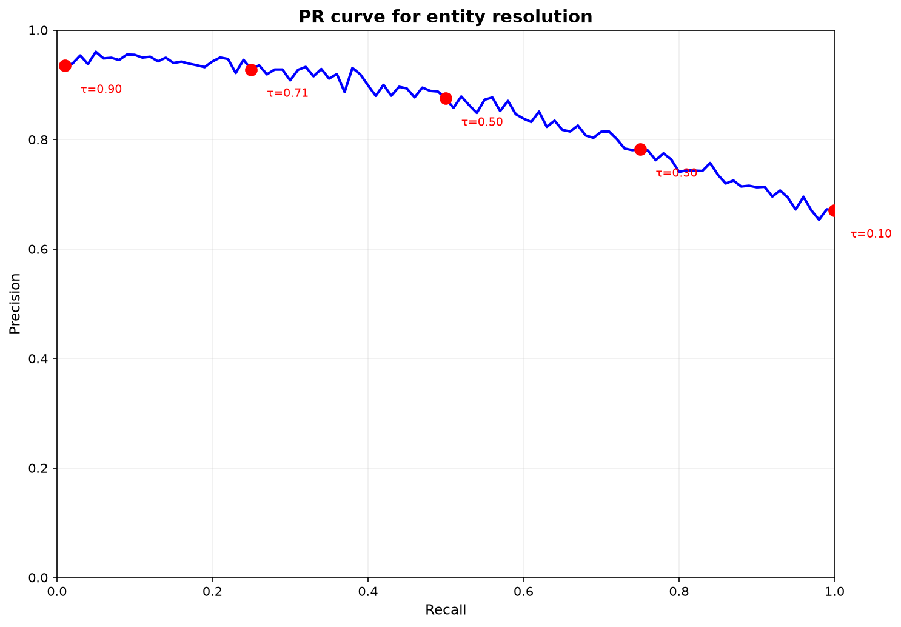
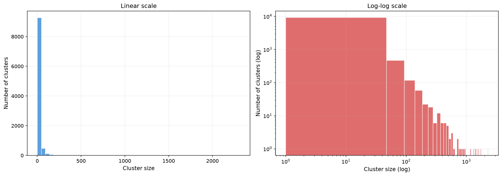

# 5. Entity Resolution: кластеризация адресов и confidence-scored fusion

Адрес — ненадёжная единица анализа. Один субъект может контролировать $10^3$–$10^4$ кошельков, и сигнал по каждому в отдельности получается зашумлённым и нестабильным. Поэтому прежде чем судить о риске, нужно склеить адреса одного владельца в кластеры — этим занимается **entity resolution**. В этой главе разберём, какие сигналы говорят о принадлежности пары адресов одному субъекту, как свести их воедино без ложной уверенности и где провести порог слияния.

## 5.1. Постановка задачи

Формально: отобразить множество адресов $\mathcal{V}$ в разбиение $\mathcal{C} = \{C_1, \ldots, C_M\}$, где каждый кластер $C_m$ предположительно соответствует одному субъекту, и вести дальнейший анализ на уровне кластера. Зачем это нужно — три причины, каждая из которых по-своему существенна.

Во-первых, стабильность сигнала: агрегированное поведение кластера отражает активность субъекта на длинном горизонте и имеет меньшую дисперсию. Во-вторых, полнота санкционного покрытия: если в перечне числится один адрес субъекта, владеющего $N$ адресами, корректная кластеризация распространяет метку на все $N$. В-третьих, подавление шума: стохастические колебания на уровне адреса усредняются при агрегации — эффект, родственный бэггингу.

Рабочая постановка — попарная. Для каждой неупорядоченной пары $(u,v)$ оценивается апостериорная вероятность $P(c_{uv}=1 \mid s_1, \ldots, s_k)$, где $c_{uv}=1$ — «$u$ и $v$ в одном кластере», а $s_1,\ldots,s_k$ — наблюдаемые сигналы. Пары выше порога $\tau$ сливаются.

## 5.2. Сигналы кластеризации

### 5.2.1. CIOH

Для Bitcoin и других UTXO-сетей доминирующий сигнал — CIOH (глава 2): механика подписи требует, чтобы все входы транзакции были подписаны ключами одного субъекта. Для транзакции $T$ с входами $\{in_1, \ldots, in_n\}$:

$$
\forall i, j: \quad \text{addr}(in_i) \sim \text{addr}(in_j)
$$

где $\sim$ — отношение «с высокой вероятностью один владелец». У эвристики три известных систематических источника ошибок. **CoinJoin** намеренно смешивает входы независимых пользователей. **Биржевые hot wallet'ы** агрегируют средства тысяч клиентов на небольшом множестве адресов, порождая ложные слияния. **Taproot/Schnorr** затрудняет определение, сколько ключей вообще подписывало вход.

На ground truth Elliptic++ оценивается $P(c_{uv}=1 \mid \text{CIOH})$; точечная оценка держится в районе $0.90$–$0.95$ — ниже единицы именно из-за перечисленных нарушений. Интервальную оценку и финальную калибровку берёт на себя fusion-модель.

### 5.2.2. Поведенческие сигналы

В account-модели CIOH недоступна, и её заменяет набор поведенческих сигналов:

| Сигнал | Определение | Информативность |
|--------|-------------|-----------------|
| **Nonce sequence** | Монотонно возрастающая последовательность nonce, переходящая с одного адреса на другой | Средняя |
| **Gas price pattern** | Совпадение предпочитаемого gas price (например, фиксированные $20$ gwei) | Средняя |
| **Temporal proximity** | $\Delta t(u,v) < \epsilon$ между транзакциями адресов | Низкая–средняя |
| **Fee pattern** | Совпадение удельной комиссии (sat/vB) с точностью до квантования кошелька | Средняя |
| **Deposit address reuse** | Повторное использование депозитного адреса при работе с биржей | Высокая |

Каждый сигнал $s_i$ — случайная величина с условными распределениями $P(s_i \mid c_{uv}=1)$ и $P(s_i \mid c_{uv}=0)$, оцениваемыми на ground truth.

### 5.2.3. Anchor-относительные сигналы

Дополнительный слабый сигнал: если два адреса показывают близкие и малые расстояния до одного якоря ($\|z_u - z_a\|_2 \approx \|z_v - z_a\|_2$ и оба малы), это аргумент за общность. Но сигнал не независим ни от геометрии embedding-пространства, ни от CIOH/поведенческих сигналов, поэтому в fusion он идёт с пониженным весом и с явным моделированием зависимости.

## 5.3. Проблема зависимых сигналов и методы fusion

### 5.3.1. Почему наивный Байес врёт

Наивный байесовский классификатор предполагает условную независимость сигналов:

$$
P(c \mid s_1, \ldots, s_k) \propto P(c) \prod_{i=1}^{k} P(s_i \mid c)
$$

Предпосылка в наших данных нарушается, и это не тонкость, а центральная проблема. CIOH и временная близость коррелируют по построению — входы одной транзакции лежат в одном блоке, значит, совпадают и времена. Gas price и nonce-последовательность коррелируют как проявления одной реализации кошелька. Игнорирование зависимости даёт систематическую переуверенность: апостериорные вероятности завышаются, начинаются ложные слияния (false merges), и страдают PR-AUC, ECE и Brier одновременно.

### 5.3.2. Copula-based fusion

**Копула** $C: [0,1]^k \to [0,1]$ — способ задать совместное распределение через маргинальные и структуру зависимости, что позволяет по теореме Склара:

$$
F(x_1, \ldots, x_k) = C\bigl(F_1(x_1), \ldots, F_k(x_k)\bigr)
$$

декомпозировать совместное распределение на маргиналы и зависимость — без предположения о независимости.

Как это применяется. Для каждого сигнала $s_i$ на ground truth оцениваются маргинальные условные распределения $P(s_i \mid c=1)$ и $P(s_i \mid c=0)$; затем параметрическое семейство копул $C_\theta$ калибруется на совместных наблюдениях. Апостериорная вероятность:

$$
P(c=1 \mid \mathbf{s}) = \frac{P(c=1) \cdot c_1\bigl(F_1(s_1\mid c=1),\ldots\bigr)}{P(c=1)\cdot c_1(\cdot) + P(c=0)\cdot c_0(\cdot)}
$$

где $c_1, c_0$ — плотности копул при $c=1$ и $c=0$.

| Семейство | Параметр зависимости | Характер зависимости в хвостах |
|-----------|---------------------|--------------------------------------|
| Clayton | $\theta > 0$ | Нижняя хвостовая |
| Gumbel | $\theta \geq 1$ | Верхняя хвостовая |
| Frank | $\theta \in \mathbb{R}\setminus\{0\}$ | Симметричная, без хвостовой асимметрии |

Семейство выбирается эмпирически — по PR-AUC, ECE, Brier и анализу rank-plot.

### 5.3.3. Logistic fusion

Прагматичная альтернатива — логистическая регрессия на сигналах:

$$
P(c=1 \mid s_1, \ldots, s_k) = \sigma\!\left(\beta_0 + \sum_{i=1}^{k} \beta_i s_i\right), \quad \sigma(z) = \frac{1}{1+e^{-z}}
$$

Её достоинства — вычислительная простота, устойчивость и интерпретируемость коэффициентов как log-odds ratio; $L_1$-регуляризация заодно отбирает значимые сигналы. Ограничение тоже честное: линейность log-odds. При выраженных пороговых эффектах (как у CIOH) копула может дать лучшую разделимость и калибровку.

**Базовая стратегия Spillety.** Baseline — logistic fusion; переход к копуле — только при статистически значимом улучшении PR-AUC/ECE/Brier на валидации. Простая модель по умолчанию, усложнение по доказательству.

## 5.4. Калибровка на ground truth

### 5.4.1. Elliptic++

Elliptic++ — единственный публичный датасет с верифицированной кластерной разметкой Bitcoin-адресов.

| Параметр | Значение |
|----------|----------|
| Транзакций | 203 769 |
| Адресов | 822 942 |
| Временных шагов | 49 |
| Illicit адресов | 14 266 |
| Licit адресов | 251 088 |
| Unknown | 557 588 |
| Признаков на адрес | 56 |

Разметка содержит метки illicit / licit / unknown (unknown — отсутствие ground truth, что не равно licit), кластеризацию по multiple-input эвристике с ручной верификацией и 49 временных шагов для walk-forward валидации. Существенная оговорка: illicit-разметка заведомо неполна (557 588 unknown), поэтому precision/recall на Elliptic++ — нижние оценки истинных значений.

### 5.4.2. Процедура калибровки

Априорная вероятность слияния: $\hat{P}(c=1) = \frac{|\{(u,v): c_{uv}=1\}|}{|\{(u,v): u \neq v\}|}$, дополнительно — темпорально-стратифицированный приор $\hat{P}(c=1 \mid t)$. Для каждого сигнала строятся эмпирические $P(s_i \mid c=1)$ и $P(s_i \mid c=0)$ (ядерная оценка плотности или гистограммы) — это маргиналы для копулы и компоненты правдоподобия для логистической модели.

Протокол: разбиение Elliptic++ по времени — train (шаги $1$–$35$), validation ($36$–$42$), test ($43$–$49$) без перемешивания; на train — оценка приоров, условных распределений и параметров модели; на validation — выбор семейства копулы, регуляризации и операционной точки; на test — финальные PR-AUC, ECE, Brier, silhouette, recall@K, KS.

## 5.5. Операционная точка и защита от вырождения

### 5.5.1. PR-кривая и стоимость ошибок

Для каждого порога $\tau \in [0,1]$:

$$
\text{Precision}(\tau) = \frac{TP(\tau)}{TP(\tau) + FP(\tau)}, \qquad \text{Recall}(\tau) = \frac{TP(\tau)}{TP(\tau) + FN(\tau)}
$$

Множество точек образует PR-кривую.

*PR-кривая entity resolution: каждая точка — порог $\tau$; отмеченная точка — операционная, минимизирующая функцию стоимости. PR-AUC — интегральная мера качества ранжирования.*

Ошибки слияния несимметричны. Ложное объединение (false merge, $C_{FP}$) порождает фальшивый кластер и каскад downstream-ошибок; ложное разделение (false split, $C_{FN}$) фрагментирует субъекта и режет полноту санкционного покрытия. Соотношение $C_{FN}/C_{FP}$ задаётся бизнес-требованиями, порог выбирается минимизацией ожидаемой стоимости:

$$
\tau^* = \arg\min_{\tau \in [0,1]} \bigl[C_{FP} \cdot FP(\tau) + C_{FN} \cdot FN(\tau)\bigr]
$$

После фиксации $\tau^*$ калибровка вероятностей проверяется ECE и Brier.

### 5.5.2. Cluster collapse

При высоком $C_{FN}/C_{FP}$ fusion-модель склонна к вырожденному решению — слить значительную долю графа в один гигантский кластер. Защита — ограничение $\text{max\_cluster\_size} = 10^6$: при его превышении порог локально повышается для соответствующего подграфа (adaptive thresholding). Это смягчает проблему, но не устраняет — см. ограничения.

*Распределение размеров кластеров в блокчейн-данных: степенной закон — преобладание мелких кластеров ($1$–$5$ адресов) и тяжёлый хвост крупных (биржи, миксеры).*

### 5.5.3. Варианты выбора порога

| Вариант | Критерий |
|---------|----------|
| Фиксированный квантиль (baseline) | $\tau$ — 95-й процентиль предсказанных вероятностей на train |
| Cost-optimal по PR-кривой | $\tau^* = \arg\min \text{Cost}(\tau)$ при заданных $C_{FP}, C_{FN}$ |
| F1-max | $\tau$ максимизирует $F_1(\tau) = 2PR/(P+R)$ |
| Constrained cost-optimal | Cost-optimal при ограничении $\text{max\_cluster\_size} = 10^6$ |

Выбор между ними — на валидации; пространством решений управляет таблица из 5.7.

## 5.6. Инкрементальное обновление кластеров

Кластерная структура должна жить непрерывно, а полная рекластеризация на каждом блоке ($O(|\mathcal{V}|^2)$ попарных сравнений в наивном виде) недопустима. Решение — **union-find** (DSU) с path compression и union by rank: `Find(v)` определяет идентификатор кластера адреса, `Union(u,v)` сливает кластеры. Амортизированная сложность операций — $O(\alpha(|\mathcal{V}|))$, где $\alpha$ — обратная функция Аккермана, практически константа ($< 5$ для любых мыслимых $|\mathcal{V}|$).

Инкрементальный протокол: новый адрес — одноэлементный кластер; каждая новая транзакция порождает оценку $P(c_{v_i v_j}=1 \mid \mathbf{s})$ для затронутых пар; пары выше $\tau^*$ сливаются через `Union`; метаданные кластера (размер, центроид эмбеддингов, агрегированные признаки) обновляются.

У инкрементальности есть цена — накопление ошибок (error drift). Поэтому периодически (по календарю или по триггеру: KS-тест на распределениях характеристик кластеров между окнами) выполняется полная рекластеризация на скользящем окне с нуля (de novo); расхождения с инкрементальными кластерами разрешаются в пользу de novo сверх порога.

## 5.7. Пространство решений fusion-модели

| Фактор | Варианты |
|--------|--------------------------|
| Модель fusion | logistic (baseline) vs copula-based |
| Семейство копулы | Clayton, Gumbel, Frank |
| Набор сигналов | CIOH only → + поведенческие → + anchor-относительные |
| Регуляризация | $L_1$, $L_2$, Elastic Net; $\lambda \in \{10^{-4},\dots,10^{-1}\}$ |
| Порог | квантиль vs cost-optimal vs constrained cost-optimal |

Процедура выбора — короткая: отсечение по PR-AUC (проигрыш $>0.01$ при $p<0.05$, bootstrap $B=1000$), затем минимум ECE/Brier с предпочтением $\text{ECE} < 0.05$, затем штраф за деградацию silhouette/Recall@K более чем на 5% относительно baseline, затем KS-стабильность между временными окнами, и — правило парсимонии — при неразличимости простая модель впереди: logistic $>$ Frank $>$ Clayton/Gumbel.

Ожидаемые эффекты: копула с Clayton/Gumbel обыгрывает logistic и Frank при выраженной хвостовой зависимости сигналов (по эмпирике CIOH и temporal proximity демонстрируют нижнюю хвостовую зависимость — это аргумент за Clayton); anchor-сигналы добавляют 1–3 п.п. PR-AUC, но могут портить ECE; cost-optimal порог бьёт фиксированный квантиль и по взвешенной стоимости, и по калибровке.

## 5.8. Ограничения

1. **Ложные срабатывания CIOH** — CoinJoin, биржевые hot wallets, Taproot; митигация — пониженный вес CIOH при детекции CoinJoin-паттернов и учёт зависимости через копулу.
2. **Ограниченность ground truth** — Elliptic++ покрывает только Bitcoin и содержит неполную illicit-разметку (unknown $= 557\,588$); перенос приоров на Ethereum без CIOH добавляет ошибку.
3. **Риск cluster collapse** — ограничение размера смягчает, но не устраняет.
4. **Темпоральный дрейф** сигналов; детекция KS-тестом, ответ — периодическая рекластеризация.
5. **Стоимость полной рекластеризации** — $O(|\mathcal{V}|^2)$ наивно, на практике $O(|\mathcal{E}|)$ с pruning; union-find дешевле, но накапливает ошибки.

---

## См. также

- [04_entity_resolution.ipynb](../notebooks/04_entity_resolution.ipynb) — кластеризация адресов и оценка качества fusion.

Источники:
- Meiklejohn S. et al. A Fistful of Bitcoins: Characterizing Payments Among Men with No Names, 2013.
- Harrigan M., Fretter C. The Unreasonable Effectiveness of Address Clustering, 2016.
- Sklar A. Fonctions de répartition à n dimensions et leurs marges, 1959.
- Elliptic++ Dataset: Weber M. et al., 2024.