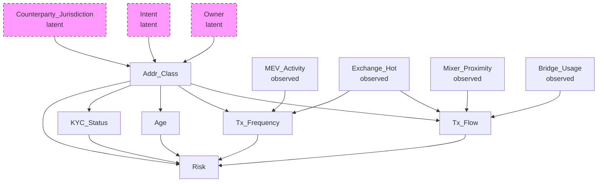
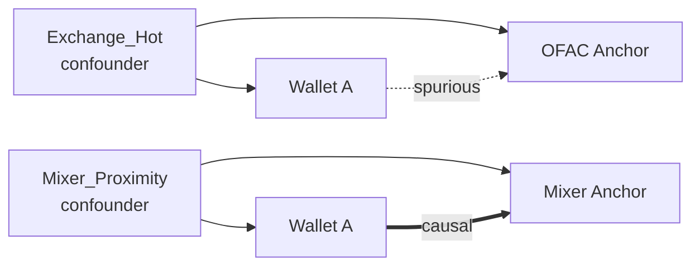
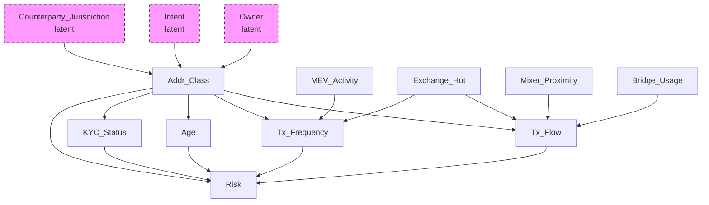

# 6. Causal inference и DAG: отделение корреляционной близости от причинной связи

Данный раздел формализует переход от меры сходства в пространстве вложений (embedding space) к причинно-обоснованному критерию риска. Близкие в смысле косинусного или евклидова расстояния кошельки не эквивалентны причинно связанным кошелькам: наблюдаемая близость может быть обусловлена общей причиной (confounder). Инструментом декомпозиции корреляции и причинности выступает аппарат причинного вывода (causal inference) с представлением причинной структуры в виде направленного ациклического графа (causal DAG) и последующей оценкой устойчивости выводов к ненаблюдаемому смешению (sensitivity analysis).

### Термины

| Термин | Определение |
|--------|-------------|
| Causal inference | Раздел статистики, направленный на идентификацию и оценивание причинно-следственных эффектов при наличии наблюдаемых и ненаблюдаемых смешивающих факторов |
| Causal DAG | Directed Acyclic Graph — направленный ациклический граф, в котором вершины соответствуют случайным переменным, а направленные рёбра кодируют прямые причинные влияния |
| Confounder | Переменная, являющаяся общей причиной для рассматриваемых причины и следствия и порождающая ложную (spurious) корреляцию при отсутствии кондиционирования |
| Collider | Переменная, являющаяся общим следствием двух и более переменных; кондиционирование на коллайдере индуцирует ложную зависимость между его причинами |
| Conditional independence | Свойство стохастической независимости двух переменных при фиксированном значении третьей (множества) переменных |
| Markov equivalence class | Класс эквивалентности DAG, порождающих идентичное множество условных независимостей и неразличимых по наблюдаемому распределению без дополнительных идентификационных допущений |
| E-value | Минимальная величина ассоциации ненаблюдаемого confounder'а с воздействием и исходом, необходимая для полного объяснения наблюдаемого эффекта при заданном risk ratio |
| Rosenbaum Γ* | Пороговое значение параметра чувствительности Γ, при котором верхняя граница p-value при модели скрытого смещения превышает уровень значимости 0.05 |
| Sensemakr | Метод анализа чувствительности, параметризующий влияние ненаблюдаемого смешения через partial R² в регрессионной постановке |
| Spurious correlation | Статистическая корреляция, обусловленная общей причиной или структурой отбора, не отражающая прямого причинного влияния |

---

## 6.1. Постановка задачи

В предшествующих разделах представлено получение векторного представления кошелька посредством контрастивного обучения и объединение адресов в сущности (entity resolution). Механизм retrieval извлекает top-K ближайших anchors в пространстве вложений; расстояние до anchors используется как сигнал риска.

Фундаментальное ограничение такого сигнала состоит в его корреляционной природе. Близость объекта $A$ к OFAC-адресу в embedding space не имплицирует причинную связь между $A$ и источником риска. Наблюдаемая близость может быть объяснена наличием **confounder'а** — переменной, каузально влияющей как на представление $A$, так и на представление anchor'а.

Формальная интерпретация иллюстративного примера: кошелёк $A$, функционирующий как горячий кошелёк централизованной биржи (Exchange_Hot), обслуживает транзакции множества пользователей, включая санкционированные адреса. В пространстве вложений $A$ и OFAC-адрес коллоцируются вследствие сходных графовых характеристик (высокая степень вершины, пересечение множеств контрагентов), а не вследствие прямой причинной зависимости. Без коррекции данная конфигурация порождает spurious correlation: Exchange_Hot выступает общей причиной для признаков потока транзакций и наблюдаемой близости к anchor'у, искажая оценку риска и индуцируя ложноположительные классификации.

Следовательно, необходимость причинной фильтрации предшествует подаче retrieval-сигналов в модель принятия решений (GBDT).

> **Теоретически мы оцениваем наше решение вот так: CI p-values, E-value, Rosenbaum Γ*, sensemakr R², Brier, ECE, PR-AUC, SHAP** — единый теоретико-метрический базис оценки корректности и устойчивости всего decision path; в настоящем разделе релевантны прежде всего CI p-values, E-value, Rosenbaum Γ* и sensemakr R², тогда как Brier, ECE, PR-AUC и SHAP раскрываются в разделе 7.

---

## 6.2. Causal DAG: структура и построение

### 6.2.1. Определение DAG

**Causal DAG** — ориентированный ациклический граф $G = (V, E)$, где:

- $V$ — множество вершин, соответствующих случайным переменным (признакам, классам адресов, исходам);
- $E \subseteq V \times V$ — множество направленных рёбер, причём ребро $X \to Y$ интерпретируется как прямое причинное влияние $X$ на $Y$;
- выполняется свойство ацикличности: $\nexists$ направленного пути $X \to \dots \to X$.

DAG кодирует множество условных независимостей через критерий d-разделения (d-separation): отсутствие открытого пути между вершинами при заданном множестве кондиционирования имплицирует их условную независимость.

Формальная интерпретация: утверждение об отсутствии ребра $X \to Y$ эквивалентно гипотезе об условной независимости $X \perp\!\!\!\perp Y \mid \mathrm{Pa}(X,Y)$, проверяемой статистически (см. §6.3).

### 6.2.2. Классы вершин в Spillety

DAG в Spillety специфицируется на уровне **классов адресов**, а не индивидуальных кошельков, в силу следующих оснований: (i) индивидуальная гетерогенность кошельков препятствует стабильной идентификации причинной структуры; (ii) классы (Exchange_Hot, Mixer, Bridge и т.п.) обладают воспроизводимыми причинными механизмами; (iii) классовая спецификация допускает экспертную верификацию и статистическую фальсификацию.

**Вершины DAG:**

| Вершина | Тип | Описание |
|---------|-----|----------|
| Addr_Class | Класс адреса | Подклассы: Exchange_Hot_CEX_US, Exchange_Hot_DEX_EU, Mixer_Tornado, Mixer_Privacy, Bridge_CrossChain, MEV_Bot, DeFi_Pool, EOA, Unknown |
| Tx_Flow | Признак | Направление и объём потока транзакций |
| Tx_Frequency | Признак | Частота транзакций |
| Age | Признак | Возраст кошелька |
| KYC_Status | Признак | Статус KYC (где доступно) |

**Наблюдаемые confounders (observed):**

Формальная интерпретация: наблюдаемые смешивающие факторы поддаются измерению и включению в множество кондиционирования; игнорирование их индуцирует смещённую оценку причинного эффекта.

| Confounder | Интерпретация смешения |
|------------|------------------------|
| Exchange_Hot | Индуцирует близость к anchors через механизм обслуживания транзакций |
| Mixer_Proximity | Индуцирует близость через участие в протоколах микширования |
| Bridge_Usage | Индуцирует близость через cross-chain операции |
| MEV_Activity | Индуцирует близость через активность MEV-ботов |

**Латентные confounders (unobserved):**

Формальная интерпретация: ненаблюдаемые факторы не допускают прямого кондиционирования; их потенциальное влияние оценивается исключительно через анализ чувствительности (§6.5).

| Confounder | Основание ненаблюдаемости |
|------------|---------------------------|
| Owner | Истинная идентичность владельца не установлена |
| Intent | Интенция (легитимная либо illicit) не наблюдаема ex ante |
| Counterparty_Jurisdiction | Юрисдикция контрагента доступна неполно |

Латентные confounders не включаются в наблюдаемую спецификацию DAG, но их воздействие параметризуется в рамках sensitivity analysis.

### 6.2.3. Пример DAG

**Интерпретация структуры:**

- Ребро $X \to Y$ кодирует прямое причинное влияние $X$ на $Y$.
- Exchange_Hot влияет на Tx_Flow и Tx_Frequency, но не на Risk напрямую; следовательно, Exchange_Hot является классическим confounder'ом для связи Tx_Flow — Risk.
- Addr_Class влияет как на Tx_Flow, так и на Risk, образуя альтернативный путь смешения.
- Owner, Intent, Counterparty_Jurisdiction — латентные источники вариации Addr_Class.

Импликация для идентификации: оценка причинного влияния Tx_Flow на Risk требует кондиционирования на Exchange_Hot (и иных наблюдаемых confounders). Формально, без кондиционирования наблюдаемая ассоциация

$$\mathrm{Assoc}(\text{Tx\_Flow}, \text{Risk}) = \text{causal effect} + \text{bias}(\text{Exchange\_Hot})$$

содержит компоненту смещения.

Формальная интерпретация кондиционирования: аналогично стратификации по статусу курения при оценке эффекта потребления кофе на заболеваемость, фиксация уровня Exchange_Hot (сравнение кошельков внутри страт с идентичным значением confounder'а) изолирует вариацию Tx_Flow, не объясняемую общей причиной.

---

## 6.3. Валидация DAG

DAG рассматривается как экспертный априорный граф, подлежащий эмпирической фальсификации. Валидация включает четыре взаимосвязанных уровня. Выбор итоговой структуры из множества кандидатов осуществляется формально.

### 6.3.1. Тесты подразумеваемых условных независимостей

DAG имплицирует множество условных независимостей вида $X \perp\!\!\!\perp Y \mid Z$. Для каждой имплицируемой независимости выполняется статистический тест условной независимости. Отвержение нулевой гипотезы о независимости при $p < 0.05$ свидетельствует о рассогласовании DAG с наблюдаемым распределением.

Формальная интерпретация: каждое ребро, отсутствующее в DAG, порождает фальсифицируемое предсказание о независимости, верифицируемое на данных.

**Методы тестирования:**

- **Partial correlation** — для линейных зависимостей при допущении гауссовости;
- **Conditional mutual information** — для нелинейных зависимостей без параметрических допущений;
- **Bootstrap CI для p-value** — оценивание устойчивости вывода к выборочной вариабельности; доверительный интервал для p-value строится бутстрэпом (1000 репликаций), и независимость считается отвергнутой только при устойчивом выходе верхней границы CI за порог значимости.

Масштабирование: число тестов растёт экспоненциально с $ |V| $ (для $ |V|=20 $ — 190 пар с множественными кондиционирующими множествами). Применяется стратегия локального тестирования — верификация исключительно рёбер, инцидентных родителям и детям каждой вершины, что обеспечивает компромисс между полнотой и вычислительной осуществимостью.

### 6.3.2. Falsification-тесты на конкретных парах

Дополнительно выполняются направленные falsification-тесты для критических отсутствующих рёбер.

Пример: DAG постулирует отсутствие прямого ребра Exchange_Hot $\to$ Risk. Фальсифицирующая спецификация:

$$\text{Risk} \sim \beta_0 + \beta_1 \cdot \text{Exchange\_Hot} + \beta_2 \cdot \text{Tx\_Flow} + \beta_3 \cdot \text{Tx\_Frequency} + \varepsilon$$

Нулевая гипотеза $H_0: \beta_1 = 0$. Статистическая значимость $\hat{\beta}_1$ (t-тест, $p < 0.05$, с bootstrap CI) является основанием для пересмотра DAG — добавления ребра либо пересмотра множества кондиционирования.

Формальная интерпретация: значимость коэффициента при переменной, объявленной условно независимой от исхода, фальсифицирует соответствующую d-разделённость в графе.

### 6.3.3. Чувствительность к альтернативным DAG и выбор из Markov equivalence class

Причинная структура идентифицируется неединственным образом: существует **Markov equivalence class** — множество DAG, кодирующих идентичное множество условных независимостей и потому неразличимых по наблюдаемому распределению без дополнительных допущений.

Процедура оценки чувствительности:

1. Построение Markov equivalence class посредством алгоритмов каузального обнаружения (PC-algorithm, GES) либо экспертной энумерацией кандидатов;
2. Оценивание причинного эффекта для каждого DAG в классе;
3. Сопоставление оценок через bootstrap CI; перекрытие интервалов интерпретируется как устойчивость, расхождение — как недостаточная идентифицируемость.

**Формальный выбор DAG среди кандидатов DAG-A … DAG-E.** В Spillety специфицируются пять экспертных кандидатов DAG-A, DAG-B, DAG-C, DAG-D, DAG-E, различающихся ориентацией спорных рёбер (например, направление влияния Bridge_Usage $\to$ Tx_Flow vs. Tx_Flow $\to$ Bridge_Usage, наличие ребра MEV_Activity $\to$ Risk). Выбор осуществляется по критерию фальсификации:

- Для каждого кандидата DAG-$k$ ($k \in \{A,B,C,D,E\}$) выполняется полный набор CI-тестов и falsification-тестов (§6.3.1–6.3.2) с построением bootstrap CI для p-values.
- Вычисляется доля нарушенных независимостей и число значимых falsification-рёбер.
- Выбирается DAG с минимальным числом отвержений при условии, что его p-values устойчиво превышают порог значимости по верхней границе bootstrap CI. При эквивалентности нескольких кандидатов (перекрывающиеся bootstrap CI оценок эффекта) предпочтение отдаётся более парсимоничной структуре (минимальное число рёбер) — принцип оккамизации.

Теоретически мы оцениваем наше решение вот так: CI p-values, E-value, Rosenbaum Γ*, sensemakr R², Brier, ECE, PR-AUC, SHAP — при этом выбор DAG-A…DAG-E верифицируется именно по CI p-values и их bootstrap CI, а также по устойчивости оценок эффекта между эквивалентными графами.

### 6.3.4. Power analysis

Тесты условной независимости требуют достаточного объёма выборки. Для редких подклассов (например, Mixer_Tornado) статистическая мощность может быть недостаточной для обнаружения зависимости умеренной величины, что делает неотвержение $H_0$ неинформативным.

Процедура power analysis: определение минимального объёма $n_{\min}$, обеспечивающего мощность $1-\beta = 0.8$ при заданном размере эффекта (effect size) и уровне $\alpha = 0.05$. Если наблюдаемое $n < n_{\min}$, тест не интерпретируется как подтверждение независимости; подкласс маркируется как «недостаточно данных», и соответствующие рёбра помечаются как неверифицированные.

Формальная интерпретация: отсутствие статистической значимости при недостаточной мощности не эквивалентно доказательству отсутствия причинной связи.

---

## 6.4. Causal filter: применение DAG к retrieval

### 6.4.1. Проблема ложных соседей (spurious neighbors)

Механизм retrieval возвращает top-K anchors, минимизирующих расстояние в пространстве вложений. Подмножество этих anchors является ложными соседями: их близость обусловлена confounder'ом, а не прямой причинной связью между кошельком и источником риска.

Формальная интерпретация: retrieval ранжирует по мере сходства представлений, тогда как decision path требует ранжирования по мере причинной релевантности; без коррекции меры расходятся.

Пример: Exchange_Hot-кошелёк $A$ и OFAC-адрес коллоцируются вследствие общей причины (высокая транзакционная степень, пересечение контрагентов), а не вследствие того, что $A$ причинно порождает санкционный риск.

### 6.4.2. Алгоритм фильтрации

**Шаг 1.** Для каждого anchor $a$ в top-K проверить существование открытого причинного пути (causal path) от кошелька $w$ к $a$, не блокируемого наблюдаемыми confounders в DAG.

**Шаг 2.** Если единственный путь $w \text{ — } a$ проходит через confounder $C$ (например, Exchange_Hot), объясняющий ковариацию представлений, anchor исключается.

**Шаг 3.** Формальный критерий исключения:

$$
P(a \mid w, C) \approx P(a \mid C)
$$

что эквивалентно условной независимости $a \perp\!\!\!\perp w \mid C$.

Формальная интерпретация условия: при фиксированном значении confounder'а знание о кошельке не изменяет предсказательное распределение anchor'а; следовательно, наблюдаемая близость полностью объясняется общей причиной и не несёт инкрементальной причинной информации.

**Шаг 4.** Сохраняются исключительно anchors, для которых существует прямой причинный путь, не d-разделяемый множеством наблюдаемых confounders.

### 6.4.3. Иллюстрация работы фильтра

Интерпретация:

- OFAC-anchor исключается: условная независимость $ \text{OFAC} \perp\!\!\!\perp \text{Wallet} \mid \text{Exchange\_Hot}$ не отвергается, близость признается spurious.
- Mixer-anchor сохраняется: путь не блокируется наблюдаемым confounder'ом, условная зависимость сохраняется.

### 6.4.4. Оценка качества фильтрации

Метрика: **causal_filter_pass_rate** — доля anchors, прошедших фильтр среди top-K. Низкое значение указывает на преобладание spurious-близостей в retrieval; высокое — на причинную релевантность пространства вложений после коррекции.

Пороговая калибровка: PR-кривая для задачи retrieval с varying порогом фильтра; операционная точка выбирается минимизацией cost-функции (см. раздел 7). Теоретически мы оцениваем наше решение вот так: CI p-values, E-value, Rosenbaum Γ*, sensemakr R², Brier, ECE, PR-AUC, SHAP — где PR-AUC характеризует качество retrieval до и после фильтрации.

---

## 6.5. Sensitivity analysis: оценка устойчивости к латентному смешению

При наличии ненаблюдаемых confounders (Owner, Intent, Counterparty_Jurisdiction) точечная идентификация причинного эффекта невозможна. Sensitivity analysis отвечает на вопрос: какой величины должно быть ненаблюдаемое смешение, чтобы полностью объяснить (аннулировать) наблюдаемый эффект. Чем большая величина требуется, тем более устойчив вывод.

Теоретически мы оцениваем наше решение вот так: CI p-values, E-value, Rosenbaum Γ*, sensemakr R², Brier, ECE, PR-AUC, SHAP — где E-value, Rosenbaum Γ* и sensemakr partial R² составляют ядро анализа чувствительности к латентному смешению.

### 6.5.1. E-value

**Определение.** Для наблюдаемого risk ratio $RR$:

$$
\text{E-value} = RR + \sqrt{RR \cdot (RR - 1)}
$$

E-value — минимальная сила ассоциации ненаблюдаемого confounder'а одновременно с воздействием и исходом (по шкале risk ratio), необходимая для сведения наблюдаемого эффекта к нулевому при условии, что измеренные ковариаты уже учтены.

Формальная интерпретация: при E-value $= 2.3$ ненаблюдаемый confounder должен быть ассоциирован как с воздействием, так и с исходом с $RR \geq 2.3$, чтобы объяснить наблюдаемую ассоциацию. Если существование confounder'а такой силы априорно маловероятно, эффект признаётся устойчивым.

Применение в Spillety: E-value вычисляется для каждого алерта; алерты с низким E-value маркируются как чувствительные к ненаблюдаемому смешению и направляются на human review.

**Выбор порога для Tier 1: 2.0 vs 2.5.** Рассматриваются два кандидатных порога $E_{\text{thr}} \in \{2.0, 2.5\}$ для классификации алерта как устойчивого (auto-block). Процедура выбора:

- На исторической hold-out выборке оценивается распределение E-value среди истинно положительных и ложноположительных алертов.
- Для каждого порога вычисляются precision, recall и ожидаемый cost (см. §7.7) с построением bootstrap CI для разности метрик.
- Порог $2.5$ обеспечивает более консервативную селекцию (выше precision, ниже recall, меньше ложных блокировок), тогда как $2.0$ допускает умеренное смешение. Выбор $2.0$ как базового для Tier 1 обоснован тем, что bootstrap CI для прироста precision при переходе к $2.5$ перекрывает нуль при значимом падении recall; $2.5$ резервируется для режима повышенной строгости (high-stakes jurisdiction). Оба порога сохраняются как операционные режимы.

### 6.5.2. Rosenbaum Γ*

**Определение.** Для наблюдаемого эффекта $\hat{\tau}$ и его стандартной ошибки $SE$, Rosenbaum $\Gamma^*$ — минимальное значение параметра чувствительности $\Gamma$, при котором верхняя граница p-value в модели скрытого смещения (hidden bias model) превышает $\alpha = 0.05$. Модель допускает, что ненаблюдаемый confounder может увеличивать шансы (odds) получения воздействия в $\Gamma$ раз между двумя единицами с идентичными наблюдаемыми ковариатами.

Формальная интерпретация: при $\Gamma^* = 2.1$ ненаблюдаемый confounder должен искажать odds ratio воздействия не менее чем в 2.1 раза, чтобы аннулировать статистическую значимость. Порог $\Gamma^* > 1.5$ для Tier 1 соответствует требованию устойчивости к умеренному скрытому смещению.

Дополнение: Rosenbaum $\Gamma^*$ параметризует исключительно скрытое смещение; явное смещение (overt bias, например selection bias) корректируется отдельно через процедуру overt bias reconciliation.

### 6.5.3. Sensemakr partial R²

Sensemakr формализует чувствительность через долю объяснённой дисперсии. В регрессионной постановке $Y \sim X + Z + U$, где $U$ — ненаблюдаемый confounder, partial $R^2$ определяется как

$$R^2_{Y \sim U \mid X,Z} = \frac{\mathrm{Var}(Y \mid X,Z) - \mathrm{Var}(Y \mid X,Z,U)}{\mathrm{Var}(Y \mid X,Z)}$$

— доля остаточной дисперсии исхода, объясняемая $U$ после учёта наблюдаемых ковариат. Аналогично определяется $R^2_{X \sim U \mid Z}$.

Формальная интерпретация: значение partial $R^2 = 0.15$ означает, что ненаблюдаемый confounder должен объяснять 15% остаточной дисперсии исхода (и соответствующую долю дисперсии воздействия), чтобы свести эффект к нулю. Порог $> 0.10$ для Tier 1 требует, чтобы confounder объяснял существенную долю вариации, что считается маловероятным для Hawkes-компонента временных признаков, где sensemakr применяется приоритетно.

### 6.5.4. Пороги для Tier 1

| Метрика | Порог (базовый) | Альтернативный порог | Обоснование |
|---------|-----------------|----------------------|-------------|
| E-value | $> 2.0$ (сравнивается с $> 2.5$) | $> 2.5$ — консервативный режим | Устойчивость к умеренному/сильному confounding; выбор по bootstrap CI precision/recall |
| Rosenbaum Γ* | $> 1.5$ | — | Устойчивость к умеренному скрытому bias |
| Sensemakr partial R² | $> 0.10$ | — | Требование существенной объяснённой дисперсии |

Пороги калибруются эмпирически на исторических данных как квантили, максимизирующие precision на hold-out при контроле recall; для E-value дополнительно верифицируются сравнением $2.0$ vs $2.5$ по bootstrap CI разности PR-AUC и cost-метрик.

---

## 6.6. Визуализация

Код генерации графиков вынесен в [`files/6_visualization.py`](./files/6_visualization.py). Ниже приведены спецификации визуализаций и их формальная интерпретация.

### 6.6.1. DAG

Пунктирные вершины — латентные confounders; сплошные — наблюдаемые переменные и признаки.

### 6.6.2. Графики чувствительности

Формальная интерпретация: зависимость E-value от risk ratio; горизонтальная линия — порог Tier 1 ($2.0$, пунктирно — $2.5$); точка пересечения определяет минимальный $RR$, при котором эффект признаётся устойчивым.

Формальная интерпретация: зависимость верхней границы p-value от параметра $\Gamma$; горизонтальная линия $p=0.05$; абсцисса пересечения — $\Gamma^*$.

Формальная интерпретация: контурная диаграмма изменения скорректированной оценки эффекта как функции $(R^2_{Y\sim U\mid X,Z}, R^2_{X\sim U\mid Z})$; изолиния нулевого эффекта и порог Tier 1 ($R^2 = 0.10$) разграничивают область устойчивости.

---

## 6.7. Ограничения

1. **Экспертная природа DAG.** Граф специфицируется на основании доменных знаний; ошибочная спецификация экспертов транслируется в пропуск spurious-связей фильтром и смещение последующих оценок.
2. **Markov-эквивалентность.** Принадлежность к одному классу эквивалентности сохраняет множество условных независимостей, но допускает различные причинные интерпретации и оценки эффекта; выбор среди DAG-A…DAG-E по CI p-values и bootstrap CI снижает, но не элиминирует неопределённость идентификации.
3. **Латентное смешение.** Переменные Owner, Intent, Counterparty_Jurisdiction ненаблюдаемы; коррекция невозможна, доступна лишь параметризация устойчивости через E-value, Rosenbaum Γ* и sensemakr R².
4. **Статистическая мощность.** Для редких подклассов (Mixer_Tornado и аналогичных) объём выборки может не обеспечивать мощность $0.8$; неотвержение независимости в таких стратах неинформативно.
5. **Вычислительная сложность.** Полная энумерация тестов условной независимости экспоненциальна по $|V|$; ограничение локальными тестами является аппроксимацией, допускающей пропуск слабых зависимостей.
6. **Темпоральный дрейф причинной структуры.** Появление новых протоколов (ZK-mixers, cross-chain bridges, приватные L2) изменяет причинные механизмы; DAG требует периодической респецификации и ревалидации.

---

**Резюме.** Causal DAG формализует множество наблюдаемых confounders и обеспечивает фильтрацию ложных соседей до подачи сигналов в GBDT. Валидация DAG осуществляется через тесты условных независимостей, falsification-тесты и анализ Markov-эквивалентности с выбором среди DAG-A…DAG-E по CI p-values и их bootstrap CI. Устойчивость к латентному смешению параметризуется метриками E-value (порог $2.0$ vs $2.5$), Rosenbaum Γ* и sensemakr partial R², калибруемыми эмпирически на исторических данных.

| Компонент | Функция | Формальный результат |
|-----------|---------|----------------------|
| Causal DAG | Формализация структуры смешения | Спецификация множества для кондиционирования |
| CI-тесты | Эмпирическая валидация структуры | p-values, bootstrap CI |
| Falsification-тесты | Проверка конкретных отсутствующих рёбер | Статистика $t$, $p$, решение о пересмотре ребра |
| Markov equivalence (DAG-A…DAG-E) | Оценка идентифицируемости | Выбор DAG по минимуму фальсификаций и перекрытию bootstrap CI |
| Causal filter | Исключение spurious neighbors | Условная независимость $P(a\mid w,C)=P(a\mid C)$, метрика causal_filter_pass_rate |
| E-value | Устойчивость к ненаблюдаемому смешению | Порог $>2.0$ (альтернатива $>2.5$), верификация по bootstrap CI |
| Rosenbaum Γ* | Устойчивость к скрытому bias | Порог $>1.5$ |
| Sensemakr partial R² | Чувствительность Hawkes-компонента | Порог $>0.10$ |

Теоретически мы оцениваем наше решение вот так: CI p-values, E-value, Rosenbaum Γ*, sensemakr R², Brier, ECE, PR-AUC, SHAP — где первые четыре метрики верифицируют причинную корректность и робастность фильтра, а Brier, ECE, PR-AUC и SHAP обеспечивают калибровочную и дискриминативную валидацию downstream-модели (раздел 7).
