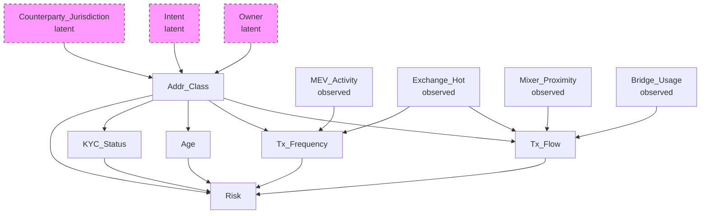
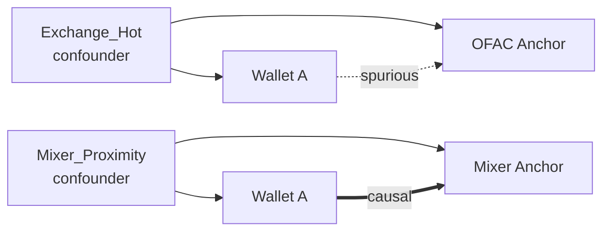
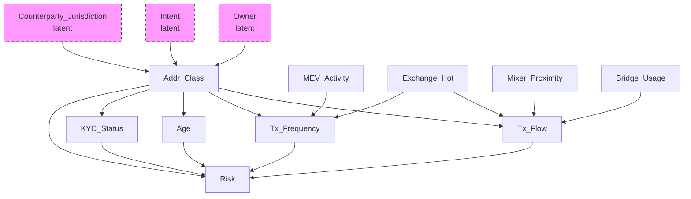
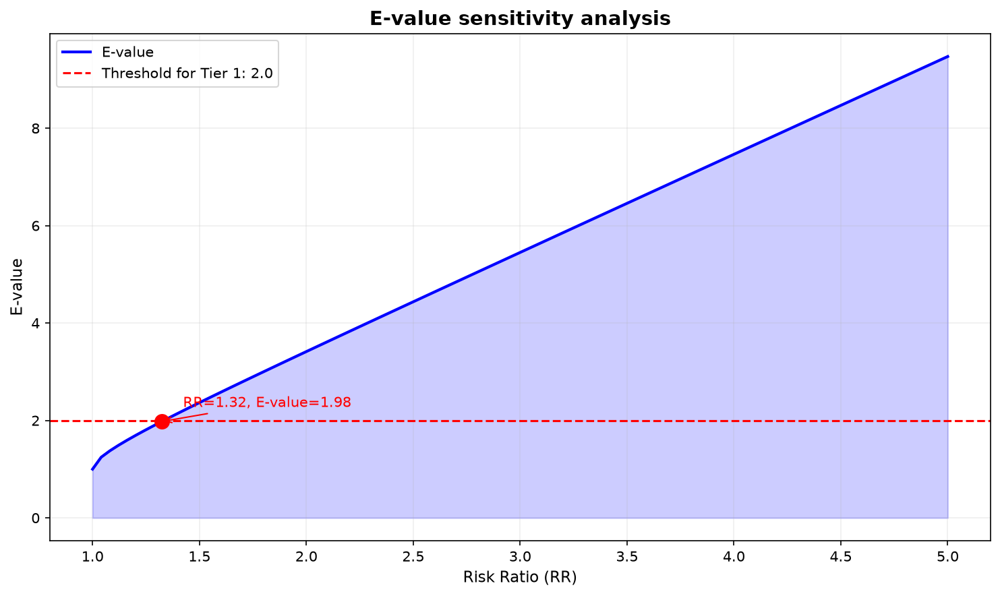
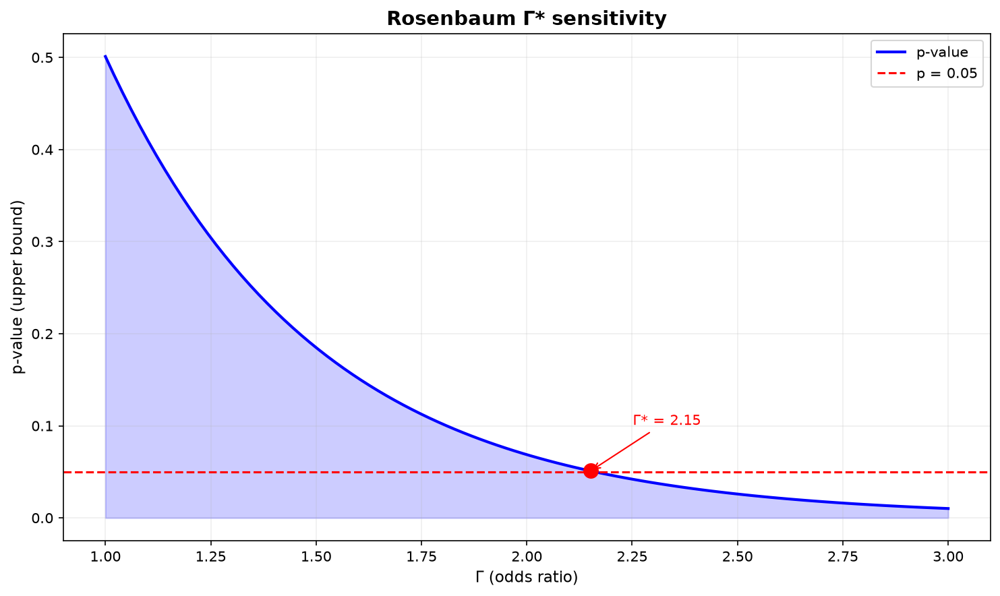
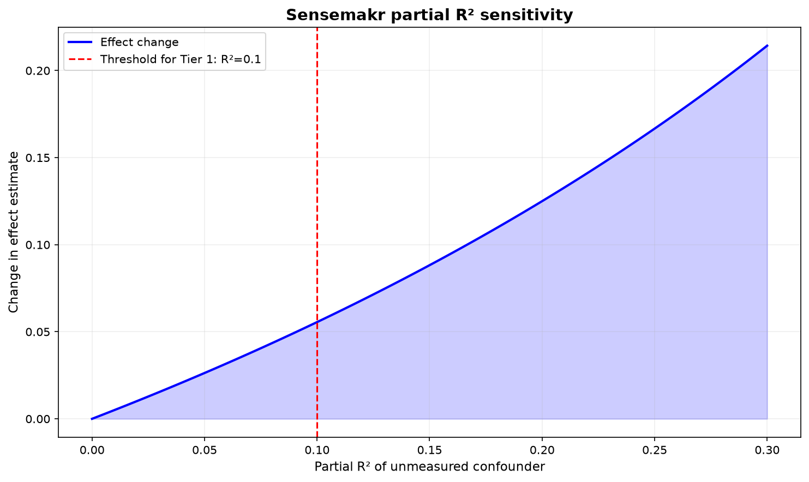

# 6. Causal inference и DAG: отделение сигнала от причинности

> **О чём этот блок простыми словами.**
> К этому моменту мы умеем превращать кошелёк в вектор (embedding) и искать похожие кошельки. Но «похожий» не значит «связанный». Крупная биржа похожа на отмывочный сервис просто потому, что через неё проходит очень много транзакций, среди которых есть и «плохие». Если реагировать только на похожесть, мы будем массово ошибаться.
> Этот блок отвечает на вопрос: **как отличить настоящую связь (причинную) от случайной (корреляционной)?** Инструмент — causal DAG (граф причин), а затем проверка его устойчивости (sensitivity analysis).

### Термины

| Термин | Определение |
|--------|-------------|
| Causal inference | Область статистики, изучающая причинно-следственные связи, а не только корреляции |
| Causal DAG | Directed Acyclic Graph: направленный ациклический граф, где вершины — переменные, рёбра — причинные влияния |
| Confounder | Переменная, влияющая и на причину, и на следствие, создающая ложную корреляцию |
| Collider | Переменная, на которую влияют две другие; при conditioning на неё может возникнуть ложная связь |
| Conditional independence | Условие, при котором две переменные независимы при фиксации третьей |
| Markov equivalence class | Множество DAG, кодирующих одинаковые условные независимости |
| E-value | Минимальная сила связи с unmeasured confounder, необходимая для объяснения наблюдаемого эффекта |
| Rosenbaum Γ* | Отношение шансов, при котором наблюдаемый эффект становится незначимым |
| Sensemakr | Метод оценки чувствительности к unmeasured confounding через partial R² |
| Spurious correlation | Корреляция, не отражающая причинной связи |

---

## 6.1. Постановка задачи

> **Простыми словами.** Мы ищем «плохие» кошельки по близости к известным «плохим» адресам (anchor'ам). Но близость в векторном пространстве — это как близость по «внешнему виду», а не по «родству». Два человека могут быть похожи, потому что оба носят форму, но это не значит, что они родственники. «Носить форму» здесь и есть **confounder** (смешивающий фактор).

В предыдущих блоках было показано, как получить embedding кошелька через контрастивное обучение и как объединить адреса в кластеры через entity resolution. Retrieval находит top-K ближайших anchors в embedding space, и расстояние до них используется как сигнал риска.

Однако здесь возникает фундаментальная проблема. **Расстояние в embedding space — это корреляция, а не причинность.** Если кошелёк A близок к OFAC-адресу в embedding space, это не означает, что A связан с OFAC причинно. Близость может объясняться **confounder'ом** — переменной, которая влияет и на A, и на OFAC-адрес, создавая ложную связь.

**Пример.** Кошелёк A — exchange hot wallet. Через него проходят транзакции тысяч пользователей, включая OFAC-адрес. В embedding space A оказывается близок к OFAC, потому что оба имеют высокую степень и взаимодействуют с похожими контрагентами. Но A — не illicit; он просто **обслуживает** illicit-транзакции наряду с миллионами легитимных.

Если использовать расстояние без фильтрации, exchange hot wallets будут массово помечаться как высокорисковые. Это **spurious correlation**: близость объясняется confounder'ом (роль exchange), а не прямой причинной связью.

**Causal inference** решает эту проблему: causal DAG формализует, какие переменные являются confounder'ами, и позволяет фильтровать spurious-связи до того, как они попадут в GBDT.

> **Что дальше.** Мы сначала нарисуем граф причин (DAG), затем проверим его на данных, затем применим как фильтр к retrieval, и наконец оценим, насколько выводы устойчивы к тому, чего мы не видим (latent confounders).

---

## 6.2. Causal DAG: структура и построение

### 6.2.1. Что такое DAG

> **Простыми словами.** DAG — это схема «кто на кого влияет», нарисованная стрелками. Стрелка от A к B означает «A влияет на B». Слово «ациклический» значит, что нельзя, идя по стрелкам, вернуться в исходную точку (нет порочного круга).

**Causal DAG** — это направленный ациклический граф, где:

- **Вершины** — переменные (признаки, классы, исходы).
- **Рёбра** — причинные влияния: ребро \(X \to Y\) означает «X причинно влияет на Y».
- **Ацикличность** — отсутствие циклов: нельзя вернуться в ту же вершину по направленным рёбрам.

DAG кодирует **условные независимости**: если две вершины не связаны путём, они независимы при фиксации их общих предков.

> **Как это читать на практике.** Если между двумя переменными нет стрелки и нет общего «предка», то изменение одной не должно менять другую. Это и есть проверяемое утверждение: любую такую «независимость» можно проверить на данных (см. §6.3).

### 6.2.2. Классы вершин в Spillety

> **Простыми словами.** Мы строим граф не для каждого отдельного кошелька (их слишком много и они слишком разные), а для **классов** кошельков — «биржа», «миксер», «мост». У классов связи предсказуемы, и эксперты могут их проверить.

DAG в Spillety строится на **уровне классов**, а не отдельных кошельков. Это сделано потому, что:

- Отдельные кошельки слишком разнородны для построения стабильного DAG.
- Классы (Exchange_Hot, Mixer, Bridge и т.д.) имеют предсказуемые причинные связи.
- DAG на классах верифицируется экспертами и тестируется на данных.

**Вершины DAG:**

| Вершина | Тип | Описание |
|---------|-----|----------|
| Addr_Class | Класс адреса | Подклассы: Exchange_Hot_CEX_US, Exchange_Hot_DEX_EU, Mixer_Tornado, Mixer_Privacy, Bridge_CrossChain, MEV_Bot, DeFi_Pool, EOA, Unknown |
| Tx_Flow | Признак | Направление и объём потока транзакций |
| Tx_Frequency | Признак | Частота транзакций |
| Age | Признак | Возраст кошелька |
| KYC_Status | Признак | Статус KYC (где доступно) |

**Confounders (observed):**

> **Простыми словами.** Это «смешивающие» факторы, которые мы **видим** и можем измерить. Они создают ложные связи, и их нужно «выключить» (condition), чтобы увидеть настоящий эффект.

| Confounder | Что объясняет |
|------------|---------------|
| Exchange_Hot | Близость к anchors через обслуживание транзакций |
| Mixer_Proximity | Близость через участие в mixing-протоколах |
| Bridge_Usage | Близость через cross-chain операции |
| MEV_Activity | Близость через MEV-ботов |

**Latent confounders (unobserved):**

> **Простыми словами.** Это факторы, которые мы **не видим**: реальная личность владельца, его намерение, юрисдикция контрагента. Их нельзя учесть напрямую — но можно оценить, насколько сильно они способны перевернуть наш вывод (см. §6.5).

| Confounder | Почему не наблюдается |
|------------|----------------------|
| Owner | Реальная личность владельца неизвестна |
| Intent | Намерение (легитимное или illicit) неизвестно |
| Counterparty_Jurisdiction | Юрисдикция контрагента не всегда доступна |

Latent confounders не могут быть включены в DAG напрямую, но их влияние оценивается через **sensitivity analysis** (см. §6.5).

### 6.2.3. Пример DAG

**Как читать DAG:**

- Стрелка \(X \to Y\) означает «X причинно влияет на Y».
- Exchange_Hot влияет на Tx_Flow и Tx_Frequency, но не на Risk напрямую. Это **confounder**: он создаёт корреляцию между Tx_Flow и Risk, не являясь причиной Risk.
- Addr_Class влияет и на Tx_Flow, и на Risk. Это тоже confounder, но его влияние на Risk — прямое.
- Owner, Intent, Counterparty_Jurisdiction — latent confounders: они влияют на Addr_Class, но не наблюдаются.

**Ключевое:** если мы хотим оценить причинное влияние Tx_Flow на Risk, мы должны **condition на Exchange_Hot**. Иначе корреляция между Tx_Flow и Risk будет частично объясняться Exchange_Hot, а не прямым влиянием.

> **Аналогия для «condition».** Представьте, что мы сравниваем заболеваемость среди тех, что пьёт кофе и не пьёт кофе. Оказывается, пьющие кофе чаще курят. Чтобы понять настоящий эффект кофе, нужно сравнивать пьющих и непьющих **внутри группы курящих** и **внутри группы некурящих** отдельно. «Зафиксировать курение» = condition на confounder. То же самое здесь: зафиксировав роль Exchange_Hot, мы видим «чистый» эффект потока.

---

## 6.3. Валидация DAG

> **Простыми словами.** DAG — это гипотеза, которую придумали эксперты. Гипотезу нужно проверить на реальных данных: если данные говорят «эти две вещи связаны», а DAG говорит «нет» — DAG нужно пересмотреть.

DAG — это **экспертный prior**, а не истина. Он должен быть проверен на данных. Валидация состоит из четырёх этапов.

### 6.3.1. Implied conditional independence tests

DAG кодирует **условные независимости**: если две вершины не связаны путём, они должны быть независимы при фиксации их общих предков.

> **Простыми словами.** DAG утверждает список «пар, которые не связаны». Мы каждую такую пару проверяем статистическим тестом. Если тест говорит «связаны» — гипотеза неверна.

**Процедура:**

1. Для каждой пары вершин, которые DAG объявляет независимыми при данном conditioning set, выполнить тест на условную независимость.
2. Если тест отвергает независимость (p-value < 0.05), DAG не согласуется с данными.

**Методы тестирования:**

- **Partial correlation:** для линейных связей.
- **Conditional mutual information:** для нелинейных связей.
- **Bootstrap CI:** для оценки устойчивости p-value.

**Проблема:** с ростом числа вершин число тестов растёт экспоненциально. Для DAG с 20 вершинами — 190 пар, каждая с несколькими conditioning sets. Решение: фокус на **локальных** тестах (родители и дети каждой вершины), а не на всех парах.

### 6.3.2. Falsification tests на конкретных парах

> **Простыми словами.** Это «точечные» проверки самых важных утверждений. Например, DAG говорит «Exchange_Hot не влияет на Risk напрямую». Мы строим регрессию и смотрим: если коэффициент при Exchange_Hot значим, значит DAG ошибается.

Помимо общих CI-тестов, выполняются **falsification tests** на конкретных парах, где DAG предсказывает отсутствие связи.

**Пример:** DAG утверждает, что Exchange_Hot не влияет на Risk напрямую. Falsification test: построить регрессию Risk ~ Exchange_Hot + Tx_Flow + Tx_Frequency. Если коэффициент при Exchange_Hot значим, DAG неверен.

**Как проверяем:** t-test на коэффициент, p-value < 0.05 → DAG пересматривается.

### 6.3.3. Sensitivity к альтернативным DAG

> **Простыми словами.** Одни и те же данные часто совместимы с несколькими разными графами (это называется Markov equivalence class). Если разные графы дают разный ответ — значит, данных не хватает, чтобы выбрать правильный граф.

DAG определён неоднозначно: существует **Markov equivalence class** — множество DAG, кодирующих одинаковые условные независимости. Если два DAG в одном классе эквивалентности дают разные оценки эффекта, DAG недостаточно идентифицирован.

**Процедура:**

1. Построить Markov equivalence class через PC-algorithm или GES.
2. Для каждого DAG в классе оценить причинный эффект.
3. Если оценки значимо различаются, DAG требует дополнительных предположений.

**Как проверяем:** сравнение оценок через bootstrap CI; если CI перекрываются, DAG устойчив.

### 6.3.4. Power analysis

> **Простыми словами.** Если у нас мало данных о каком-то редком классе (например, Mixer_Tornado), тест может не заметить связь просто потому, что наблюдений мало. Тогда вывод «связи нет» будет ненадёжным.

CI-тесты требуют достаточного числа наблюдений. Для подклассов (например, Mixer_Tornado) число наблюдений может быть малым.

**Power analysis:** определить минимальное число наблюдений \(n_{\min}\) для достижения мощности 0.8 при заданном effect size. Если \(n < n_{\min}\), тест не выполняется, и подкласс помечается как «недостаточно данных».

---

## 6.4. Causal filter: применение DAG к retrieval

### 6.4.1. Проблема spurious neighbors

> **Простыми словами.** Retrieval возвращает «похожих соседей». Среди них есть и настоящие родственники, и «коллеги по форме». Нужно оставить только первых.

Retrieval возвращает top-K anchors, ближайших к кошельку в embedding space. Некоторые из этих anchors близки **не причинно**, а из-за confounder'а.

**Пример:** кошелёк A — exchange hot wallet. Retrieval возвращает OFAC-адрес как ближайший anchor, потому что A и OFAC оба имеют высокую степень и взаимодействуют с похожими контрагентами. Это spurious neighbor.

### 6.4.2. Алгоритм фильтрации

**Шаг 1.** Для каждого anchor в top-K проверить, существует ли causal path от wallet к anchor в DAG.

**Шаг 2.** Если path проходит через confounder (например, Exchange_Hot), который объясняет близость — исключить anchor.

**Шаг 3.** Формально: anchor исключается, если

\[
P(\text{anchor} | \text{wallet}, \text{confounder}) \approx P(\text{anchor} | \text{confounder})
\]

т.е. близость объясняется confounder'ом, а не прямым влиянием wallet.

> **Простыми словами.** Формула говорит: «знание о кошельке ничего не добавляет к знанию о confounder'е». Значит, вся близость объясняется confounder'ом — сосед лишний.

**Шаг 4.** Оставить только anchors с прямым causal path (без confounder'ов).

### 6.4.3. Пример работы

В этом примере:

- OFAC-адрес исключается: близость объясняется Exchange_Hot, а не прямым влиянием wallet.
- Mixer-адрес остаётся: causal path не проходит через confounder.

### 6.4.4. Оценка качества фильтрации

**Метрика:** доля anchors, прошедших фильтр (causal_filter_pass_rate). Низкое значение означает, что большинство близких anchors — spurious. Высокое значение означает, что retrieval находит причинно-связанные anchors.

**Как получаем порог:** PR-curve на retrieval task; operating point — по cost-функции.

---

## 6.5. Sensitivity analysis: оценка устойчивости

> **Простыми словами.** Мы не видим часть важных факторов (Owner, Intent, Jurisdiction). Sensitivity analysis задаёт вопрос: «насколько сильным должен быть этот невидимый фактор, чтобы полностью объяснить наш вывод?» Если нужен абсурдно сильный фактор — выводу можно доверять. Если достаточно слабого — нет.

### 6.5.1. E-value

**E-value** — минимальная сила связи с unmeasured confounder, необходимая для объяснения наблюдаемого эффекта.

**Формально:** для risk ratio \(RR\):

\[
\text{E-value} = RR + \sqrt{RR \cdot (RR - 1)}
\]

**Интерпретация:** если E-value = 2.3, то unmeasured confounder должен иметь risk ratio ≥ 2.3 с обоими переменными (причина и следствие), чтобы объяснить наблюдаемый эффект. Если такой confounder маловероятен, эффект устойчив.

> **Простыми словами.** Чем больше E-value, тем «крепче» вывод: чтобы его опровергнуть, нужен очень мощный скрытый фактор.

**Применение в Spillety:** для каждого алерта вычисляется E-value. Если E-value низкий, алерт помечается как «чувствительный к unmeasured confounding» и требует human review.

### 6.5.2. Rosenbaum Γ*

**Rosenbaum Γ*** — отношение шансов, при котором наблюдаемый эффект становится незначимым.

**Формально:** для наблюдаемого эффекта \(\hat{\tau}\) и его стандартной ошибки \(SE\), Γ* — минимальное значение \(\Gamma\) такое, что upper bound на p-value превышает 0.05 при допущении, что unmeasured confounder увеличивает odds of treatment в \(\Gamma\) раз.

**Интерпретация:** если Γ* = 2.1, то unmeasured confounder должен увеличивать odds of treatment в 2.1 раза, чтобы объяснить эффект. Если такой confounder маловероятен, эффект устойчив.

**Overt bias reconciliation:** Rosenbaum Γ* учитывает только **скрытый** bias. Если есть **явный** bias (например, selection bias), он корректируется отдельно через overt bias reconciliation.

### 6.5.3. Sensemakr partial R²

> **Простыми словами.** Здесь мы измеряем, какую **долю разброса** объясняет невидимый фактор. Чем больше доля нужна, чтобы перевернуть вывод, тем надёжнее вывод.

**Sensemakr** — метод оценки чувствительности через partial R². Для регрессии \(Y \sim X + Z\), partial R² unmeasured confounder \(U\) — это доля дисперсии \(Y\), объяснённая \(U\) после контроля \(X\) и \(Z\).

**Интерпретация:** если partial R² = 0.15, то unmeasured confounder должен объяснять 15% остаточной дисперсии, чтобы объяснить эффект.

**Применение в Spillety:** sensemakr partial R² вычисляется для Hawkes-компонента (временные признаки), где unmeasured confounding наиболее вероятен.

### 6.5.4. Пороги для Tier 1

Для auto-block (Tier 1) устанавливаются пороги:

| Метрика | Порог | Обоснование |
|---------|-------|-------------|
| E-value | > 2.0 | Эффект устойчив к умеренному confounding |
| Rosenbaum Γ* | > 1.5 | Эффект устойчив к умеренному скрытому bias |
| Sensemakr partial R² | > 0.10 | Unmeasured confounder должен объяснять значительную долю дисперсии |

**Как получаем пороги:** эмпирически на исторических данных; пороги соответствуют квантилям, при которых precision на hold-out максимальна.

---

## 6.6. Визуализация

> Код для генерации всех графиков этого раздела вынесен в отдельный файл [`files/6_visualization.py`](./files/6_visualization.py). Ниже — только сами картинки и их смысл.

### 6.6.1. DAG

Пунктирные вершины — latent confounders (не наблюдаются). Сплошные — observed.

### 6.6.2. Графики чувствительности

**E-value sensitivity:** Зависимость E-value от risk ratio. Красная линия — порог для Tier 1. Точка пересечения — минимальный RR, при котором эффект устойчив.

**Rosenbaum Γ*:** Зависимость p-value от Γ. Красная линия — p = 0.05. Точка пересечения — Γ*, при котором эффект становится незначимым.

**Sensemakr partial R²:** Зависимость изменения эффекта от partial R² unmeasured confounder. Красная линия — порог для Tier 1.

---

## 6.7. Ограничения

1. **DAG — экспертный prior:** DAG строится на основе экспертных знаний, а не данных. Если эксперты ошибаются, DAG неверен, и causal filter пропускает spurious-связи.

2. **Markov equivalence:** DAG определён неоднозначно. Альтернативные DAG в одном классе эквивалентности могут давать разные оценки эффекта.

3. **Latent confounders:** Owner, Intent, Counterparty_Jurisdiction не наблюдаются. Их влияние оценивается только через sensitivity analysis, а не корректируется напрямую.

4. **Power analysis:** CI-тесты требуют достаточного числа наблюдений. Для редких подклассов (Mixer_Tornado) данных может не хватать.

5. **Вычислительная сложность:** Полный CI-тест для всех пар вершин экспоненциален. Решение — фокус на локальных тестах, но это компромисс между полнотой и вычислимостью.

6. **Temporal drift:** Причинная структура может меняться при появлении новых протоколов (ZK-mixers, cross-chain bridges). DAG требует периодического пересмотра.

---

**Главная мысль:** Causal DAG формализует confounder'ы и позволяет фильтровать spurious-связи до того, как они попадут в GBDT. Sensitivity analysis (E-value, Rosenbaum Γ*, sensemakr) оценивает устойчивость эффекта к latent confounders.

| Компонент | Роль | Результат |
|-----------|------|-----------|
| Causal DAG | Формализация confounder'ов | Структура для фильтрации |
| CI-тесты | Валидация DAG на данных | p-values, устойчивость |
| Falsification tests | Проверка конкретных пар | Отвержение неверных рёбер |
| Markov equivalence | Проверка идентифицируемости | Сравнение альтернативных DAG |
| Causal filter | Исключение spurious neighbors | Чистый набор anchors |
| E-value | Оценка устойчивости к unmeasured confounding | Порог для Tier 1 |
| Rosenbaum Γ* | Оценка устойчивости к скрытому bias | Порог для Tier 1 |
| Sensemakr partial R² | Оценка чувствительности Hawkes-компонента | Порог для Tier 1 |

**Практический вывод:**
- Distance в embedding space — корреляция, а не причинность.
- Causal DAG формализует confounder'ы (Exchange_Hot, Mixer_Proximity, Bridge_Usage, MEV_Activity).
- Causal filter исключает spurious neighbors, близость которых объясняется confounder'ом.
- Latent confounders (Owner, Intent, Counterparty_Jurisdiction) оцениваются через sensitivity analysis.
- E-value, Rosenbaum Γ*, sensemakr partial R² — три метрики устойчивости.
- Пороги для Tier 1 определяются эмпирически на исторических данных.
- DAG — экспертный prior, требующий периодического пересмотра.
