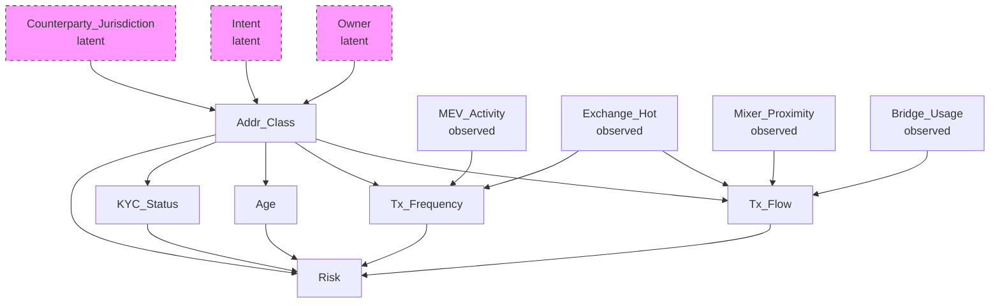
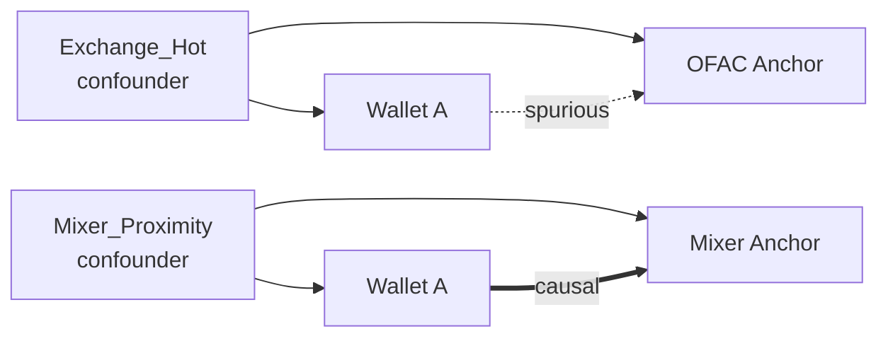

# 6. Causal inference и DAG: отделение корреляционной близости от причинной связи

Retrieval из главы 3 возвращает ближайших якорей, и расстояние до них становится сигналом риска. Но близость в embedding-пространстве — мера корреляционная, и в этом её предел: близкие кошельки не обязательно причинно связаны — сходство может производить общая причина. Инструмент для разделения — причинный вывод (causal inference) с представлением структуры в виде направленного ациклического графа (causal DAG) и оценкой устойчивости выводов к ненаблюдаемому смешению (sensitivity analysis). Разберём постановку, построение и валидацию DAG, фильтр ложных соседей и количественные меры чувствительности.

**Словарь, к которому будем возвращаться.** 
| Термин | Определение |
| ------ | ----------- | 
| *Confounder* | общая причина рассматриваемых причины и следствия; без кондиционирования порождает ложную корреляцию. |
| *Collider* | общее следствие двух переменных; кондиционирование на нём, наоборот, индуцирует ложную зависимость. | 
| *Spurious correlation* | корреляция от общей причины или структуры отбора, а не от прямого влияния. |
|*E-value*, *Rosenbaum Γ\** и *sensemakr partial R²* | три меры того, сколь сильным должно быть ненаблюдаемое смешение, чтобы обнулить наблюдаемый эффект (их определения — в 6.5, где им место). |

## 6.1. Постановка задачи

Фундаментальное ограничение retrieval-сигнала в том, что близость объекта $A$ к OFAC-адресу не имплицирует причинную связь: наблюдаемая близость может целиком объясняться конфаундером.

> Горячий кошелёк централизованной биржи (Exchange_Hot) обслуживает транзакции множества пользователей, включая санкционные адреса. В embedding-пространстве он коллоцируется с OFAC-адресом — но из-за сходных графовых характеристик (высокая степень, пересечение контрагентов), а не потому, что причинно порождает санкционный риск. Без коррекции эта конфигурация — чистая spurious correlation. Причинная фильтрация должна стоять до подачи retrieval-сигналов в модель решений (GBDT, раздел 7); она же поставляет в GBDT собственные признаки качества — causal_filter_pass_rate, E-value и производные.

## 6.2. Causal DAG: структура и построение

### 6.2.1. Определение

**Causal DAG** — ориентированный ациклический граф $G = (V, E)$: вершины — случайные переменные (признаки, классы адресов, исходы), ребро $X \to Y$ — прямое причинное влияние, ацикличность исключает самоциклы. DAG кодирует условные независимости через критерий d-разделения: отсутствие открытого пути между вершинами при заданном множестве кондиционирования означает их условную независимость. Отсюда фальсифицируемость: утверждение об отсутствии ребра $X \to Y$ эквивалентно гипотезе $X \perp\!\!\!\perp Y \mid \mathrm{Pa}(X,Y)$, проверяемой статистически.

### 6.2.2. Вершины на уровне классов

DAG специфицируется по **классам адресов**, а не по отдельным кошелькам, и на то три причины: индивидуальная гетерогенность не даёт стабильной идентификации; классы имеют воспроизводимые причинные механизмы; классовая спецификация допускает и экспертную верификацию, и статистическую фальсификацию.

**Вершины:**

| Вершина | Тип | Описание |
|---------|-----|----------|
| Addr_Class | Класс адреса | Exchange_Hot_CEX_US, Exchange_Hot_DEX_EU, Mixer_Tornado, Mixer_Privacy, Bridge_CrossChain, MEV_Bot, DeFi_Pool, EOA, Unknown |
| Tx_Flow | Признак | Направление и объём потока транзакций |
| Tx_Frequency | Признак | Частота транзакций |
| Age | Признак | Возраст кошелька |
| KYC_Status | Признак | Статус KYC (где доступен) |

**Наблюдаемые конфаундеры:** Exchange_Hot (близость через механизм обслуживания транзакций), Mixer_Proximity (через участие в микшировании), Bridge_Usage (через cross-chain операции), MEV_Activity (через активность ботов).

**Латентные конфаундеры:** Owner (истинный владелец не установлен), Intent (легитимная или illicit интенция ненаблюдаема ex ante), Counterparty_Jurisdiction (юрисдикция известна неполно). В наблюдаемую спецификацию они не входят, но их воздействие параметризуется в sensitivity analysis.

### 6.2.3. Пример DAG

Пунктирные вершины — латентные конфаундеры, сплошные — наблюдаемые переменные. Обратите внимание на Exchange_Hot: он влияет на Tx_Flow и Tx_Frequency, но не на Risk напрямую — значит, классический конфаундер для связи Tx_Flow → Risk. Addr_Class влияет и на Tx_Flow, и на Risk — альтернативный путь смешения; Owner, Intent и юрисдикция — латентные источники вариации самого Addr_Class.

Оценка причинного влияния Tx_Flow на Risk требует кондиционирования на Exchange_Hot (и других наблюдаемых конфаундерах). Без него:

$$\mathrm{Assoc}(\text{Tx\_Flow}, \text{Risk}) = \text{causal effect} + \text{bias}(\text{Exchange\_Hot})$$

Кондиционирование изолирует вариацию Tx_Flow, не объяснённую общей причиной.

## 6.3. Валидация DAG

DAG — экспертный априорный граф, подлежащий эмпирической фальсификации. Валидация работает на четырёх уровнях.

### 6.3.1. Тесты условных независимостей

Каждое отсутствующее ребро — фальсифицируемое предсказание независимости $X \perp\!\!\!\perp Y \mid Z$. Методы: **partial correlation** для линейных зависимостей (при гауссовости), **conditional mutual information** для нелинейных без параметрических допущений, **bootstrap CI для p-value** (1000 репликаций) — независимость считается отвергнутой только при устойчивом выходе верхней границы CI за порог. Отвержение $H_0$ при $p < 0.05$ — рассогласование DAG с данными.

Число тестов растёт экспоненциально с $|V|$, поэтому применяется локальное тестирование — проверяются рёбра, инцидентные родителям и детям каждой вершины.

### 6.3.2. Falsification-тесты на конкретных парах

Для критических отсутствующих рёбер строятся направленные тесты. Если DAG постулирует отсутствие прямого ребра Exchange_Hot → Risk, оценивается регрессия:

$$\text{Risk} \sim \beta_0 + \beta_1 \cdot \text{Exchange\_Hot} + \beta_2 \cdot \text{Tx\_Flow} + \beta_3 \cdot \text{Tx\_Frequency} + \varepsilon$$

и проверяется $H_0: \beta_1 = 0$ (t-тест, bootstrap CI). Значимый $\hat{\beta}_1$ фальсифицирует соответствующую d-разделённость — повод пересмотреть граф.

### 6.3.3. Markov equivalence class

Структура идентифицируется неединственным образом: существует класс эквивалентности DAG, порождающих одинаковые условные независимости и неразличимых по наблюдаемому распределению. Процедура честности: построить класс (алгоритмом PC/GES или экспертной энумерацией — в Spillety заданы пять кандидатов DAG-A…DAG-E, различающихся ориентацией спорных рёбер), оценить эффект для каждого DAG, сопоставить оценки через bootstrap CI; перекрытие интервалов — устойчивость, расхождение — сигнал недостаточной идентифицируемости. Кандидат выбирается по минимальному числу нарушенных CI-тестов и проваленных фальсификаций при устойчивых p-value; при эквивалентности — более парсимоничная структура.

### 6.3.4. Power analysis

Тестам нужна мощность. Для редких подклассов (Mixer_Tornado) минимальный объём $n_{\min}$ под мощность $1-\beta = 0.8$ и $\alpha = 0.05$ может превышать доступное. Тогда тест не читается как подтверждение независимости: подкласс маркируется «недостаточно данных», а рёбра — как неверифицированные. Неотвержение $H_0$ на слабых данных неинформативно — это важно держать в голове при интерпретации «зелёных» тестов.

## 6.4. Causal filter: применение DAG к retrieval

### 6.4.1. Ложные соседи

Retrieval ранжирует по мере сходства представлений, а decision path требует ранжирования по причинной релевантности. Подмножество top-K якорей — ложные соседи: их близость произведена конфаундером. Пример из 6.1: Exchange_Hot-кошелёк и OFAC-адрес рядом из-за общей причины, а не из-за причинной связи.

### 6.4.2. Алгоритм фильтрации

Для каждого якоря $a$ из top-K:

**Шаг 1.** Проверить существование открытого причинного пути от кошелька $w$ к $a$, не блокируемого наблюдаемыми конфаундерами.

**Шаг 2.** Если единственный путь проходит через конфаундер $C$ (например, Exchange_Hot), объясняющий ковариацию представлений, якорь — кандидат на исключение.

**Шаг 3.** Критерий исключения — условная независимость:

$$
P(a \mid w, C) \approx P(a \mid C)
$$

При фиксированном $C$ знание о кошельке не меняет предсказательного распределения якоря: близость полностью объяснена общей причиной.

**Шаг 4.** Сохраняются только якоря с прямым причинным путём, не d-разделяемым наблюдаемыми конфаундерами.

### 6.4.3. Иллюстрация

OFAC-якорь исключается: $ \text{OFAC} \perp\!\!\!\perp \text{Wallet} \mid \text{Exchange\_Hot}$ не отвергается — близость признана ложной. Mixer-якорь сохраняется: путь не блокируется наблюдаемым конфаундером.

### 6.4.4. Качество фильтрации

Метрика — **causal_filter_pass_rate**: доля якорей, прошедших фильтр среди top-K. Низкое значение сигнализирует о преобладании ложных близостей; высокое — о причинной релевантности пространства представлений. Порог фильтра калибруется PR-кривой задачи retrieval с операционной точкой по cost-функции (раздел 8).

## 6.5. Sensitivity analysis: устойчивость к латентному смешению

При ненаблюдаемых конфаундерах (Owner, Intent, юрисдикция) точечная идентификация эффекта невозможна. Sensitivity analysis отвечает на другой, практически более честный вопрос: *какой силы должно быть ненаблюдаемое смешение, чтобы обнулить наблюдаемый эффект?* Чем большая сила требуется, тем устойчивее вывод. Три параметризации.

### 6.5.1. E-value

Для наблюдаемого risk ratio $RR$:

$$
\text{E-value} = RR + \sqrt{RR \cdot (RR - 1)}
$$

E-value — минимальная сила ассоциации ненаблюдаемого конфаундера одновременно с воздействием и исходом (в шкале risk ratio), необходимая, чтобы свести эффект к нулю при уже учтённых наблюдаемых ковариатах. При E-value $= 2.3$ конфаундер должен быть связан и с воздействием, и с исходом с $RR \geq 2.3$; если такой конфаундер априорно маловероятен — эффект устойчив. В Spillety E-value считается для каждого алерта; алерты с низким значением помечаются как чувствительные и уходят на human review.

**Порог Tier 1: 2.0 vs 2.5.** Порог $2.5$ — консервативнее (выше precision, ниже recall); $2.0$ — базовый. Выбор $2.0$ обоснован тем, что bootstrap CI для прироста precision при переходе к $2.5$ перекрывает нуль при значимом падении recall; $2.5$ резервируется за режимом повышенной строгости.

### 6.5.2. Rosenbaum Γ*

Где E-value говорит на языке risk ratio, Γ* говорит на языке скрытого смещения отбора. Модель допускает, что ненаблюдаемый конфаундер увеличивает odds получения воздействия в $\Gamma$ раз между единицами с идентичными наблюдаемыми ковариатами. **Rosenbaum Γ\*** — минимальное $\Gamma$, при котором верхняя граница p-value превышает $\alpha = 0.05$. При $\Gamma^* = 2.1$ смещение должно искажать odds воздействия более чем вдвое, чтобы аннулировать значимость; порог Tier 1 — $\Gamma^* > 1.5$. Ограничение метода: Γ* параметризует только скрытое смещение, явное (overt bias) корректируется отдельно.

### 6.5.3. Sensemakr partial R²

Третья параметризация — через дисперсии. В регрессии $Y \sim X + Z + U$ с ненаблюдаемым $U$:

$$R^2_{Y \sim U \mid X,Z} = \frac{\mathrm{Var}(Y \mid X,Z) - \mathrm{Var}(Y \mid X,Z,U)}{\mathrm{Var}(Y \mid X,Z)}$$

— доля остаточной дисперсии исхода, которую конфаундер должен объяснять после учёта наблюдаемых ковариат (аналогично $R^2_{X \sim U \mid Z}$ для воздействия), чтобы свести эффект к нулю. Порог Tier 1 — $> 0.10$: конфаундер обязан объяснять существенную долю вариации. Partial $R^2 = 0.15$ означает ровно это — 15%.

### 6.5.4. Пороги Tier 1

| Метрика | Базовый порог | Альтернатива |
|---------|---------------|--------------|
| E-value | $> 2.0$ | $> 2.5$ (консервативный режим) |
| Rosenbaum Γ* | $> 1.5$ | — |
| Sensemakr partial R² | $> 0.10$ | — |

Пороги калибруются на исторических данных как квантили, максимизирующие precision на hold-out при контроле recall. Содержательно три меры отвечают на один вопрос с трёх сторон — эффект-размер, смещение отбора, доля объяснённой дисперсии — и потому применяются вместе, а не по выбору.

## 6.6. Визуализация

Код генерации графиков: [`files/6_visualization.py`](./files/6_visualization.py). Схема DAG — выше, в 6.2.3; здесь — графики чувствительности.

Зависимость E-value от risk ratio; горизонтальная линия — порог Tier 1 ($2.0$, пунктиром $2.5$); пересечение задаёт минимальный $RR$, при котором эффект признаётся устойчивым.

Верхняя граница p-value в зависимости от $\Gamma$; линия $p=0.05$; абсцисса пересечения — $\Gamma^*$.

Контурная диаграмма скорректированной оценки эффекта в координатах $(R^2_{Y\sim U\mid X,Z}, R^2_{X\sim U\mid Z})$; изолиния нулевого эффекта и порог Tier 1 ($R^2 = 0.10$) очерчивают область устойчивости.

## 6.7. Ограничения

1. **Экспертная природа DAG.** Ошибка спецификации транслируется в пропуск ложных связей и смещение последующих оценок.
2. **Markov-эквивалентность.** Выбор среди DAG-A…DAG-E снижает, но не устраняет неопределённость причинной интерпретации.
3. **Латентное смешение.** Owner, Intent, юрисдикция ненаблюдаемы; доступна лишь параметризация устойчивости (E-value, Γ*, partial R²), не коррекция.
4. **Мощность.** Для редких подклассов неотвержение независимости неинформативно (см. 6.3.4).
5. **Вычислительная сложность.** Полная энумерация CI-тестов экспоненциальна; локальное тестирование — аппроксимация.
6. **Дрейф причинной структуры.** Новые протоколы (ZK-миксеры, мосты, приватные L2) меняют механизмы; DAG требует периодической респецификации.

---

## См. также

- [09_causal_filter.ipynb](../notebooks/09_causal_filter.ipynb) — применение causal DAG к retrieval и фильтрация ложных соседей.