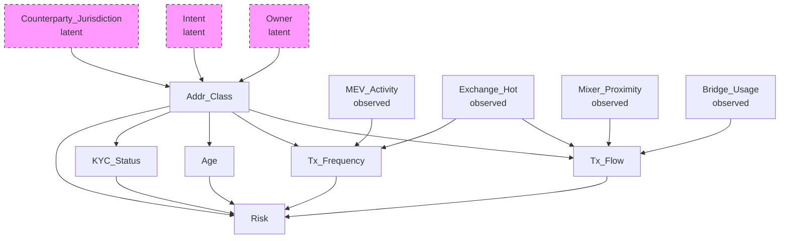
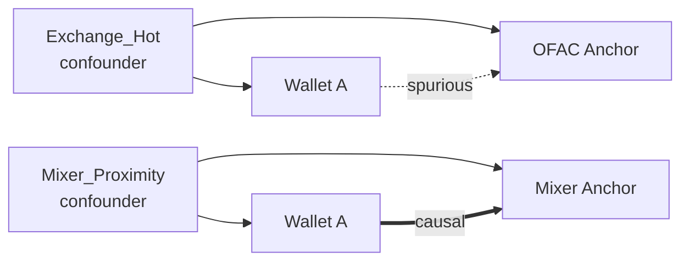
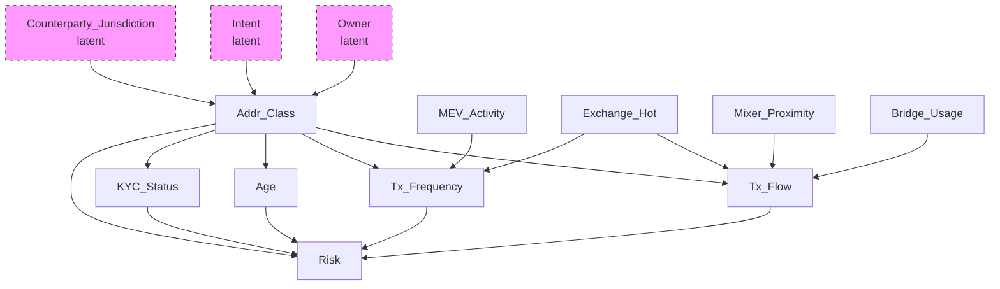

# 6. Causal inference и DAG: отделение корреляционной близости от причинной связи

Переход от меры сходства в embedding space к причинно-обоснованному критерию риска. Близкие в смысле метрического расстояния кошельки не эквивалентны причинно связанным: наблюдаемая близость может быть обусловлена общей причиной (confounder). Инструмент — причинный вывод (causal inference) с представлением структуры в виде направленного ациклического графа (causal DAG) и оценка устойчивости выводов к ненаблюдаемому смешению (sensitivity analysis).

### Термины

| Термин | Определение |
|--------|-------------|
| Causal inference | Раздел статистики, направленный на идентификацию и оценивание причинно-следственных эффектов при наличии наблюдаемых и ненаблюдаемых смешивающих факторов |
| Causal DAG | Directed Acyclic Graph — направленный ациклический граф, в котором вершины соответствуют случайным переменным, а направленные рёбра кодируют прямые причинные влияния |
| Confounder | Переменная, являющаяся общей причиной для рассматриваемых причины и следствия и порождающая ложную корреляцию при отсутствии кондиционирования |
| Collider | Переменная, являющаяся общим следствием двух и более переменных; кондиционирование на коллайдере индуцирует ложную зависимость между его причинами |
| Conditional independence | Свойство стохастической независимости двух переменных при фиксированном значении третьей (множества) переменных |
| Markov equivalence class | Класс эквивалентности DAG, порождающих идентичное множество условных независимостей и неразличимых по наблюдаемому распределению без дополнительных идентификационных допущений |
| E-value | Минимальная величина ассоциации ненаблюдаемого confounder'а с воздействием и исходом, необходимая для полного объяснения наблюдаемого эффекта при заданном risk ratio |
| Rosenbaum Γ* | Пороговое значение параметра чувствительности Γ, при котором верхняя граница p-value при модели скрытого смещения превышает уровень значимости 0.05 |
| Sensemakr | Метод анализа чувствительности, параметризующий влияние ненаблюдаемого смешения через partial R² в регрессионной постановке |
| Spurious correlation | Статистическая корреляция, обусловленная общей причиной или структурой отбора, не отражающая прямого причинного влияния |

---

## 6.1. Постановка задачи

Retrieval извлекает top-K ближайших anchors в embedding-пространстве; расстояние до anchors используется как сигнал риска.

Фундаментальное ограничение — корреляционная природа сигнала. Близость объекта $A$ к OFAC-адресу не имплицирует причинную связь. Наблюдаемая близость может объясняться наличием **confounder'а** — переменной, каузально влияющей как на представление $A$, так и на представление anchor'а.

**Пример.** Кошелёк $A$, функционирующий как горячий кошелёк централизованной биржи (Exchange_Hot), обслуживает транзакции множества пользователей, включая санкционированные адреса. В embedding-пространстве $A$ и OFAC-адрес коллоцируются вследствие сходных графовых характеристик (высокая степень вершины, пересечение множеств контрагентов), а не вследствие прямой причинной зависимости. Без коррекции данная конфигурация порождает spurious correlation.

Необходимость причинной фильтрации предшествует подаче retrieval-сигналов в модель принятия решений (GBDT).

Оценка: CI p-values, E-value, Rosenbaum Γ*, sensemakr R², Brier, ECE, PR-AUC, SHAP. В настоящем разделе релевантны прежде всего CI p-values, E-value, Rosenbaum Γ* и sensemakr R²; Brier, ECE, PR-AUC и SHAP раскрываются в разделе 7.

---

## 6.2. Causal DAG: структура и построение

### 6.2.1. Определение DAG

**Causal DAG** — ориентированный ациклический граф $G = (V, E)$, где:

- $V$ — множество вершин, соответствующих случайным переменным (признакам, классам адресов, исходам);
- $E \subseteq V \times V$ — множество направленных рёбер, ребро $X \to Y$ интерпретируется как прямое причинное влияние $X$ на $Y$;
- выполняется ацикличность: $\nexists$ направленного пути $X \to \dots \to X$.

DAG кодирует множество условных независимостей через критерий d-разделения (d-separation): отсутствие открытого пути между вершинами при заданном множестве кондиционирования имплицирует их условную независимость.

Утверждение об отсутствии ребра $X \to Y$ эквивалентно гипотезе об условной независимости $X \perp\!\!\!\perp Y \mid \mathrm{Pa}(X,Y)$, проверяемой статистически.

### 6.2.2. Классы вершин в Spillety

DAG специфицируется на уровне **классов адресов**, а не индивидуальных кошельков: (i) индивидуальная гетерогенность препятствует стабильной идентификации причинной структуры; (ii) классы обладают воспроизводимыми причинными механизмами; (iii) классовая спецификация допускает экспертную верификацию и статистическую фальсификацию.

**Вершины DAG:**

| Вершина | Тип | Описание |
|---------|-----|----------|
| Addr_Class | Класс адреса | Подклассы: Exchange_Hot_CEX_US, Exchange_Hot_DEX_EU, Mixer_Tornado, Mixer_Privacy, Bridge_CrossChain, MEV_Bot, DeFi_Pool, EOA, Unknown |
| Tx_Flow | Признак | Направление и объём потока транзакций |
| Tx_Frequency | Признак | Частота транзакций |
| Age | Признак | Возраст кошелька |
| KYC_Status | Признак | Статус KYC (где доступно) |

**Наблюдаемые confounders:**

| Confounder | Интерпретация смешения |
|------------|------------------------|
| Exchange_Hot | Индуцирует близость к anchors через механизм обслуживания транзакций |
| Mixer_Proximity | Индуцирует близость через участие в протоколах микширования |
| Bridge_Usage | Индуцирует близость через cross-chain операции |
| MEV_Activity | Индуцирует близость через активность MEV-ботов |

**Латентные confounders:**

| Confounder | Основание ненаблюдаемости |
|------------|---------------------------|
| Owner | Истинная идентичность владельца не установлена |
| Intent | Интенция (легитимная либо illicit) не наблюдаема ex ante |
| Counterparty_Jurisdiction | Юрисдикция контрагента доступна неполно |

Латентные confounders не включаются в наблюдаемую спецификацию DAG, но их воздействие параметризуется в sensitivity analysis.

### 6.2.3. Пример DAG

- Ребро $X \to Y$ кодирует прямое причинное влияние.
- Exchange_Hot влияет на Tx_Flow и Tx_Frequency, но не на Risk напрямую; следовательно, Exchange_Hot — классический confounder для связи Tx_Flow — Risk.
- Addr_Class влияет как на Tx_Flow, так и на Risk, образуя альтернативный путь смешения.
- Owner, Intent, Counterparty_Jurisdiction — латентные источники вариации Addr_Class.

Оценка причинного влияния Tx_Flow на Risk требует кондиционирования на Exchange_Hot (и иных наблюдаемых confounders). Без кондиционирования:

$$\mathrm{Assoc}(\text{Tx\_Flow}, \text{Risk}) = \text{causal effect} + \text{bias}(\text{Exchange\_Hot})$$

Кондиционирование изолирует вариацию Tx_Flow, не объясняемую общей причиной.

---

## 6.3. Валидация DAG

DAG рассматривается как экспертный априорный граф, подлежащий эмпирической фальсификации. Валидация включает четыре уровня.

### 6.3.1. Тесты подразумеваемых условных независимостей

DAG имплицирует множество условных независимостей вида $X \perp\!\!\!\perp Y \mid Z$. Для каждой имплицируемой независимости выполняется статистический тест. Отвержение $H_0$ о независимости при $p < 0.05$ свидетельствует о рассогласовании DAG с наблюдаемым распределением.

Каждое отсутствующее ребро в DAG порождает фальсифицируемое предсказание о независимости.

**Методы тестирования:**

- **Partial correlation** — для линейных зависимостей при допущении гауссовости.
- **Conditional mutual information** — для нелинейных зависимостей без параметрических допущений.
- **Bootstrap CI для p-value** — оценивание устойчивости вывода к выборочной вариабельности; доверительный интервал для p-value строится бутстрэпом (1000 репликаций), независимость считается отвергнутой только при устойчивом выходе верхней границы CI за порог значимости.

Масштабирование: число тестов растёт экспоненциально с $|V|$. Применяется стратегия локального тестирования — верификация рёбер, инцидентных родителям и детям каждой вершины.

### 6.3.2. Falsification-тесты на конкретных парах

Направленные falsification-тесты для критических отсутствующих рёбер.

**Пример.** DAG постулирует отсутствие прямого ребра Exchange_Hot $\to$ Risk. Фальсифицирующая спецификация:

$$\text{Risk} \sim \beta_0 + \beta_1 \cdot \text{Exchange\_Hot} + \beta_2 \cdot \text{Tx\_Flow} + \beta_3 \cdot \text{Tx\_Frequency} + \varepsilon$$

$H_0: \beta_1 = 0$. Статистическая значимость $\hat{\beta}_1$ (t-тест, $p < 0.05$, bootstrap CI) — основание для пересмотра DAG.

Значимость коэффициента при переменной, объявленной условно независимой от исхода, фальсифицирует соответствующую d-разделённость.

### 6.3.3. Чувствительность к альтернативным DAG и выбор из Markov equivalence class

Причинная структура идентифицируется неединственным образом: существует **Markov equivalence class** — множество DAG, кодирующих идентичное множество условных независимостей и неразличимых по наблюдаемому распределению.

Процедура:

1. Построение Markov equivalence class посредством алгоритмов каузального обнаружения (PC-algorithm, GES) либо экспертной энумерацией кандидатов.
2. Оценивание причинного эффекта для каждого DAG в классе.
3. Сопоставление оценок через bootstrap CI; перекрытие интервалов — устойчивость, расхождение — недостаточная идентифицируемость.

**Выбор DAG среди кандидатов DAG-A … DAG-E.** В Spillety специфицируются пять экспертных кандидатов, различающихся ориентацией спорных рёбер. Выбор по критерию фальсификации:

- Для каждого кандидата DAG-$k$ ($k \in \{A,B,C,D,E\}$) выполняется полный набор CI-тестов и falsification-тестов с bootstrap CI для p-values.
- Вычисляется доля нарушенных независимостей и число значимых falsification-рёбер.
- Выбирается DAG с минимальным числом отвержений при условии, что p-values устойчиво превышают порог по верхней границе bootstrap CI. При эквивалентности — предпочтение более парсимоничной структуре (минимальное число рёбер).

### 6.3.4. Power analysis

Тесты условной независимости требуют достаточного объёма выборки. Для редких подклассов (Mixer_Tornado) статистическая мощность может быть недостаточной для обнаружения зависимости умеренной величины.

Процедура: определение минимального объёма $n_{\min}$, обеспечивающего мощность $1-\beta = 0.8$ при заданном effect size и $\alpha = 0.05$. Если $n < n_{\min}$, тест не интерпретируется как подтверждение независимости; подкласс маркируется как «недостаточно данных», соответствующие рёбра помечаются как неверифицированные.

---

## 6.4. Causal filter: применение DAG к retrieval

### 6.4.1. Проблема ложных соседей (spurious neighbors)

Retrieval возвращает top-K anchors, минимизирующих расстояние в embedding-пространстве. Подмножество этих anchors — ложные соседи: их близость обусловлена confounder'ом, а не прямой причинной связью.

Retrieval ранжирует по мере сходства представлений, тогда как decision path требует ранжирования по мере причинной релевантности.

**Пример.** Exchange_Hot-кошелёк $A$ и OFAC-адрес коллоцируются вследствие общей причины (высокая транзакционная степень, пересечение контрагентов), а не вследствие того, что $A$ причинно порождает санкционный риск.

### 6.4.2. Алгоритм фильтрации

**Шаг 1.** Для каждого anchor $a$ в top-K проверить существование открытого причинного пути (causal path) от кошелька $w$ к $a$, не блокируемого наблюдаемыми confounders в DAG.

**Шаг 2.** Если единственный путь $w \text{ — } a$ проходит через confounder $C$ (например, Exchange_Hot), объясняющий ковариацию представлений, anchor исключается.

**Шаг 3.** Критерий исключения:

$$
P(a \mid w, C) \approx P(a \mid C)
$$

эквивалентно условной независимости $a \perp\!\!\!\perp w \mid C$.

При фиксированном значении confounder'а знание о кошельке не изменяет предсказательное распределение anchor'а; наблюдаемая близость полностью объясняется общей причиной.

**Шаг 4.** Сохраняются исключительно anchors, для которых существует прямой причинный путь, не d-разделяемый множеством наблюдаемых confounders.

### 6.4.3. Иллюстрация работы фильтра

- OFAC-anchor исключается: условная независимость $\text{OFAC} \perp\!\!\!\perp \text{Wallet} \mid \text{Exchange\_Hot}$ не отвергается, близость признается spurious.
- Mixer-anchor сохраняется: путь не блокируется наблюдаемым confounder'ом.

### 6.4.4. Оценка качества фильтрации

Метрика: **causal_filter_pass_rate** — доля anchors, прошедших фильтр среди top-K. Низкое значение — преобладание spurious-близостей; высокое — причинная релевантность пространства вложений после коррекции.

Пороговая калибровка: PR-кривая для задачи retrieval с varying порогом фильтра; операционная точка — минимизацией cost-функции (см. раздел 7).

---

## 6.5. Sensitivity analysis: оценка устойчивости к латентному смешению

При наличии ненаблюдаемых confounders (Owner, Intent, Counterparty_Jurisdiction) точечная идентификация причинного эффекта невозможна. Sensitivity analysis отвечает на вопрос: какой величины должно быть ненаблюдаемое смешение, чтобы полностью объяснить (аннулировать) наблюдаемый эффект. Чем большая величина требуется, тем более устойчив вывод.

### 6.5.1. E-value

Для наблюдаемого risk ratio $RR$:

$$
\text{E-value} = RR + \sqrt{RR \cdot (RR - 1)}
$$

E-value — минимальная сила ассоциации ненаблюдаемого confounder'а одновременно с воздействием и исходом (по шкале risk ratio), необходимая для сведения наблюдаемого эффекта к нулевому при условии, что измеренные ковариаты уже учтены.

При E-value $= 2.3$ ненаблюдаемый confounder должен быть ассоциирован как с воздействием, так и с исходом с $RR \geq 2.3$, чтобы объяснить наблюдаемую ассоциацию. Если существование confounder'а такой силы априорно маловероятно, эффект признаётся устойчивым.

В Spillety E-value вычисляется для каждого алерта; алерты с низким E-value маркируются как чувствительные к ненаблюдаемому смешению и направляются на human review.

**Выбор порога для Tier 1: 2.0 vs 2.5.**

- Порог $2.5$ — более консервативная селекция (выше precision, ниже recall).
- Порог $2.0$ — базовый; допускает умеренное смешение.
- Выбор $2.0$ обоснован тем, что bootstrap CI для прироста precision при переходе к $2.5$ перекрывает нуль при значимом падении recall; $2.5$ резервируется для режима повышенной строгости.

### 6.5.2. Rosenbaum Γ*

Для наблюдаемого эффекта $\hat{\tau}$ и его стандартной ошибки $SE$, Rosenbaum $\Gamma^*$ — минимальное значение параметра чувствительности $\Gamma$, при котором верхняя граница p-value в модели скрытого смещения превышает $\alpha = 0.05$. Модель допускает, что ненаблюдаемый confounder может увеличивать odds получения воздействия в $\Gamma$ раз между двумя единицами с идентичными наблюдаемыми ковариатами.

При $\Gamma^* = 2.1$ ненаблюдаемый confounder должен искажать odds ratio воздействия не менее чем в 2.1 раза, чтобы аннулировать статистическую значимость. Порог $\Gamma^* > 1.5$ для Tier 1 — устойчивость к умеренному скрытому смещению.

Rosenbaum $\Gamma^*$ параметризует исключительно скрытое смещение; явное смещение (overt bias) корректируется отдельно.

### 6.5.3. Sensemakr partial R²

Sensemakr формализует чувствительность через долю объяснённой дисперсии. В регрессионной постановке $Y \sim X + Z + U$, где $U$ — ненаблюдаемый confounder:

$$R^2_{Y \sim U \mid X,Z} = \frac{\mathrm{Var}(Y \mid X,Z) - \mathrm{Var}(Y \mid X,Z,U)}{\mathrm{Var}(Y \mid X,Z)}$$

— доля остаточной дисперсии исхода, объясняемая $U$ после учёта наблюдаемых ковариат. Аналогично определяется $R^2_{X \sim U \mid Z}$.

Partial $R^2 = 0.15$ означает, что ненаблюдаемый confounder должен объяснять 15% остаточной дисперсии исхода (и соответствующую долю дисперсии воздействия), чтобы свести эффект к нулю. Порог $> 0.10$ для Tier 1 требует, чтобы confounder объяснял существенную долю вариации.

### 6.5.4. Пороги для Tier 1

| Метрика | Порог (базовый) | Альтернативный порог |
|---------|-----------------|----------------------|
| E-value | $> 2.0$ | $> 2.5$ — консервативный режим |
| Rosenbaum Γ* | $> 1.5$ | — |
| Sensemakr partial R² | $> 0.10$ | — |

Пороги калибруются эмпирически на исторических данных как квантили, максимизирующие precision на hold-out при контроле recall.

---

## 6.6. Визуализация

Код генерации графиков: [`files/6_visualization.py`](./files/6_visualization.py).

### 6.6.1. DAG

Пунктирные вершины — латентные confounders; сплошные — наблюдаемые переменные.

### 6.6.2. Графики чувствительности

Зависимость E-value от risk ratio; горизонтальная линия — порог Tier 1 ($2.0$, пунктирно — $2.5$); точка пересечения определяет минимальный $RR$, при котором эффект признаётся устойчивым.

Зависимость верхней границы p-value от параметра $\Gamma$; горизонтальная линия $p=0.05$; абсцисса пересечения — $\Gamma^*$.

Контурная диаграмма изменения скорректированной оценки эффекта как функции $(R^2_{Y\sim U\mid X,Z}, R^2_{X\sim U\mid Z})$; изолиния нулевого эффекта и порог Tier 1 ($R^2 = 0.10$) разграничивают область устойчивости.

---

## 6.7. Ограничения

1. **Экспертная природа DAG.** Ошибочная спецификация экспертов транслируется в пропуск spurious-связей фильтром и смещение последующих оценок.
2. **Markov-эквивалентность.** Принадлежность к одному классу эквивалентности сохраняет множество условных независимостей, но допускает различные причинные интерпретации; выбор среди DAG-A…DAG-E по CI p-values и bootstrap CI снижает, но не элиминирует неопределённость.
3. **Латентное смешение.** Переменные Owner, Intent, Counterparty_Jurisdiction ненаблюдаемы; коррекция невозможна, доступна лишь параметризация устойчивости через E-value, Rosenbaum Γ* и sensemakr R².
4. **Статистическая мощность.** Для редких подклассов (Mixer_Tornado) объём выборки может не обеспечивать мощность $0.8$; неотвержение независимости в таких стратах неинформативно.
5. **Вычислительная сложность.** Полная энумерация тестов условной независимости экспоненциальна по $|V|$; ограничение локальными тестами является аппроксимацией.
6. **Темпоральный дрейф причинной структуры.** Появление новых протоколов (ZK-mixers, cross-chain bridges, приватные L2) изменяет причинные механизмы; DAG требует периодической респецификации.

---

## См. также

- [09_causal_filter.ipynb](../notebooks/09_causal_filter.ipynb) — применение causal DAG к retrieval и фильтрация ложных соседей.
