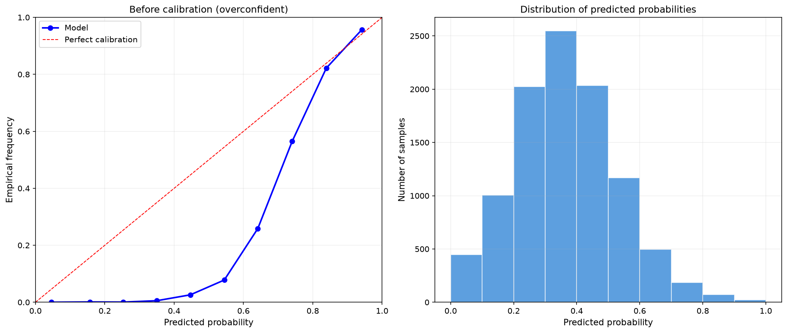
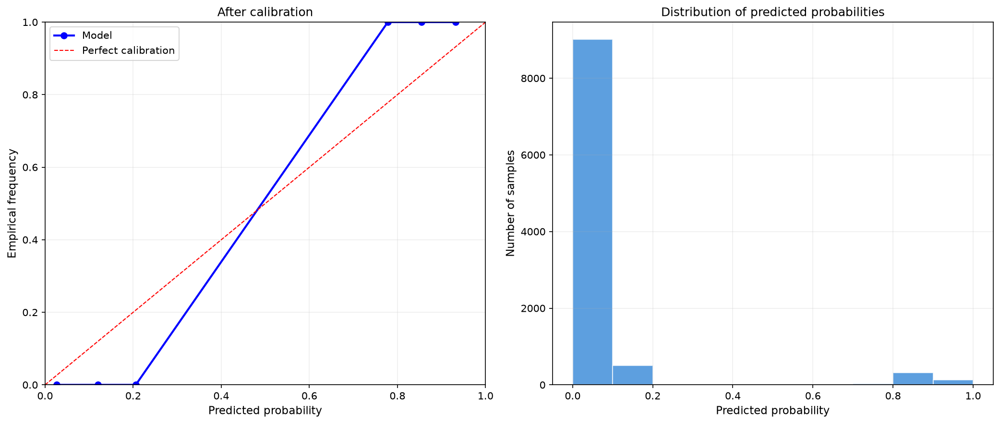
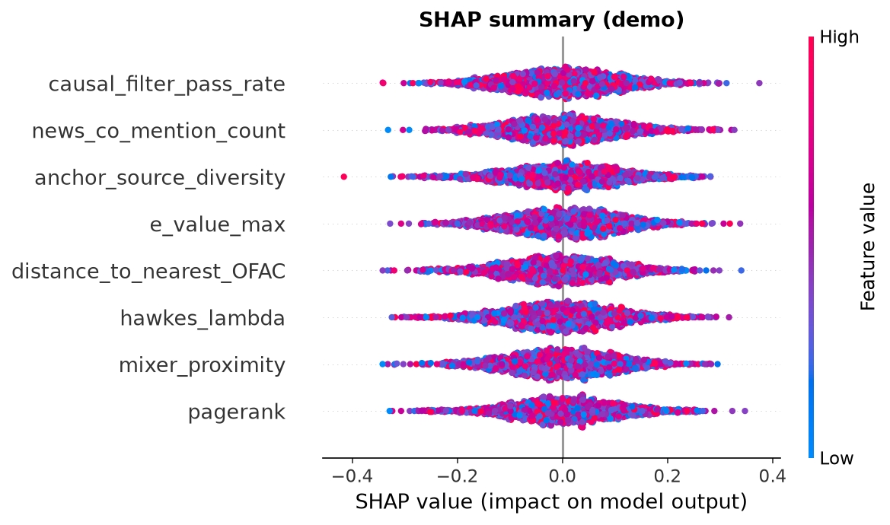

# 7. GBDT, калибровка и decision path

Финальный этап decision path — превратить retrieval-сигналы, прошедшие причинную фильтрацию, в калиброванную оценку риска $P(\text{illicit} \mid \text{window})$. В этой главе — почему для этого выбран градиентный бустинг над деревьями (GBDT) в реализации LightGBM, из чего состоит пространство признаков, как калибруются вероятности и как решение раскладывается на вклады признаков для человека, который будет его проверять.

## 7.1. Постановка задачи

К моменту decision path уже есть: векторные представления кошельков, кластеры сущностей и набор retrieval-сигналов (расстояния до top-K якорей, их типы, графовые и темпоральные признаки), прошедших причинный фильтр из главы 6. Требуется отображение

$$\Phi: \mathcal{X} \subseteq \mathbb{R}^d \to [0,1], \quad \Phi(x) = \hat{P}(\text{illicit} \mid x)$$

с четырьмя требованиями. Решение должно быть разложимым на вклады наблюдаемых признаков — верифицируемым регулятором и судом. Выход должен быть вероятностью в частотном смысле, а не порядковым скором. Инференс — на CPU, без GPU, с латентностью, совместимой с потоковой обработкой. И для каждого алерта нужен вектор вкладов признаков для human review и evidence-пакета (глава 10).

Этим требованиям отвечает GBDT. Глубокое обучение в decision path исключается — из-за непрозрачности и регуляторной квалификации генеративных моделей (SR 26-2); его место — этап представления (GraphSAGE-энкодер), где требования к объяснимости иные. Разделение ролей важное: GraphSAGE — функция представления $\mathcal{G} \to \mathbb{R}^d$; GBDT — функция решения $\mathbb{R}^d \to [0,1]$, и только вторая подлежит требованиям допустимости.

Механика бустинга прозрачна: $F_M(x) = \sum_{m=1}^{M} \nu \cdot h_m(x)$, где каждое $h_m$ — решающее дерево, аппроксимирующее отрицательный градиент функции потерь, а $\nu$ — learning rate. Последовательная коррекция ошибок предшествующих итераций допускает детерминированную трассировку пути решения — то, чего от непрозрачных сетей не добиться.

## 7.2. Почему GBDT, а не нейросеть

Обоснование сводится к четырём аргументам, каждый из которых проверяем.

Интерпретируемость: у GBDT есть SHAP-разложение, важности признаков и трассируемый путь по дереву; у глубоких сетей — непрозрачная параметризация, и регулятор квалифицирует это как недостаток, а не особенность. Калибруемость: выход бустинга честно дожимается изотонической или beta-калибровкой (7.5), тогда как для сетей нужны дополнительные процедуры, и гарантий тех же свойств нет. Ресурсы: CPU-инференс с низкой латентностью против зависимости от ускорителей. Малые выборки: при $p(\text{illicit})<0.05$ бустинг с контролируемой сложностью ($num\_leaves$, $min\_data\_in\_leaf$, регуляризация) ведёт себя предсказуемо, сети склонны к переобучению. Плюс организационный аргумент: GBDT — устоявшийся класс методов финансового моделирования, что упрощает регуляторное признание.

Из реализаций выбран **LightGBM**: гистограммное разбиение и leaf-wise рост дают высокую скорость и низкое потребление памяти при нативной поддержке категориальных признаков. Сравнение с XGBoost:

| Свойство | LightGBM | XGBoost |
|----------|----------|---------|
| Скорость обучения | Высокая (гистограммное разбиение) | Средняя |
| Потребление памяти | Низкое | Среднее |
| Стратегия роста | Leaf-wise (максимальный выигрыш) | Level-wise |
| Категориальные признаки | Нативная поддержка | Требует кодирования |
| CPU-инференс | Высокая производительность | Высокая производительность |

Leaf-wise рост на каждой итерации расщепляет лист с максимальным приростом — точнее при фиксированном числе листьев, но требовательнее к контролю сложности через $num\_leaves$ и $min\_data\_in\_leaf$.

## 7.3. Пространство признаков

GBDT обучается на табличных признаках, сконструированных из выходов retrieval. Итоговая размерность $d \approx 50$–$100$, уточняется по анализу важностей. Признаки естественным образом группируются в шесть семейств.

**Расстояния до якорей.** Основа — сами расстояния $d_1,\dots,d_K$ до top-K якорей в евклидовой или косинусной метрике; поверх них агрегаты: mean, min и квантили (центральная тенденция и хвост распределения близости) и std (дисперсия сигнала). Параметр $K$ подбирается по PR-кривой задачи retrieval с выбором по cost-функции.

**Типы якорей.** Частоты типов в top-K (`anchor_types_in_top_K`) дают типологическую структуру ближайших источников риска; `anchor_source_diversity` — число уникальных источников, широту ассоциаций; плюс три «точечных» расстояния — до ближайшего OFAC-адреса, до ближайшего миксера и до ближайшей биржи. Первое — прямая санкционная близость, второе — косвенная близость к механизмам сокрытия, третье — инфраструктурная.

**Графовые признаки.** PageRank (центральность и структурная важность), входящая и исходящая степени (активность), `velocity_24h` — число транзакций за сутки (интенсивность потока) и `counterparty_diversity` — доля уникальных контрагентов в транзакциях (розничный профиль против оптового).

**Темпоральные признаки.** Hawkes $\lambda$ (MLE точечного процесса, параметр самовозбуждения из главы 2), `time_since_last_tx` (рекуррентность), burstiness (кластеризация во времени) и `diurnal_pattern` — распределение активности по часам суток, из которого FFT или напрямую читается прокси геолокационной структуры.

**Контекстуальные признаки.** `news_co_mention_count` — публичная ассоциированность адреса; расстояния до кластеров бирж и миксеров (`exchange_proximity`, `mixer_proximity`); `bridge_usage` — интенсивность cross-chain активности.

**Признаки причинного контура.** Качество upstream-фильтрации превращено в признаки: `causal_filter_pass_rate` — доля якорей, прошедших причинный фильтр; `e_value_max` — максимальная устойчивость к ненаблюдаемому смешению среди top-K; `rosenbaum_gamma_min` — минимальная устойчивость к скрытому смещению; `sensemakr_r2_max` — максимум partial R².

## 7.4. Обучение

### 7.4.1. Гиперпараметры

| Параметр | Диапазон кандидатов | Роль |
|----------|---------------------|------|
| num_leaves | $\{31, 63, 127\}$ | Контроль сложности дерева |
| learning_rate | $0.01$–$0.1$ | Шаг градиентного обновления |
| n_estimators | $100$–$1000$ | Число итераций бустинга |
| min_data_in_leaf | $20$–$100$ | Регуляризация листа |
| feature_fraction | $0.7$–$0.9$ | Стохастический отбор признаков |
| bagging_fraction | $0.7$–$0.9$ | Стохастический отбор наблюдений |
| lambda_l1, lambda_l2 | $0$–$1$ | $L_1$/$L_2$-регуляризация |

Сложность (num_leaves) выбирается отдельно и осмотрительно: три кандидатные конфигурации сравниваются на hold-out temporal split с bootstrap CI для разности PR-AUC; берётся минимальная сложность, не уступающая более сложным по верхней границе CI — парсимония как правило, а не вкус. Остальные гиперпараметры — через Optuna/Hyperopt на validation с целевым PR-AUC на hold-out.

### 7.4.2. Данные и target

Обучение — на Elliptic++, IBM AML и AMLSim с временным разбиением, исключающим look-ahead bias. Target — индикатор:

$$\text{Target} = \mathbb{I}[\text{illicit in next window}], \qquad \text{illicit} := \text{OFAC-listed} \lor \text{court-convicted} \lor \text{under active investigation}$$

Дизъюнкция чувствительна к регуляторным изменениям — её модификация требует респецификации target и ревалидации (см. ограничения).

Классовый дисбаланс (доля illicit $<5\%$) обрабатывается `scale_pos_weight`, focal loss и осторожным oversampling меньшинства. Верификация — сравнение PR-AUC на hold-out с baseline (XGBoost на Elliptic++).

## 7.5. Калибровка

### 7.5.1. Зачем калибровать

Сырой выход $s = F_M(x)$ — монотонное преобразование log-odds, но не вероятность: $s=0.8$ не означает, что 80% объектов со скором 0.8 illicit. Калибровка нужна по трём причинам: чтобы аналитик мог читать вероятность буквально, чтобы cost-оптимальный порог (раздел 8) выбирался корректно, и по регуляторному требованию SR 26-2.

### 7.5.2. Два метода

**Isotonic regression** — непараметрическая монотонная ступенчатая функция:

$$
\min_{f \text{ монотонна}} \sum_{i=1}^{n} (y_i - f(\hat{p}_i))^2
$$

без параметрических допущений, но требующая большой калибровочной выборки и нестабильная на хвостах. **Beta calibration** — параметрическое семейство:

$$
f(\hat{p}) = \frac{1}{1 + \exp\left(-a \log \frac{\hat{p}}{1 - \hat{p}} - b \log \hat{p} - c\right)}
$$

с тремя параметрами $a, b, c$, оценёнными максимизацией правдоподобия на validation; устойчива на малых выборках ценой параметрического допущения.

### 7.5.3. Процедура выбора

Временное разбиение train/validation/test; обучение GBDT на train; подгонка обоих калибраторов на validation; вычисление ECE и Brier на test; bootstrap CI (1000 репликаций) для разностей $\Delta\text{ECE}$ и $\Delta\text{Brier}$. Выбирается метод со статистически значимо меньшим ECE; при неразличимости — beta как более устойчивая к малым выборкам. Диагностика — reliability diagram: близость ломаной к диагонали $y=x$ означает калиброванность. Метрики определяются в разделе 12; здесь важна процедура, а не формулы.





Reliability diagram до и после калибровки: систематическое отклонение ниже диагонали — overconfidence, выше — underconfidence; после калибровки ломаная ложится на диагональ.

## 7.6. Интерпретируемость: SHAP

Для предсказания $f(x)$ и признака $i$ значение Шепли:

$$
\phi_i = \sum_{S \subseteq N \setminus \{i\}} \frac{|S|!\,(|N| - |S| - 1)!}{|N|!}\bigl(f(S \cup \{i\}) - f(S)\bigr)
$$

где $N$ — множество признаков, $S$ — коалиция. Свойство эффективности гарантирует полное разложение: $\sum_{i \in N} \phi_i = f(x) - \mathbb{E}[f(X)]$. По смыслу $\phi_i$ — маргинальный вклад признака, усреднённый по всем порядкам включения.

Для каждого алерта вычисляются SHAP-значения топ-10 признаков и включаются в evidence JSON (глава 10):

```json
{
  "shap_values": {
    "distance_to_nearest_OFAC": -0.34,
    "causal_filter_pass_rate": 0.28,
    "e_value_max": 0.15,
    "anchor_source_diversity": 0.12
  }
}
```

Знак $\phi_i$ — направление вклада в риск, абсолютная величина — относительная важность. Для LightGBM применяется TreeSHAP — точное вычисление за полиномиальное время.



SHAP summary: признаки упорядочены по среднему $|\phi_i|$; цвет кодирует значение признака (высокие — красные, низкие — синие).

Существенная оговорка: SHAP-вклады — ассоциативные, не причинные. Причинную интерпретацию даёт только DAG-формализм главы 6; смешивать эти два языка в доказательствах — методологическая ошибка.

## 7.7. Выбор порога

После калибровки ставится операционная точка: порог выбирается минимизацией ожидаемой стоимости ошибок $Cost(\tau) = C_{FP} \cdot FP(\tau) + C_{FN} \cdot FN(\tau)$ при бюджетном ограничении на поток алертов, с tier-политикой Tier 1/2/3. Полное построение — cost-функция, источник коэффициентов, бюджетный биндинг и tier-таблица — вынесено в раздел 8.

## 7.8. Ограничения

1. **Классовый дисбаланс** ($<5\%$ illicit) смещает модель к majority class; `scale_pos_weight` и focal loss снижают, но не устраняют риск.
2. **Темпоральный дрейф** $P(X,Y)$; ответ — периодическое переобучение с проверкой PR-AUC и ECE на скользящем окне (раздел 9).
3. **Калибровка на малых выборках**: изотонике нужен объём, beta устойчивее, но параметрична; выбор по bootstrap частично смягчает компромисс.
4. **Стоимость SHAP** на мощных ансамблях; TreeSHAP делает её полиномиальной.
5. **SHAP ≠ причинность** (см. 7.6).
6. **Зависимость target от дефиниции illicit**; изменение дизъюнкции — ревалидация.

---

## См. также

- [05_gbdt_calibration.ipynb](../notebooks/05_gbdt_calibration.ipynb) — обучение GBDT, калибровка и выбор operating point.