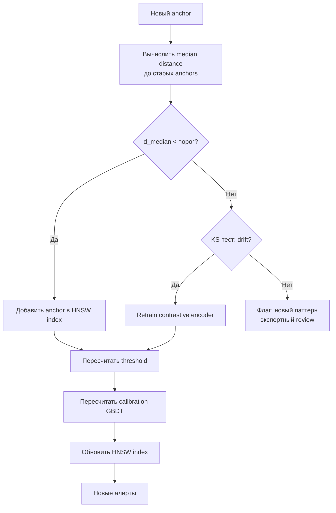

# 8. Temporal validation и self-evolution: как система развивается без человека

> **О чём этот блок простыми словами.**
> Любая модель стареет: мир меняется, появляются новые санкции и новые схемы отмывания. Если ничего не делать, точность падает. Этот блок о том, **как система проверяет себя на будущем** (а не на прошлом), **как замечает, что устарела**, и **как переобучается автоматически**, используя новые санкции как бесплатную подсказку.

### Термины

| Термин | Определение |
|--------|-------------|
| Temporal validation | Проверка модели на данных, которые появились **после** обучающей выборки, с сохранением хронологии |
| Temporal split | Разбиение данных по времени: train — прошлое, test — будущее; без перемешивания |
| Walk-forward | Схема валидации, при которой окно обучения сдвигается вперёд, а тест всегда идёт после train |
| Data leakage | Утечка информации из будущего в прошлое; приводит к завышенным метрикам |
| Drift | Изменение распределения данных во времени, из-за которого модель деградирует |
| KS-тест | Kolmogorov-Smirnov test: непараметрический тест на равенство распределений |
| Silhouette score | Метрика, измеряющая, насколько объект близок к своему кластеру по сравнению с чужими |
| Retrain | Полное переобучение encoder'а на новых данных |
| Incremental update | Обновление индекса (HNSW) без полного переобучения |
| Self-supervised signal | Сигнал из данных, не требующий ручной разметки; в Spillety — новые санкции |

---

## 8.1. Постановка задачи

> **Простыми словами.** Представьте, что вы учились водить в 2010 году, а сейчас 2026: дороги, знаки и машины изменились. Старые навыки частично устарели. Нужен механизм, который это замечает и «переучивает» вас. В нашей задаче «новые знаки» — это новые санкционные адреса.

В предыдущих блоках было показано, как обучить encoder через контрастивное обучение (блок 4), как объединить адреса в кластеры (блок 5), как фильтровать spurious-связи через causal DAG (блок 6) и как получить финальный риск-скор через GBDT (блок 7).

Однако все эти компоненты обучаются на **исторических данных**. Со временем:

- Появляются новые санкции (OFAC, EU, UN, OFSI).
- Меняются паттерны активности (новые протоколы, ZK-mixers, cross-chain bridges).
- Распределение embeddings сдвигается.

Без механизма саморазвития система деградирует: precision падает, recall падает, алерты становятся нерелевантными.

**Temporal validation** решает эту проблему: она проверяет модель на данных, которые появились **после** обучения, и запускает retraining при обнаружении drift. Ключевое — новые санкции используются как **self-supervised сигнал**: если новый anchor близок к старым, embedding обобщает; если далёк — модель требует обновления.

---

## 8.2. Temporal split: почему нельзя перемешивать

### 8.2.1. Проблема случайного разбиения

> **Простыми словами.** Если перемешать прошлое и будущее, модель «подсмотрит ответы». Это как дать школьнику контрольную вместе с ответами, а потом удивляться, что он всё решил.

Стандартный подход в ML — случайное разбиение данных на train/test. В задаче on-chain анализа это **неприемлемо** по двум причинам.

**Причина 1: Data leakage.** Если транзакция из будущего попадает в train, модель «видит» будущее. Например, если illicit-адрес, санкционированный в 2024 году, попадает в train 2022 года, модель учится распознавать его по признакам, которые стали известны только после санкции. На test метрики завышены.

**Причина 2: Temporal drift.** Распределение данных меняется во времени. Если train и test перемешаны, модель не проверяется на способность обобщать на будущее — а именно это и есть цель.

### 8.2.2. Temporal split

**Temporal split** — разбиение по времени без перемешивания:

```
|-------- train --------|---- validation ----|---- test ----|
         прошлое          ближе к настоящему    настоящее
```

**Процедура:**

1. Отсортировать все данные по timestamp.
2. Выбрать границы: например, train — до 2023-01-01, validation — 2023-01-01…2023-06-01, test — после 2023-06-01.
3. Обучить модель на train, настроить гиперпараметры на validation, оценить на test.

**Ключевое:** test всегда **после** train и validation. Это имитирует реальное использование: модель обучается на прошлом, применяется к будущему.

### 8.2.3. Walk-forward validation

> **Простыми словами.** Одного разреза мало — результат может зависеть от случайного выбора границы. Walk-forward делает много разрезов, сдвигая окно вперёд, и смотрит, стабильны ли метрики.

Одного temporal split недостаточно: результат зависит от выбора границ. **Walk-forward validation** повторяет процедуру с несколькими сдвигами окна:

```
Fold 1: train [t0, t1]  → test [t1, t2]
Fold 2: train [t0, t2]  → test [t2, t3]
Fold 3: train [t0, t3]  → test [t3, t4]
...
```

**Преимущества:**

- Оценка устойчивости метрик на разных временных окнах.
- Обнаружение drift: если метрики падают от fold к fold, модель деградирует.

**Как проверяем:** KS-тест на распределении embeddings для каждого fold; если p-value < 0.05, распределение значимо сдвинулось.

---

## 8.3. Temporal validation: self-supervised сигнал

### 8.3.1. Идея

> **Простыми словами.** Когда OFAC публикует новый «плохой» адрес, мы не используем его для обучения (иначе это утечка). Мы используем его как **экзаменационный вопрос**: близок ли он к уже известным «плохим» адресам? Если да — система «понимает» мир. Если нет — пора переучиваться.

Новые санкции — это **бесплатный self-supervised сигнал**. Когда OFAC добавляет новый адрес, мы знаем, что он плохой (illicit). Но мы **не используем** его как training label. Вместо этого мы используем его как **тест**: насколько хорошо embedding пространство, обученное на старых данных, обобщает на новый anchor?

**Логика:**

- Если новый anchor **близок** к старым anchors в embedding space → embedding обобщает, модель работает.
- Если новый anchor **далёк** от старых → embedding деградировал, требуется retraining.

### 8.3.2. Метрика: median distance

Для нового anchor \(a_{\text{new}}\) вычисляется медианное расстояние до всех старых anchors \(\mathcal{A}_{\text{old}}\):

\[
d_{\text{median}}(a_{\text{new}}) = \text{median}_{a \in \mathcal{A}_{\text{old}}} \|z_{a_{\text{new}}} - z_a\|
\]

**Порог:** распределение median distance на исторических парах anchor→anchor. Порог — квантиль, соответствующий стабильному embedding.

**Как получаем порог:**

1. Взять исторические пары (anchor, добавленный в момент \(t\), и anchors, добавленные до \(t\)).
2. Вычислить median distance для каждой пары.
3. Построить распределение.
4. Порог — 95-й квантиль этого распределения.

Если \(d_{\text{median}}(a_{\text{new}})\) превышает порог, anchor считается «далёким».

### 8.3.3. Два режима



**Режим 1 (нормальный):** новый anchor близок к старым → embedding обобщает → добавить anchor в index.

**Режим 2 (drift):** новый anchor далёк от старых → различаем два случая:

- **Embedding деградировал:** KS-тест на распределении embeddings показывает drift выше порога → retrain.
- **Новый паттерн:** cluster-level analysis показывает, что новый anchor формирует новый кластер, а не шум → флаг для экспертного review, не retrain.

### 8.3.4. Различение drift vs новый паттерн

> **Простыми словами.** «Стало хуже» и «появилось что-то новое» выглядят одинаково (расстояние выросло). Различаем по двум вопросам: «сдвинулось ли всё распределение?» (KS) и «держатся ли новые точки вместе?» (silhouette).

**Проблема:** и drift, и новый паттерн дают высокий median distance. Как их различить?

**Решение:** комбинация KS-теста и silhouette score.

| Ситуация | KS-тест | Silhouette | Интерпретация |
|----------|---------|------------|---------------|
| Норма | Низкий | Высокий | Embedding обобщает |
| Drift | Высокий | Низкий | Embedding деградировал → retrain |
| Новый паттерн | Низкий | Низкий | Новый кластер → экспертный review |
| Шум | Высокий | Высокий | Единичный выброс → игнорировать |

**KS-тест:** сравнивает распределение embeddings на старых и новых данных. Высокое значение → drift.

**Silhouette score:** измеряет, насколько новый anchor близок к своему кластеру по сравнению с чужими. Низкое значение → новый паттерн или шум.

**Как получаем пороги:** эмпирически на исторических данных.

---

## 8.4. Retraining и incremental update

### 8.4.1. Два уровня обновления

> **Простыми словами.** Есть «лёгкое» обновление (добавить новые данные — быстро, миллисекунды) и «тяжёлое» (переучить всю модель — долго, по расписанию/триггеру).

**Уровень 1 (быстрый, online):**

- Обновление структурных и временных признаков при новых транзакциях.
- Anchor-относительные признаки пересчитываются через HNSW lookup.
- Latency: миллисекунды.
- **Не требует** переобучения encoder'а.

**Уровень 2 (медленный, offline):**

- Переобучение encoder'а при drift > порога.
- Пересчёт embeddings для всех кошельков.
- Частота: по триггеру (новые санкции, KS drift).
- **Требует** полного пересчёта HNSW index.

### 8.4.2. Incremental update HNSW

HNSW поддерживает **вставку** новых элементов без полной перестройки:

1. Новый anchor → embedding.
2. Вставка в HNSW: поиск ближайших соседей на каждом слое, добавление связей.
3. Обновление метаданных (тип anchor, источник, дата).

**Ограничение:** при большом числе вставок (например, после retraining) HNSW деградирует: граф теряет сбалансированность. Решение — периодическая **полная перестройка** (раз в N вставок или при drift).

**Как получаем N:** эмпирически по recall@K на hold-out; если recall падает ниже порога, перестройка.

### 8.4.3. Пересчёт threshold

После retraining и обновления HNSW пересчитывается operating point:

\[
\tau = \arg\min_{\tau} \left[ C_{FP} \cdot FP(\tau) + C_{FN} \cdot FN(\tau) \right]
\]

Cost-функция использует обновлённые \(C_{FP}\) и \(C_{FN}\) (см. блок 7). Если \(C_{FN}/C_{FP}\) изменилось (например, из-за новых регуляторных требований), threshold пересчитывается.

### 8.4.4. Пересчёт калибровки GBDT

После retraining encoder'а признаки (distances, anchor types) меняются. GBDT требует **перекалибровки**:

1. Пересчитать признаки на validation set.
2. Обучить isotonic или beta calibration заново.
3. Оценить ECE и Brier на test.
4. Если ECE вырос, калибровка ухудшилась — требуется переобучение GBDT.

**Как проверяем:** reliability diagram на test; если кривая отклоняется от диагонали, калибровка неадекватна.

---

## 8.5. Active learning без selection bias

### 8.5.1. Проблема selection bias

> **Простыми словами.** Если проверять только «непонятные» алерты, мы никогда не узнаем, что уверенно помеченные были ошибкой. Это как проверять только сложные задачи и не замечать, что в лёгких систематическая ошибка.

Стандартный active learning выбирает для разметки **uncertain** примеры (Tier 2–3). Это создаёт **selection bias**: модель учится только на uncertain region, но не на уверенных ошибках.

**Пример:** если модель уверенно (score > 0.95) помечает кошелёк как illicit, но он легитимен, этот пример никогда не попадёт в разметку. Модель не узнает об ошибке.

### 8.5.2. Random sampling

**Решение:** часть auto-clear и auto-block проходит **случайную** ручную проверку.

| Уровень | Доля случайных проверок | Цель |
|---------|------------------------|------|
| Auto-clear | 0.1–1% | Оценка recall |
| Auto-block | 1–5% | Оценка precision Tier 1 |
| Tier 2–3 | 100% (уже проверяются) | Обучение |

**Как получаем долю:** размер выборки определяется по **power analysis** для целевого доверительного интервала precision/recall.

**Формула для размера выборки:**

\[
n = \frac{z^2 \cdot p \cdot (1 - p)}{e^2}
\]

где \(z\) — z-score для уровня доверия (1.96 для 95%), \(p\) — ожидаемая precision/recall, \(e\) — допустимая ошибка (±5%).

**Пример:** для оценки precision = 0.9 с ±5% при 95% confidence:

\[
n = \frac{1.96^2 \cdot 0.9 \cdot 0.1}{0.05^2} \approx 138
\]

То есть 138 случайных auto-block должны проходить ручную проверку ежемесячно.

### 8.5.3. Unbiased precision/recall

Random sampling даёт **unbiased** оценку precision/recall на всех уровнях:

\[
\text{Precision}_{\text{unbiased}} = \frac{\text{TP в random sample}}{\text{все в random sample}}
\]

\[
\text{Recall}_{\text{unbiased}} = \frac{\text{TP в random sample из auto-clear}}{\text{все illicit в random sample}}
\]

**Ключевое:** без random sampling метрики на Tier 2–3 **смещены**: они отражают только uncertain region, а не всю популяцию.

---

## 8.6. Drift monitoring

### 8.6.1. Что мониторим

> **Простыми словами.** Мы постоянно следим за «здоровьем» системы по нескольким датчикам: сдвиг распределения (KS), ухудшение калибровки (Brier, ECE), всплеск алертов и падение precision/recall.

| Метрика | Как считается | Порог |
|---------|---------------|-------|
| KS на embeddings | Сравнение распределений на разных временных срезах | p-value < 0.05 |
| Brier drift | Разность Brier на train и test | > 0.05 |
| ECE drift | Разность ECE на train и test | > 0.05 |
| Alert rate | Доля алертов от общего числа транзакций | Изменение > 20% |
| Precision@K drift | Precision на hold-out | Падение > 10% |
| Recall@K drift | Recall на hold-out | Падение > 10% |

### 8.6.2. Dashboard

Drift monitoring реализуется через **dashboard**, который обновляется ежедневно:

- Графики KS, Brier, ECE во времени.
- Alert rate по дням.
- Precision/recall на hold-out.
- Распределение scores.

**Как проверяем:** если метрика превышает порог, запускается alert для команды.

### 8.6.3. Триггеры retraining

| Триггер | Условие | Действие |
|---------|---------|----------|
| Новые санкции | OFAC/EU/UN добавили > N anchors | Temporal validation |
| KS drift | p-value < 0.05 на 3+ временных срезах | Retrain |
| Brier drift | > 0.05 | Retrain |
| Precision drift | Падение > 10% | Retrain |
| Периодический | Раз в месяц | Полная рекластеризация |

**Как получаем N:** эмпирически; если добавление N anchors не вызывает drift, N можно увеличить.

---

## 8.7. Визуализация


**Temporal validation:** Медианное расстояние нового anchor до старых anchors во времени. Красная линия — порог drift. Точки выше порога — сигнал retraining.


**KS drift:** Сравнение распределений embeddings на старых и новых данных. Гистограммы и CDF показывают, насколько распределения различаются. KS-stat и p-value указывают на значимость.


**Drift dashboard:** Динамика нескольких метрик во времени. Если метрика выходит за порог, запускается alert.


**Walk-forward validation:** Метрики (PR-AUC, Precision@K, Recall@K) по folds. Падение метрик от fold к fold — сигнал drift.

---

## 8.8. Ограничения

1. **Selection bias в active learning:** даже с random sampling, доля проверок ограничена ресурсами. Если random sample слишком мал, оценка precision/recall неточна.

2. **Temporal drift может быть нелинейным:** KS-тест обнаруживает сдвиг распределения, но не его причину. Различение drift и нового паттерна требует silhouette score, который тоже эмпиричен.

3. **Retraining дорог:** полное переобучение encoder'а на 80M+ кошельков требует значительных ресурсов. Частота retraining — компромисс между качеством и стоимостью.

4. **Incremental update накапливает ошибки:** HNSW деградирует при большом числе вставок. Периодическая полная перестройка необходима, но её частота эмпирична.

5. **Power analysis требует оценки \(p\):** для расчёта размера выборки нужно знать ожидаемую precision/recall. Если оценка неверна, размер выборки недостаточен.

6. **Новые санкции — не random sample:** anchors, добавленные OFAC, смещены в сторону определённых типов illicit. Temporal validation на них не даёт unbiased оценки на всей популяции.

7. **Drift monitoring требует инфраструктуры:** dashboard, alerting, хранение метрик — всё это операционная нагрузка.

---

**Главная мысль:** Temporal validation использует новые санкции как self-supervised сигнал. Если новый anchor близок к старым — embedding обобщает. Если далёк — различаем drift (retrain) и новый паттерн (экспертный review). Random sampling из auto-clear даёт unbiased оценку precision/recall.

| Компонент | Роль | Результат |
|-----------|------|-----------|
| Temporal split | Разбиение по времени без утечки | Честная оценка |
| Walk-forward | Многократная валидация | Устойчивость метрик |
| Median distance | Метрика близости нового anchor | Сигнал обобщения |
| KS-тест | Обнаружение drift | p-value |
| Silhouette | Различение drift vs новый паттерн | Интерпретация |
| Incremental update | Обновление HNSW | Быстрое добавление anchors |
| Retraining | Полное переобучение | Восстановление качества |
| Random sampling | Unbiased validation | Честные precision/recall |
| Drift monitoring | Dashboard | Раннее обнаружение |

**Практический вывод:**
- Temporal split обязателен: случайное разбиение даёт data leakage.
- Walk-forward validation показывает устойчивость метрик на разных временных окнах.
- Новые санкции — бесплатный self-supervised сигнал для temporal validation.
- Median distance + KS-тест + silhouette score различают норму, drift, новый паттерн и шум.
- Incremental update HNSW быстрый, но накапливает ошибки; периодическая перестройка необходима.
- Random sampling из auto-clear даёт unbiased precision/recall.
- Drift monitoring — операционная необходимость, а не опция.