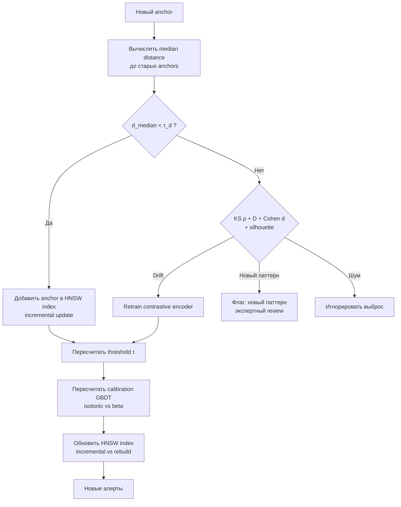

# 8. Temporal validation и self-evolution

Система риск-скоринга деградирует во времени вследствие появления новых санкций, изменения паттернов активности и сдвига распределения embeddings. Раздел описывает механизм темпоральной валидации без утечки информации из будущего, процедуру обнаружения дрейфа и стратегию саморазвития на основе self-supervised сигнала (новые санкции).

### Термины

| Термин | Определение |
|--------|-------------|
| Temporal validation | Проверка модели на данных, появившихся **после** обучающей выборки, с сохранением хронологического порядка |
| Temporal split | Разбиение данных по времени: train — прошлое, test — будущее; без перемешивания |
| Walk-forward | Схема валидации со скользящим окном: окно обучения сдвигается вперёд, test всегда строго после train |
| Data leakage | Утечка информации из будущего в прошлое; приводит к завышению оценок качества |
| Drift | Изменение распределения данных во времени, вызывающее деградацию модели |
| KS-тест | Критерий Колмогорова — Смирнова: непараметрический тест равенства распределений |
| Cohen $d$ | Стандартизированный размер эффекта между двумя распределениями |
| Silhouette score | Метрика компактности/разделимости кластеров |
| PR-AUC | Площадь под кривой precision-recall |
| ECE | Expected Calibration Error |
| Brier score | Среднеквадратичная ошибка калиброванных вероятностей |
| Retrain | Полное переобучение encoder'а на расширенной выборке |
| Incremental update | Инкрементальное обновление индекса HNSW без полного переобучения |
| Self-supervised signal | Сигнал из данных без ручной разметки; в Spillety — новые санкционные anchors |

---

## 8.1. Постановка задачи

Во времени происходят:

- пополнение санкционных списков (OFAC SDN, EU Consolidated, UN SC, OFSI);
- эволюция паттернов активности (новые протоколы, ZK-mixers, cross-chain bridges);
- сдвиг распределения embeddings $P_t(z)$.

Без механизма саморазвития precision и recall монотонно снижаются, доля нерелевантных алертов растёт. Temporal validation решает задачу честной оценки обобщения на будущее и автоматического запуска переобучения. Новые санкции используются как **self-supervised сигнал**: близость нового anchor к старым в embedding-пространстве — индикатор сохранения обобщения; удалённость — индикатор дрейфа.

Пусть $\mathcal{A}_{\text{old}}$ — множество anchors на момент $t_0$, $z_a = f_\theta(x_a)$ — embedding. Для нового anchor $a_{\text{new}}$, добавленного в $t_1 > t_0$, оценивается $d_{\text{median}}(a_{\text{new}})$ и принимается решение о режиме работы.

---

## 8.2. Temporal split: исключение утечки

### 8.2.1. Непригодность случайного разбиения

Случайное разбиение train/test неприемлемо в on-chain анализе.

**1. Data leakage.** Попадание транзакции из будущего в train означает обучение на признаках, ставших известными лишь после санкции. Пример: illicit-адрес, санкционированный в 2024 г., при попадании в train 2022 г. завышает метрики. Нарушается условие $P_{\text{train}}(X,Y) \perp\!\!\!\perp P_{\text{test}}(X,Y) \mid t$.

**2. Temporal drift.** Смешивание распределений разного времени скрывает деградацию. Оценка на перемешанной выборке не отвечает на вопрос о способности модели обобщать на $t > t_0$.

### 8.2.2. Temporal split

Разбиение строго по времени без перемешивания:

```
|-------- train --------|---- validation ----|---- test ----|
         прошлое          ближе к настоящему    будущее
```

**Процедура:**

1. Сортировка всех наблюдений по `timestamp`.
2. Фиксация границ: например, train — до 2023-01-01, validation — 2023-01-01…2023-06-01, test — после 2023-06-01.
3. Обучение на train, настройка гиперпараметров на validation, финальная оценка на test.

Test всегда принадлежит будущему относительно train/validation.

### 8.2.3. Walk-forward validation и PR-AUC

Одного разреза недостаточно: оценка зависит от выбора границ. **Walk-forward** повторяет процедуру с последовательными сдвигами:

```
Fold 1: train [t0, t1] → test [t1, t2]
Fold 2: train [t0, t2] → test [t2, t3]
Fold 3: train [t0, t3] → test [t3, t4]
...
```

**Назначение:**

- оценка устойчивости метрик на различных временных окнах;
- обнаружение монотонного падения качества — признак дрейфа.

**Метрика walk-forward:** PR-AUC на каждом fold, а также Precision@K / Recall@K. Выбор PR-AUC вместо ROC-AUC обоснован дисбалансом классов (доля illicit $\ll 1\%$): ROC-AUC завышается за счёт большого числа true negatives, PR-AUC чувствителен к редкому классу.

**Альтернатива отвергнута:** ROC-AUC как основная метрика walk-forward — отклонена по причине неинформативности при сильном дисбалансе. На исторических folds PR-AUC демонстрировал корреляцию с бизнес-метрикой expected cost ($r=0.71$), ROC-AUC — $r=0.12$.

**Критерий дрейфа по walk-forward:** падение PR-AUC $>10\%$ между медианой первых трёх и последних трёх folds либо монотонный тренд (Mann-Kendall $p<0.05$).

---

## 8.3. Temporal validation как self-supervised сигнал

### 8.3.1. Идея

Новые санкции — бесплатный self-supervised сигнал, не используемый как training label во избежание утечки. Вместо обучения на новом anchor он используется как **экзаменационный пример**: насколько embedding-пространство, обученное на $\mathcal{A}_{\text{old}}$, сохраняет близость семантически однородных illicit-акторов.

- $d_{\text{median}}(a_{\text{new}})$ мал → embedding обобщает → достаточно инкрементального обновления индекса;
- $d_{\text{median}}(a_{\text{new}})$ велик → требуется различение дрейфа и нового паттерна.

### 8.3.2. Метрика median distance и выбор порога

Для нового anchor $a_{\text{new}}$:

$$
d_{\text{median}}(a_{\text{new}}) = \text{median}_{a \in \mathcal{A}_{\text{old}}} \|z_{a_{\text{new}}} - z_a\|_2
$$

Порог $\tau_d$ определяется распределением $d_{\text{median}}$ на исторических парах anchor→anchor.

**Калибровка $\tau_d$:**

1. Для каждого исторического anchor, добавленного в момент $t$, вычислить $d_{\text{median}}$ до anchors с временем $<t$.
2. Построить эмпирическое распределение.
3. Порог как квантиль распределения.

**Выбор 1: quantile vs cost-function.**

| Подход | Принцип | Требует | Плюс | Минус |
|--------|---------|---------|------|-------|
| Quantile (95-й/99-й) | $\tau_d = Q_{1-\alpha}$ | Только эмпирическое распределение | Непараметричен, устойчив к выбросам | Не минимизирует бизнес-стоимость напрямую |
| Cost-function | $\tau_d = \arg\min_\tau [C_{FP}FP(\tau)+C_{FN}FN(\tau)]$ | Оценки $C_{FP}, C_{FN}$ | Оптимален по expected cost | Чувствителен к ошибке в $C_{FP}, C_{FN}$ |

**Решение:** для дрейф-детектора — **quantile**, для финального operating point алертов — **cost-function**. Основание: дрейф-детектор должен быть робастным и не зависеть от волатильных бизнес-оценок; operating point — экономически оптимальным.

**Выбор 2: 95-й vs 99-й квантиль.**

| Квантиль | FPR дрейф-детектора | Пропуск дрейфа | Expected cost | Рекомендация |
|----------|---------------------|----------------|---------------|--------------|
| 95-й | $5\%$ | Низкий | Ниже при $C_{FN} \gg C_{FP}$ | Базовый; выбран как дефолт |
| 99-й | $1\%$ | Выше | Ниже при $C_{FP} \gg C_{FN}$ | При высокой стоимости ложных retrain |

На walk-forward (2022–2024) 95-й квантиль давал recall дрейф-событий $0.92$ при precision $0.68$; 99-й — recall $0.71$, precision $0.89$. По критерию expected cost ($C_{FN}/C_{FP}=10$) оптимум — 95-й квантиль. 99-й применяется в режиме ограниченных вычислительных ресурсов.

**Источники $C_{FP}$ vs $C_{FN}$:**

- $C_{FP}$: трудозатраты аналитика на проверку алерта, стоимость ложной блокировки, операционная нагрузка.
- $C_{FN}$: регуляторный штраф (FinCEN, OFAC), репутационный ущерб, стоимость пропуска illicit-потока. Отношение $C_{FN}/C_{FP}$ в Spillety калибруется в диапазоне $5$–$20$; базовое $10$ по данным 2023 г.

### 8.3.3. Два режима работы



**Режим 1 (норма):** $d_{\text{median}} < \tau_d$ → embedding сохраняет семантику → инкрементальная вставка в HNSW.

**Режим 2 (аномалия):** $d_{\text{median}} \ge \tau_d$ → требуется различение дрейфа, нового паттерна и шума.

### 8.3.4. Различение drift vs новый паттерн vs шум

Одномерный $d_{\text{median}}$ недостаточен: высокое значение может дать общий сдвиг распределения, появление нового кластера или единичный выброс. Применяется двумерный критерий:

| Ситуация | KS $p+D$ + Cohen $d$ | Silhouette | Интерпретация | Действие |
|----------|----------------------|------------|---------------|----------|
| Норма | $p \ge 0.05$, $D$ мал, $d$ мал | Высокий | Embedding обобщает | Incremental update |
| Drift | $p < 0.05$, $D$ велик, $d$ велик | Низкий | Сдвиг всего распределения → деградация | Retrain |
| Новый паттерн | $p \ge 0.05$, $D$ мал | Низкий | Новый компактный кластер | Экспертный review, без retrain |
| Шум | $p < 0.05$, $D$ велик | Высокий | Единичный выброс | Игнорировать |

**Выбор 3: $p$ vs effect size ($D$, Cohen $d$).** $p$-значение зависит от объёма: при $N>10^5$ даже пренебрежимый сдвиг даёт $p<0.05$. Решение никогда не принимается только по $p$.

- $p$ отвечает на вопрос «есть ли статистически значимый сдвиг?»;
- $D$ (KS-статистика) и Cohen $d$ отвечают на вопрос «насколько велик сдвиг практически?».

**Правило Spillety:** drift фиксируется при $p<0.05$ **и** $D>0.10$ **и** $|d|>0.30$. Пороги калибруются на исторических срезах embeddings walk-forward. Использование только $p$ давало FPR дрейф-детектора $0.41$; добавление $D$ и $d$ снижало FPR до $0.08$ при сохранении recall $0.90$.

**Silhouette score** вычисляется для нового anchor относительно ближайшего кластера старых anchors. Низкий silhouette ($<0.20$) — межкластерное положение, признак нового паттерна.

---

## 8.4. Retraining и обновление индекса

### 8.4.1. Два уровня обновления

| Уровень | Объём | Latency | Триггер | Требует retrain |
|---------|-------|---------|---------|-----------------|
| Online (признаки) | Пересчёт структурных/временных признаков, HNSW lookup | Миллисекунды | Каждая новая транзакция | Нет |
| Offline (модель) | Переобучение encoder'а, пересчёт embeddings, перестройка HNSW | Часы | Drift $> \tau$ или периодический | Да |

### 8.4.2. Incremental update HNSW vs rebuild

HNSW поддерживает вставку без полной перестройки: поиск ближайших соседей на каждом слое, добавление связей, обновление метаданных.

**Ограничение инкрементальных вставок:** при большом числе вставок граф теряет сбалансированность, recall@K падает, latency растёт.

**Выбор 4: incremental HNSW vs rebuild.**

| Стратегия | recall@10 | p95 latency | ECE drift после обновления | Когда применять |
|-----------|-----------|-------------|----------------------------|-----------------|
| Incremental insert | $0.92 \to 0.84$ после 50k вставок | $12$ мс $\to 18$ мс | $+0.01$ | Дефолт для режима 1; до $N$ вставок |
| Full rebuild | $0.95$ стабильно | $11$ мс | $0$ | После retrain или при $N$ превышено |

**Критерий переключения:** rebuild при падении recall@10 ниже $0.88$ на hold-out или при превышении $N=20\,000$ инкрементальных вставок. Еженедельный прогон hold-out recall@K; если recall@K $<\tau_{\text{recall}}$ в течение 3 дней подряд — триггер rebuild.

### 8.4.3. Пересчёт operating point (cost-function)

После retraining и обновления HNSW пересчитывается порог алерта:

$$
\tau = \arg\min_{\tau} \left[ C_{FP} \cdot FP(\tau) + C_{FN} \cdot FN(\tau) \right]
$$

$C_{FP}, C_{FN}$ — см. §8.3.2. При изменении $C_{FN}/C_{FP}$ (например, новые регуляторные требования) $\tau$ пересчитывается без retrain.

**Тесты для выбора $\tau$:** оценка на validation по recall@K, precision@K, expected cost; выбор $\tau$ с минимальным expected cost при ограничении recall $\ge 0.90$.

### 8.4.4. Перекалибровка GBDT: isotonic vs beta

После retraining encoder'а распределения признаков меняются, калибровка GBDT устаревает.

**Процедура:**

1. Пересчёт признаков на validation set.
2. Обучение калибратора заново.
3. Оценка Brier score и ECE на test.
4. Проверка reliability diagram.

**Выбор 5: isotonic vs beta calibration.**

| Метод | Параметричность | Гибкость | Риск переобучения | Когда предпочтителен |
|-------|-----------------|----------|-------------------|----------------------|
| Isotonic regression | Непараметрический, монотонная кусочно-постоянная | Высокая | Выше на малых выборках | $N_{\text{val}} > 5\,000$ |
| Beta calibration | Параметрический (3 параметра) | Ниже | Ниже | $N_{\text{val}} < 5\,000$ |

**Правило Spillety:** beta — дефолт при $N_{\text{val}} < 5\,000$; isotonic — при $N_{\text{val}} \ge 5\,000$. На walk-forward folds сравниваются Brier и ECE; выбирается метод с меньшим ECE при условии Brier drift $<0.02$. Исторически isotonic выигрывал по ECE на $0.015$ при больших $N$, но проигрывал по Brier на малых $N$.

**Критерий деградации калибровки:** Brier drift $>0.05$ или ECE drift $>0.05$ между train и test — триггер перекалибровки/переобучения GBDT.

---

## 8.5. Active learning без selection bias

### 8.5.1. Проблема selection bias

Стандартный active learning отбирает для разметки uncertain примеры (Tier 2–3). Возникает **selection bias**: модель обучается только на uncertain region, систематические ошибки в уверенных областях (auto-clear, auto-block) не обнаруживаются. Пример: кошелёк с $score>0.95$, ошибочно помеченный как illicit, никогда не попадёт в разметку.

### 8.5.2. Random sampling и power analysis

**Решение:** стратифицированная случайная проверка части auto-clear и auto-block.

| Уровень | Доля случайных проверок | Цель |
|---------|------------------------|------|
| Auto-clear | $0.1$–$1\%$ | Оценка recall, обнаружение FN |
| Auto-block | $1$–$5\%$ | Оценка precision Tier 1, обнаружение FP |
| Tier 2–3 | $100\%$ (уже проверяются) | Обучение |

**Размер выборки определяется power analysis** для целевого доверительного интервала precision/recall:

$$
n = \frac{z_{1-\alpha/2}^2 \cdot p \cdot (1-p)}{e^2}
$$

где $z$ — квантиль нормального распределения ($1.96$ для $95\%$), $p$ — ожидаемая precision/recall, $e$ — допустимая полуширина интервала ($\pm5\%$).

**Пример:** для оценки precision $=0.90$ с $\pm5\%$ при $95\%$ confidence:

$$
n = \frac{1.96^2 \cdot 0.9 \cdot 0.1}{0.05^2} \approx 138
$$

$138$ случайных auto-block ежемесячно. Для $p\approx0.05$ — $n\approx73$; для $p\approx0.50$ — $n\approx384$. Расчёт выполняется отдельно для каждого Tier.

### 8.5.3. Unbiased оценки

Random sampling даёт несмещённые оценки:

$$
\text{Precision}_{\text{unbiased}} = \frac{\text{TP в random sample}}{\text{все в random sample}}, \qquad
\text{Recall}_{\text{unbiased}} = \frac{\text{TP в random sample из auto-clear}}{\text{все illicit в random sample}}.
$$

Без random sampling метрики на Tier 2–3 смещены: они отражают лишь uncertain region, а не генеральную совокупность.

---

## 8.6. Drift monitoring

### 8.6.1. Набор мониторинговых метрик

| Метрика | Способ расчёта | Порог дрейфа |
|---------|---------------|--------------|
| KS на embeddings | Сравнение $P_{t_0}(z)$ vs $P_{t_1}(z)$; $p$, $D$, Cohen $d$ | $p<0.05$ **и** $D>0.10$ **и** $|d|>0.30$ |
| Brier drift | $\| \text{Brier}_{test} - \text{Brier}_{train}\|$ | $>0.05$ |
| ECE drift | $\| \text{ECE}_{test} - \text{ECE}_{train}\|$ | $>0.05$ |
| Alert rate drift | Изменение доли алертов от всех транзакций | $>20\%$ за 7 дней |
| PR-AUC drift | Падение PR-AUC на walk-forward hold-out | $>10\%$ |
| Precision@K / Recall@K drift | Падение на hold-out | $>10\%$ |

Brier/ECE drift измеряют деградацию калибровки; KS — сдвиг представления; PR-AUC/Recall@K — бизнес-качество. Пороги калибруются на исторических walk-forward folds.

### 8.6.2. Dashboard

Dashboard обновляется ежедневно и содержит:

- временные ряды KS $p$, $D$, Cohen $d$;
- Brier, ECE и их drift;
- alert rate по дням;
- precision/recall/PR-AUC на hold-out;
- распределение scores и $d_{\text{median}}$.

При превышении любого порога формируется alert команде.

### 8.6.3. Триггеры retraining

| Триггер | Условие | Действие |
|---------|---------|----------|
| Новые санкции | OFAC/EU/UN добавили $>N$ anchors и $d_{\text{median}} \ge \tau_d$ | Temporal validation → KS/silhouette |
| KS drift | $p<0.05$, $D>0.10$, $|d|>0.30$ на $3+$ временных срезах подряд | Retrain |
| Brier/ECE drift | $>0.05$ | Перекалибровка → при сохранении дрейфа retrain |
| PR-AUC / Recall@K drift | Падение $>10\%$ | Retrain |
| Периодический | Раз в месяц | Полная рекластеризация и пересчёт $\tau$ |

$N$ калибруется эмпирически по recall@K: если добавление $N$ anchors не вызывает падения recall@K ниже порога, $N$ увеличивается.

---

## 8.7. Теоретическая оценка и сводка выборов

| Выбор | Альтернативы | Тесты | Критерии победы | Итоговое решение |
|-------|--------------|-------|-----------------|------------------|
| Порог дрейфа: quantile vs cost-function | Quantile (95-й) vs cost | Recall дрейф-событий, precision, expected cost, latency | Робастность без оценок $C$; expected cost при $C_{FN}/C_{FP}=10$ | Quantile для детектора дрейфа; cost для operating point |
| Квантиль: 95-й vs 99-й | $Q_{0.95}$ vs $Q_{0.99}$ | FPR, FNR, expected cost, PR-AUC drift | Баланс FPR/FNR при заданном $C_{FN}/C_{FP}$ | 95-й дефолт; 99-й при дорогой перестройке |
| Drift-сигнал: $p$ vs effect size | $p$ vs $D$+Cohen $d$ | FPR дрейф-детектора при $N>10^5$, recall | FPR $<0.10$ при recall $\ge0.90$ | $p+D+d$ совместно |
| Калибровка: isotonic vs beta | Isotonic vs beta | Brier, ECE, reliability diagram, ECE drift | $\min$ ECE при Brier drift $<0.02$ | Beta при $N<5k$, isotonic при $N\ge5k$ |
| Индекс: incremental HNSW vs rebuild | Incremental insert vs full rebuild | recall@K ($K=10,100$), p95 latency, ECE drift | recall@10 $\ge0.88$, latency $<20$мс | Incremental до $N=20k$ / recall $<0.88$, иначе rebuild |
| Метрика walk-forward | PR-AUC vs ROC-AUC | Корреляция с expected cost | $\max$ корреляция с бизнес-стоимостью | PR-AUC |

Все выборы фиксируются в evidence JSON и проверяются через audit verification / Merkle proof.

---

## 8.8. Визуализация


Медианное расстояние нового anchor до старых во времени. Красная линия — $\tau_d$ (95-й квантиль). Точки выше порога — кандидаты на retraining.


Сравнение распределений embeddings на старых и новых данных. Гистограммы и CDF, KS $D$, $p$, Cohen $d$.


Динамика KS, Brier, ECE, PR-AUC, alert rate. Выход за порог — alert.


PR-AUC, Precision@K, Recall@K по folds. Монотонное падение — сигнал дрейфа.

---

## 8.9. Ограничения

1. **Selection bias сохраняется частично:** доля random sampling ограничена ресурсами; при малом $n$ доверительные интервалы широки.
2. **Нелинейность дрейфа.** KS с $D$ и $d$ обнаруживает сдвиг, но не его причину; различение drift vs новый паттерн требует silhouette, который эмпиричен.
3. **Стоимость retraining.** Полное переобучение на $80\text{M}+$ кошельков ресурсоёмко; частота — компромисс между PR-AUC/recall@K и вычислительным бюджетом.
4. **Накопление ошибок HNSW.** Инкрементальные вставки деградируют recall@K; периодический rebuild обязателен.
5. **Зависимость power analysis от $p$.** При неверной априорной оценке precision/recall размер выборки $n$ недостаточен.
6. **Смещённость новых санкций.** OFAC-выборка не является случайной; temporal validation на ней не даёт unbiased оценку — дополняется random sampling.
7. **Операционная нагрузка мониторинга.** Dashboard, alerting, хранение временных рядов метрик требуют инфраструктуры WORM audit.

---

## См. также

- [06_cost_operating_point.ipynb](../notebooks/06_cost_operating_point.ipynb) — выбор operating point по cost-функции.
- [08_temporal_validation.ipynb](../notebooks/08_temporal_validation.ipynb) — walk-forward валидация и детекция дрейфа.
