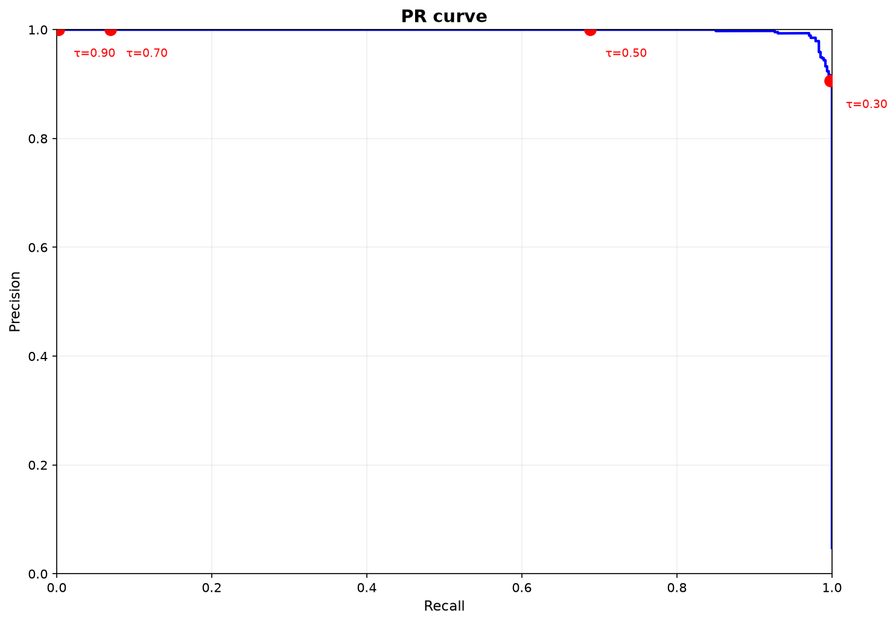

# 8. Cost-функция и операционная точка

Калиброванная вероятность из главы 7 сама по себе никого не защищает: решение принимает порог. И порог этот — не техническая настройка, а экономическое и операционное решение: сколько стоит пропущенное отмывание, сколько стоит ложная тревога, сколько алертов в день физически способен обработать аналитический отдел. Эта глава собирает выбор операционной точки в явную процедуру: cost-функция, бюджетное ограничение, tier-политика и пересчёт при изменении условий.

## 8.1. Постановка задачи

После калибровки каждый объект имеет вероятность $p \in [0,1]$, но система должна принимать бинарные решения: блокировать, отправлять на проверку, пропускать. Мост между вероятностью и действием — порог $\tau$, и выбирать его «по умолчанию 0.5» или «по F1» — значит игнорировать всю экономику задачи. Правильная постановка: минимизировать ожидаемую стоимость ошибок при ограничениях, которые диктует реальная операционная среда.

## 8.2. Cost-функция

### 8.2.1. PR-кривая

Для каждого порога $\tau \in [0,1]$:

$$
\text{Precision}(\tau) = \frac{TP(\tau)}{TP(\tau) + FP(\tau)}, \qquad
\text{Recall}(\tau) = \frac{TP(\tau)}{TP(\tau) + FN(\tau)}.
$$

PR-кривая описывает компромисс точность/полнота: повышение $\tau$ монотонно увеличивает precision за счёт recall.

PR-кривая: каждая точка — порог $\tau$; PR-AUC агрегирует дискриминативную способность; отмеченные точки — операционные пороги Tier 1/2/3.

### 8.2.2. Стоимость ошибок

Оптимальный порог минимизирует ожидаемую стоимость:

$$
\text{Cost}(\tau) = C_{FP} \cdot FP(\tau) + C_{FN} \cdot FN(\tau)
$$

Содержание коэффициентов важнее формулы. $C_{FP}$ — стоимость ложноположительного срабатывания: время аналитика, умноженное на ставку, плюс операционная нагрузка. $C_{FN}$ — стоимость ложноотрицательного: ожидаемый регуляторный штраф, умноженный на вероятность его реализации, плюс репутационный ущерб. Оба коэффициента — оценки, и их источник должен быть зафиксирован (в provenance evidence-пакета, глава 10), иначе порог становится неопровержимым.

Соотношение коэффициентов определяет поведение порога: при дорогих пропусках ($C_{FN}/C_{FP} \gg 1$) $\tau^*$ уезжает вниз — вплоть до вырожденной политики «алерт на всех», о которой ниже.

### 8.2.3. Бюджетное ограничение

При очень дорогих пропусках чистая минимизация стоимости вырождается: алертить на всех объектах формально оптимально и абсолютно бесполезно. Вводится ограничение пропускной способности:

$$
\text{Alerts}(\tau) \leq B
$$

где $B$ — пропускная способность аналитического подразделения. Порог выбирается максимизирующим recall при выполнении ограничения. Смысл решения в том, что нехватка бюджета перестаёт быть тихой: если оптимальная точка не влезает в бюджет, это видно явно, и решение «что отбросить» принимается осознанно, а не по факту переполнения очереди.

## 8.2.4. Tier-политика

Одного порога мало: решения разной серьёзности требуют разных процедур. Три уровня:

| Tier | Условие | Действие |
|------|---------|----------|
| Tier 1 | $\text{score} > \tau_1 \land \text{causal passed} \land \text{E-value} > 2.0 \land \Gamma^* > 1.5$ | auto-block + SAR + human review |
| Tier 2 | $\tau_2 < \text{score} \leq \tau_1$ | analyst review |
| Tier 3 | $\tau_3 < \text{score} \leq \tau_2$ | async review, no blocking |
| Auto-clear | $\text{score} \leq \tau_3$ | no action, logged |

Пороги $\tau_1,\tau_2,\tau_3$ определяются из PR-кривой минимизацией Cost при бюджетном ограничении. Обратите внимание, что Tier 1 — не только скор: дополнительно требуются прохождение причинного фильтра (раздел 6) и пороги чувствительности E-value/Γ*; в консервативном режиме порог E-value поднимается до $2.5$.

## 8.3. Откуда берутся коэффициенты

Честная cost-функция живёт или умирает вместе с оценками $C_{FP}$ и $C_{FN}$, поэтому их происхождение стоит проговорить.

$C_{FP}$ собирается из операционных данных: трудозатраты аналитика на проверку алерта (измеряются, а не предполагаются — через random sampling из раздела 9), стоимость ложной блокировки клиента, нагрузка на инфраструктуру. $C_{FN}$ — самая трудная величина: регуляторные штрафы (FinCEN, OFAC), вероятность их наложения, репутационный ущерб, стоимость пропущенного illicit-потока. Отношение $C_{FN}/C_{FP}$ в Spillety калибруется в диапазоне $5$–$20$ с базовым значением $10$; при изменении регуляторной среды коэффициенты пересматриваются, и порог $\tau$ пересчитывается без переобучения модели.

## 8.4. Связь с остальным контуром

Операционная точка — не изолированный артефакт, а узел, в который сходятся остальные слои. Калибровка из главы 7 делает вероятности сопоставимыми с коэффициентами стоимости: без неё Cost(τ) считается по искажённой шкале. Причинный фильтр из главы 6 поставляет условия Tier 1 (causal passed, E-value). Темпоральная валидация из главы 9 пересчитывает $\tau$ после каждого retraining и при изменении коэффициентов. Evidence-контур из главы 10 фиксирует выбранный порог и коэффициенты в provenance каждого алерта — так решение о пороге становится проверяемым, а не легендой.

## 8.5. Ограничения

1. **Оценки стоимости субъективны.** $C_{FN}$ содержит вероятностные суждения о штрафах и ущербе; чувствительность $\tau^*$ к ошибкам в коэффициентах стоит проверять анализом чувствительности, а не игнорировать.
2. **Вырождение при дорогих пропусках.** При $C_{FN}/C_{FP} \gg 1$ без бюджетного ограничения решение вырождается в «алертить всех»; ограничение $B$ обязательно.
3. **Бюджет — не оптимум, а компромисс.** Максимизация recall при фиксированном $B$ — не то же самое, что глобальный оптимум стоимости; расхождение стоит показывать явно.
4. **Tier-пороги зависят от upstream.** Условия Tier 1 наследуют пороги причинного фильтра; их изменение требует пересчёта всей tier-политики.

---

## См. также

- [06_cost_operating_point.ipynb](../notebooks/06_cost_operating_point.ipynb) — выбор operating point по cost-функции.