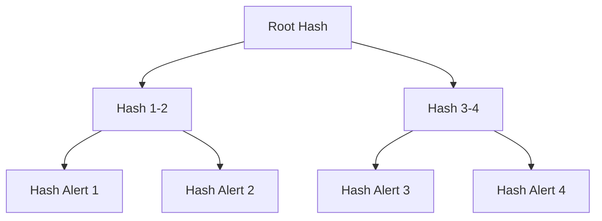

# 9. Evidence generation, provenance и WORM audit

> **О чём этот блок простыми словами.**
> Когда система говорит «этот кошелёк подозрительный», этого мало. Нужно **доказать**, что именно послужило причиной, причём так, чтобы доказательство нельзя было подделать или изменить задним числом. Этот блок о том, **как формируется «паспорт» каждого алерта** (evidence JSON), **как фиксируется его происхождение** (provenance) и **как гарантируется неизменяемость** (WORM audit).

### Термины

| Термин | Определение |
|--------|-------------|
| Evidence JSON | Структурированный документ, сопровождающий каждый алерт и содержащий все данные, необходимые для его проверки |
| Provenance | Информация о происхождении данных: кто, когда и из какого источника получил каждое значение |
| WORM | Write Once Read Many — модель хранения, при которой данные после записи не могут быть изменены или удалены |
| Хеш | Криптографическая функция, преобразующая данные произвольной длины в строку фиксированной длины |
| Merkle tree | Дерево хешей, позволяющее эффективно доказать, что элемент принадлежит множеству |
| Merkle proof | Доказательство принадлежности элемента к Merkle tree без раскрытия всего дерева |
| Ed25519 | Схема цифровой подписи на эллиптических кривых, быстрая и безопасная |
| OpenTimestamps | Протокол, привязывающий хеш документа к блокчейну Bitcoin без раскрытия содержимого |
| SAR | Suspicious Activity Report — отчёт о подозрительной активности, подаваемый в FinCEN |
| Audit trail | Журнал всех действий с алертом: создание, просмотр, изменение статуса, подача SAR |

---

## 9.1. Постановка задачи

> **Простыми словами.** Алерт без доказательства — это просто число, которому нельзя верить. А доказательство, которое можно незаметно переписать, — бесполезно в суде. Нужно и то, и другое: полное «досье» и защита от подмены.

В предыдущих блоках было показано, как получить риск-скор через GBDT и как система развивается через temporal validation. Однако остаётся открытым вопрос: **как доказать, что алерт корректен и не был изменён?**

Это критически важно по трём причинам.

**Причина 1: Регуляторное соответствие.** FinCEN, FATF и SR 26-2 требуют, чтобы каждый алерт сопровождался **документированным обоснованием**. Без evidence JSON алерт — это просто число, которое нельзя проверить.

**Причина 2: Court-admissibility.** Если дело доходит до суда, защита потребует доказательств, что алерт не был сфабрикован или изменён после факта. WORM audit обеспечивает **целостность** и **неизменяемость**.

**Причина 3: Внутренний контроль.** Аналитик, compliance-офицер и независимый валидатор должны видеть **одну и ту же версию** алерта. Без provenance невозможно понять, откуда взялись данные и почему модель приняла решение.

**Evidence generation** решает эти задачи: для каждого алерта формируется структурированный JSON с полным provenance, а WORM audit гарантирует, что JSON не был изменён.

---

## 9.2. Evidence JSON: структура

### 9.2.1. Общая схема

> **Простыми словами.** Это «паспорт» алерта. В нём есть всё: что за кошелёк, какие anchor'ы его «выдали», какой причинный путь, какие признаки, какие версии моделей и криптографическая подпись.

```json
{
  "alert_id": "uuid",
  "risk_score": 0.87,
  "confidence_tier": "Tier 1",
  "anchors": [...],
  "causal_path": [...],
  "graph_features": {...},
  "shap_values": {...},
  "provenance": {...},
  "audit": {...}
}
```

Каждое поле обязательно. Схема валидируется при генерации.

### 9.2.2. Поля

| Поле | Тип | Описание |
|------|-----|----------|
| alert_id | UUID | Уникальный идентификатор алерта |
| risk_score | float [0, 1] | Калиброванная вероятность illicit |
| confidence_tier | enum | Tier 1 / Tier 2 / Tier 3 |
| anchors | array | Список anchors, использованных для алерта |
| causal_path | array | Причинный путь от wallet к anchor |
| graph_features | object | Графовые признаки кошелька |
| shap_values | object | Вклад признаков в предсказание |
| provenance | object | Источник данных, аналитик, дата |
| audit | object | Подпись, Merkle proof, timestamp |

### 9.2.3. Anchors

Каждый anchor в списке содержит:

```json
{
  "wallet": "0xABC...",
  "source": "OFAC SDN",
  "added": "2023-04-12",
  "distance": 0.12,
  "causal_filter": "passed",
  "e_value": 2.3,
  "rosenbaum_gamma": 2.1,
  "sensemakr_r2": 0.15
}
```

| Поле | Описание |
|------|----------|
| wallet | Адрес anchor |
| source | Источник (OFAC SDN, EU Consolidated, UN SC, UK OFSI, court document) |
| added | Дата добавления в список |
| distance | Расстояние в embedding space |
| causal_filter | Результат causal filter: passed / excluded |
| e_value | E-value для anchor |
| rosenbaum_gamma | Rosenbaum Γ* для anchor |
| sensemakr_r2 | Sensemakr partial R² для anchor |

**Зачем:** аналитик видит, какие anchors повлияли на алерт, и может проверить каждый из них вручную.

### 9.2.4. Causal path

```json
{
  "causal_path": [
    {"edge": "Wallet → Mixer_Proximity", "effect": 0.34, "rosenbaum_gamma": 2.1},
    {"edge": "Mixer_Proximity → Anchor", "effect": 0.28, "rosenbaum_gamma": 1.9}
  ]
}
```

**Зачем:** показывает, какие причинные связи объясняют близость к anchor. Это необходимо для court-admissibility: суд должен видеть, что алерт основан на причинной связи, а не на корреляции.

### 9.2.5. Graph features

```json
{
  "graph_features": {
    "in_degree": 45,
    "out_degree": 23,
    "pagerank": 0.003,
    "velocity_24h": 5,
    "counterparty_diversity": 0.67
  }
}
```

**Зачем:** даёт контекст о поведении кошелька. Аналитик может сравнить с типичными значениями для класса.

### 9.2.6. SHAP values

```json
{
  "shap_values": {
    "distance_to_nearest_OFAC": -0.34,
    "causal_filter_pass_rate": 0.28,
    "e_value_max": 0.15,
    "anchor_source_diversity": 0.12
  }
}
```

**Зачем:** показывает, какие признаки внесли вклад в риск-скор. Это необходимо для интерпретируемости и для human review.

### 9.2.7. Provenance

```json
{
  "provenance": {
    "source": "on-chain + anchors",
    "analyst": "analyst_id",
    "date": "2026-09-14T12:00:00Z",
    "model_version": "v2.0",
    "encoder_version": "graphsage-128d-v2.0",
    "gbdt_version": "lightgbm-v2.0"
  }
}
```

**Зачем:** позволяет воспроизвести алерт: зная версии моделей и источник данных, можно повторить вычисления.

### 9.2.8. Audit

```json
{
  "audit": {
    "signature": "ed25519:...",
    "merkle_proof": "0x...",
    "timestamp": "2026-09-14T12:00:01Z",
    "opentimestamps": "0x..."
  }
}
```

| Поле | Описание |
|------|----------|
| signature | Ed25519 подпись JSON |
| merkle_proof | Merkle proof принадлежности к дереву алертов |
| timestamp | Время подписи |
| opentimestamps | OpenTimestamps proof |

> **Простыми словами про audit.** Подпись = «печать», Merkle proof = «место алерта в большом реестре», timestamp = «когда поставлена печать», OpenTimestamps = «независимое подтверждение через блокчейн Bitcoin».

---

## 9.3. WORM audit: целостность и неизменяемость

### 9.3.1. Что такое WORM

> **Простыми словами.** WORM = «записал и забыл». После записи строку нельзя изменить или удалить. Это как высечь в камне: если кто-то захочет исправить — это будет заметно.

**WORM** (Write Once Read Many) — модель хранения, при которой данные после записи **не могут быть изменены или удалены**. Это критически важно для court-admissibility: если алерт был изменён после создания, он теряет юридическую силу.

**WORM реализуется через:**

1. **Ed25519 подпись:** каждый алерт подписывается приватным ключом системы. Подпись проверяется публичным ключом.
2. **Merkle tree:** все алерты объединяются в дерево хешей. Корень дерева фиксируется.
3. **OpenTimestamps:** корень дерева привязывается к блокчейну Bitcoin.

### 9.3.2. Ed25519 подпись

> **Простыми словами.** Подпись работает как «оттиск ключа»: её легко проверить всем, но подделать без ключа — невозможно. Изменение хоть одного символа в JSON ломает подпись.

**Ed25519** — схема цифровой подписи на эллиптической кривой Curve25519. Она обеспечивает:

- **Быструю подпись:** ~50,000 операций в секунду на CPU.
- **Быструю верификацию:** ~20,000 операций в секунду.
- **Малый размер:** подпись — 64 байта, публичный ключ — 32 байта.
- **Безопасность:** 128-битный уровень.

**Процедура:**

1. Система генерирует пару ключей: приватный \(sk\), публичный \(pk\).
2. Для каждого алерта вычисляется хеш JSON: \(h = \text{SHA-256}(\text{JSON})\).
3. Подпись: \(\sigma = \text{Sign}(sk, h)\).
4. Подпись включается в audit.

**Верификация:**

1. Получатель вычисляет хеш JSON: \(h' = \text{SHA-256}(\text{JSON})\).
2. Проверяет: \(\text{Verify}(pk, h', \sigma) = \text{true}\).

**Если JSON был изменён,** хеш \(h'\) изменится, и верификация не пройдёт.

### 9.3.3. Merkle tree

> **Простыми словами.** Merkle tree — это «турнирная сетка» из хешей. Чтобы доказать, что один алерт входит в общий список, достаточно нескольких хешей (путь к корню), а не всего списка.

**Merkle tree** — дерево хешей, где каждый лист — хеш алерта, а каждый внутренний узел — хеш от конкатенации двух дочерних хешей.



**Свойства:**

- **Эффективность:** для \(N\) алертов дерево имеет высоту \(\log_2 N\). Для 1M алертов — 20 уровней.
- **Merkle proof:** для доказательства принадлежности алерта к дереву нужно \(\log_2 N\) хешей, а не все \(N\).
- **Неизменяемость:** изменение любого листа меняет корень.

**Процедура:**

1. Для каждого алерта вычисляется хеш.
2. Хеши объединяются в дерево.
3. Корень дерева фиксируется (например, раз в день).

**Merkle proof для алерта \(i\):** набор хешей siblings на пути от листа \(i\) к корню. Верификатор может проверить, что лист \(i\) принадлежит дереву с данным корнем.

### 9.3.4. OpenTimestamps

> **Простыми словами.** Мы «якорим» корень дерева в блокчейн Bitcoin — то есть получаем независимое подтверждение времени, которое невозможно подделать. При этом содержимое алертов не раскрывается.

**OpenTimestamps** — протокол, привязывающий хеш документа к блокчейну Bitcoin без раскрытия содержимого.

**Проблема:** если мы записываем корень Merkle tree в Bitcoin напрямую, это стоит комиссию и раскрывает информацию.

**Решение OpenTimestamps:**

1. Корень Merkle tree отправляется в OpenTimestamps сервер.
2. Сервер агрегирует корни от многих пользователей в один хеш.
3. Этот хеш записывается в Bitcoin транзакцию.
4. Пользователь получает proof, связывающий его корень с Bitcoin транзакцией.

**Результат:** корень Merkle tree привязан к блокчейну Bitcoin, что даёт **независимое доказательство** существования алертов на момент времени \(t\). Даже если система будет скомпрометирована, Bitcoin blockchain докажет, что алерты существовали.

**Как проверяем:** OpenTimestamps proof верифицируется через публичный API или CLI.

### 9.3.5. Audit trail

**Audit trail** — журнал всех действий с алертом:

| Действие | Что записывается |
|----------|------------------|
| Создание | alert_id, timestamp, модель, версии |
| Просмотр | analyst_id, timestamp |
| Изменение статуса | analyst_id, timestamp, старый статус, новый статус |
| Подача SAR | analyst_id, timestamp, SAR ID |
| Верификация | verifier_id, timestamp, результат |

**Зачем:** audit trail показывает, кто и когда взаимодействовал с алертом. Это необходимо для внутреннего контроля и для court-admissibility.

**Как хранится:** audit trail — часть WORM storage. Записи не могут быть изменены или удалены.

---

## 9.4. SAR generation

### 9.4.1. Что такое SAR

**SAR** (Suspicious Activity Report) — отчёт о подозрительной активности, подаваемый в FinCEN (США) или аналогичный регулятор в других юрисдикциях.

**SAR требуется, когда:**

- Транзакция превышает порог ($2,000 для MSB, $5,000 для банков).
- Есть подозрение на illicit-активность.
- Транзакция структурирована для обхода порога.

### 9.4.2. Что включается в SAR

| Поле | Источник |
|------|----------|
| Transaction hash | On-chain |
| Blockchain | On-chain |
| Timestamp | On-chain |
| Sender address | On-chain |
| Receiver address | On-chain |
| Amount (crypto) | On-chain |
| Amount (USD) | Price oracle |
| Causal path | Evidence JSON |
| Anchor provenance | Evidence JSON |
| Risk score | GBDT |

### 9.4.3. SAR generation из evidence JSON

> **Простыми словами.** Поскольку в evidence JSON уже есть всё нужное, отчёт SAR собирается автоматически. Но человек обязан проверить его перед отправкой.

Evidence JSON содержит все необходимые данные. SAR генерируется автоматически:

1. Извлечь поля из evidence JSON.
2. Форматировать в соответствии с требованиями FinCEN.
3. Подписать Ed25519.
4. Отправить в FinCEN.

**Human review обязателен:** SAR не подаётся автоматически. Аналитик проверяет evidence JSON и подтверждает подачу.

---

## 9.5. Визуализация


**Merkle tree:** Дерево хешей для 8 алертов. Листья (синие) — хеши алертов. Корень (красный) — корневой хеш, который привязывается к Bitcoin через OpenTimestamps.


**Audit trail:** Хронология действий с алертом. Каждая точка — событие (создание, просмотр, review, escalation, SAR filing, верификация). Цвет — тип действия.

---

## 9.6. Ограничения

1. **WORM storage дорог:** хранение всех алертов с подписями и Merkle proofs требует значительного объёма. Решение — архивирование старых алертов с сохранением корней.

2. **Ed25519 key management:** приватный ключ должен быть защищён. Компрометация ключа означает, что все подписи могут быть подделаны. Решение — HSM (Hardware Security Module).

3. **OpenTimestamps latency:** привязка к Bitcoin требует времени (до нескольких часов). Для срочных SAR это может быть проблемой. Решение — промежуточная подпись Ed25519, OpenTimestamps — асинхронно.

4. **Merkle proof для больших деревьев:** для 1M алертов proof содержит ~20 хешей. Это приемлемо, но для 1B алертов — ~30 хешей. Рост логарифмический, но не константный.

5. **Audit trail полнота:** если аналитик взаимодействует с алертом вне системы (например, через email), это не попадает в audit trail. Решение — все взаимодействия только через систему.

6. **SAR generation автоматизация:** SAR не может подаваться автоматически. Human review обязателен. Это ограничивает throughput.

7. **Регуляторные различия:** FinCEN, FATF, 6AMLD требуют разных форматов SAR. Evidence JSON должен поддерживать все форматы.

---

**Главная мысль:** Evidence JSON содержит полное provenance алерта. WORM audit через Ed25519, Merkle tree и OpenTimestamps гарантирует целостность и неизменяемость. SAR generation автоматизирована, но требует human review.

| Компонент | Роль | Результат |
|-----------|------|-----------|
| Evidence JSON | Структурированное обоснование алерта | Проверяемость |
| Provenance | Источник данных и версии моделей | Воспроизводимость |
| Ed25519 | Подпись JSON | Целостность |
| Merkle tree | Дерево хешей алертов | Эффективное доказательство |
| OpenTimestamps | Привязка к Bitcoin | Независимое доказательство |
| Audit trail | Журнал действий | Внутренний контроль |
| SAR generation | Автоматическая генерация отчёта | Регуляторное соответствие |

**Практический вывод:**
- Evidence JSON — обязательный документ для каждого алерта.
- Provenance позволяет воспроизвести алерт: зная версии моделей и источник данных, можно повторить вычисления.
- Ed25519 обеспечивает целостность: изменение JSON ломает подпись.
- Merkle tree позволяет эффективно доказать принадлежность алерта к множеству.
- OpenTimestamps привязывает корень Merkle tree к блокчейну Bitcoin.
- Audit trail фиксирует все действия с алертом.
- SAR generation автоматизирована, но требует human review.