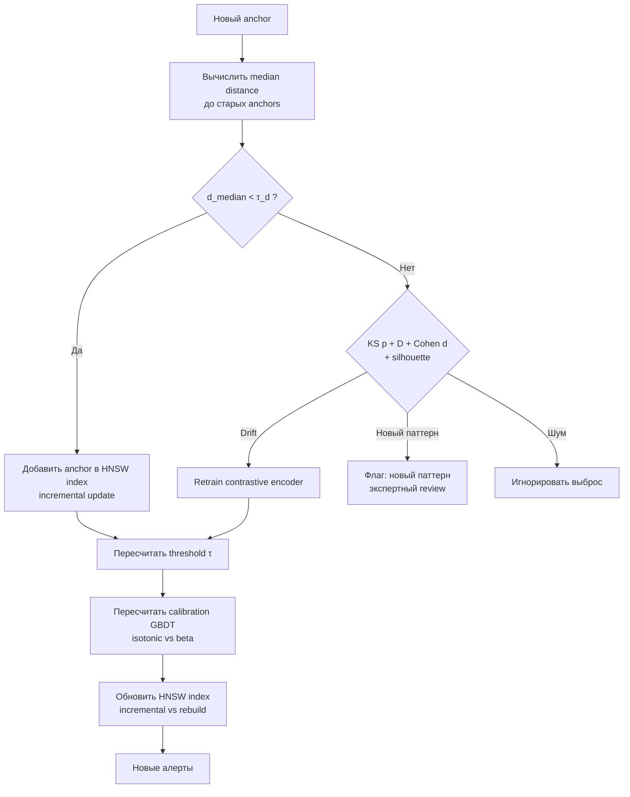
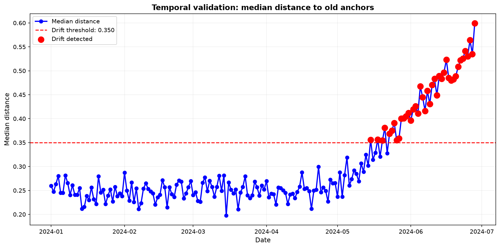
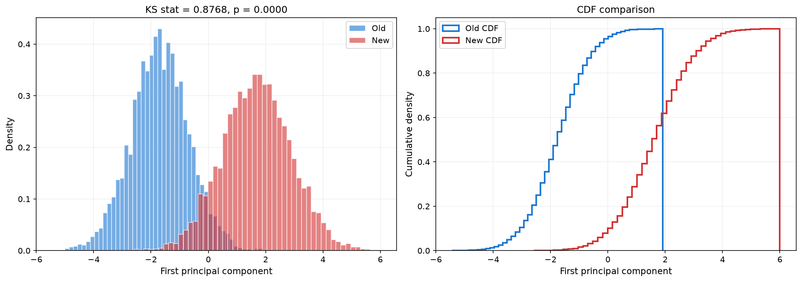
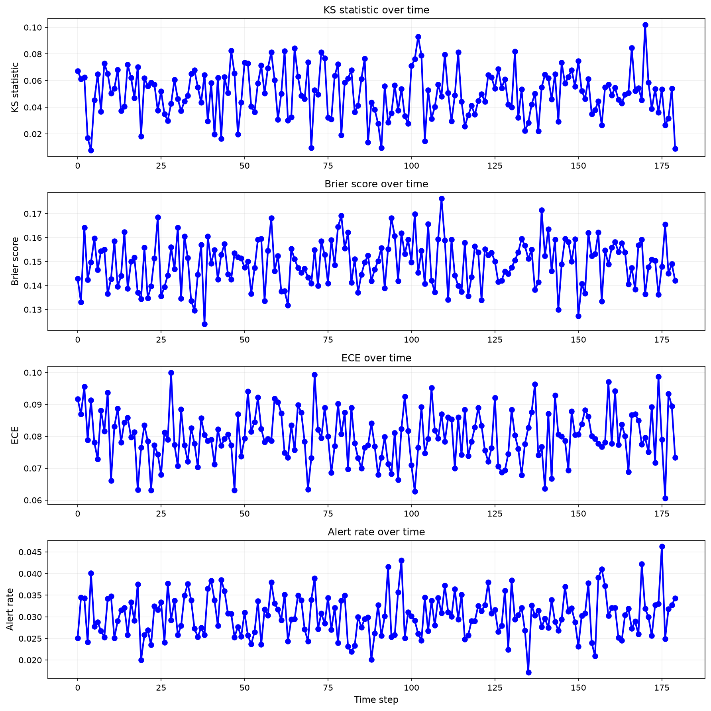
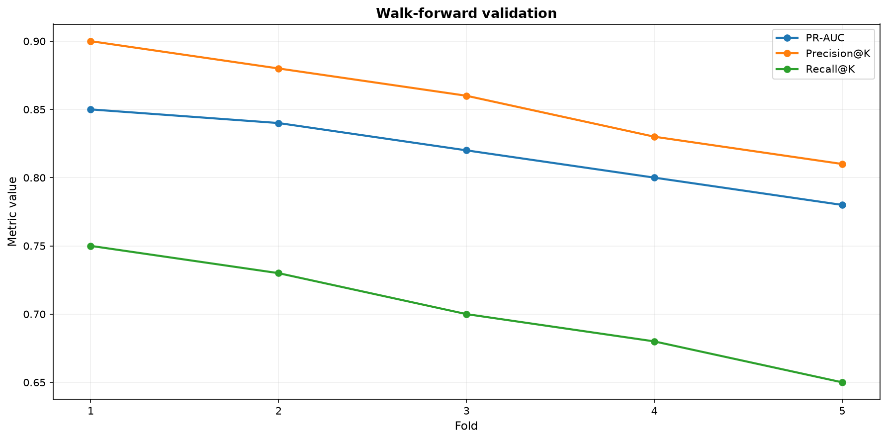

# 9. Temporal validation и self-evolution

Система риск-скоринга стареет: санкционные списки пополняются, паттерны активности эволюционируют (новые протоколы, ZK-миксеры, кросс-чейн мосты), распределение эмбеддингов сдвигается. Без механизма самопроверки precision и recall монотонно падают, а доля нерелевантных алертов растёт — тихо, без единой ошибки в логах. Эта глава описывает, как система честно оценивает себя на будущем (temporal validation), как различает дрейф, новый паттерн и шум, и как новые санкции превращаются в бесплатный self-supervised сигнал.

## 9.1. Постановка задачи

Во времени происходят три вещи: пополнение санкционных списков (OFAC SDN, EU Consolidated, UN SC, OFSI), эволюция паттернов активности и сдвиг распределения эмбеддингов $P_t(z)$. Temporal validation решает двойную задачу — даёт несмещённую оценку обобщения на будущее и автоматически запускает переобучение, когда оно действительно нужно.

Ключевая идея self-evolution: новые санкции — готовый экзаменационный материал. Пусть $\mathcal{A}_{\text{old}}$ — якоря на момент $t_0$, $z_a = f_\theta(x_a)$ — их эмбеддинги. Для нового якоря $a_{\text{new}}$, добавленного в $t_1 > t_0$, измеряется $d_{\text{median}}(a_{\text{new}})$ — и по нему принимается решение о режиме работы. Важно, что новый якорь не используется как обучающая метка — это была бы утечка; он используется именно как экзамен.

## 9.2. Temporal split: почему нельзя перемешивать

### 9.2.1. Две причины

Случайное разбиение train/test в on-chain анализе неприемлемо, и причин две, обе фатальные.

**Утечка (data leakage).** Транзакция из будущего, попавшая в train, — это обучение на признаках, ставших известными после события. Пример: illicit-адрес, санкционированный в 2024-м, в train 2022 года завышает метрики безнадёжно — модель «знает» то, чего знать не может. Нарушается условие $P_{\text{train}}(X,Y) \perp\!\!\!\perp P_{\text{test}}(X,Y) \mid t$.

**Маскировка дрейфа.** Перемешивание смешивает распределения разных времён, и деградация качества становится невидимой: оценка на такой выборке не отвечает на главный вопрос — обобщает ли модель на $t > t_0$.

### 9.2.2. Разбиение и walk-forward

Разбиение строго по времени без перемешивания:

```
|-------- train --------|---- validation ----|---- test ----|
         прошлое          ближе к настоящему     будущее
```

Процедура: сортировка по `timestamp`, фиксация границ (например, train до 2023-01-01, validation до 2023-06-01, test после), обучение на train, настройка гиперпараметров на validation, финальная оценка на test. Test всегда в будущем относительно всего остального.

Одного разреза мало: оценка зависит от выбора границ. **Walk-forward** повторяет процедуру со сдвигами:

```
Fold 1: train [t0, t1] → test [t1, t2]
Fold 2: train [t0, t2] → test [t2, t3]
Fold 3: train [t0, t3] → test [t3, t4]
...
```

Это даёт устойчивость метрик по окнам и обнаружение монотонной деградации — главного признака дрейфа. Основная метрика walk-forward — PR-AUC (плюс Precision@K / Recall@K); выбор перед ROC-AUC продиктован дисбалансом классов: ROC-AUC раздувается за счёт огромного числа true negatives, PR-AUC чувствителен к редкому классу. Альтернатива отвергнута не умозрительно: на исторических folds PR-AUC коррелировал с бизнес-метрикой expected cost ($r=0.71$), ROC-AUC — на уровне шума ($r=0.12$). Критерий дрейфа по walk-forward: падение PR-AUC $>10\%$ между медианами первых трёх и последних трёх folds либо монотонный тренд (Mann-Kendall $p<0.05$).

## 9.3. Новые санкции как self-supervised сигнал

### 9.3.1. Median distance и порог

Для нового якоря $a_{\text{new}}$:

$$
d_{\text{median}}(a_{\text{new}}) = \text{median}_{a \in \mathcal{A}_{\text{old}}} \|z_{a_{\text{new}}} - z_a\|_2
$$

Малое значение — пространство обобщает, достаточно инкрементального обновления индекса; большое — нужен разбор: дрейф, новый паттерн или выброс. Порог $\tau_d$ калибруется на истории: для каждого якоря, добавленного в момент $t$, вычисляется $d_{\text{median}}$ до якорей старше $t$; по эмпирическому распределению берётся квантиль.

### 9.3.2. Quantile vs cost-function

| Подход | Принцип | Плюс | Минус |
|--------|---------|------|-------|
| Quantile (95-й/99-й) | $\tau_d = Q_{1-\alpha}$ | Непараметричен, устойчив к выбросам, не требует оценок стоимости | Не минимизирует бизнес-стоимость напрямую |
| Cost-function | $\tau_d = \arg\min_\tau [C_{FP}FP(\tau)+C_{FN}FN(\tau)]$ | Оптимален по expected cost | Чувствителен к ошибкам в $C_{FP}, C_{FN}$ |

Решение Spillety разделяет роли: для дрейф-детектора — **quantile** (детектор должен быть робастным и не зависеть от волатильных бизнес-оценок), для операционной точки алертов — **cost-function** (там экономика — суть задачи; см. раздел 8).

По квантилю: 95-й даёт FPR детектора 5% и низкий пропуск дрейфа, 99-й — FPR 1% и выше пропуск. На walk-forward 2022–2024: 95-й — recall дрейф-событий $0.92$ при precision $0.68$; 99-й — recall $0.71$, precision $0.89$. При $C_{FN}/C_{FP}=10$ оптимум по expected cost — 95-й, он и дефолт; 99-й — режим дорогих перестроек. Сами коэффициенты: $C_{FP}$ — трудозатраты аналитика, стоимость ложной блокировки, операционная нагрузка; $C_{FN}$ — регуляторные штрафы (FinCEN, OFAC), репутационный ущерб, стоимость пропущенного потока. Отношение $C_{FN}/C_{FP}$ калибруется в диапазоне $5$–$20$, базовое $10$.

### 9.3.3. Два режима



**Режим 1 (норма):** $d_{\text{median}} < \tau_d$ — семантика пространства сохранилась, якорь вставляется в индекс инкрементально. **Режим 2 (аномалия):** $d_{\text{median}} \ge \tau_d$ — требуется различение дрейфа, нового паттерна и шума.

### 9.3.4. Дрейф, новый паттерн или шум

Одномерного $d_{\text{median}}$ недостаточно: высокое значение может означать и общий сдвиг распределения, и появление нового кластера, и единичный выброс — а действия для этих трёх случаев противоположны. Применяется двумерный критерий:

| Ситуация | KS $p+D$ + Cohen $d$ | Silhouette | Интерпретация | Действие |
|----------|----------------------|------------|---------------|----------|
| Норма | $p \ge 0.05$, $D$ мал, $d$ мал | Высокий | Эмбеддинг обобщает | Incremental update |
| Drift | $p < 0.05$, $D$ велик, $d$ велик | Низкий | Сдвиг всего распределения | Retrain |
| Новый паттерн | $p \ge 0.05$, $D$ мал | Низкий | Новый компактный кластер | Экспертный review, без retrain |
| Шум | $p < 0.05$, $D$ велик | Высокий | Единичный выброс | Игнорировать |

Здесь принципиальный статистический момент: $p$-значение зависит от объёма выборки, и при $N>10^5$ даже пренебрежимый сдвиг даёт $p<0.05$. Поэтому решение никогда не принимается по $p$ одному: $p$ отвечает «есть ли сдвиг статистически», а $D$ (KS-статистика) и Cohen $d$ — «велик ли он практически». Правило Spillety: дрейф фиксируется при $p<0.05$ **и** $D>0.10$ **и** $|d|>0.30$; пороги калибруются на исторических walk-forward срезах. Цена вопроса конкретна: детектор только по $p$ давал FPR $0.41$; добавление effect size снизило FPR до $0.08$ при сохранении recall $0.90$.

Silhouette вычисляется для нового якоря относительно ближайшего кластера старых; значение ниже $0.20$ — межкластерное положение, признак нового паттерна.

## 9.4. Retraining и обновление индекса

### 9.4.1. Два уровня обновления

| Уровень | Объём | Latency | Триггер | Retrain |
|---------|-------|---------|---------|---------|
| Online (признаки) | Пересчёт признаков, HNSW lookup | Миллисекунды | Каждая транзакция | Нет |
| Offline (модель) | Переобучение энкодера, пересчёт эмбеддингов, перестройка HNSW | Часы | Drift или расписание | Да |

### 9.4.2. Incremental HNSW vs rebuild

HNSW поддерживает вставку без полной перестройки, но у инкрементальности есть предел: с ростом числа вставок граф теряет сбалансированность, recall@K падает, латентность растёт.

| Стратегия | recall@10 | p95 latency | ECE drift | Когда |
|-----------|-----------|-------------|-----------|-------|
| Incremental insert | $0.92 \to 0.84$ после 50k вставок | $12 \to 18$ мс | $+0.01$ | Дефолт режима 1, до лимита |
| Full rebuild | $0.95$ стабильно | $11$ мс | $0$ | После retrain или при превышении лимита |

Критерий переключения: rebuild при падении recall@10 ниже $0.88$ на hold-out или после $N=20\,000$ инкрементальных вставок; еженедельный контроль hold-out recall@K, три дня подряд ниже порога — триггер.

### 9.4.3. Пересчёт порога и калибровки

После retraining и обновления индекса пересчитывается порог алертов:

$$
\tau = \arg\min_{\tau} \left[ C_{FP} \cdot FP(\tau) + C_{FN} \cdot FN(\tau) \right]
$$

с ограничением recall $\ge 0.90$; при изменении $C_{FN}/C_{FP}$ (например, новые регуляторные требования) порог пересчитывается без retrain. Распределение признаков после переобучения энкодера меняется — калибровка GBDT устаревает и перестраивается: пересчёт признаков на validation, обучение калибратора заново, оценка Brier/ECE на test, проверка reliability diagram.

Выбор калибратора — по объёму валидации: **beta** при $N_{\text{val}} < 5\,000$ (параметрическая устойчивость), **isotonic** при $N_{\text{val}} \ge 5\,000$ (непараметрическая гибкость). На walk-forward folds сравниваются Brier и ECE; берётся меньший ECE при Brier drift $<0.02$. Исторически isotonic выигрывал по ECE на $0.015$ при больших $N$, но проигрывал по Brier на малых. Триггер перекалибровки — Brier drift $>0.05$ или ECE drift $>0.05$ между train и test.

## 9.5. Active learning без selection bias

### 9.5.1. Проблема

Стандартный active learning отдаёт на разметку uncertain-примеры (Tier 2–3) — и этим создаёт selection bias: модель учится только на uncertain-области, а систематические ошибки в уверенных зонах (auto-clear, auto-block) не обнаруживаются никогда. Пример: кошелёк со скором $0.95$, ошибочно помеченный illicit, не попадёт в разметку ни при каком качестве модели.

### 9.5.2. Random sampling и power analysis

Решение — стратифицированная случайная проверка уверенных зон:

| Уровень | Доля случайных проверок | Цель |
|---------|------------------------|------|
| Auto-clear | $0.1$–$1\%$ | Оценка recall, обнаружение FN |
| Auto-block | $1$–$5\%$ | Оценка precision Tier 1, обнаружение FP |
| Tier 2–3 | $100\%$ | Обучение |

Размер выборки — по power analysis под целевую полуширину доверительного интервала:

$$
n = \frac{z_{1-\alpha/2}^2 \cdot p \cdot (1-p)}{e^2}
$$

где $z$ — квантиль нормального распределения ($1.96$ для 95%), $p$ — ожидаемая precision/recall, $e$ — допустимая полуширина. Пример: precision $0.90$ с $\pm5\%$ требует $n = \frac{1.96^2 \cdot 0.9 \cdot 0.1}{0.05^2} \approx 138$ случайных auto-block в месяц; для $p\approx0.05$ — $n\approx73$, для $p\approx0.50$ — $n\approx384$. Расчёт отдельный для каждого Tier.

Смысл в несмещённости: только random sampling даёт честные оценки

$$
\text{Precision}_{\text{unbiased}} = \frac{\text{TP в random sample}}{\text{все в random sample}}, \qquad
\text{Recall}_{\text{unbiased}} = \frac{\text{TP в random sample из auto-clear}}{\text{все illicit в random sample}},
$$

тогда как метрики на Tier 2–3 описывают лишь uncertain-область, а не генеральную совокупность.

## 9.6. Drift monitoring

### 9.6.1. Метрики и пороги

| Метрика | Расчёт | Порог |
|---------|--------|-------|
| KS на эмбеддингах | $P_{t_0}(z)$ vs $P_{t_1}(z)$; $p$, $D$, Cohen $d$ | $p<0.05$ **и** $D>0.10$ **и** $|d|>0.30$ |
| Brier drift | $\| \text{Brier}_{test} - \text{Brier}_{train}\|$ | $>0.05$ |
| ECE drift | $\| \text{ECE}_{test} - \text{ECE}_{train}\|$ | $>0.05$ |
| Alert rate drift | Изменение доли алертов | $>20\%$ за 7 дней |
| PR-AUC drift | Падение на walk-forward hold-out | $>10\%$ |
| Precision@K / Recall@K drift | Падение на hold-out | $>10\%$ |

Brier/ECE drift меряют деградацию калибровки, KS — сдвиг представления, PR-AUC/Recall@K — бизнес-качество; пороги калибруются на исторических folds.

### 9.6.2. Dashboard и триггеры

Dashboard обновляется ежедневно: временные ряды KS $p$, $D$, Cohen $d$; Brier, ECE и их drift; alert rate по дням; precision/recall/PR-AUC на hold-out; распределения скоров и $d_{\text{median}}$. Превышение любого порога — alert команде.

Триггеры retraining:

| Триггер | Условие | Действие |
|---------|---------|----------|
| Новые санкции | $>N$ якорей и $d_{\text{median}} \ge \tau_d$ | Temporal validation → KS/silhouette |
| KS drift | $p<0.05$, $D>0.10$, $|d|>0.30$ на $3+$ срезах подряд | Retrain |
| Brier/ECE drift | $>0.05$ | Перекалибровка → при сохранении retrain |
| PR-AUC / Recall@K drift | Падение $>10\%$ | Retrain |
| Периодический | Раз в месяц | Полная рекластеризация и пересчёт $\tau$ |

Параметр $N$ калибруется по recall@K: если добавление $N$ якорей не роняет recall ниже порога, лимит увеличивается.

## 9.7. Сводка выборов

| Выбор | Альтернативы | Критерий победы | Решение |
|-------|--------------|-----------------|---------|
| Порог дрейфа | quantile vs cost-function | Робастность без оценок $C$; expected cost при $C_{FN}/C_{FP}=10$ | Quantile для детектора, cost для operating point |
| Квантиль | 95-й vs 99-й | Баланс FPR/FNR при заданном $C_{FN}/C_{FP}$ | 95-й дефолт, 99-й при дорогих перестройках |
| Drift-сигнал | $p$ vs $D$+Cohen $d$ | FPR $<0.10$ при recall $\ge0.90$ | $p+D+d$ совместно |
| Калибровка | isotonic vs beta | $\min$ ECE при Brier drift $<0.02$ | Beta при $N<5k$, isotonic при $N\ge5k$ |
| Индекс | incremental vs rebuild | recall@10 $\ge0.88$, latency $<20$мс | Incremental до $N=20k$ / recall $<0.88$ |
| Метрика walk-forward | PR-AUC vs ROC-AUC | Корреляция с expected cost | PR-AUC |

Все выборы фиксируются в evidence JSON (глава 10) и проверяются через audit verification / Merkle proof.

## 9.8. Визуализация



Медианное расстояние новых якорей до старых во времени; красная линия — $\tau_d$ (95-й квантиль); точки выше порога — кандидаты на retraining.



Сравнение распределений эмбеддингов на старых и новых данных: гистограммы и CDF, KS $D$, $p$, Cohen $d$.



Динамика KS, Brier, ECE, PR-AUC, alert rate; выход за порог — alert.



PR-AUC, Precision@K, Recall@K по folds; монотонное падение — сигнал дрейфа.

## 9.9. Ограничения

1. **Selection bias сохраняется частично**: random sampling ограничен ресурсами, при малом $n$ интервалы широки.
2. **KS с effect size обнаруживает сдвиг, но не его причину**; различение дрейфа и нового паттерна опирается на эмпиричный silhouette.
3. **Стоимость retraining** на $80\text{M}+$ кошельков; частота — компромисс между качеством и вычислительным бюджетом.
4. **Накопление ошибок HNSW**; периодический rebuild обязателен.
5. **Power analysis чувствителен к априорной оценке $p$**; ошибка в ней занижает $n$.
6. **Смещённость санкционной выборки**: OFAC-пополнения не случайны, temporal validation на них не даёт unbiased оценку — дополняется random sampling.
7. **Операционная нагрузка мониторинга** (dashboard, alerting, хранение рядов) требует инфраструктуры WORM-аудита из главы 10.

---

## См. также

- [06_cost_operating_point.ipynb](../notebooks/06_cost_operating_point.ipynb) — выбор operating point по cost-функции.
- [08_temporal_validation.ipynb](../notebooks/08_temporal_validation.ipynb) — walk-forward валидация и детекция дрейфа.