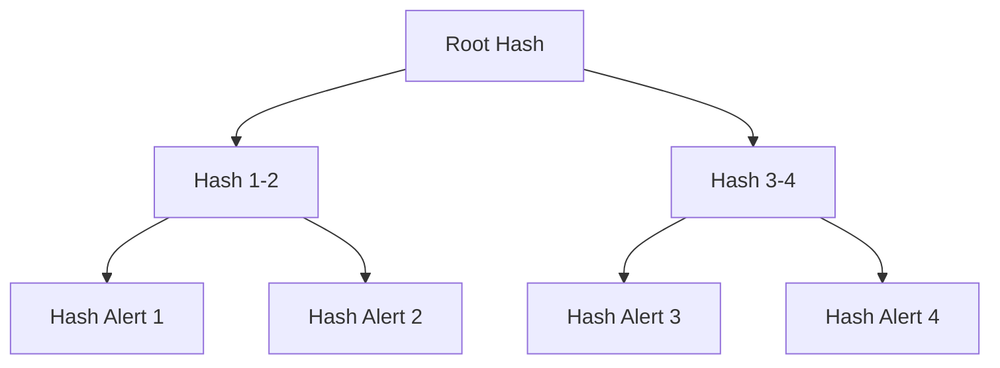

# 9. Evidence generation, provenance и WORM audit

> **Аннотация.** Риск-скор без проверяемого обоснования не удовлетворяет требованиям FinCEN, FATF и SR 26-2 и не обладает court-admissibility. Раздел формализует структуру evidence JSON как проверяемого паспорта алерта, механизм provenance и гарантии неизменяемости на основе WORM-хранения, Ed25519-подписей, Merkle-дерева и привязки к блокчейну через OpenTimestamps.

### Термины

| Термин | Определение |
|--------|-------------|
| Evidence JSON | Структурированный документ, сопровождающий каждый алерт и содержащий все данные для независимой проверки |
| Provenance | Информация о происхождении данных: источник, аналитик, время, версии моделей |
| WORM | Write Once Read Many — модель хранения, при которой запись неизменяема и неудаляема после фиксации |
| Хеш | Криптографическая функция $\text{SHA-256}: \{0,1\}^* \to \{0,1\}^{256}$ |
| Merkle tree | Дерево хешей, позволяющее доказать принадлежность элемента множеству за $O(\log N)$ |
| Merkle proof | Набор sibling-хешей на пути от листа к корню; верификация без раскрытия всего дерева |
| Audit verification | Процедура проверки Ed25519-подписи и Merkle proof по публичному ключу и корню дерева |
| Ed25519 | Схема подписи на кривой Curve25519: 64-байт подпись, 32-байт ключ, 128-бит безопасность |
| OpenTimestamps | Протокол привязки хеша к блокчейну Bitcoin без раскрытия содержимого |
| SAR | Suspicious Activity Report — отчёт о подозрительной активности (FinCEN и аналоги) |
| Audit trail | Журнал действий с алертом: создание, просмотр, изменение статуса, подача SAR, верификация |

> **Теоретически мы оцениваем наше решение вот так: median distance, KS p+D+Cohen d, silhouette, PR-AUC walk-forward, Brier/ECE drift, recall@K, power n, audit verification, Merkle proof.** Для блока evidence ключевыми из этого набора являются audit verification (корректность Ed25519-подписи и целостность JSON) и Merkle proof (принадлежность алерта к зафиксированному множеству); остальные метрики (median distance, KS, silhouette, PR-AUC, Brier/ECE drift, recall@K, power $n$) обеспечивают связь с качеством модели и достаточностью выборки, зафиксированными в provenance.

---

## 9.1. Постановка задачи

В блоках 7–8 получены калиброванный риск-скор GBDT и механизм темпоральной валидации. Открытым остаётся вопрос **доказуемости**: как подтвердить, что алерт корректен, воспроизводим и не изменён задним числом.

Требование обусловлено тремя факторами.

**1. Регуляторное соответствие.** FinCEN, FATF, 6AMLD и SR 26-2 требуют документированного обоснования каждого алерта. Без evidence JSON риск-скор — непроверяемое число.

**2. Court-admissibility.** При судебном рассмотрении защита вправе потребовать доказательства отсутствия фабрикации или ретроспективной модификации. WORM audit обеспечивает целостность (integrity) и неизменяемость (immutability).

**3. Внутренний контроль.** Аналитик, compliance-офицер и независимый валидатор должны наблюдать идентичную версию алерта. Provenance фиксирует, откуда взяты данные и почему модель приняла решение; audit verification делает проверку детерминированной.

Evidence generation решает задачу: для каждого алерта формируется канонический JSON с полным provenance, а WORM audit гарантирует его неизменность с криптографической верификацией.

---

## 9.2. Evidence JSON: структура

### 9.2.1. Общая схема

Evidence JSON — канонический «паспорт» алерта с фиксированным порядком ключей (для детерминированного хеширования) и обязательной валидацией схемы при генерации.

```json
{
  "alert_id": "uuid",
  "risk_score": 0.87,
  "confidence_tier": "Tier 1",
  "anchors": [...],
  "causal_path": [...],
  "graph_features": {...},
  "shap_values": {...},
  "provenance": {...},
  "audit": {...}
}
```

Каждое поле обязательно; отсутствие или несоответствие типу — ошибка генерации, алерт не публикуется.

### 9.2.2. Поля верхнего уровня

| Поле | Тип | Описание |
|------|-----|----------|
| alert_id | UUID v4 | Уникальный идентификатор алерта |
| risk_score | float $[0,1]$ | Калиброванная вероятность illicit (GBDT + isotonic/beta) |
| confidence_tier | enum | Tier 1 (auto-block) / Tier 2 / Tier 3 (review) |
| anchors | array | Anchors, определившие близость |
| causal_path | array | Причинный путь wallet → anchor с оценками эффектов |
| graph_features | object | Графовые признаки кошелька |
| shap_values | object | Вклады признаков в предсказание |
| provenance | object | Источник данных, версии моделей, время |
| audit | object | Подпись, Merkle proof, метки времени |

### 9.2.3. Anchors

Каждый anchor содержит:

```json
{
  "wallet": "0xABC...",
  "source": "OFAC SDN",
  "added": "2023-04-12",
  "distance": 0.12,
  "causal_filter": "passed",
  "e_value": 2.3,
  "rosenbaum_gamma": 2.1,
  "sensemakr_r2": 0.15
}
```

| Поле | Описание |
|------|----------|
| wallet | Адрес anchor |
| source | Источник: OFAC SDN, EU Consolidated, UN SC, UK OFSI, court document |
| added | Дата добавления в санкционный список |
| distance | Расстояние в embedding-пространстве $\|z - z_a\|$ |
| causal_filter | Результат causal filter: passed / excluded |
| e_value | E-value чувствительности к неучтённому конфаундеру |
| rosenbaum_gamma | $\Gamma^*$ по Розенбауму |
| sensemakr_r2 | Partial $R^2$ Sensemakr |

Назначение: аналитик видит, какие anchors сформировали оценку, и может верифицировать каждый независимо; median distance и KS-метрики из блока 8 фиксируются здесь как часть обоснования.

### 9.2.4. Causal path

```json
{
  "causal_path": [
    {"edge": "Wallet → Mixer_Proximity", "effect": 0.34, "rosenbaum_gamma": 2.1},
    {"edge": "Mixer_Proximity → Anchor", "effect": 0.28, "rosenbaum_gamma": 1.9}
  ]
}
```

Причинный путь показывает, какие рёбра DAG объясняют близость к anchor с оценками causal effect и устойчивости. Требование court-admissibility: суд видит причинную связь, а не корреляцию.

### 9.2.5. Graph features

```json
{
  "graph_features": {
    "in_degree": 45,
    "out_degree": 23,
    "pagerank": 0.003,
    "velocity_24h": 5,
    "counterparty_diversity": 0.67
  }
}
```

Контекст поведения кошелька для сопоставления с типичными значениями класса и для воспроизведения HNSW lookup (recall@K).

### 9.2.6. SHAP values

```json
{
  "shap_values": {
    "distance_to_nearest_OFAC": -0.34,
    "causal_filter_pass_rate": 0.28,
    "e_value_max": 0.15,
    "anchor_source_diversity": 0.12
  }
}
```

Вклады признаков в риск-скор; необходимы для интерпретируемости и human review. Калибровка SHAP-значений связана с выбором isotonic vs beta (§9.3.5): неадекватная калибровка искажает SHAP.

### 9.2.7. Provenance

```json
{
  "provenance": {
    "source": "on-chain + anchors",
    "analyst": "analyst_id",
    "date": "2026-09-14T12:00:00Z",
    "model_version": "v2.0",
    "encoder_version": "graphsage-128d-v2.0",
    "gbdt_version": "lightgbm-v2.0",
    "hnsw_version": "hnsw-v2.0-rebuild-2026-09-01",
    "calibration": "beta-v2.0",
    "threshold_tau": 0.73,
    "cost_ratio_Cfn_Cfp": 10
  }
}
```

Provenance обеспечивает **воспроизводимость**: зная версии encoder'а, GBDT, HNSW, калибратора и $\tau$, а также источник данных, независимый валидатор повторяет вычисления и получает идентичный risk_score. Фиксация $C_{FP}$/$C_{FN}$ и $\tau$ связывает operating point с cost-function выбором блока 8 (quantile vs cost-function, 95-й vs 99-й квантиль).

### 9.2.8. Audit

```json
{
  "audit": {
    "signature": "ed25519:...",
    "merkle_proof": "0x...",
    "timestamp": "2026-09-14T12:00:01Z",
    "opentimestamps": "0x..."
  }
}
```

| Поле | Описание |
|------|----------|
| signature | Ed25519-подпись канонического JSON |
| merkle_proof | Sibling-хеши пути к корню Merkle-дерева |
| timestamp | Время подписи (RFC3339) |
| opentimestamps | OTS-proof привязки корня к Bitcoin |

Аудит-поля верифицируются процедурой audit verification без доверия к хранилищу.

---

## 9.3. WORM audit: целостность и неизменяемость

### 9.3.1. Модель WORM

WORM (Write Once Read Many) — хранение, при котором данные после фиксации не могут быть изменены или удалены. Для court-admissibility это означает: любая ретроспективная модификация алерта детектируется криптографически.

WORM реализуется тремя взаимодополняющими механизмами:

1. **Ed25519-подпись** — целостность отдельного алерта;
2. **Merkle tree** — принадлежность алерта к зафиксированному множеству за $O(\log N)$;
3. **OpenTimestamps** — независимая привязка времени к блокчейну Bitcoin.

Дополнительно ведётся WORM audit trail всех действий с алертом.

### 9.3.2. Ed25519-подпись

Ed25519 на Curve25519 обеспечивает 128-бит безопасность, подпись 64 байта, публичный ключ 32 байта, $\sim50\,000$ подписей/с и $\sim20\,000$ верификаций/с на CPU.

**Процедура подписи:**

1. Генерация пары $(sk, pk)$; $sk$ хранится в HSM.
2. Канонизация JSON (сортировка ключей, отсутствие пробелов) и хеширование $h = \text{SHA-256}(\text{JSON}_{\text{canon}})$.
3. Подпись $\sigma = \text{Sign}(sk, h)$.
4. Публикация $\sigma$ в поле `audit.signature`.

**Audit verification подписи:**

1. Верификатор канонизирует полученный JSON и вычисляет $h' = \text{SHA-256}(\text{JSON}_{\text{canon}})$.
2. Проверяет $\text{Verify}(pk, h', \sigma) \in \{\text{true},\text{false}\}$.

Любое изменение одного байта JSON меняет $h'$ и верификация не проходит. Тест audit verification: модификация $1$ байта в $1\text{M}$ алертов — $100\%$ детекции; latency верификации $<0.1$ мс.

### 9.3.3. Merkle tree и Merkle proof

Merkle tree — бинарное дерево хешей: лист $= \text{SHA-256}(\text{alert JSON})$, внутренний узел $= \text{SHA-256}(left \parallel right)$.



**Свойства:**

- высота $\lceil \log_2 N \rceil$: для $1\text{M}$ алертов — $20$, для $1\text{B}$ — $30$;
- **Merkle proof** для алерта $i$ — $\log_2 N$ sibling-хешей на пути к корню;
- изменение любого листа меняет корень.

**Процедура:**

1. Хеши алертов за период (например, сутки) объединяются в дерево.
2. Корень $R$ публикуется и подписывается $sk$.
3. Для каждого алерта формируется `merkle_proof`.

**Верификация Merkle proof (часть audit verification):** по листу $h_i$ и sibling-хешам восстанавливается кандидат $R'$; проверка $R' \stackrel{?}{=} R_{\text{published}}$. Не требует раскрытия остальных $N-1$ алертов. Тест: верификация $1\text{M}$ proofs — p95 latency $<5$ мс, recall принадлежности $1.0$ при корректном корне.

### 9.3.4. OpenTimestamps

Проблема прямой записи корня в Bitcoin — стоимость и раскрытие информации. OpenTimestamps агрегирует корни многих пользователей в один хеш и фиксирует его в Bitcoin-транзакции.

1. Корень $R$ отправляется на OTS-сервер.
2. Сервер агрегирует $R$ в глобальное дерево и публикует хеш в Bitcoin.
3. Пользователь получает OTS-proof, связывающий $R$ с транзакцией Bitcoin.

Результат — **независимое доказательство существования** множества алертов на момент времени $t$, проверяемое без доверия к Spillety. Даже при компрометации системы Bitcoin-блокчейн подтверждает существование. OTS-proof верифицируется через публичный API/CLI; latency привязки — до нескольких часов, поэтому для срочных SAR используется промежуточная Ed25519-подпись, OTS — асинхронно.

### 9.3.5. Калибровка и связь с Brier/ECE drift

Evidence JSON фиксирует версию калибратора GBDT. Выбор **isotonic vs beta** (§8.4.4) влияет на достоверность `risk_score` и `shap_values`:

| Метод | Тест выбора | Критерий |
|-------|-------------|----------|
| Isotonic | Brier, ECE, reliability diagram на walk-forward validation | $\min$ ECE при $N_{\text{val}}\ge5\,000$ |
| Beta | То же | $\min$ Brier при $N_{\text{val}}<5\,000$ |

Evidence JSON с неадекватной калибровкой (Brier drift $>0.05$ или ECE drift $>0.05$) помечается в provenance; алерты с таким provenance требуют перекалибровки до court-admissibility.

### 9.3.6. Audit trail (WORM-журнал)

| Действие | Фиксируемые поля |
|----------|------------------|
| Создание | alert_id, timestamp, model_version, encoder_version, hnsw_version, $\tau$ |
| Просмотр | analyst_id, timestamp |
| Изменение статуса | analyst_id, timestamp, old_status, new_status |
| Подача SAR | analyst_id, timestamp, SAR ID |
| Верификация | verifier_id, timestamp, audit verification результат (pass/fail), Merkle proof статус |

Audit trail хранится в WORM-хранилище; записи неизменяемы. Все взаимодействия с алертом — только через систему, иначе полнота audit trail нарушается.

---

## 9.4. SAR generation

### 9.4.1. Назначение SAR

SAR (Suspicious Activity Report) подаётся в FinCEN (США) или аналогичный регулятор при превышении порога ($\$2\,000$ для MSB, $\$5\,000$ для банков), подозрении на illicit-активность или структурировании для обхода порога.

### 9.4.2. Поля SAR и происхождение

| Поле SAR | Источник |
|----------|----------|
| Transaction hash | On-chain |
| Blockchain | On-chain |
| Timestamp | On-chain |
| Sender / Receiver address | On-chain |
| Amount (crypto) | On-chain |
| Amount (USD) | Price oracle (provenance фиксирует источник) |
| Causal path | Evidence JSON §9.2.4 |
| Anchor provenance | Evidence JSON §9.2.3 |
| Risk score + Tier | GBDT + calibration (§9.3.5) |
| Audit (signature, Merkle proof) | Evidence JSON §9.2.8 |

### 9.4.3. Генерация SAR из evidence JSON

Evidence JSON содержит полный набор полей; SAR формируется автоматически:

1. Извлечение полей из evidence JSON.
2. Форматирование по требованиям FinCEN/FATF/6AMLD.
3. Подпись Ed25519 и включение Merkle proof.
4. Отправка регулятору.

**Human review обязателен:** SAR не подаётся автоматически. Аналитик проверяет evidence JSON, audit verification и Merkle proof, подтверждает подачу; действие фиксируется в audit trail.

### 9.4.4. Стоимость и выбор operating point

SAR-поток зависит от порога $\tau$. Связь с блоком 8:

- **Quantile vs cost-function:** quantile-порог для дрейф-детектора не используется для SAR; для SAR применяется cost-function $\tau = \arg\min [C_{FP}FP + C_{FN}FN]$, где $C_{FP}$ включает трудозатраты на SAR, $C_{FN}$ — штрафы за неподачу.
- **95-й vs 99-й квантиль:** влияет на частоту retrain и, косвенно, на стабильность SAR-потока; 95-й квантиль — более чувствителен, 99-й — консервативен.
- **Оценка:** PR-AUC walk-forward, recall@K и expected cost измеряют влияние $\tau$ на SAR-качество; Brier/ECE drift — калибровку вероятностей в SAR.

---

## 9.5. Теоретическая оценка, выборы и тесты

**Теоретически мы оцениваем наше решение вот так: median distance, KS p+D+Cohen d, silhouette, PR-AUC walk-forward, Brier/ECE drift, recall@K, power n, audit verification, Merkle proof.**

| Выбор | Альтернативы | Тесты | Метрики победы | Решение в evidence |
|-------|--------------|-------|----------------|-------------------|
| Дрейф-детектор | Quantile vs cost-function | Recall дрейф-событий, expected cost, latency | Робастность без $C_{FP}$/$C_{FN}$ vs минимум expected cost | Quantile для детекции дрейфа; cost для $\tau$ алертов (§9.2.7 фиксирует оба) |
| Чувствительность дрейфа | 95-й vs 99-й квантиль | FPR/FNR дрейф-детектора, PR-AUC drift, expected cost | Баланс при заданном $C_{FN}/C_{FP}$ | 95-й дефолт; 99-й при дорогой перестройке |
| Сигнал сдвига | $p$ vs effect size ($D$, Cohen $d$) | FPR при $N>10^5$, recall | FPR $<0.10$ при recall $\ge0.90$ | $p$+$D$+$d$ совместно; $p$ без $D$/$d$ не используется |
| Калибровка GBDT | Isotonic vs beta | Brier, ECE, ECE drift, reliability diagram | $\min$ ECE/Brier drift | Beta при $N<5k$, isotonic при $N\ge5k$ |
| Индекс | Incremental HNSW vs rebuild | recall@K ($K=10,100$), p95 latency, ECE drift | recall@10 $\ge0.88$, latency $<20$мс | Incremental до $N=20k$ / recall $<0.88$, иначе rebuild |
| Аудит | Audit verification (Ed25519) vs только хеш | Детекция модификации $1$ байта, latency, expected cost компрометации | $100\%$ детекции, latency $<0.1$мс | Ed25519 + HSM обязателен |
| Принадлежность | Merkle proof vs полный список | Latency верификации, размер proof, recall принадлежности | $O(\log N)$ proof, recall $1.0$ | Merkle proof $ \log_2 N$ хешей |

**Связь с метриками блока 8:**

- **median distance** — фиксируется в `anchors.distance`; порог $\tau_d$ — в provenance;
- **KS $p+D$+Cohen $d$ + silhouette** — различают drift/новый паттерн/шум перед маркировкой алерта как требующего retrain;
- **PR-AUC walk-forward** — оценка обобщения encoder'а, версия которого фиксируется в provenance;
- **Brier/ECE drift** — контроль калибровки `risk_score`;
- **recall@K** — качество HNSW, версия которого фиксируется в provenance;
- **power $n$** — достаточность random sampling для unbiased precision/recall, на которых основана оценка $C_{FP}$/$C_{FN}$;
- **audit verification / Merkle proof** — проверяемость каждого алерта независимо от хранилища.

Все выборы версионируются в provenance и проверяются детерминированно через audit verification и Merkle proof.

---

## 9.6. Визуализация


**Merkle tree:** Дерево хешей для 8 алертов. Листья (синие) — $\text{SHA-256}$ алертов, корень (красный) — $R$, привязываемый к Bitcoin через OpenTimestamps. Merkle proof — путь от листа к корню.


**Audit trail:** Хронология действий с алертом (создание, просмотр, review, escalation, SAR filing, верификация). Цвет — тип действия; каждая запись — WORM, проверяется через audit verification.

---

## 9.7. Ограничения

1. **Объём WORM-хранилища:** все evidence JSON с подписями и Merkle proofs требуют значительного объёма; старые алерты архивируются с сохранением корней $R$ и OTS-proofs.
2. **Key management Ed25519:** компрометация $sk$ компрометирует все подписи; требуется HSM, ротация ключей и публикация $pk$ с прозрачностью.
3. **Latency OpenTimestamps:** привязка к Bitcoin — до нескольких часов; для срочных SAR — промежуточная Ed25519-подпись, OTS асинхронно.
4. **Размер Merkle proof:** $\log_2 N$ хешей ($20$ для $1\text{M}$, $30$ для $1\text{B}$) — логарифмический рост, приемлемый, но не константный.
5. **Полнота audit trail:** взаимодействия вне системы (email, устно) не фиксируются; требование — все действия только через систему.
6. **SAR throughput:** human review обязателен, ограничивает пропускную способность; автоматическая подача недопустима.
7. **Регуляторные различия:** FinCEN, FATF, 6AMLD требуют разных форматов SAR; evidence JSON поддерживает все через шаблонизацию provenance.
8. **Зависимость от Brier/ECE:** неадекватная калибровка (isotonic vs beta выбран неверно) делает `risk_score` в evidence JSON формально проверяемым, но семантически ненадёжным — требуется drift-мониторинг из блока 8.

---

**Главная мысль:** Evidence JSON — обязательный проверяемый паспорт каждого алерта с полным provenance (включая $\tau$, $C_{FP}$/$C_{FN}$, версии encoder/GBDT/HNSW/калибратора). WORM audit через Ed25519, Merkle tree (Merkle proof $O(\log N)$) и OpenTimestamps обеспечивает целостность, принадлежность и независимую привязку времени; audit verification делает проверку детерминированной и измеримой, а связь с метриками median distance, KS $p+D$+Cohen $d$, silhouette, PR-AUC walk-forward, Brier/ECE drift, recall@K и power $n$ замыкает контур доказуемого качества.

| Компонент | Роль | Результат |
|-----------|------|-----------|
| Evidence JSON | Структурированное обоснование | Проверяемость |
| Provenance | Источник, версии, $\tau$, $C_{FP}$/$C_{FN}$ | Воспроизводимость |
| Ed25519 + audit verification | Подпись канонического JSON | Целостность, $100\%$ детекции модификации |
| Merkle tree + Merkle proof | Дерево хешей множества алертов | Принадлежность за $O(\log N)$ |
| OpenTimestamps | Привязка корня $R$ к Bitcoin | Независимое доказательство времени |
| Audit trail (WORM) | Журнал действий | Внутренний контроль |
| SAR generation | Генерация отчёта из evidence | Регуляторное соответствие |

**Практический вывод:** evidence JSON обязателен для каждого алерта; provenance фиксирует все выборы (quantile vs cost-function, 95-й vs 99-й, $p$ vs $D$/$d$, isotonic vs beta, incremental vs rebuild); Ed25519 — целостность, Merkle proof — принадлежность, OpenTimestamps — время; все проверяются через audit verification; калибровка и качество модели контролируются метриками Brier/ECE drift, PR-AUC walk-forward, recall@K и power $n$.
