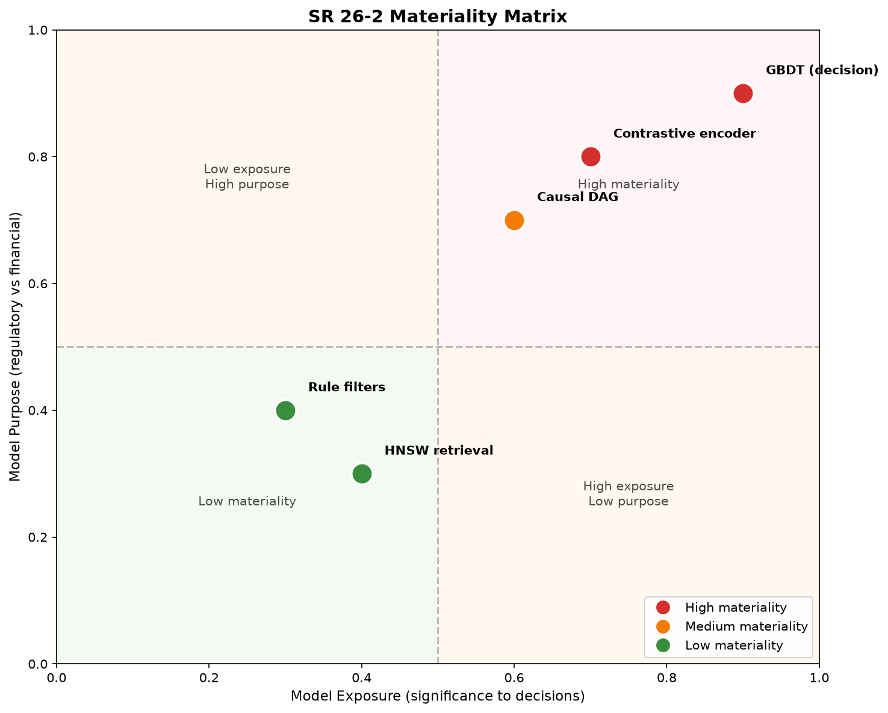
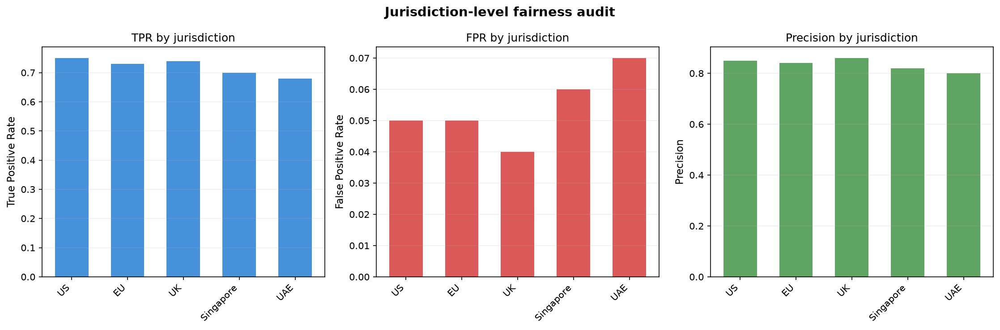
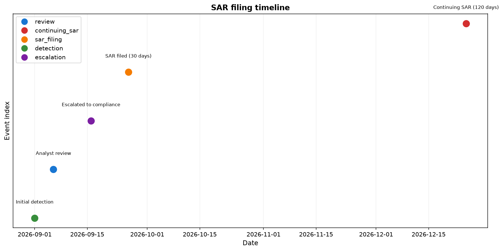

# 10. Регуляторное соответствие: SR 26-2, FATF, FinCEN, 6AMLD, Daubert

> **О чём этот блок простыми словами.**
> Технически правильная система ещё не значит «разрешённая к использованию». Банк не может взять инструмент, который не проходит проверки регуляторов. Этот блок — про «правила дорожного движения»: какие требования предъявляют регуляторы (SR 26-2, FATF, FinCEN, 6AMLD, Daubert) и как Spillety им соответствует.

### Термины

| Термин | Определение |
|--------|-------------|
| SR 26-2 | Revised Guidance on Model Risk Management, выпущено Federal Reserve 17 апреля 2026, заменяет SR 11-7 |
| Model Risk Management (MRM) | Дисциплина управления рисками, связанными с моделями: валидация, мониторинг, governance |
| Materiality | Комбинация model exposure (значимость выхода для решений) и model purpose (регуляторное или финансовое применение) |
| FATF Rec. 16 (Travel Rule) | Требование передачи информации об отправителе и получателе вместе с платёжным сообщением |
| FinCEN SAR | Suspicious Activity Report, подаваемый в FinCEN при подозрении на illicit-активность |
| 6AMLD | Sixth Anti-Money Laundering Directive, гармонизирует определение predicate offences в ЕС |
| Daubert | Критерии допуска экспертных показаний в суде США: testability, error rate, peer review, general acceptance |
| FFIEC | Federal Financial Institutions Examination Council, устанавливает стандарты BSA/AML экзамена |
| Bias audit | Проверка модели на систематическую несправедливость по отношению к защищённым группам |
| Equalized odds | Метрика справедливости: равенство TPR и FPR across groups |

---

## 10.1. Постановка задачи

> **Простыми словами.** Можно построить отличный детектор, но если он не соответствует правилам регулятора, банк его просто не сможет использовать. Соответствие — не «бюрократия сверху», а условие выхода в прод.

В предыдущих блоках была описана техническая архитектура Spillety: contrastive learning, entity resolution, causal DAG, GBDT, temporal validation и WORM audit. Однако техническая корректность не означает регуляторную приемлемость.

**Регуляторное соответствие** — это не бюрократическая надстройка, а **условие работы в проде**. Банк не может использовать систему, которая не классифицирована по SR 26-2, не соответствует FATF Rec. 16, не генерирует FinCEN SAR и не проходит Daubert-валидацию.

Spillety должна соответствовать пяти регуляторным режимам:

1. **SR 26-2** — классификация компонентов, materiality, валидация.
2. **FATF Rec. 16** — Travel Rule для VASP-транзакций.
3. **FinCEN SAR** — генерация отчётов о подозрительной активности.
4. **6AMLD** — predicate offence classification в alert prioritization.
5. **Daubert** — court-admissibility экспертных показаний.

---

## 10.2. SR 26-2: классификация и materiality

### 10.2.1. Что изменилось по сравнению с SR 11-7

> **Простыми словами.** SR 26-2 — обновлённое «руководство по управлению рисками моделей». Главное отличие: раньше ко всем моделям применяли одинаково строгие требования, теперь — по «важности» (materiality). Плюс явно очертили, что считается «моделью», а что нет.

SR 26-2 заменяет SR 11-7 и SR 21-8 (Interagency Statement on Model Risk Management for BSA/AML). Ключевые изменения:

| Область | SR 11-7 | SR 26-2 |
|---------|---------|---------|
| Governance | Uniform rigor для всех моделей | Risk-based, tiered by materiality |
| Model definition | Широкое; включало rule-based tools | Сужено до сложных количественных методов со статистической/экономической/финансовой теорией |
| Materiality | Имплицитная | Явная: model exposure × purpose |
| GenAI / Agentic AI | Не адресовано | Явно вне scope; принципы всё равно применяются |
| Compliance consequences | Supervisory criticism possible | Non-compliance alone не ведёт к supervisory criticism |
| Monitoring | Validation-centric | Больший вес на ongoing monitoring и outcomes analysis |

**Ключевое:** SR 26-2 применяется к banking organizations с total assets > $30 billion. Non-compliance с guidance alone не ведёт к supervisory criticism, но supervisory action может последовать из unsafe or unsound practices.

### 10.2.2. Materiality framework

> **Простыми словами.** «Materiality» = насколько модель важна. Определяется двумя осями: насколько её выход влияет на решения (exposure) и для чего она используется (purpose — регуляторное или финансовое). Чем важнее — тем строже надзор.

**Materiality** определяется как комбинация:

- **Model exposure:** значимость выхода модели для бизнес-решений.
- **Model purpose:** поддерживает ли модель регуляторные требования или финансовый risk management.

**Процедура tiering:**

| Tier | Exposure | Purpose | Governance |
|------|----------|---------|------------|
| High | Критичный для решений | Регуляторный | Full validation, independent review |
| Medium | Влияет на решения | Финансовый | Validation + monitoring |
| Low | Информационный | Внутренний | Identification + performance monitoring |

### 10.2.3. Классификация компонентов Spillety

| Компонент | Классификация | Обоснование |
|-----------|---------------|-------------|
| Contrastive encoder (GraphSAGE) | **Model** | Сложный количественный метод с теорией (contrastive learning) |
| Causal DAG | **Expert-based model** | Документированные предположения; не статистический метод |
| GBDT (LightGBM) | **Model** | Количественный метод с статистической теорией |
| Rule-based filters | **May not qualify as models** | Детерминированные правила, если нет статистической теории |
| HNSW retrieval | **Not model** | Детерминированный алгоритм поиска |
| LLM Explainer | **Excluded from scope** | Generative AI явно вне SR 26-2 |

**FFIEC independent testing:** даже если компонент классифицирован как non-model, он подлежит FFIEC independent testing. Rule-based filters требуют независимой верификации логики и программирования.

### 10.2.4. Validation requirements

> **Простыми словами.** Валидация проверяет три вещи: правильно ли устроена модель (conceptual soundness), как она ведёт себя на реальных данных (outcomes analysis) и не деградирует ли со временем (ongoing monitoring).

SR 26-2 требует три области валидации:

1. **Conceptual soundness:** соответствует ли дизайн модели риск-профилю института.
2. **Outcomes analysis:** above-the-line и below-the-line testing.
3. **Ongoing monitoring:** детекция drift и деградации.

**AML-специфичное дополнение:** data integrity testing — проверка, что данные, необходимые модели, действительно поступают. Wise US был оштрафован на $4.2M в июле 2025 за SAR deficiencies и transaction monitoring data integrity issues.

**Above-the-line / below-the-line testing:**

- **Below-the-line:** понижение threshold ниже production, replay исторических транзакций, review алертов, которые сработали бы — проверка under-detection.
- **Above-the-line:** повышение threshold, sampling алертов, которые были бы потеряны — проверка, что потерянные алерты не были продуктивными.

**Как проверяем:** documented methodology для threshold adjustments; sample sizes calculated; results documented.

### 10.2.5. Validation frequency

SR 26-2 не устанавливает фиксированную частоту. Validation frequency — **risk-based**: зависит от model materiality, change velocity, data limitations.

**Для Spillety:** high-materiality модели (GBDT в decision path) — annual validation; low-materiality (retrieval) — ongoing monitoring + periodic review.

---

## 10.3. FATF Rec. 16 (Travel Rule)

### 10.3.1. Что требует Rec. 16

> **Простыми словами.** «Travel Rule» — правило, по которому вместе с переводом должна «путешествовать» информация об отправителе и получателе. Для криптовалют это означает обмен данными между биржами (VASP) вне блокчейна.

FATF Rec. 16 требует, чтобы информация об отправителе и получателе сопровождала платёжное сообщение при cross-border переводах. Для virtual assets это означает передачу данных между VASP **off-chain** через secure messaging.

**Стандартизированные требования:**

| Поле | Для сумм > USD/EUR 1,000 |
|------|--------------------------|
| Имя отправителя | Да |
| Имя получателя | Да |
| Адрес или country/town | Да (originator) |
| Дата рождения | Да (originator) |
| Account number или unique transaction reference | Да |

**Ревизия Rec. 16 (июнь 2025):**

- Уточнена ответственность в payment chain.
- Стандартизированы требования к информации (name, address, DOB для P2P > USD/EUR 1,000).
- Требование внедрять инструменты защиты от fraud и error.
- Effective by end of 2030.

**Пороги по юрисдикциям:**

| Юрисдикция | Порог |
|------------|-------|
| FATF default | USD/EUR 1,000 |
| US FinCEN | USD 3,000 |
| EU (TFR 2023/1113) | €0 (no threshold) |
| UK | £1,000 |
| Canada | CAD 1,000 |

**EU — outlier:** zero threshold, все CASP-to-CASP transfers покрыты; self-hosted wallet verification required for ≥€1,000.

### 10.3.2. Как Spillety соответствует

Evidence JSON включает originator/beneficiary information для VASP-транзакций. Off-chain данные получаются через VASP-интеграции (фаза 2).

**Проблема Sunrise Issue:** VASP в compliant region транзакции с counterparty, чей регулятор не имплементировал Travel Rule. Решение: enhanced due diligence, direct customer data request, limit activity с higher-risk regions.

---

## 10.4. FinCEN SAR

### 10.4.1. Что такое SAR

> **Простыми словами.** SAR — официальный отчёт «о подозрительной активности», который банк обязан подать регулятору. Есть жёсткие сроки: обычно 30 дней с момента обнаружения.

**SAR** подаётся при подозрении на illicit-активность. FinCEN SAR Filing Instructions определяют:

- **Filing deadline:** 30 calendar days после initial detection; дополнительно 30 days для identify suspect, но не более 60 days total.
- **Порог:** $5,000 для банков, $2,000 для MSBs.
- **Триггеры:** funds derived from illegal activity; designed to evade reporting; no business/lawful purpose; facilitates criminal activity.

**Continuing activity:** FinCEN FAQ (октябрь 2025) уточняет: file SAR, review continuing activity for 90 days, file continuing SAR within 30 days after 90-day review period — total 120 days.

### 10.4.2. SAR generation из evidence JSON

Evidence JSON содержит все необходимые поля:

| SAR поле | Источник |
|----------|----------|
| Transaction hash | On-chain |
| Blockchain | On-chain |
| Timestamp | On-chain |
| Sender address | On-chain |
| Receiver address | On-chain |
| Amount (crypto) | On-chain |
| Amount (USD) | Price oracle |
| Causal path | Evidence JSON |
| Anchor provenance | Evidence JSON |
| Risk score | GBDT |

**Human review обязателен:** SAR не подаётся автоматически. Аналитик проверяет evidence JSON и подтверждает подачу.

---

## 10.5. 6AMLD

### 10.5.1. Что такое 6AMLD

> **Простыми словами.** 6AMLD — директива ЕС, которая расширяет список «первичных преступлений» (predicate offences), за которыми может следовать отмывание. Чем серьёзнее преступление — тем выше приоритет алерта.

6AMLD (Sixth Anti-Money Laundering Directive) гармонизирует определение predicate offences в ЕС. Ключевые изменения:

- **22 predicate offences:** включая cybercrime, environmental crime, tax crime.
- **Aiding, abetting, inciting, attempting:** теперь criminal offences.
- **Legal persons liability:** companies могут быть criminally liable за действия employees.
- **Minimum sentence:** 4 years imprisonment.
- **Dual criminality:** Member States должны criminalise predicate offences, даже если они не illegal в их jurisdiction.

### 10.5.2. Как Spillety соответствует

DAG учитывает predicate offence classification в alert prioritization. Если кошелёк связан с anchor, санкционированным за predicate offence (например, cybercrime), алерт получает более высокий приоритет.

**Реализация:** anchor metadata включает predicate offence type (из court documents). GBDT features включают predicate_offence_severity как признак.

---

## 10.6. Daubert court-admissibility

### 10.6.1. Критерии Daubert

> **Простыми словами.** Daubert — это «экзамен» для экспертных показаний в суде США. Судья проверяет: можно ли метод проверить, известна ли его ошибка, прошёл ли он научную проверку и принят ли в отрасли.

Daubert требует, чтобы экспертное показание было основано на надёжной методологии. Критерии:

| Критерий | Что проверяется |
|----------|-----------------|
| Testability | Можно ли проверить методологию? |
| Error rate | Какова известная error rate? |
| Peer review | Прошла ли методология peer review? |
| General acceptance | Принята ли методология в relevant field? |

**Ключевое:** фокус Daubert inquiry — **на принципах и методологии, не на выводах**.

### 10.6.2. Как Spillety соответствует

| Критерий | Соответствие Spillety |
|----------|----------------------|
| Testability | PR-AUC, Brier, ECE на held-out temporal split |
| Error rate | Precision@K, Recall@K, FP-rate per analyst |
| Peer review | Independent validation, external team |
| General acceptance | Contrastive learning + GBDT — established methods |

**Что нужно:** внешняя Daubert-валидация (error rate, peer review) перед заявлением court-admissibility.

### 10.6.3. Ограничение: adversarial testing

Daubert требует robustness к adversarial testing. Red team monthly проверяет модель на устойчивость к adversarial anchors.

---

## 10.7. Bias audit

### 10.7.1. Зачем нужен bias audit

> **Простыми словами.** Нужно убедиться, что модель не «притесняет» одни группы (например, юрисдикции) по сравнению с другими. Это требование регуляторов (EBA, AI Act).

Регуляторы (EBA, AI Act) требуют, чтобы банки детектировали и митигировали unwanted bias в моделях. В FCP-домене bias может проявляться как:

- **False positives для определённых юрисдикций:** LLM показывают country-contingent differential treatment в fraud detection.
- **Levelling down:** попытка выравнять precision across groups может снизить recall для advantaged groups без улучшения для disadvantaged.

### 10.7.2. Метрики fairness

| Метрика | Определение |
|---------|-------------|
| Demographic parity | Равенство positive rate across groups |
| Equalized odds | Равенство TPR и FPR across groups |
| Predictive parity | Равенство precision across groups |

**Проблема:** метрики fairness несовместимы. Нельзя одновременно удовлетворить все. Выбор зависит от контекста.

### 10.7.3. Jurisdiction-level fairness audit

Spillety проводит audit на уровне юрисдикций (jurisdiction-level fairness):

1. Разбить алерты по jurisdictions.
2. Вычислить precision, recall, FPR для каждой.
3. Проверить equalized odds: TPR и FPR должны быть близки across jurisdictions.
4. Если disparity значима — investigate feature-level bias.

**Ограничение:** jurisdiction может коррелировать с illicit-активностью. Если OFAC-санкции концентрированы в определённых юрисдикциях, disparity может быть justified. Audit должен различать **unjustified** и **justified** disparity.

### 10.7.4. SHAP для детекции hidden bias

SHAP values могут выявлять признаки, которые действуют как proxies для sensitive attributes. Если признак (например, news_co_mention_count) сильно коррелирует с jurisdiction, это может указывать на hidden bias.

---

## 10.8. Визуализация

**Materiality matrix:** Модели Spillety в координатах exposure × purpose. Красная зона — high materiality (GBDT, encoder). Зелёная — low materiality (HNSW, rules).

**Fairness audit:** TPR, FPR, Precision по юрисдикциям. Disparity между группами показывает potential bias. Equalized odds требует близких TPR и FPR across groups.

**SAR timeline:** Хронология SAR filing. Detection → review → escalation → SAR filing (30 days) → continuing SAR (120 days).

---

## 10.9. Ограничения

1. **SR 26-2 не устанавливает enforceable standards:** non-compliance with guidance alone не ведёт к supervisory criticism. Но supervisory action может последовать из unsafe or unsound practices.

2. **Materiality assessment субъективен:** нет чётких критериев для определения exposure и purpose. Каждый институт определяет сам.

3. **GenAI excluded from scope:** SR 26-2 не адресует GenAI, но principles still apply. Для Spillety это означает, что LLM Explainer вне scope, но governance всё равно нужен.

4. **FATF Rec. 16 не полностью имплементирован:** разные юрисдикции имеют разные пороги и timelines. Sunrise Issue создаёт operational challenges.

5. **FinCEN SAR timing:** 30 days для initial detection, 120 days для continuing activity. Для Spillety это означает, что auto-block должен срабатывать быстро, чтобы уложиться в deadline.

6. **6AMLD dual criminality:** Member States должны criminalise predicate offences, даже если они не illegal locally. Это создаёт сложности для cross-jurisdiction alert prioritization.

7. **Daubert adversarial testing:** Red team monthly — дорого и требует экспертизы. Без adversarial testing court-admissibility под вопросом.

8. **Bias audit: justified vs unjustified disparity:** Jurisdiction может коррелировать с illicit-активностью. Audit должен различать justified и unjustified disparity, но критерии нечёткие.

9. **Метрики fairness несовместимы:** нельзя одновременно удовлетворить demographic parity, equalized odds и predictive parity. Выбор зависит от контекста.

---

**Главная мысль:** Регуляторное соответствие — не бюрократия, а условие работы. SR 26-2 требует классификации компонентов и materiality-based governance. FATF Rec. 16 требует Travel Rule data. FinCEN SAR требует timely filing. 6AMLD требует predicate offence classification. Daubert требует court-admissibility. Bias audit требует fairness.

| Регуляторный режим | Что требует | Как Spillety соответствует |
|-------------------|-------------|---------------------------|
| SR 26-2 | Классификация, materiality, validation | GBDT=model, encoder=model, retrieval=not model |
| FATF Rec. 16 | Travel Rule data | Evidence JSON + VASP integrations |
| FinCEN SAR | Timely filing | Auto-generation + human review |
| 6AMLD | Predicate offence classification | DAG + anchor metadata |
| Daubert | Court-admissibility | Independent validation + adversarial testing |
| Bias audit | Fairness | Jurisdiction-level audit + SHAP |

**Практический вывод:**
- SR 26-2 заменяет SR 11-7; risk-based, materiality-driven governance.
- Model definition сужено: rule-based tools могут не квалифицироваться как models.
- FFIEC independent testing применяется даже к non-models.
- FATF Rec. 16: стандартизированные требования; EU — zero threshold outlier.
- FinCEN SAR: 30 days для initial detection, 120 days для continuing activity.
- 6AMLD: 22 predicate offences, включая cybercrime и environmental crime.
- Daubert: testability, error rate, peer review, general acceptance.
- Bias audit: jurisdiction-level fairness; SHAP для hidden bias detection.