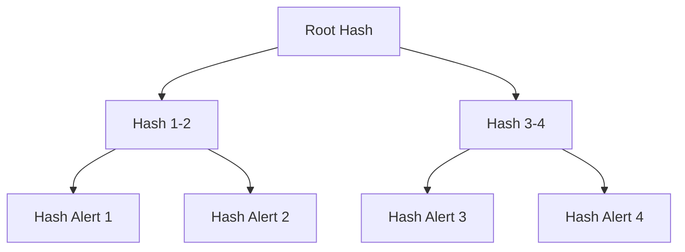
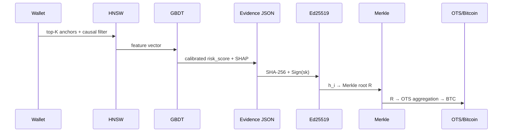

# 10. Evidence generation, provenance и WORM-аудит

В разделах 7–9 получены калиброванный риск-скор GBDT, операционная точка и механизм темпоральной валидации. Открытым остаётся вопрос доказуемости: как подтвердить, что алерт корректен, воспроизводим и не изменён задним числом. Риск-скор сам по себе, без проверяемого обоснования, не удовлетворяет требованиям FinCEN, FATF и SR 26-2 и не обладает допустимостью в суде. Эта глава описывает evidence JSON — проверяемый «паспорт» каждого алерта, — механизм provenance и криптографические гарантии неизменяемости: подписи Ed25519, Merkle-дерево и привязку к блокчейну через OpenTimestamps.

## 10.1. Постановка задачи

Требование доказуемости подпирается тремя мотивами, каждый из которых по-своему жёсткий.

Регуляторный: FinCEN, FATF, 6AMLD и SR 26-2 требуют документированного обоснования каждого алерта. Судебный: при рассмотрении дела защита вправе потребовать доказательства отсутствия фабрикации или ретроспективной модификации — WORM-аудит обеспечивает целостность и неизменяемость, критерии допустимости разбираются в главе 11. Внутренний: аналитик, compliance-офицер и независимый валидатор обязаны видеть идентичную версию артефакта; provenance фиксирует происхождение данных и версии моделей, а верификация становится детерминированной процедурой.

Формально генерация доказательства — отображение

$$\mathcal{E}: (w, \mathcal{A}_K, \mathcal{G}, \theta) \mapsto J$$

где $w$ — кошелёк, $\mathcal{A}_K$ — top-$K$ якорей после причинного фильтра, $\mathcal{G}$ — графовые признаки, $\theta$ — версии моделей, $J$ — Evidence JSON. WORM-аудит гарантирует целостность, доказательство включения и внешнюю временную привязку.

## 10.2. Структура Evidence JSON

### 10.2.1. Общая схема

Evidence JSON — канонический документ с фиксированным порядком ключей (иначе хеши не сойдутся) и обязательной валидацией схемы при генерации: каждое поле required, отсутствие или несоответствие типу — ошибка генерации, алерт не публикуется.

```json
{
  "alert_id": "uuid",
  "risk_score": 0.87,
  "confidence_tier": "Tier 1",
  "anchors": [...],
  "causal_path": [...],
  "graph_features": {...},
  "shap_values": {...},
  "provenance": {...},
  "audit": {...}
}
```

| Поле | Тип | Семантика |
|------|-----|-----------|
| alert_id | UUID v4 | Уникальный идентификатор |
| risk_score | float $[0,1]$ | Калиброванная вероятность $P(\text{illicit})$ (GBDT + калибровка) |
| confidence_tier | enum {Tier 1, Tier 2, Tier 3, auto-clear} | Операционное решение |
| anchors | array | Якоря, прошедшие retrieval и причинный фильтр |
| causal_path | array | Причинные рёбра и оценки эффекта |
| graph_features | object | Структурные и темпоральные признаки |
| shap_values | object | Вклады признаков (SHAP, раздел 7) |
| provenance | object | Источник, версии моделей, аналитик, дата |
| audit | object | Подпись, Merkle proof, метки времени |

### 10.2.2. Anchors

```json
{
  "wallet": "0xABC...",
  "source": "OFAC SDN",
  "added": "2023-04-12",
  "distance": 0.12,
  "causal_filter": "passed",
  "e_value": 2.3,
  "rosenbaum_gamma": 2.1,
  "sensemakr_r2": 0.15
}
```

| Атрибут | Определение |
|---------|-------------|
| wallet | Адрес якоря |
| source | OFAC SDN / EU Consolidated / UN SC / UK OFSI / court document |
| added | Дата включения в санкционный список |
| distance | Расстояние в embedding-пространстве $\|z_w - z_a\|$ |
| causal_filter | passed / excluded — решение DAG-фильтра (раздел 6) |
| e_value | Устойчивость к ненаблюдаемому смешению |
| rosenbaum_gamma | Rosenbaum $\Gamma^*$ |
| sensemakr_r2 | Partial $R^2$ |

Аналитик видит, какие якоря сформировали оценку, и может верифицировать каждый независимо — в этом смысле anchors-блок и есть «объяснение» скоринга.

### 10.2.3. Causal path

```json
{
  "causal_path": [
    {"edge": "Wallet → Mixer_Proximity", "effect": 0.34, "rosenbaum_gamma": 2.1},
    {"edge": "Mixer_Proximity → Anchor", "effect": 0.28, "rosenbaum_gamma": 1.9}
  ]
}
```

Причинный путь показывает, какие рёбра DAG объясняют близость к якорю, с оценками эффекта и устойчивости. Для суда это принципиально: допустимость требует показать методологию и связь, а не корреляцию.

### 10.2.4. Graph features и SHAP

```json
{
  "graph_features": {
    "in_degree": 45,
    "out_degree": 23,
    "pagerank": 0.003,
    "velocity_24h": 5,
    "counterparty_diversity": 0.67
  },
  "shap_values": {
    "distance_to_nearest_OFAC": -0.34,
    "causal_filter_pass_rate": 0.28,
    "e_value_max": 0.15,
    "anchor_source_diversity": 0.12
  }
}
```

Первое — контекст поведения кошелька для сопоставления с типичными значениями класса; второе — вклады признаков в скоринг, необходимые для human review (раздел 7).

### 10.2.5. Provenance

```json
{
  "provenance": {
    "source": "on-chain + anchors",
    "analyst": "analyst_id",
    "date": "2026-09-14T12:00:00Z",
    "model_version": "v2.0",
    "encoder_version": "graphsage-128d-v2.0",
    "gbdt_version": "lightgbm-v2.0",
    "hnsw_params": {"M": 24, "efConstruction": 128, "efSearch": 100},
    "calibration": "beta-v2.0",
    "threshold_tau": 0.73,
    "cost_ratio_Cfn_Cfp": 10
  }
}
```

Provenance — это то, что делает алерт воспроизводимым: зная версии энкодера, GBDT, параметры индекса, калибратора, порог и источник данных, независимый валидатор повторяет вычисления и получает идентичный risk_score.

### 10.2.6. Audit

```json
{
  "audit": {
    "signature": "ed25519:...",
    "merkle_proof": "0x...",
    "timestamp": "2026-09-14T12:00:01Z",
    "opentimestamps": "0x..."
  }
}
```

| Поле | Назначение |
|------|------------|
| signature | Ed25519-подпись канонического JSON |
| merkle_proof | Sibling-хеши пути к корню |
| timestamp | RFC3339 время подписи |
| opentimestamps | OTS-доказательство привязки корня к Bitcoin |

Все audit-поля верифицируются процедурой из 10.3.5 без доверия к хранилищу.

## 10.3. WORM-аудит: гарантии неизменяемости

WORM-семантика (Write Once Read Many): после фиксации артефакт доступен только для чтения, и любая модификация детектируется криптографически. Контур собирается из четырёх компонентов: подпись каждого алерта (целостность), Merkle-агрегация (доказательство включения без раскрытия всего множества), внешняя временная привязка OTS (независимость от внутренних часов системы) и журнал действий.

### 10.3.1. Выбор подписи: Ed25519 vs ECDSA

| Критерий | Ed25519 | ECDSA (secp256k1) |
|----------|---------|-------------------|
| Детерминизм nonce | Да (RFC 8032) | Нет (требует HMAC-DRBG) |
| Риск повторного $k$ | Отсутствует | Критичен |
| Размер подписи | 64 байта | 70–72 байта (DER) |
| Подпись | ~50k ops/s CPU | ~15k ops/s |
| Верификация | ~20k ops/s | ~7k ops/s |
| Безопасность | 128 бит | 128 бит |

Решение — **Ed25519**: детерминированный nonce устраняет класс катастрофических отказов (повторное использование $k$ раскрывает приватный ключ), подпись короче и обе операции быстрее; подтверждается замерами latency p99 (bootstrap CI, $n=10\,000$). Закрытый ключ хранится в HSM с ротацией и сохранением публичных ключей для исторических проверок.

Процедура. Канонизация JSON (сортировка ключей, без пробелов), хеширование $h = \text{SHA-256}(J_c)$, подпись $\sigma = \text{Sign}_{\text{Ed25519}}(sk, h)$. Верификация: $\text{Verify}(pk, \text{SHA-256}(J_c), \sigma)$. Изменение любого байта меняет $h$ и роняет проверку; тест — подмена одного байта в $1\text{M}$ алертов детектируется в 100% случаев, latency верификации $< 0.1$ мс.

### 10.3.2. Агрегация: Merkle tree vs плоский список

| Вариант | Доказательство включения | Размер proof | Верификация |
|---------|--------------------------|--------------|-------------|
| Flat (список хешей) | $O(N)$ хешей | $N \cdot 32$ байта | $O(N)$ |
| Merkle tree | $O(\log_2 N)$ sibling-хешей | $\log_2 N \cdot 32$ байта | $O(\log N)$ |

Разница не асимптотическая теория, а практические числа: для $N=10^6$ proof занимает 640 байт против 32 МБ у плоского списка; для $10^9$ — 960 байт (30 хешей).



Механика: листья $h_i = \text{SHA-256}(J_{c,i})$, внутренние узлы $h_{p} = \text{SHA-256}(h_{left} \| h_{right})$, корень $R$ фиксируется периодически и подписывается. Proof для листа — последовательность sibling-хешей на пути к корню; верификация восстанавливает кандидата $R'$ и сравнивает с опубликованным $R$, не требуя остальных $N-1$ алертов. Тест: верификация $1\text{M}$ proofs — p95 latency $< 5$ мс, корректность принадлежности 1.0.

### 10.3.3. OpenTimestamps

Записывать каждый корень напрямую в Bitcoin дорого и не нужно. OTS агрегирует корни множества пользователей: корень $R$ уходит на агрегатор, включается в глобальное дерево и фиксируется в одной Bitcoin-транзакции; пользователь получает OTS-proof, связывающий $R$ с блоком. Свойства: содержимое не раскрывается (уходит только хеш), временная привязка проверяется без доверия к Spillety, компрометация внутренних часов системы ничего не даёт. Латентность — асинхронная, до нескольких часов, поэтому для срочных SAR первичная гарантия — Ed25519 + Merkle, OTS дополняет её ретроспективно.

### 10.3.4. Audit trail

| Событие | Фиксируемые атрибуты |
|---------|----------------------|
| Создание | alert_id, timestamp, версии моделей, параметры HNSW |
| Просмотр | analyst_id, timestamp |
| Смена статуса | analyst_id, timestamp, старый/новый статус |
| Подача SAR | analyst_id, timestamp, SAR ID |
| Верификация | verifier_id, timestamp, результат (pass/fail) |

Хранение — append-only WORM; взаимодействия с алертом вне системы исключаются регламентом, поскольку их не зафиксировать.

### 10.3.5. Верификация end-to-end

Полная проверка одного алерта — четыре шага: канонизация JSON и вычисление $h'$; проверка подписи $\sigma$; пересчёт Merkle-пути до заявленного корня $R$; OTS-верификация $R$ против Bitcoin. Неуспех любого шага — индикатор модификации; аналогично ноутбук 11 показывает, что подмена одного символа в доказательстве роняет верификацию целиком.

## 10.4. SAR-генерация из Evidence JSON

SAR (Suspicious Activity Report) подаётся в FinCEN или аналог при пороге $\$2\,000$ для MSB, $\$5\,000$ для банков, при подозрении на illicit-активность или структурировании для обхода порога. Evidence JSON содержит все обязательные поля, и SAR формируется из него автоматически:

| Поле SAR | Источник |
|----------|----------|
| Transaction hash / blockchain / timestamp | on-chain |
| Sender / Receiver | on-chain |
| Amount (crypto) | on-chain |
| Amount (USD) | price oracle (источник фиксируется в provenance) |
| Causal path | Evidence JSON (10.2.3) |
| Anchor provenance | Evidence JSON (10.2.2) |
| Risk score + tier | GBDT + калибровка (разделы 7–8) |
| Audit (подпись, Merkle proof) | Evidence JSON (10.2.6) |

Поток: извлечение полей → форматирование по требованиям FinCEN/FATF/6AMLD → подпись Ed25519 и включение Merkle proof → отправка. Автоматическая подача запрещена: аналитик обязан проверить evidence, верификацию и proof, и подтвердить подачу — действие фиксируется в audit trail. Порог $\tau$ для SAR берётся из cost-функции раздела 8, где $C_{FP}$ включает трудозатраты на SAR, а $C_{FN}$ — штрафы за неподачу.

## 10.5. Связь с остальным контуром

Два обстоятельства стоит проговорить явно, чтобы паспорт не оказался красивее содержимого.

Первое — калибровка. `risk_score` в JSON достоверен ровно настолько, насколько достоверна калибровка GBDT; версия калибратора фиксируется в provenance, и если Brier/ECE drift превысит порог (правила — в разделе 9), алерты с таким provenance требуют перекалибровки до юридического применения.

Второе — распределение решений. Операционные выборы собственно evidence-контура обоснованы здесь: Ed25519 против ECDSA (10.3.1), Merkle против flat (10.3.2). Выборы калибровки (isotonic vs beta) и дрейф-детекции (квантили, effect size) разобраны в разделах 8 и 9 и лишь ссылаются в provenance; повторять их здесь не нужно.

## 10.6. Визуализация


**Merkle tree:** листья — хеши алертов, корень фиксируется и анкорится через OTS; доказательство принадлежности требует $\log_2 N$ хешей.


**Audit trail:** хронология жизненного цикла алерта; цвет — тип события, каждая запись — WORM.

Путь алерта через весь контур:



## 10.7. Ограничения

1. **Объём WORM-хранилища** растёт линейно с числом алертов; старые алерты архивируются с сохранением корней и OTS-proofs.
2. **Key management**: компрометация закрытого ключа компрометирует все подписи — HSM и ротация обязательны.
3. **OTS-латентность** — часы; для срочных SAR первична Ed25519-гарантия.
4. **Размер Merkle-proof** логарифмический, но не константный: 20 хешей для $10^6$, 30 для $10^9$.
5. **Полнота audit trail** зависит от регламентного запрета внесистемных коммуникаций.
6. **SAR throughput** ограничен обязательным human review; форматы различаются по юрисдикциям — схема JSON версионируется под каждый.

Evidence-контур вместе с подписью, агрегацией и внешней привязкой закрывает требования SR 26-2, FATF Rec. 16, FinCEN SAR и 6AMLD на уровне артефактов; критерии допустимости и bias-аудит — предмет следующей главы.

---

## См. также

- [11_evidence_worm_audit.ipynb](../notebooks/11_evidence_worm_audit.ipynb) — генерация evidence JSON, подпись и верификация WORM-аудита.