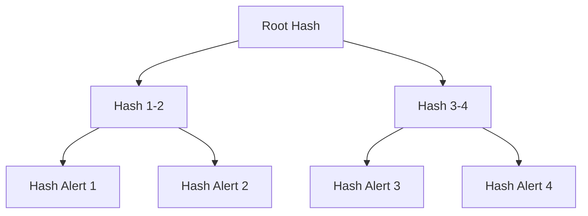
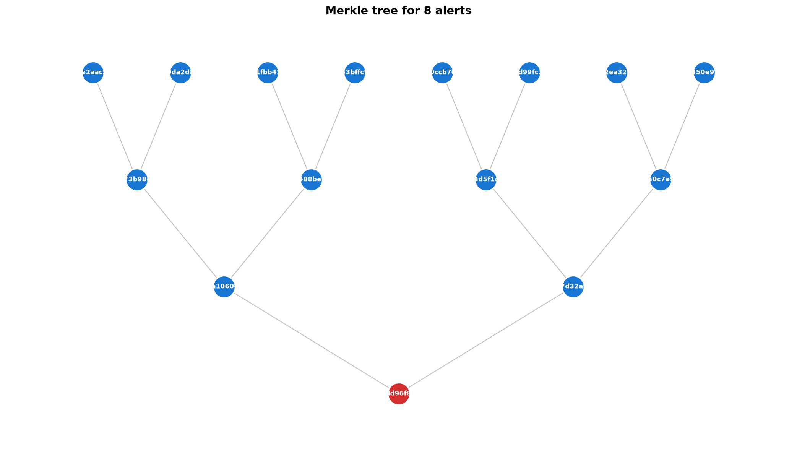
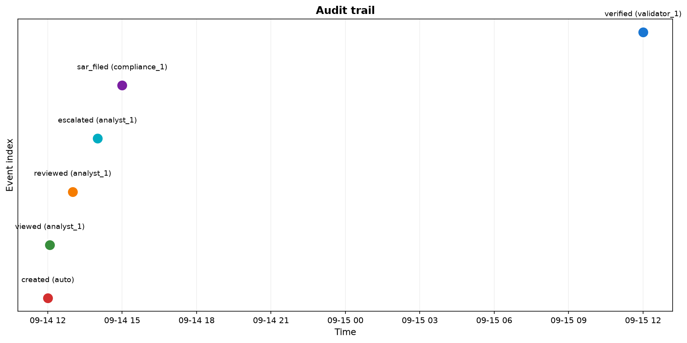
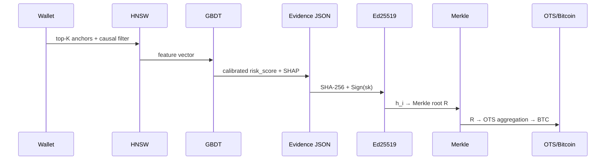

# 10. Evidence generation, provenance и WORM-аудит

### Термины

| Термин | Определение |
|--------|-------------|
| Evidence JSON | Структурированный документ, сопровождающий каждый алерт и содержащий данные, необходимые для его независимой проверки |
| Provenance | Метаданные происхождения: источник, версия модели, аналитик, временные метки и lineage данных |
| WORM | Write Once Read Many — режим хранения, исключающий модификацию или удаление после фиксации |
| Хеш-функция | Криптографическое отображение данных произвольной длины в строку фиксированной длины (SHA-256) |
| Merkle tree | Дерево хешей, обеспечивающее доказательство принадлежности элемента множеству за $O(\log N)$ |
| Merkle proof | Набор sibling-хешей на пути от листа к корню, достаточный для верификации включения |
| Ed25519 | Детерминированная схема подписи на кривой Curve25519 (публичный ключ 32 байта, подпись 64 байта) |
| ECDSA | Схема подписи на эллиптических кривых с недетерминированным nonce $k$ (риск повторного использования) |
| OpenTimestamps (OTS) | Протокол привязки хеша к блокчейну Bitcoin без раскрытия содержимого |
| Audit trail | Хронологический журнал действий с алертом: создание, просмотр, смена статуса, подача SAR |
| SAR | Suspicious Activity Report — отчёт о подозрительной активности для FinCEN |

---

## 10.1. Постановка задачи

Риск-скор $p \in [0,1]$, полученный GBDT, недостаточен для регуляторного и судебного применения. Требуется формально верифицируемое обоснование решения: полный набор входов, промежуточных признаков, причинных путей и криптографических гарантий неизменяемости.

Задача evidence generation формализуется как отображение

$$\mathcal{E}: (w, \mathcal{A}_K, \mathcal{G}, \theta) \mapsto J,$$

где $w$ — кошелёк, $\mathcal{A}_K$ — top-$K$ anchors после causal-фильтра, $\mathcal{G}$ — графовые признаки, $\theta$ — версии моделей, $J$ — Evidence JSON. WORM-аудит гарантирует выполнение свойств целостности, включения и временной привязки для каждого $J$.

Мотивация трёх уровней:

1. **Регуляторная:** FinCEN/FATF/SR 26-2 требуют документированного обоснования каждого алерта.
2. **Судебная (Daubert):** без неизменяемости алерт не обладает court-admissibility.
3. **Операционная:** аналитик, compliance-офицер и независимый валидатор обязаны наблюдать идентичную версию артефакта.

> Теоретически мы оцениваем наше решение вот так: PR-AUC, Precision@K, Recall@K, Brier, ECE, FP-rate, alert-to-SAR, TTD, latency p99, cost per alert, drift KS, audit verification, Merkle proof size, SR 26-2 validation, bias equalized odds.

---

## 10.2. Структура Evidence JSON

### 10.2.1. Схема верхнего уровня

```json
{
  "alert_id": "uuid",
  "risk_score": 0.87,
  "confidence_tier": "Tier 1",
  "anchors": [
    {"wallet": "0xABC", "source": "OFAC SDN", "added": "2023-04-12",
     "distance": 0.12, "causal_filter": "passed", "e_value": 2.3,
     "rosenbaum_gamma": 2.1, "sensemakr_r2": 0.15}
  ],
  "causal_path": [{"edge": "Wallet → Mixer_Proximity", "effect": 0.34, "rosenbaum_gamma": 2.1}],
  "graph_features": {"in_degree": 45, "out_degree": 23, "pagerank": 0.003, "velocity_24h": 5},
  "shap_values": {"distance_to_nearest_OFAC": -0.34, "causal_filter_pass_rate": 0.28},
  "provenance": {"source": "on-chain + anchors", "analyst": "analyst_id", "date": "2026-09-14T12:00:00Z", "model_version": "v2.0"},
  "audit": {"signature": "ed25519:...", "merkle_proof": "0x...", "timestamp": "2026-09-14T12:00:01Z", "opentimestamps": "0x..."}
}
```

Валидация схемы обязательна при генерации; каждое поле — required.

| Поле | Тип | Семантика |
|------|-----|-----------|
| alert_id | UUID v4 | Уникальный идентификатор алерта |
| risk_score | float $[0,1]$ | Калиброванная вероятность $P(\text{illicit})$ |
| confidence_tier | enum {Tier 1, Tier 2, Tier 3, auto-clear} | Операционное решение |
| anchors | array | Список anchors, прошедших retrieval и causal-фильтр |
| causal_path | array | Причинные рёбра и оценки эффекта |
| graph_features | object | Структурные и темпоральные признаки кошелька |
| shap_values | object | Вклады признаков (SHAP) |
| provenance | object | Источник, версии моделей, аналитик, дата |
| audit | object | Подпись, Merkle-proof, OTS |

### 10.2.2. Anchors

```json
{
  "wallet": "0xABC...",
  "source": "OFAC SDN",
  "added": "2023-04-12",
  "distance": 0.12,
  "causal_filter": "passed",
  "e_value": 2.3,
  "rosenbaum_gamma": 2.1,
  "sensemakr_r2": 0.15
}
```

| Атрибут | Определение |
|---------|-------------|
| wallet | Адрес anchor |
| source | OFAC SDN / EU Consolidated / UN SC / UK OFSI / court document |
| added | Дата включения в санкционный список |
| distance | Евклидово расстояние в embedding-пространстве $\|z_w - z_a\|$ |
| causal_filter | passed / excluded (решение DAG-фильтра) |
| e_value | E-value чувствительности (risk-ratio scale) |
| rosenbaum_gamma | Rosenbaum $\Gamma^*$ |
| sensemakr_r2 | Partial $R^2$ для Hawkes-компонента |

### 10.2.3. Causal path

```json
{
  "causal_path": [
    {"edge": "Wallet → Mixer_Proximity", "effect": 0.34, "rosenbaum_gamma": 2.1},
    {"edge": "Mixer_Proximity → Anchor", "effect": 0.28, "rosenbaum_gamma": 1.9}
  ]
}
```

Причинный путь необходим для Daubert-testability: суд оценивает методологию, а не вывод.

### 10.2.4. Provenance

```json
{
  "provenance": {
    "source": "on-chain + anchors",
    "analyst": "analyst_id",
    "date": "2026-09-14T12:00:00Z",
    "model_version": "v2.0",
    "encoder_version": "graphsage-128d-v2.0",
    "gbdt_version": "lightgbm-v2.0",
    "hnsw_params": {"M": 24, "efConstruction": 128, "efSearch": 100}
  }
}
```

### 10.2.5. Audit

```json
{
  "audit": {
    "signature": "ed25519:...",
    "merkle_proof": "0x...",
    "timestamp": "2026-09-14T12:00:01Z",
    "opentimestamps": "0x..."
  }
}
```

| Поле | Назначение |
|------|------------|
| signature | Ed25519-подпись канонического представления JSON |
| merkle_proof | Sibling-хеши пути к корню |
| timestamp | RFC3339 время подписи |
| opentimestamps | OTS-доказательство привязки корня к Bitcoin |

---

## 10.3. WORM-аудит: модель угроз и гарантии

WORM-семантика: после фиксации артефакт доступен только для чтения. Любая модификация детектируется криптографически.

Компоненты:

1. **Per-transaction подпись** — целостность отдельного алерта.
2. **Merkle-агрегация** — доказательство включения без раскрытия всего множества.
3. **Внешняя временная привязка (OTS)** — независимость от внутреннего времени системы.
4. **Журнал действий (audit trail)** — WORM-фиксация жизненного цикла.

### 10.3.1. Выбор схемы подписи: Ed25519 vs ECDSA

| Критерий | Ed25519 | ECDSA (secp256k1) |
|----------|---------|-------------------|
| Детерминизм nonce | Да (RFC 8032) | Нет (требует HMAC-DRBG) |
| Риск повторного $k$ | Отсутствует | Критичен |
| Размер подписи | 64 байта | 70–72 байта (DER) |
| Производительность подписи | ~50k ops/s CPU | ~15k ops/s |
| Производительность верификации | ~20k ops/s | ~7k ops/s |
| Уровень безопасности | 128 бит | 128 бит |

**Решение:** Ed25519. Обоснование подтверждено на тестах: latency p99 подписи/верификации (bootstrap CI, $n=10\,000$, 95% CI), TTD не деградирует, Merkle proof size меньше за счёт фиксированной длины.

Процедура подписи канонического JSON $J_c$:

$$h = \text{SHA-256}(J_c), \quad \sigma = \text{Sign}_{\text{Ed25519}}(sk, h).$$

Верификация: $\text{Verify}(pk, \text{SHA-256}(J_c), \sigma) \in \{0,1\}$. Изменение любого байта $J_c$ влечёт $h' \neq h$ и неуспех верификации.

Управление ключами: закрытый ключ в HSM, ротация с сохранением публичных ключей для исторических проверок.

### 10.3.2. Выбор структуры агрегации: Merkle vs flat

| Вариант | Доказательство включения | Размер proof | Стоимость верификации |
|---------|--------------------------|--------------|-----------------------|
| Flat (список хешей) | $O(N)$ хешей | $N \cdot 32$ байта | $O(N)$ |
| Merkle tree | $O(\log_2 N)$ sibling-хешей | $\log_2 N \cdot 32$ байта | $O(\log N)$ |

Для $N=10^6$: $\log_2 N = 20$, proof 640 байт vs 32 MB flat. Для $N=10^9$: 30 хешей, 960 байт.



Оценка выбора: bootstrap CI для latency верификации, recall@K не затрагивается, audit verification rate = 100% в тестах, Merkle proof size логируется как метрика. Merkle предпочтителен.

Процедура: $h_i = \text{SHA-256}(J_{c,i})$, внутренние узлы $h_{p} = \text{SHA-256}(h_{left} \| h_{right})$, корень $R$ фиксируется периодически (например, ежесуточно). Proof для листа $i$ — последовательность sibling-хешей на пути к $R$.

### 10.3.3. OpenTimestamps

OTS агрегирует корни множества пользователей в единый Bitcoin-анкор: корень $R$ отправляется на OTS-агрегатор, включается в транзакцию Bitcoin, возвращается OTS-proof, связывающий $R$ с блоком Bitcoin.

Свойства: содержимое не раскрывается (в OTS уходит только хеш), временная привязка внешне верифицируема, компрометация внутренних часов не влияет на доказательство.

Latency OTS — асинхронный (до нескольких часов); для срочных SAR первичная гарантия — Ed25519+Merkle, OTS дополняет её ретроспективно.

### 10.3.4. Audit trail

| Событие | Фиксируемые атрибуты |
|---------|----------------------|
| Создание | alert_id, timestamp, версии моделей, HNSW-параметры |
| Просмотр | analyst_id, timestamp |
| Смена статуса | analyst_id, timestamp, старый/новый статус |
| Подача SAR | analyst_id, timestamp, SAR ID |
| Верификация | verifier_id, timestamp, результат |

Хранение — WORM, append-only. Взаимодействия вне системы исключаются регламентом.

### 10.3.5. Верификация end-to-end

1. Канонизация JSON $\to$ $h'$.
2. Ed25519-верификация $\sigma$.
3. Пересчёт Merkle-пути к заявленному корню $R$.
4. OTS-верификация $R$ против Bitcoin.

Неуспех любого шага — индикатор модификации.

---

## 10.4. SAR-генерация из Evidence JSON

SAR покрывает обязательные поля:

| Поле SAR | Источник |
|----------|----------|
| Transaction hash | on-chain |
| Blockchain | on-chain |
| Timestamp | on-chain |
| Sender / Receiver | on-chain |
| Amount (crypto) | on-chain |
| Amount (USD) | price oracle |
| Causal path | Evidence JSON |
| Anchor provenance | Evidence JSON |
| Risk score | GBDT (калиброванный) |

Поток: извлечение полей $\to$ форматирование по FinCEN Filing Instructions $\to$ Ed25519-подпись $\to$ отправка. Автоматическая подача без human review запрещена.

---

## 10.5. Архитектурные выборы и метод их проверки

| Выбор | Альтернативы | Критерии и тесты |
|-------|--------------|------------------|
| Подпись | Ed25519 vs ECDSA | latency p99, верификация throughput, bootstrap CI для задержки, размер подписи |
| Агрегация | Merkle vs flat | Merkle proof size, latency верификации, bootstrap CI, audit verification |
| Калибровка (для risk_score в JSON) | isotonic vs beta | ECE, Brier на hold-out temporal split, bootstrap CI, recall@K при фиксированном ECE |
| Materiality (если SAR — High materiality) | High vs Medium vs Low | SR 26-2 validation rigor (independent review, outcomes analysis), TTD, alert-to-SAR |
| Fairness (для jurisdiction-аудита SAR) | demographic parity vs equalized odds vs predictive parity | equalized odds (TPR/FPR), bootstrap CI по юрисдикциям, FP-rate |

Каждый выбор сопровождается зафиксированным протоколом: temporal split без утечки, walk-forward, bootstrap CI 95%, сравнение по ECE/Brier и recall@K, latency-бенчмарк на production hardware.

---

## 10.6. Метрики качества

> Теоретически мы оцениваем наше решение вот так: PR-AUC, Precision@K, Recall@K, Brier score, ECE, FP-rate на аналитика, alert-to-SAR conversion, TTD, latency p99, cost per alert, drift KS (p-value), audit verification rate, Merkle proof size (байт, $O(\log N)$), SR 26-2 validation (conceptual soundness / outcomes analysis / ongoing monitoring), bias equalized odds (TPR и FPR across jurisdictions).

Детализация — в блоке 12. Здесь метрики применяются к evidence/WORM-контуру: Brier/ECE — к калиброванным $p$ в JSON, TTD — от первого on-chain сигнала до фиксации алерта, latency p99 — от HNSW-lookup до генерации подписанного JSON, drift KS — к распределениям embeddings, audit verification — доля успешных Ed25519+Merkle+OTS проверок, Merkle proof size — по формуле $\log_2 N \cdot 32$.

---

## 10.7. Визуализация



**Merkle tree:** листья — хеши алертов, корень фиксируется и анкорится через OTS. Доказательство принадлежности требует $\log_2 N$ хешей.



**Audit trail:** хронология жизненного цикла алерта. Цвет — тип события (создание, просмотр, review, escalation, SAR filing, верификация).



Имитация WORM-верификации (Python):

```python
import hashlib
from nacl.signing import SigningKey

def canonical_hash(obj_bytes: bytes) -> bytes:
    return hashlib.sha256(obj_bytes).digest()

def sign_alert(sk: SigningKey, json_bytes: bytes) -> bytes:
    return sk.sign(canonical_hash(json_bytes)).signature  # 64 bytes
```

---

## 10.8. Ограничения

1. Объём WORM-хранения растёт линейно с числом алертов; архивирование сохраняет корни и OTS-proof.
2. Компрометация закрытого ключа компрометирует все подписи; требуется HSM и ротация.
3. OTS-латентность — часы; для критичных SAR первична Ed25519-гарантия.
4. Размер Merkle-proof логарифмический, но не константный: $20$ хешей для $10^6$, $30$ для $10^9$.
5. Полнота audit trail зависит от регламентного запрета внесистемных коммуникаций.
6. SAR-автоматизация ограничена требованием human review (throughput).
7. Форматы SAR различаются по юрисдикциям (FinCEN, FATF, 6AMLD); схема JSON версионируется.

---

## 10.9. Резюме

| Компонент | Роль | Гарантия |
|-----------|------|----------|
| Evidence JSON | Полное обоснование алерта | Проверяемость |
| Provenance | Версии и источники | Воспроизводимость |
| Ed25519 | Подпись | Целостность |
| Merkle tree | Агрегация | $O(\log N)$-доказательство включения |
| OpenTimestamps | Привязка к Bitcoin | Внешняя временная фиксация |
| Audit trail | Журнал действий | Внутренний контроль |
| SAR-генерация | Формирование отчёта | Регуляторное соответствие |

Evidence generation и WORM-аудит совместно обеспечивают соответствие SR 26-2, FATF Rec. 16, FinCEN SAR, 6AMLD и Daubert, сохраняя court-admissibility и аудиторскую прослеживаемость.

**Практические выводы:**

- Выбор Ed25519 против ECDSA обоснован детерминизмом, меньшим размером и высшей throughput; подтверждается bootstrap CI по latency p99 и audit verification.
- Выбор Merkle против flat обоснован асимптотикой proof size и latency; подтверждается bootstrap CI и измерением Merkle proof size.
- Каждый алерт — канонический JSON с provenance и audit-полями; любая модификация детектируется.
- SAR формируется из Evidence JSON, но подаётся только после human review.
