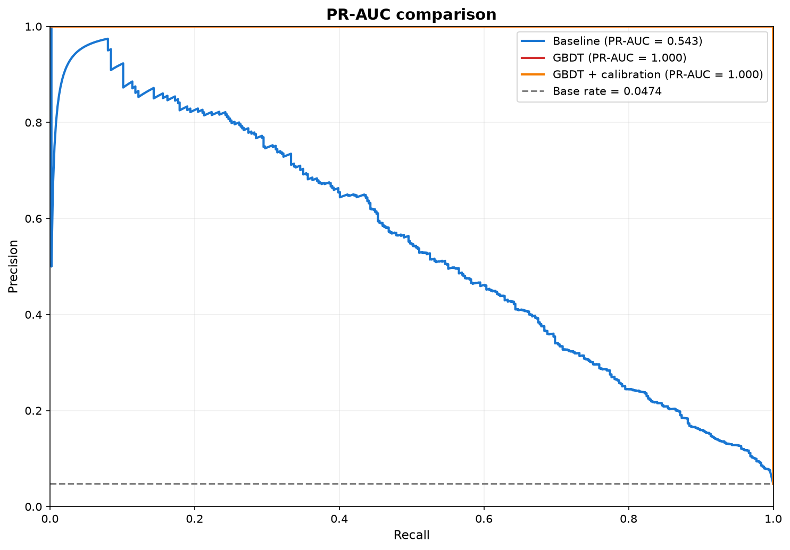
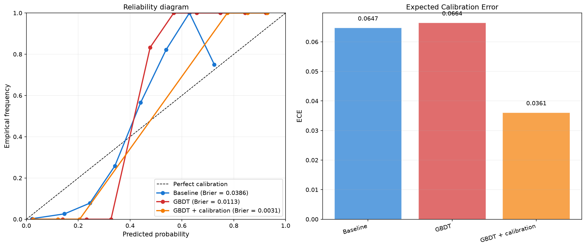
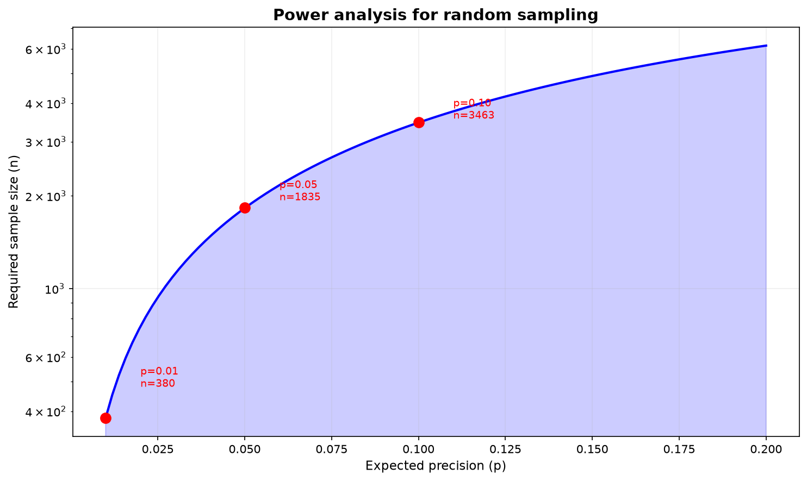
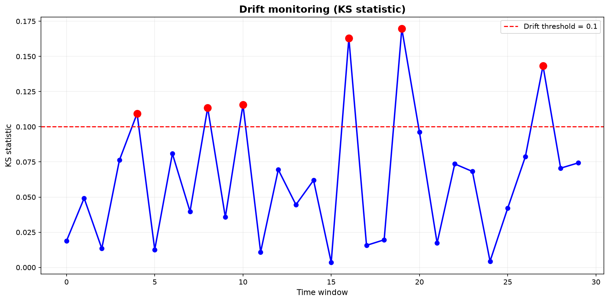

# 11. Метрики и оценка качества

> **О чём этот блок простыми словами.**
> Как понять, что система реально работает, а не только «выглядит хорошо на бумаге»? Для этого нужны честные метрики: одни измеряют качество ранжирования, другие — калибровку, третьи — операционную работу и экономику. Этот блок описывает **полный набор метрик** и, что важно, **чего Spillety не обещает**.

### Термины

| Термин | Определение |
|--------|-------------|
| PR-AUC | Area Under Precision-Recall Curve — площадь под кривой precision-recall |
| Precision@K | Доля релевантных объектов среди top-K, возвращённых retrieval |
| Recall@K | Доля истинных соседей, попавших в top-K ближайших |
| Brier score | Средний квадрат разности между предсказанной вероятностью и исходом |
| ECE | Expected Calibration Error — ожидаемая ошибка калибровки |
| TTD | Time To Detection — время от первого on-chain сигнала до алерта |
| Labeling cost | Стоимость верификации разметки (в Spillety — стоимость верификации court documents) |
| FTE | Full-Time Equivalent — число сотрудников, эквивалентное полной занятости |
| Power analysis | Статистический метод определения минимального размера выборки для достижения заданной мощности теста |
| Base rate | Доля положительного класса в популяции |
| Walk-forward validation | Схема валидации, при которой обучение идёт на прошлом, тест — на будущем, с постепенным сдвигом окна |

---

## 11.1. Постановка задачи

> **Простыми словами.** Одной цифры «точность 95%» недостаточно. Нужно честно измерять разные стороны системы и сравнивать с простыми baseline'ами. И не обещать невозможного.

В предыдущих блоках были описаны компоненты Spillety: entity resolution, contrastive learning, causal filter, GBDT, калибровка, cost-функция. Каждый компонент имеет свои внутренние метрики, но **система в целом** требует набора метрик, которые:

1. **Честно отражают реальные характеристики** — без завышенных обещаний.
2. **Сравнимы с baseline** — конкурентами и тривиальными предикторами.
3. **Обоснованы эмпирически** — на hold-out данных, а не на training set.
4. **Разделяют компоненты** — retrieval, scoring, калибровка, операционные метрики.
5. **Учитывают base rate** — precision при base rate 0.1% и 5% — это разные precision.

Этот блок описывает **полный набор метрик**, способ их получения и то, что Spillety **не обещает**.

---

## 11.2. Классификация метрик

Метрики делятся на пять групп:

| Группа | Что измеряет | Примеры |
|--------|--------------|---------|
| **Качество ранжирования** | Насколько хорошо модель отделяет illicit от legit | PR-AUC, Precision@K, Recall@K |
| **Калибровка** | Насколько предсказанные вероятности соответствуют реальности | Brier, ECE |
| **Операционные** | Как система работает в проде | FP-rate на аналитика, alert-to-SAR, TTD, latency |
| **Стоимость** | Экономика системы | Labeling cost, FTE, cost per alert |
| **Self-evolution** | Способность адаптироваться | Temporal validation, drift (KS) |

---

## 11.3. Метрики качества ранжирования

### 11.3.1. PR-AUC

**PR-AUC** — площадь под кривой precision-recall. В отличие от ROC-AUC, PR-AUC чувствителен к base rate: при низкой доле положительного класса ROC-AUC может быть высоким, даже если precision низкий .

**Формально:**

\[
\text{PR-AUC} = \int_0^1 \text{Precision}(\text{Recall}) \, d\text{Recall}
\]

**Как получаем:** hold-out temporal split. Обучение на ранних временных шагах, тест — на поздних. PR-curve строится на тесте.

**Baseline:** XGBoost на Elliptic++ (56 признаков). Сравнение с baseline показывает, даёт ли архитектура Spillety прирост.

**Проблема imbalanced классов:** при base rate 0.1% precision даже у хорошей модели может быть низким. PR-AUC не заменяет precision при рабочем пороге — он показывает **потенциал** модели.

### 11.3.2. Precision@K

**Precision@K** — доля релевантных объектов среди top-K, возвращённых retrieval.

**Формально:**

\[
\text{Precision@K} = \frac{|\{\text{relevant}\} \cap \{\text{top-K}\}|}{K}
\]

**Применение в Spillety:** retrieval возвращает top-K anchors для кошелька. Precision@K показывает, какая доля этих anchors действительно связана с кошельком (по ground truth).

**Как получаем K:** PR-curve на retrieval task; K выбирается по cost-функции.

**Base rate учитывается:** precision при base rate 0.1% и 5% — разные. В отчёте указывается base rate.

### 11.3.3. Recall@K

**Recall@K** — доля истинных соседей, попавших в top-K ближайших.

**Формально:**

\[
\text{Recall@K} = \frac{|\{\text{relevant}\} \cap \{\text{top-K}\}|}{|\{\text{relevant}\}|}
\]

**Применение в Spillety:** recall@K на anchor retrieval показывает, насколько хорошо модель находит семантически близкие anchors для заданного кошелька.

**Cluster-level evaluation:** recall@K оценивается на уровне кластеров, а не отдельных адресов. Это связано с тем, что кластер — более стабильная единица (блок 5).

**Temporal validation:** recall@K оценивается на **новых** санкциях, добавленных после даты обучения. Это показывает, насколько модель обобщает на unseen anchors.

---

## 11.4. Метрики калибровки

### 11.4.1. Brier score

\[
\text{Brier} = \frac{1}{n} \sum_{i=1}^{n} (\hat{p}_i - y_i)^2
\]

где \(\hat{p}_i\) — предсказанная вероятность, \(y_i\) — истинная метка.

**Интерпретация:** 0 — идеальная калибровка; 0.25 — случайный предиктор (при balanced classes). Для imbalanced классов Brier смещён.

**Baseline:** тривиальный предиктор, предсказывающий base rate для всех объектов. Сравнение с ним показывает, даёт ли модель прирост.

### 11.4.2. ECE

\[
\text{ECE} = \sum_{m=1}^{M} \frac{|B_m|}{n} \left| \text{acc}(B_m) - \text{conf}(B_m) \right|
\]

где \(B_m\) — бин \(m\), \(\text{acc}(B_m)\) — эмпирическая точность, \(\text{conf}(B_m)\) — средняя предсказанная вероятность.

**Интерпретация:** 0 — идеальная калибровка; > 0.1 — плохая.

**Число бинов:** фиксировано (обычно 10–15). Слишком мало — грубая оценка; слишком много — шум.

**Сравнение методов калибровки:** isotonic vs beta calibration. Выбор по ECE на hold-out.

---

## 11.5. Операционные метрики

### 11.5.1. FP-rate на аналитика

**FP-rate на аналитика** — число ложных срабатываний, которые аналитик обрабатывает за единицу времени.

**Как получаем:** operational data. Аналитик помечает каждый алерт как TP или FP. FP-rate = FP / (TP + FP) для данного аналитика.

**Baseline:** определяется из исторических данных или пилотного запуска.

**Зачем:** FP-rate напрямую связан с cost-функцией (блок 7). Высокий FP-rate → высокий C_FP → threshold сдвигается вправо.

### 11.5.2. Alert-to-SAR conversion

**Alert-to-SAR conversion** — доля алертов, которые приводят к подаче SAR (Suspicious Activity Report).

**Как получаем:** feedback loop. Аналитик помечает, подан ли SAR по данному алерту.

**Baseline:** определяется из исторических данных.

**Зачем:** conversion rate показывает, насколько алерты **полезны** для compliance. Низкий conversion rate означает, что система генерирует шум.

### 11.5.3. TTD (Time To Detection)

**TTD** — время от первого on-chain сигнала до алерта.

**Как получаем:** для каждого алерта фиксируется timestamp первого сигнала (например, первая транзакция с illicit-адресом) и timestamp алерта. TTD = разность.

**Baseline:** определяется эмпирически на исторических данных.

**Зачем:** TTD показывает, насколько быстро система реагирует на новые паттерны. Для novel sanctions TTD — ключевая метрика.

### 11.5.4. Latency p99

**Latency p99** — 99-й процентиль времени ответа системы.

**Как получаем:** benchmark на production hardware. Замеряется время от запроса до ответа для 10,000+ запросов.

**Baseline:** определяется SLA. Для Spillety — CPU-only, интерактивная latency.

**Зачем:** latency критична для интеграции в real-time системы (биржи, платёжные шлюзы).

---

## 11.6. Метрики стоимости

### 11.6.1. Labeling cost

**Labeling cost** — стоимость верификации court documents и других источников разметки.

**Как получаем:** стоимость часа аналитика × число часов на верификацию одного документа.

**Baseline:** у конкурентов — 30+ FTE на разметку. У Spillety — anchors бесплатны, labeling cost близок к нулю.

**Зачем:** labeling cost — ключевое конкурентное преимущество Spillety. Без ручной разметки экономика системы радикально лучше.

### 11.6.2. FTE

**FTE** — число сотрудников, эквивалентное полной занятости, необходимое для работы системы.

**Как получаем:** power analysis + operational data. Для random sampling (блок 8) требуется определённое число наблюдений; для Tier 2 review — определённое число алертов в день.

**Baseline:** у конкурентов — 100+ FTE. У Spillety — минимум.

**Зачем:** FTE — ключевая метрика unit economics.

### 11.6.3. Cost per alert

**Cost per alert** — стоимость обработки одного алерта.

**Формула:**

\[
\text{Cost per alert} = \frac{\text{FTE cost} + \text{infrastructure cost}}{\text{number of alerts}}
\]

**Как получаем:** operational data.

**Baseline:** определяется из исторических данных.

---

## 11.7. Метрики self-evolution

### 11.7.1. Temporal validation

**Temporal validation** — median distance на исторических парах anchor→anchor.

**Как получаем:** для каждой пары anchors \((a_i, a_j)\), добавленных в разные моменты времени, вычисляется расстояние в embedding space. Медиана этого расстояния — temporal validation metric.

**Интерпретация:** низкое значение означает, что embedding обобщает на новые anchors. Высокое — что embedding деградировал.

**Порог:** распределение median distance на исторических парах; порог — квантиль, соответствующий стабильному embedding.

### 11.7.2. Drift (KS)

**Drift (KS)** — результат KS-теста на распределении embeddings.

**Как получаем:** сравнение распределений embeddings на разных временных срезах. KS-статистика и p-value.

**Интерпретация:** p-value < 0.05 означает значимый drift. Требуется retraining.

**Мониторинг:** dashboard с KS-статистикой по времени.

### 11.7.3. Recall@K на новых санкциях

**Recall@K на новых санкциях** — доля новых санкций, для которых retrieval находит правильные anchors в top-K.

**Как получаем:** для каждой новой санкции (добавленной после даты обучения) проверяется, попадает ли она в top-K для связанных кошельков.

**Baseline:** определяется эмпирически.

**Зачем:** эта метрика показывает, насколько система готова к novel sanctions.

---

## 11.8. Что НЕ обещаем

| Обещание | Почему нет |
|----------|-----------|
| Абсолютные значения метрик без эмпирической базы | Метрики зависят от данных, base rate, определения illicit |
| Precision = 1.0 | Невозможно при imbalanced классах и неполной разметке |
| Recall = 1.0 | Невозможно: unknown-адреса могут быть illicit |
| Zero FP | Невозможно: FP — неизбежная часть любой системы |
| «Distance = causal» | Неверно: distance — корреляция в learned space |
| Court-admissibility без Daubert | Требуется внешняя валидация (error rate, peer review) |

**Почему это важно:** завышенные обещания подрывают доверие регулятора и инвесторов. Честные метрики с оговорками — основа для long-term работы.

---

## 11.9. Power analysis для random sampling

### 11.9.1. Проблема

Random sampling из auto-clear (блок 8) требует определённого размера выборки для unbiased оценки precision/recall. Слишком маленькая выборка даёт широкий доверительный интервал; слишком большая — избыточна.

### 11.9.2. Формула

Для оценки precision с доверительным интервалом \(\pm e\) при уровне доверия \(1 - \alpha\):

\[
n = \frac{z_{1-\alpha/2}^2 \cdot p(1-p)}{e^2}
\]

где:
- \(z_{1-\alpha/2}\) — квантиль нормального распределения (1.96 для 95% confidence)
- \(p\) — ожидаемая precision
- \(e\) — допустимая ошибка

**Пример:** для precision \(p = 0.05\), ошибки \(e = 0.01\), confidence 95%:

\[
n = \frac{1.96^2 \cdot 0.05 \cdot 0.95}{0.01^2} \approx 1825
\]

**Как получаем \(p\):** из исторических данных или пилотного запуска.

**Как получаем \(e\):** из требований к точности оценки.

### 11.9.3. Применение в Spillety

Размер random sampling определяется по power analysis. Например, для оценки precision auto-clear с \(\pm 5\%\) при 95% confidence требуется определённое число наблюдений. Это число пересчитывается ежемесячно на основе обновлённых данных.

---

## 11.10. Визуализация

> Код для генерации всех графиков этого раздела вынесен в отдельный файл [`files/11_visualization.py`](./files/11_visualization.py). Ниже — только сами картинки и их смысл.

**PR-AUC comparison:** Сравнение PR-curve для baseline, GBDT и GBDT+calibration. PR-AUC указан в легенде. Base rate — горизонтальная линия.

**Calibration comparison:** Reliability diagram + ECE bar chart. Показывает, насколько хорошо модели калиброваны.

**Power analysis:** Зависимость требуемого размера выборки от ожидаемой precision. Позволяет определить размер random sampling.

**Drift monitoring:** KS-статистика по времени. Точки выше порога — сигнал для retraining.

---
## 11.11. Ограничения

1. **Неполнота ground truth:** Elliptic++ содержит только частичную разметку illicit (unknown = 557k). Precision/recall — нижняя оценка реальных метрик.

2. **Base rate dependency:** precision зависит от base rate. В разных популяциях (Bitcoin vs Ethereum, CEX vs DEX) base rate различается, и precision несравним без нормализации.

3. **Temporal drift:** метрики, полученные на исторических данных, могут не отражать текущую производительность. Требуется периодический пересчёт.

4. **Стоимость метрик:** некоторые метрики (TTD, alert-to-SAR) требуют operational data, которая собирается только после запуска в проде.

5. **Power analysis assumptions:** формула для размера выборки предполагает нормальную аппроксимацию. При малых \(p\) и малых \(n\) требуется точный биномиальный расчёт.

6. **Сравнение с конкурентами:** метрики конкурентов не публичны. Сравнение возможно только по косвенным данным (FTE, latency, cost).

---

**Главная мысль:** Метрики Spillety делятся на пять групп: качество ранжирования, калибровка, операционные, стоимость, self-evolution. Каждая метрика имеет baseline и способ получения. Spillety не обещает абсолютных значений, precision=1.0, recall=1.0 или zero FP.

| Группа | Ключевые метрики | Как получаем |
|--------|------------------|--------------|
| Качество ранжирования | PR-AUC, Precision@K, Recall@K | Hold-out temporal split |
| Калибровка | Brier, ECE | Reliability diagram |
| Операционные | FP-rate, alert-to-SAR, TTD, latency p99 | Operational data, benchmark |
| Стоимость | Labeling cost, FTE, cost per alert | Operational data, power analysis |
| Self-evolution | Temporal validation, drift (KS), recall@K на новых санкциях | Мониторинг, temporal split |

**Практический вывод:**
- PR-AUC чувствителен к base rate; precision при рабочем пороге — отдельная метрика.
- Brier и ECE — взаимодополняющие метрики калибровки.
- FP-rate на аналитика напрямую связан с cost-функцией.
- Labeling cost и FTE — ключевые метрики unit economics.
- Temporal validation и drift monitoring — основа self-evolution.
- Random sampling требует power analysis для unbiased оценки.
- Что НЕ обещаем: абсолютные значения без базы, precision=1.0, recall=1.0, zero FP, «distance = causal», court-admissibility без Daubert.